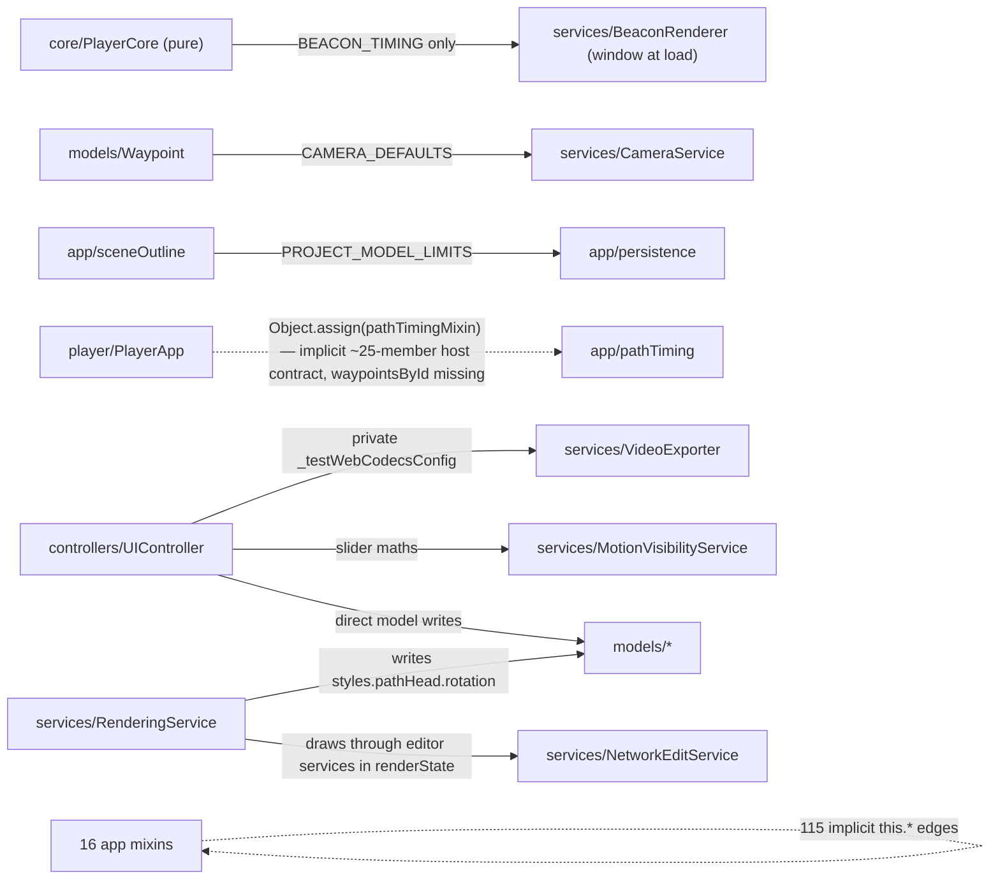
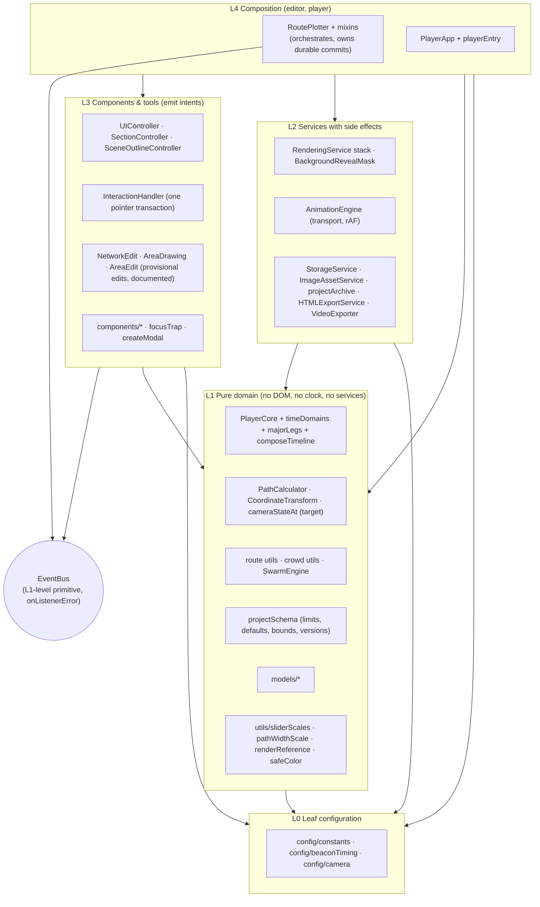
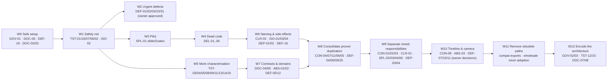

# Codebase Abstraction and Auditability Plan

**Repository:** `djDAOjones/route-plotter` (Route Plotter v3)

**Baseline:** analysed at `review-remediation` @ `587f90a`; re-validated at **`main` @ `2e4d78e`** (release v3.2.690), whose `src/` is identical (§2.8).

**Date:** 2026-09-22

**Method:** lead review by Claude (Opus 5) with nine Claude subagents, plus an **independent co-review by Codex (`gpt-6-astra`) in two rounds**, reconciled in §2.7 and §2.9. Round 2 added browser checks, a test-assertion audit and a read of the agent workflows.

**Status:** **Complete against every completion criterion in the brief.** Coverage is 100% accounted for and **62.4% substantively assessed**. All 96 text files in `src/` and all 74 test files were inspected directly. 82 supporting files (vendored framework prose, archives, maintainer notes, CSS) were covered at group level, and 52 were excluded with justification (§21–§22). Codex rated its own independent pass as partial for the same kind of supporting-document gap.

**Change policy:** investigation only. **No source, test, configuration or generated file was changed.**

**Owner decisions (2026-09-22):** every recommended default in §20 was accepted, and the programme was adopted. The decision log records this ("2026-09-22 — adopt the codebase abstraction plan, on every recommended default"), and backlog `### Next` holds W0. Per Q20, this file lives at `reviews/codebase-abstraction-and-auditability-plan-2026-09-22.md`.

---

## 1. Executive summary

**Current condition.** Route Plotter is a carefully governed, vanilla-JS Canvas application.
- It has 1,065 passing tests and a non-mutating build gate.
- It has **zero static import cycles**.
- It has strong trust boundaries: staged, rollback-safe project import; a hand-written ZIP preflight; a colour grammar; CSP; allowlisted diagnostics; a hash-pinned publication manifest.
- A small set of genuinely good abstractions exists: PlayerCore, CoordinateTransform, the `VECTOR_LAYERS` registry, the asset admission planner, the semantic scene outline, and VideoExporter's single frame plan.

Its structural weakness is **implicit contracts**, not missing layers.
- Sixteen prototype mixins share one `this` through 115 undeclared caller→owner edges.
- The exported player borrows editor mixins through an undocumented host contract of about 25 members. It has broken silently twice.
- Three millisecond "time domains" and two waypoint "index spaces" are mixed without names.
- Waypoint selection is kept in three stores, and the inspector is filled by three writers.
- The test suite is strong in the models, persistence and pointer input, but **weakest exactly where refactoring would cut**:
  - no test boots the app;
  - no test asserts any draw output;
  - 52 of 77 orchestrator events are never exercised;
  - several tests assert *source text*.
- About 1,500–2,000 lines of misleading surface (dead functions, commented-out legacy handlers, an inert tooltip system, dead CSS, unused constants and barrels) make the codebase harder for AI agents to read accurately.
- Canonical documentation contradicts the code in 13 places.

**Principal risks: behaviour defects found during the review** (33, in the §12.1 register; round 2 confirmed most of the user-visible ones in a real browser, §2.9). None is a refactor; each needs a test-first fix and owner approval. The most important:
- **Live debug overlay.** "Angle of View Reveal" paints a black **"Background Mode Debug"** panel onto the canvas, into exports and in the player. **Reproduced on the live site.**
- **The exported player** draws every **anchored crowd node in the wrong place**.
- **Waypoints authored below 100% background zoom make the project, and its autosave, impossible to reload.** The player silently drops them. Several other authoring paths also exceed the limits that load enforces, so they produce saves that won't reopen (DEF-03/04/31).
- **Camera motion is not a function of timeline time.** At the same instant it gave four different zooms across preview, export and seek, so exported video depends on encoder speed. This contradicts the project's deterministic-timeline mandate.
- **Other issues:**
  - on branched routes, camera and marker timing are mis-paired (the shipped open-day example hides its final waypoint for its whole end pause);
  - a glow beacon with a short hex colour, which load accepts, **freezes playback** and stops the editor redrawing until reload;
  - after opening a project the Duration slider is out of sync, so one nudge can turn 12.7 s into 646 s;
  - beacon marker scaling is missing from exports;
  - the renderer writes into saved project state;
  - a path cache makes geometry depend on edit history;
  - keyboard shortcuts die whenever a button or list row has focus, and keyboard focus is lost after every list selection;
  - hint labels stop checkboxes toggling;
  - `push.js --dryrun` (a typo) performs a real, now *live*, release;
  - the vendored agent workflow commits *and pushes* after every closed task, and nothing in AGENTS.md stops it on the now-live `main`.

**Also resolved during the review.** At the start, GitHub Pages was serving the working branch while every record said `main`. The owner's v3.2.690 release fixed this independently (§2.8).

**Recommended overall strategy.** *Pin, then prune, then clarify, then consolidate. Never rewrite.*
- **W0:** safe working setup, starting with an AGENTS.md rule that agents never push `main`, and truthful docs.
- **W1:** a safety net. A whole-app test boot (proven feasible), golden draw logs, snapshot-shape goldens, a strict EventBus in tests, a player host-contract test.
- **W2:** the urgent live defects.
- **W3:** a bounded **pilot**. Move six pure slider-scale functions out of the visibility service (chosen by both reviewers).
- **W4:** dead-code removal.
- **W5–W12:** explicit contracts (a `TimelineHost` type, named time domains, a trunk-index accessor, a generated event catalogue), consolidation of proven duplication, splitting the low-cohesion units along evidenced seams, a pure timeline and camera, and finally architecture rules encoded as tests.

Each wave is a series of one-concern PRs, reversible on their own, whose goldens stay byte-identical unless a defect fix is intended. The plan says just as clearly **what not to abstract**: the visibility modes, the save/autosave/undo projections, the beacon curves, the per-control wiring handlers, and the explicit post-edit pipelines stay as they are.

**Key numbers:**
- **Files:** 356 tracked; 37 segments.
- **Backlog:** 111 items: 33 defects plus 78 behaviour-preserving refactors, with 22 owner decisions (Q1–Q20 plus two sub-questions) and recommended defaults in §20.
- **Size:** 47 functions over 100 lines; the largest is a single 1,228-line registration function.
- **Dead code:** about 46 production-dead functions.
- **Test suite:** 0 render goldens; 5 source-text test sites.

---

## 2. Scope, constraints, and inspection method

### 2.1 What was inspected

| Item | Value |
|---|---|
| Repository | `djDAOjones/route-plotter` (Route Plotter v3) |
| Branch / commit | **Analysis baseline:** `review-remediation` @ `587f90a287d21b7d045c7c34fbc7d703d594a3f3` (v3.2.689; identical to the maintainer's HEAD at the start). **Re-validated at `main` @ `2e4d78e3e9c625755c6e30b13356f47703496928`.** This is the owner's v3.2.690 release, landed during this review (2026-09-22): 5 commits, 19 files changed, **none in `src/`**. See §2.8. Line references are to `2e4d78e`. |
| Tracked files | 356 at `2e4d78e` (`git ls-files`). There were 354 at `587f90a`; the release added `docs/LICENSE.txt` and `docs/THIRD_PARTY_NOTICES.txt`. |
| Inspection copy | Two throwaway clones of the branch in a session scratch directory. The maintainer's OneDrive worktree was **not** used for inspection: 125 of its 354 tracked files were cloud-only placeholders at the start of the session, and `git status` there stalled reading `_Joe/dev helper scripts/restart_localhost.sh` and `specs/…`. |
| Date | 2026-09-22 |

### 2.2 Who did the work

- **Lead: Claude (Opus 5).** Census, metrics, cross-cutting scans, verification of the high-impact findings, reconciliation, and this report.
- **Eight Claude subagents.** Each assessed a disjoint group of segments against a shared 28-field template, working in the read-only clone.
- **Codex (`gpt-6-astra`, via the ChatGPT app's bundled Codex CLI 0.155).** Ran the same brief independently in its own clone, without access to the Claude work. Its report was cross-checked against this one; §2.7 records where the two agree and differ.
- **Round 2** (§2.9): browser checks by the lead; a falsification pass and test-assertion audit by Codex (CLI 0.155.1); and a ninth Claude subagent for a deep test read and the four PM-Skills workflow files.

### 2.3 Instructions that governed the analysis

1. **The brief** (Codex prompt: "Codebase Abstraction and Auditability Review").
2. **Repository contract `AGENTS.md`.** The read tiers were followed for Pass 0: README, brief, architecture and conventions whole; file-map, backlog and decision-log sectional; DEV-INFRASTRUCTURE and UI-STANDARDS conditionally. So were the hard rules: normalised coordinates, EventBus, a single pointer transaction, no hand edits to `docs/` or `_Joe/`, the two runtime dependencies only, and the deterministic timeline.
3. **`CLAUDE.md`**, which is an adapter for AGENTS.md only.
4. **`DEV-INFRASTRUCTURE.md`**: canonical scripts, the threads-pool rationale, and the files agents must not hand-edit.
5. **`pm_skills/project/*`**: the brief's constraints (the deterministic mandate), the architecture, conventions, backlog (Active), and the last 27 decision-log headings with relevant entries.
6. **`reviews/`**: the 2026-08-26 review and crosswalk were used as evidence of known and already-fixed issues. Every re-reported item was re-verified against today's code.
7. **Maintainer standing preferences from session memory**, treated as non-authoritative: the merge to `main` is held; quality outranks budget targets; decisions are the owner's.

### 2.4 Commands and tools used (all non-mutating)

| Purpose | Command / tool | Result |
|---|---|---|
| Census | `git ls-files`; `wc -l`; `file --mime`; `stat` flags | 356 files at `2e4d78e`. Line and byte counts in the census. 125 dataless placeholders in the OneDrive copy at the start (1 by the pause; the owner reports it fully local now). |
| Canonical gate | `npm run check` in the clone (vitest threads pool, shell restart contract, `build:check`) | **Pass at `587f90a`**: 72 test files / 1,063 tests (51.2 s); restart safety passed; "Check build left docs/ and version.json unchanged". **Pass again at `2e4d78e`**: 72 files / **1,065** tests; restart safety; `build:check` inventory of **22** files; docs unchanged; 0 "Error in event listener" lines. |
| Import graph | Custom script (comment-stripped regex over `src/`, `build.js`, `push.js`, `scripts/`) plus Tarjan SCC | 247 edges, **0 cycles**. An earlier run reported a DotRenderer↔RenderingService "cycle"; it came from a JSDoc `import()` type annotation and was corrected. |
| Complexity | `rolldown/parseAst` (the ESTree parser already in `node_modules`) plus a function walker | 1,851 functions measured; lengths and cyclomatic approximations |
| Dead-symbol scan | Name-reference count per function across `src/` and `index.html` vs `tests/` | 46 production-dead function candidates (~459 lines), each re-checked by grep; about 30 more are referenced only by tests |
| Event catalogue | `git grep` of `.emit('…')` / `.on('…')`, with dynamic emitters resolved by hand | 135 distinct emitted, 137 subscribed literal names; orphans in §7 |
| Cross-cutting scans | `git grep` for clocks/randomness, storage keys, `fetch`, `innerHTML`, `try`/`catch`, globals, constants placement | See §7 |
| Runtime confirmation | Round 1: the built-in browser against the **public live site** (read-only); browser storage was backed up, restored, and checked after a reload. Round 2: the same `docs/` build served from the scratch clone on a separate local origin. | Round 1 reproduced the Angle-of-View-Reveal debug overlay (DEF-01). Round 2 confirmed or corrected 9 registered defects live and found 2 more (§2.9). |
| Pages source | `gh api repos/djDAOjones/route-plotter/pages` (read-only) | At analysis time: `source.branch = review-remediation`, `/docs`, last built at `587f90a`. **After the owner's release: `source.branch = main`, latest build `2e4d78e`.** |
| Subagent probes | Throwaway node/jsdom scripts in the scratch directory, importing `rp/src` unmodified | Behaviour of camera, anchors, path cache, JKL, keyboard guard, label activation, polygon events, prune cost, and a whole-app boot, confirmed as cited |
| Framework scripts | `gen-file-map.mjs --stdout`, `check-links.mjs` | The generator would damage `file-map.md`; check-links exits 1 (15 broken absolute links under `specs/`) |

**Not run, and why:**
- **Coverage:** `@vitest/coverage-v8` is not installed, and installing it is forbidden by the brief. Adding it would also fail `tests/governance.test.js` by design.
- **Lint:** no linter exists (`conventions.md` → Tooling).
- **Real-browser export runs and physical devices:** out of scope, and these are owner-run evidence tickets (REV-03/04/05).

### 2.5 Constraints honoured

- No source, test, configuration, lockfile or generated file was modified. After the analysis, `git status` in both clones showed only Codex's own report file in the Codex clone.
- Nothing was installed, committed or pushed.
- This report was drafted outside the repository and written to the repository root only after the owner confirmed a clean worktree. On the owner's §20 Q20 answer it moved to `reviews/`.
- Round 2's local server was started through the Browser pane's launch configuration, which lives in the parent folder's `.claude/launch.json`, outside the repository. It was temporarily extended and then restored byte-identical.

### 2.6 Limitations (full detail in §22)

1. **Browser runtime.** Round 1 made one browser check (DEF-01); round 2 made eleven more (§2.9). The remaining inferred effects are listed in §22.3.
2. **Supporting documents read at summary level.** 82 files were covered through reviewed groups rather than line by line: 26 vendored framework files (the 4 workflow files were read in full), project-memory archives, historical reviews, the archived spec, maintainer notes, CSS and the lockfile's transitive tree.
3. **Excluded files.** 52 files were excluded from content review with a stated reason: generated `docs/`, binary images and screenshots, and vendored changelogs.
4. **Coverage figures.** Method-reference counts are a name-search proxy, not line coverage.

### 2.7 Co-review reconciliation (Claude ↔ Codex)

Codex produced a complete, independent report: 29 segments, 21 backlog items, and a self-assessed **partial** status because 34 supporting documents were inspected only superficially. The two reviews were compared item by item.

**Agreements (independent convergence; confidence raised):**
- Baseline and structure:
  - The same gate result at `587f90a` (72/1,063, shell pass, non-mutating build).
  - **Zero static import cycles.** Codex used esbuild's resolved graph; Claude used a comment-stripped scan after correcting a JSDoc false positive.
  - The same fan-in/fan-out leaders.
- The same **dependency-direction problems**: PlayerCore→BeaconRenderer, Waypoint→CameraService, UI/persistence→MotionVisibilityService for arithmetic, and PlayerApp's implicit `this` contract with pathTiming.
- The same **main structural liability**. The mixin split moved methods into files without narrowing their access to the whole application.
- The same **documentation contradictions**: the non-existent console ring buffer, DEV-INFRASTRUCTURE's autosave-assets claim, and the mutating per-change build rule in `conventions.md`.
- The same **boundaries to preserve**: PlayerCore, CoordinateTransform, staged admission with generation tokens, the asset admission planner, the publication allowlist, SceneOutline/sceneSemantics, and VideoExporter's frame plan and codec seam.
- The same **pilot**, chosen independently: move the pure slider-scale functions out of MotionVisibilityService.
- The same warnings against over-abstraction: no DI container, universal editor context, exporter framework, generic form schema, or merging of the autosave/undo/project projections.
- The same **`EventBus.once` defect** (a throwing callback runs twice), reproduced independently.

**Found by Codex, adopted here:**
- **Traced graph IDs exceed the persisted-ID limit.** `gn_trace_<wpId>` and `ge_trace_<from>__<to>` built from maximum-length (256-character) waypoint IDs give 265- and 523-character IDs, which `FlowLayer.assertValidJSON` rejects on reload. Codex reproduced this; the lead re-verified the mechanism (`routeTrace.js:64,95,110` vs `FlowLayer.js:194,216`). Adopted as **DEF-31**, part of the "authorable ⇒ loadable" class (DEF-03/04).
- **`push.js` runs `npm test` rather than the canonical `npm run check`**, so the shell contract is skipped. Merged into **DEF-18**.
- `restart.sh` treats HTTP 200 as readiness, which is weaker than DEV-INFRASTRUCTURE's own definition ("no console errors and version stamp renders"). Added to **DOC-02**.
- Pilot detail: `formatUIValue` rounds negative magnitudes ≥10 with `Math.floor`, contrary to its "toward zero" comment. Characterise that behaviour; don't "fix" it silently (§14).
- Architecture checks should use esbuild's metafile rather than regex scans, since a regex scan produced this review's one false positive (**GOV-03**).

**Found here, not by Codex:**
- Codex did not run the app, query GitHub, or trace the defects below. Its 21 items are mostly structural directions.
- **Pages served `review-remediation`**, from 2026-08-26, confirmed via API. Codex assumed the documented hold on `main` was in force. The owner's v3.2.690 release on 2026-09-22 switched Pages to `main` and corrected the record, independently of this review; see the decision log entry of that date.
- **Runtime defects**, all evidenced as cited in §12:
  - the live debug overlay (DEF-01), confirmed in a browser;
  - the exported player's missing `waypointsById` (DEF-02);
  - out-of-bounds waypoints making projects unloadable (DEF-03);
  - index-space mis-pairing on branched routes (DEF-05);
  - stale branch state after Clear All (DEF-06);
  - camera non-determinism, measured at 4 different zooms for one instant (DEF-07);
  - beacon scale missing from export (DEF-08);
  - the render-time `pathHead.rotation` write (DEF-09);
  - the curvature-cache key collision (DEF-10);
  - the minor-end timing cliff (DEF-11);
  - time-domain mixing (DEF-12);
  - the keyboard focus guard (DEF-13);
  - label activation (DEF-14);
  - JKL reset (DEF-15);
  - nudge under zoom (DEF-16);
  - null polygon events (DEF-17);
  - `push.js` flag handling (DEF-18);
  - undo-only images in exports (DEF-23);
  - invalid example data (DEF-24);
  - the 2.4 s prune cost (DEF-25).
- **The inert Tooltip system.** Confirmed at runtime: 0 `[data-tooltip]` versus 75 `[data-tip]` on the live page. Codex treated Tooltip as a live component with a different lifecycle from ParamTooltip.
- **The measured dead-code inventory** (~46 functions, `_majorWaypointsCache` ceremony), the **source-text tests** that would break under refactoring, and **the feasibility of a whole-app test boot**.

**Disagreements, and how they are resolved in this report:**

| Topic | Codex | This report | Resolution |
|---|---|---|---|
| Status label | Partial (34 docs superficial) | Meets every completion criterion; supporting files covered at group level are listed (110 in round 1, 82 after round 2) | Both positions are shown. The difference is labelling, not evidence: all production, test, build, CI and configuration files were inspected directly or as reviewed groups. See §22. |
| Barrels (`src/{models,services,utils}/index.js`) | "Leave intact: small barrels" | Delete (low priority) | Deletion stands. None of the three has an importer anywhere; `services/index.js` lists 7 of 20 services; `file-map.md` presents them as consumed. A barrel that misrepresents the module set costs audit time. Low priority (P2). |
| Pages/release hold | "Keep existing hold; verify live settings at release" | At `587f90a` the hold was not in force: the live site served the branch | API evidence overrode the documented assumption. The question is now **superseded**: the owner released to `main` on 2026-09-22, Pages serves `main`, and `main` is protected (REL-02). §20 Q1 now covers only where the refactor waves land. |
| `EventBus.once` fix priority | P1 | P3 (no production caller) | P3. Codex also notes that no affected production consumer was established. It is fixed together with the EventBus pinning tests (TST-10). |

### 2.8 Baseline change during the review (release v3.2.690)

While this report was being drafted, the owner released the remediation line. There are 5 commits from `587f90a` to `2e4d78e` (2026-09-22), and the maintainer's worktree is now clean on `main` @ `2e4d78e`.

| Commit | Change | Effect on this report |
|---|---|---|
| `35de7d5` | Merge `review-remediation` into `main` (DEPLOY-01) | `main` now holds the analysed code |
| `4e5575d` | LEGAL-01: publish `LICENSE.txt` and `THIRD_PARTY_NOTICES.txt` with the app; Help links to them; notice source links pinned to exact tags; governance tests for both (mutation-tested) | `docs/` inventory 20 → 22; `build.js` +19 lines; `index.html` +9; `styles/main.css` +10; tests 1,063 → 1,065. The new guards are a **strength** (SEG-028). |
| `caea691` | Deploy v3.2.690 | Generated output only |
| `43ad2a7` | Record the release; **correct the deployment record**, independently confirming the Pages finding; close DEPLOY-01, REL-01 (keep the source map) and LEGAL-01 | **DOC-01 closed.** GOV-01 reduced to branch strategy. The REL-01 references are updated. |
| `2e4d78e` | REL-02: a repository ruleset blocks force-push and deletion of `main` | Wave 0 relies on it (§13) |

**Verification.**
- `git diff --name-status 587f90a 2e4d78e -- src` is **empty**. Every code finding, probe and line reference in `src/` is unaffected.
- The gate was re-run at `2e4d78e`: 72 files / 1,065 tests pass, restart safety passes, and `build:check` passes with 22 files.
- The census was re-run: 356 files, all mapped.
- The import graph was re-run: 247 edges, 0 cycles.
- The live site now serves `main` (Pages API: latest build `2e4d78e`).

**Line references re-pointed.** For the 12 non-`src/` files the release touched (`build.js`, `index.html`, `styles/main.css`, `DEV-INFRASTRUCTURE.md`, `README.md`, `THIRD_PARTY_NOTICES.md`, `tests/governance.test.js`, `tests/publicationBoundary.test.js`, and the `pm_skills/project/` backlog, decision-log, file-map and trajectory), the report's `file:line` references were recomputed from the diff hunks. Examples: `DEV-INFRASTRUCTURE.md:274-276` → `:299-301` (the autosave statement is **still stale** there); decision-log references +99.

**Still true after the release.** Every defect in §12.1 remains open. The release changed no application code, and the stale `DEV-INFRASTRUCTURE` autosave paragraph and the README ring-buffer claim remain.

### 2.9 Round 2: runtime confirmation, test-assertion audit and workflow read

After the first delivery, the owner asked whether widening the set of checked files would help. Three strands were then run in parallel at `2e4d78e`:
1. **Browser checks (lead).** The production `docs/` build was served from the scratch clone on a separate local origin, so the live site's storage was untouched, and exercised in the built-in Chromium.
2. **Codex round 2** (`gpt-6-astra`, Codex CLI 0.155.1). Codex was asked to **falsify** four claims (DEF-14, DEF-13, DEF-25, DEF-05) and to audit 24 test files at assertion level. It changed no tracked files and removed its probe directory.
3. **A ninth Claude subagent.** It deep-read 10 of those test files, plus the 4 PM-Skills workflow files that drive every close.

**Runtime results (all now [L]):**

| Item | Before | After round 2 |
|---|---|---|
| **DEF-05** (renderer) | Mechanism [C]; effect [I] | **Visible** on the shipped `uon-open-day` with `hide-before`. The branch waypoint's marker appears about 5.5 s after the branch reaches it, and **the final waypoint is hidden for its whole 4.5 s end pause**. With correct neighbours it would read `at-waypoint`. |
| **DEF-06** | Ghost drawing [I] | State leak confirmed, but **no ghost is drawn** (0 stroke calls) and the time display is correct. **P1 → P3.** |
| **DEF-13** | jsdom [C] | After a real click on a transport button (Chromium keeps focus there), real Delete and ArrowRight are ignored and Cmd+S/Cmd+Z are not prevented. The report's "after selecting in the list" example was wrong: that path loses focus instead (DEF-32). |
| **DEF-14** | jsdom [C]; focus unverifiable in jsdom (Codex) | **Both halves confirmed** with real clicks. Label text neither toggles the checkbox nor focuses the slider; the blank area of the same label works. |
| **DEF-20** | [I] | After Open the Duration thumb stays at 3901 (correct: 1586) under a 12.7 s readout, and **one +5 nudge makes the duration 646 s**. **P2 → P1.** |
| **DEF-25** | Node [C] | Chrome: **181–201 ms per committed edit** at 300 waypoints and 150 retained states, vs 1 ms for the save alone. |
| **DEF-26** | [I] per spec | **Escalated.** `#rgb`/`#rgba` throw on every glow frame. The throw skips all later layers, **stops the playback loop** while the UI says "playing", and **latches `queueRender`**, so edits stop redrawing until reload. `#rrggbbaa` does not throw but loses its alpha (the subagent and Codex agree). **P2 → P1.** |
| **DEF-27** | Visual [I] | At 50% background zoom the tint rect covers the whole canvas (0,0,806×570) while the image occupies (202,143,403×285). |
| **DEF-24** | [C] unzip | **All three** examples are affected. The Waypoints select shows blank, and markers behave as always-show. Load accepts any string for the three visibility enums. |
| **New DEF-32** | — | Activating a waypoint-list row rebuilds the list twice, so the focus restore misses and **focus falls to `<body>`** after every selection (WCAG 2.4.3). |
| **New DEF-33** | Startup announcement [I] | "Animation paused" is written to the live region 92 ms into every cold load. |

**Codex round-2 verdicts:**
- **C1 (DEF-14): partly confirmed.** The checkbox cancellation was confirmed (5/5; forwarded control clicks 69 → 0). Label focus was unverifiable in jsdom; the browser has now settled it.
- **C2 (DEF-13): confirmed.** On a real list row all 10 keys yielded; on body all 10 were handled.
- **C3 (DEF-25): confirmed** (medians of 52 / 336 / 2,207 ms). Two qualifications were adopted into DEF-25:
  - an early return also skips today's malformed-history validation;
  - pruning runs even when a duplicate save is rejected.
- **C4 (DEF-05): confirmed**, with C receiving D's progress. Its corrections were adopted:
  - `RenderingService.js:2236` is an unused local, so the citation was removed;
  - label timing (`:2201`) and the beacon draw gate (`:2009-2014`) were added;
  - the head-direction wait guard (`:676-681`) checks bounds, not ownership, and was folded into DEF-05.
- **Extras, each verified against source before adoption:**
  - **DEF-12:** anchored onset vs true arrival, 5,500/6,000 ms under a 1 s intro and 6,250/5,000 ms under a comet tail.
  - **DEF-17:** reproduced with the real drawing service.
  - **DEF-22:** reproduced with the real `insert-on-leg` handler, so UI reachability is now [C].
  - **DEF-23:** `zipAssets=[live, undo-only]`. A new row was drafted for this and then dropped as a duplicate of DEF-23.
  - **Undo equality is serialized-string equality.** This is a contract for CON-04 to decide, not a defect.
  - **A vacuous density test** (TST-16).

**Test-assertion audit** (24 files; the 10 deep-read files hold 140 tests, all passing individually):
- **No truthiness assertions**, but several incomplete predicates, now collected in **TST-16**.
- **Four dead symbols are pinned by tests.** Two sit inside live assertions and need rewriting, not deleting; DEL-06 and §20 Q8 were updated.
- **TST-15** was missing a prerequisite: `routeBranches` and `headDirectionBranchWait` import modules that touch `window`, so they need DEP-01 before they can leave jsdom.
- **Refactor-fragile couplings** to handle in the PR that moves them:
  - `areaEdit`'s exact render counts and private fields;
  - `assetPruning`'s `_getUndoableState` seam (keep it through CON-04) and its exact `console.error` text (ISO-01);
  - `headDirectionBranchWait` calling the method on `RenderingService` (CON-09 needs a delegator);
  - `revealTrail`'s statics ending at MVS `:1504`, adjacent to SPL-01's range.
- **The characterisation to add first** (TST-16), `todo` until each fix:

| Item | Already pinned (the side to preserve) | Add before the fix |
|---|---|---|
| **DEF-12** | `composeBranchTimeline` in route-ms; the `waitForCrowdMs` solver | Branch progress vs `getTime()` with an intro and a comet tail; an anchored `scheduleDots`/`evaluate` release; `fitRouteWaitToCrowd` in engine time |
| **DEF-11** | — | Minor-start and minor-end trunk timing; the arrival map vs the engine |
| **DEF-17** | Cancel and reset paths | Polygon completion: both events carry the target waypoint; banner and key listener removed |
| **DEF-22** | The resolver's `branch-run-split` | The exact problem list; the real insert handlers at first and last branch positions |
| **DEF-23** | Store retention of undo-only assets (`assetPruning.test.js:92-113`) | ZIP and HTML export contents with an undo-only asset |
| **DEF-25** | Sweep correctness | A zero-asset prune returns `[]` without parsing |
| **DEF-26** | The acceptance grammar (`safeColor.test.js:5`) | Glow stops for all four forms; a render-throw test proving that the loop and `queueRender` recover |
| **CON-04** | String-equality duplicates | After loading each example, the first `_getUndoableState()` is byte-equal to `getUndoBaseline(staged)` |
| **CON-09** | The RS wait branch and bounds guard | A curved-path direction golden under zoom; RS == MVS parity; run ownership of the wait index |

**Workflow read** (`task.md`, `end-of-task.md`, `session-start.md`, `memory-policy.md`, all in full). Findings were verified against the root documents and folded into **DOC-06**, now **P0**:
- **No root rule stops the default "commit *and push* after every closed task"**, and `main` is now live.
- 7 framework→root references and 2 root-internal ones dangle.
- The documented gate claims lint and typecheck; the real gate has neither.
- The close-out boot check rewrites tracked `docs/` and `version.json`.
- The file-map generator drops wrapped text on 16 rows.
- Memory budgets were exceeded (decision log 30/20, trajectory 2,535/2,000 words), while the owner's prune bar is recorded only in the decision log. A separate memory session pruned both the same day, under the prune bar, to 20/20 entries and 1,021 words.
- Refactor mode's "tests unchanged, no API delta" conflicts with the waves' import re-pointing.
- The backlog holds none of the plan's IDs; importing all rows would break its Active budget.

These led to four plan changes. W0 now starts with the AGENTS.md commit, push and release rule. Ground rule 5 is amended. §20 Q1 and Q8 carry the matching defaults. A new ground rule 8 gives the **14 defects that previously had no wave** a slot, plus the two new ones.

**Claims corrected by round 2:**
- DEF-26: the forms that throw.
- DEF-13: the list example.
- DEF-06: the ghost.
- DEF-05: a citation.
- DEF-22: its evidence.
- TST-15: its prerequisite.
- SEG-021's "focus is restored after every rebuild".
- `undoService` is strong for save and preview only.
- `imageAssetRoundTrip` does not pin export filtering; it prunes by hand before exporting.

**Coverage change:**
- Inspected directly: 194 → **222** (54.5% → **62.4%**).
- Reviewed group: 110 → 82.
- Excluded: 52.
- Backlog: 108 → **111** (DEF-32, DEF-33, TST-16).

---

## 3. Repository census

### 3.1 By category

Every tracked file has exactly one primary category and one primary segment (§5, §21). Line counts are text lines; binaries are counted as files only.

| Category | Files | Text lines | Binary | Primary segments |
|---|---:|---:|---:|---|
| Production source (orchestrator, mixins, player, services) | 24 | 13,089 | 0 | SEG-001–006, 014, 017, 018 |
| Domain model (models, timing/geometry, crowd) | 22 | 5,918 | 0 | SEG-008–010 |
| Shared library (core runtime, route utilities) | 8 | 1,866 | 0 | SEG-007, 011 |
| User interface (controllers, components, rendering, input, shell, styles) | 32 | 20,085 | 0 | SEG-012, 013, 019–022, 025 |
| Data access / persistence | 9 | 3,415 | 0 | SEG-004, 015 |
| API or integration (export) | 2 | 1,420 | 0 | SEG-016 |
| Configuration | 12 | 3,770 | 0 | SEG-023, 024, 026 |
| Build tooling | 3 | 997 | 0 | SEG-024, 026 |
| Scripts | 4 | 635 | 0 | SEG-027 |
| Infrastructure / deployment (CI) | 1 | 36 | 0 | SEG-028 |
| Tests (incl. setup and shell contract) | 74 | 20,211 | 0 | SEG-029 |
| Examples | 1 | 231 | 0 | SEG-024 |
| Static assets | 27 | 11 | 26 | SEG-024, 035 |
| Generated code (build output) | 22 | 10,320 | 10 | SEG-036 |
| Vendored / third-party (PM-Skills framework) | 38 | 9,473 | 0 | SEG-032 |
| Documentation (canonical, project memory, reviews, governance, maintainer notes) | 58 | 14,474 | 0 | SEG-028, 030, 031, 033, 035 |
| Deprecated / legacy (archived dot-crowd-navigator spec and salvage) | 15 | 2,819 | 0 | SEG-034 |
| Development tooling (agent/editor config) | 4 | 273 | 0 | SEG-037 |
| Database schema / migration | 0 | — | — | None exists. The app is client-only, and there is no migration code for project files either (see §7, "serialisation"). |
| Unknown / requiring investigation | 0 | — | — | — |
| **Total** | **356** | | **36** | |

### 3.2 Largest production units

| File | Lines | Notes |
|---|---:|---|
| `src/services/RenderingService.js` | 2,509 | Frame orchestration plus 8 helper domains (SEG-012) |
| `src/controllers/UIController.js` | 2,458 | 11 responsibilities (SEG-019) |
| `src/services/MotionVisibilityService.js` | 1,673 | 11 concerns, including UI slider maths (SEG-013) |
| `src/app/wiringControllers.js` | 1,345 | One 1,228-line function (SEG-002) |
| `src/app/persistence.js` | 1,239 | 5 concerns (SEG-004) |
| `src/handlers/InteractionHandler.js` | 1,176 | Pointer transaction plus keyboard (SEG-021) |
| `src/services/BeaconRenderer.js` | 1,176 | 5 genuinely different beacon styles (SEG-012) |
| `src/controllers/SceneOutlineController.js` | 1,131 | Best-structured UI unit (SEG-020) |
| `src/main.js` | 1,076 | Constructor 375 lines; `init` 186 lines (SEG-001) |
| `src/services/NetworkEditService.js` | 1,073 | 6 concerns, including ~280 lines of drawing (SEG-014) |
| `src/app/wiringDom.js` | 1,058 | One ~950-line function, ~135 of it commented out (SEG-002) |
| `src/services/VideoExporter.js` | 1,040 | Cohesive; strategy seam adequate (SEG-016) |
| `src/services/AnimationEngine.js` | 1,016 | Transport plus duplicated boundary maths plus ~12 dead methods (SEG-009) |
| `src/app/sceneOutline.js` | 1,000 | Command adapter (SEG-006) |

### 3.3 Exclusions from detailed code review

These files are all still in the ledger.

| Path / pattern | Files | Reason | Verified? | Risk of not inspecting |
|---|---:|---|---|---|
| `docs/**` | 22 | Generated Pages output from `build.js`. The 2 new `.txt` files are byte-identical to `LICENSE` and `THIRD_PARTY_NOTICES.md` (`cmp`). | **Yes.** A scratch rebuild matched `587f90a`, and `build:check` at `2e4d78e` validated the 22-file inventory: `app.js` differs only in its banner timestamp; `player.js`, styles, images and ZIPs are byte-identical. `build.js` validates the inventory and hashes. | Low. `docs/app.js.map` publishes full source; that is the owner's REL-01 decision. |
| `images/*` | 6 | Approved public background images | SHA-256 matches `public-assets.json` | None for code structure |
| `src/assets/drone-head.png` | 1 | Bundled path-head preset | Sized: 183 KB source, 245 KB as a data URL inside `player.js` | Size only (see E-21 in §12) |
| `_Joe/design docs/screenshots/*.png` | 19 | Maintainer screenshots of the v3.1 UI (47 MB) | Not viewed | None for code. They make up about 2/3 of `.git` size (history rewrite not recommended). |
| `pm_skills/CHANGELOG*.md` | 4 | Vendored framework changelogs (2,874 lines) | Not read | None; not executed |

---

## 4. Current architecture

*Everything in this section describes the code as it is at `2e4d78e`, whose `src/` is identical to `587f90a`. The proposed direction is in §11.*

### 4.1 Executable entry points

| Entry point | Kind | How it starts | Output / effect |
|---|---|---|---|
| `src/main.js` | Browser app, esbuild ESM bundle | `DOMContentLoaded` → `window.app = new RoutePlotter()` (`main.js:1074-1076`). Module-level `console.log` and a title setter run *before* the imports (`main.js:20-30`). | `docs/app.js`, loaded by `docs/index.html` as a **classic** `<script>` (see §7, "build") |
| `src/player/playerEntry.js` | Exported-HTML player, esbuild IIFE | `boot()` reads `window.__ROUTE_PLOTTER_PROJECT__` / `__ROUTE_PLOTTER_BG__` (`playerEntry.js:46-55`) | `docs/player.js`, fetched and inlined by `HTMLExportService` into every HTML export; exposes `window.__routePlotterPlayer` |
| `build.js` | Node CLI (`dev`, `build`, `build:check`, `--verify-public-assets-only`) | Runs at import. Everything is top-level. | `docs/**`, `version.json`, a dev server on `localhost:3000` |
| `push.js` | Node CLI (`push`, `push:dry-run`) | `main()` | Test → build → commit `docs/` + `version.json` → push the **current branch**. **Pages serves `main`** (since the v3.2.690 release on 2026-09-22; from 2026-08-26 until then it served `review-remediation`). A push from `main` therefore publishes live. `main` is protected against force-push and deletion (REL-02). |
| `scripts/restart.sh`, `scripts/build.sh` | Maintainer shell wrappers | Direct execution; `restart.sh` is sourceable for tests | Owned-process restart with a readiness probe; production build |
| `scripts/perf-harness.js` | Console-pasted benchmark | `await routePlotterBenchmark()` | Timing tables. Disables autosave until reload, by design. |
| `scripts/build-examples.mjs` | Node module, also runnable alone | Dynamic `import()` from `build.js:346` | `docs/examples/*.zip` (byte-reproducible) |
| `.github/workflows/ci.yml` | GitHub Actions | Every push and PR | `npm ci` → `npm run check` → `git diff --exit-code -- docs version.json` |
| `tests/**` | Vitest (jsdom, threads, serial) plus one bash contract | `npm test`, `npm run test:shell` | Pass/fail. **No test imports `src/main.js`.** |

### 4.2 Component map (current)

```mermaid
flowchart TB
  subgraph Shell["index.html + styles (SEG-025)"]
  end
  subgraph Orchestrator["RoutePlotter = main.js + 16 prototype mixins (SEG-001..006)"]
    main["main.js<br/>constructor · init · render() state assembly"]
    wiring["wiringBus / wiringControllers / wiringDom<br/>(~230 subscriptions & DOM listeners)"]
    lifecycle["persistence · projectReset · privacy · backgroundLoading"]
    timeline["pathTiming · playback · camera · viewport · exporting"]
    scene["crowds · network · sceneOutline · editorPanel · pointer · undoRedo"]
  end
  subgraph Components["Components (emit on bus)"]
    ui["UIController / SectionController (SEG-019)"]
    outline["SceneOutlineController + sceneSemantics (SEG-020)"]
    input["InteractionHandler (SEG-021)"]
    widgets["ContextMenu · Dropdown · ParamTooltip · SwatchPicker · focusTrap (SEG-022)"]
  end
  subgraph Services
    engine["AnimationEngine → PlayerCore (SEG-007/009)"]
    geom["PathCalculator · CameraService · CoordinateTransform (SEG-009)"]
    swarm["SwarmEngine + crowd utils (SEG-010)"]
    render["RenderingService · BeaconRenderer · DotRenderer · AreaHighlight · TextLabel (SEG-012)"]
    mvs["MotionVisibilityService (SEG-013)"]
    edit["NetworkEdit · AreaDrawing · AreaEdit (SEG-014)"]
    store["StorageService · ImageAssetService · UndoService (SEG-015)"]
    export["HTMLExportService · VideoExporter (SEG-016)"]
    diag["DiagnosticsService (SEG-017)"]
  end
  models["Models: Waypoint · Scene → FlowLayer → GraphModel/Node/Edge · Emitter · ImageAsset · AnimationState (SEG-008)"]
  bus(("EventBus (SEG-007)"))
  player["PlayerApp + playerEntry (SEG-018)<br/>adopts pathTiming wholesale + 5 viewport/camera methods"]

  Shell --> ui & input & outline
  ui -- emit --> bus
  input -- emit / sync request-response --> bus
  outline -- emit --> bus
  bus --> wiring
  wiring --> lifecycle & timeline & scene
  Orchestrator -- "~60 direct calls" --> ui & input
  Orchestrator --> engine & geom & swarm & render & mvs & edit & store & export & diag
  Orchestrator --> models
  edit -- "mutate directly, then emit" --> models
  ui -- "mutates pause/speed/area/name" --> models
  render --> mvs
  render -- "draws via editor services carried in renderState" --> edit
  player --> engine & geom & swarm & render & mvs & models
```

### 4.3 Data and control flows

1. **Authoring gesture.** `InteractionHandler` owns one captured Pointer Events transaction: down → hit-test by synchronous bus request/response → threshold → drag → exactly one commit or a restoring cancel (`InteractionHandler.js:211-558`). It emits a terminal event, and `wiringControllers` / `wiringBus` handlers mutate the models. A handler then typically runs the post-mutation pipeline by hand: `saveUndoState → calculatePath → updateWaypointList → autoSave → queueRender`, in about 8 places for waypoints and about 14 for scene edits (§8).
2. **Timeline.**
   - `pathTiming.calculatePath` rebuilds the spline (PathCalculator), branch structure (routeBranches) and anchors. After a 50 ms debounce, `updateAnimationDuration` composes the total duration (start handle, intro, path, pauses, tail, branch extension) and configures `AnimationEngine`.
   - `AnimationEngine` owns transport (`AnimationState`) and the demand-driven rAF loop. It delegates instant evaluation to `PlayerCore`, which is pure.
   - `render()` in `main.js:877-969` hand-assembles a ~35-key `renderState` literal. `PlayerApp.render` assembles a parallel ~33-key literal (`PlayerApp.js:336-387`).
3. **Frame.** `RenderingService.render()` draws three stages:
   - The background stage has its mode switch hard-coded (`RenderingService.js:469-518`).
   - The vector stage is an offscreen canvas iterated over `VECTOR_LAYERS` (14 entries).
   - Composite. `MotionVisibilityService` supplies visibility ranges and reveal masks.
4. **Persistence.**
   - **Autosave** (model-only; 4 MiB cap): `autoSave()` → `_buildProjectSnapshot({includeAssets:false})` → strip asset references → StorageService debounce. There are about 66 call sites.
   - **Project ZIP save/load.** Load is a detached `importZip` → `stageProject` validation → token check → synchronous `commitStagedProject` with per-surface rollback.
   - **HTML export.** The same snapshot, plus assets and the inlined `player.js`.
   - **Undo.** A separate snapshot shape (`_getUndoableState`), compared by JSON string in `UndoService`.
5. **Export.** `VideoExporter` consumes one pure frame plan. `renderFrame(progress)` → `seekToProgress` → the app's `render()`. MP4 and WebM use WebCodecs plus mediabunny; WebM has a MediaRecorder fallback, locked by format.

### 4.4 State ownership (as-is)

| State | Owner (declared) | Actually written from |
|---|---|---|
| `waypoints`, `waypointsById` | RoutePlotter | 5 files reassign; `wiringControllers` splices ×9. UIController writes `pauseTime`/`segmentSpeed`/area/`name` directly. The area tools write `areaHighlight`. |
| Selection (waypoints) | RoutePlotter | **Three live copies:** the app Array, the UIController Set, and the InteractionHandler Array. They are kept in step by about 20 copied fan-outs. |
| Selection (crowd / network) | RoutePlotter | 4–5 copies: `selectedCrowd`, `UIController._selectedCrowd`, `SectionController`, `networkEditService.layer/selection`, `_sceneOutlineSelectionKey` |
| Scene / graph models | Scene aggregate | Also written by NetworkEditService, the area tools, `network.js` (`edge.setWeight`) and `sceneOutline.js` |
| Derived route state (`pathPoints`, `branchPaths`, `routeStructure`, `branchTimeline`, `_trunkWaypoints`, `anchorReport`, caches) | `pathTiming.calculatePath` | Bypassed by 5 "≥2 waypoints ?" guards, so stale branch state survives Clear All (DEF-06). `_majorWaypointsCache` is invalidated in ~10 places, but its only reader is dead. |
| Transport | AnimationEngine / AnimationState | Also written by `pathTiming` (`pathDuration`), `persistence` (`_currentPauseState`, `nextPauseIndex`) and `PlayerApp` |
| Render byproducts | none | `RenderingService.js:1889` writes `styles.pathHead.rotation` every frame. That value is persisted into autosave, export and undo. |
| Camera momentum | CameraService | Per-call smoothing plus a wall-clock rate limiter (`CameraService.js:116-187, 395-421`) |

### 4.5 Boundaries

| Boundary | Where |
|---|---|
| **Persistence** | localStorage (7 keys across 5 modules; `StorageService` owns 3). Project ZIP (`ImageAssetService` codec with bespoke central-directory preflight). Standalone HTML (`HTMLExportService`). There is no server. |
| **Network** | Same-origin `fetch` only: `player.js?v=…` (`HTMLExportService.js:93-106`, and the constructor pre-fetches it), `examples/<id>.zip` (`persistence.js:999`), example images (`backgroundLoading.js:15`). CSP `connect-src 'self'`. The exported HTML has `connect-src 'none'`. |
| **Trust** | Untrusted input is: user image files, project ZIPs, autosave records, and localStorage keybinding overrides. It is validated by `assertSafeProjectTree`, `stageProject`, the model `assertValid*` checks, the `ImageAsset` signature and size checks, the ZIP preflight and `safeColor`. |
| **Egress** | Egress is always user-initiated: save ZIP, HTML export, video, diagnostics copy/download. It goes through the disclosure dialogs in `privacy.js`. Diagnostics come from the pure allowlist in `DiagnosticsService`. |
| **Auth** | None. This is a client-only static app, with no accounts or secrets (DEV-INFRASTRUCTURE "Env / secrets: none"). |

### 4.6 Configuration sources

- `src/config/constants.js`: 15 groups, ~170 keys, of which ~43 are unused.
- Per-boundary limit objects in 8 modules. DEV-INFRASTRUCTURE states this placement is deliberate.
- Tuning constants in 4 service modules: `CAMERA_DEFAULTS`, `BEACON_TIMING`, the MVS statics and the SwarmEngine/PlayerCore module constants.
- `index.html` attributes, which are the de facto slider ranges.
- `public-assets.json` (the approval ledger).
- `package.json`, `version.json`, `.nvmrc`, `vitest.config.js`.
- localStorage preferences.
- The build-time define `APP_VERSION`.

### 4.7 Dependency direction and cycles

- **Static import graph.** 247 runtime edges and **no cycles**. Fan-out is highest in `main.js` (48), `PlayerApp.js` (17) and `persistence.js` (14). Fan-in is highest in `constants.js` (27), `ImageAsset` (8), and 7 each for `Waypoint`, `CameraService`, `MotionVisibilityService` and `pathHeadPresets`.
- **Inverted or surprising edges:**
  - `core/PlayerCore.js` → `services/BeaconRenderer.js`, for constants only. The "pure" timeline core then cannot load without `window`: importing it in Node fails with "window is not defined".
  - `models/Waypoint.js` → `services/CameraService.js`, for `CAMERA_DEFAULTS`.
  - `app/sceneOutline.js` → `app/persistence.js`, for model limits.
  - `UIController` → `VideoExporter._testWebCodecsConfig` (a private static) and → `MotionVisibilityService` for slider maths.
  - `HTMLExportService` → `ImageAsset._hasExpectedSignature` (private).
- **Implicit dependencies:**
  - **Mixins.** 115 distinct caller→owner mixin-file pairs through `this`. The hubs are `announce` (15 files), `queueRender` (12), `calculatePath` (11), `render` (11) and `autoSave` (10).
  - **PlayerApp.** It depends on the undeclared host contract of `pathTimingMixin`, which has about 25 members. It is missing `waypointsById` (DEF-02).
  - **Synchronous bus.** Dispatch is load-bearing for InteractionHandler's request/response queries.
- **Environment-dependent behaviour:**
  - `CameraService` uses the wall clock.
  - `BeaconRenderer` reads `prefers-reduced-motion` at module load, which also applies to baked video.
  - `isMac` uses the deprecated `navigator.platform`.
  - `restart.sh` relies on macOS `ps`/`lsof`, stubbed in CI.
  - The OneDrive workspace forced `--pool=threads --no-file-parallelism`.

### 4.8 Important dependency problems (current)

### 4.9 Error propagation, logging, background processing

- **Errors.**
  - `EventBus.emit` catches **every** listener exception and only calls `console.error` (`EventBus.js:95-100`). With about 197 handlers, a throwing handler is indistinguishable from "does nothing". The code records two such past incidents (`wiringControllers.js:1255-1258, 1284-1287`).
  - Import and validation errors are thrown `Error`s with user text, which callers `announce`.
  - StorageService returns `{ok, pending, unchanged, error}`.
  - VideoExporter signals through 3 channels. Cancellation is detected by message-string equality.
  - Export failures use blocking `alert()`, 7 calls, all in `exporting.js`.
  - A failed autosave *restore* is reported to the console only.
- **Logging.** There are 160 `console.*` calls in `src/`, with no level gate or policy; the only precedent for one is `BeaconRenderer.DEBUG = false`. Debug chatter ships in `docs/app.js` and in every exported HTML player, and produces about 560 lines per test run. README.md:341 describes a 500-entry console ring buffer with "Download Debug Log", but **no such code exists**. The menu now says "diagnostics".
- **Background processing.**
  - The rAF loop in AnimationEngine is demand-driven.
  - Other timers: a 50 ms duration debounce, a 400 ms undo debounce, a 1000 ms autosave write debounce, a 100 ms resize debounce, the scene-outline refresh (microtask plus 75 ms) and toasts.
  - There are no workers. The `workers/` layer was deleted on 2026-06-18.

### 4.10 Build, test, release and deployment flows

- **Build.** `build.js` holds 10 concerns, listed in SEG-026. Production builds go to a staging directory, which is validated (exact inventory, hashes, local references, ZIP allowlist) and then atomically swapped into `docs/`, with version rollback on failure. Dev mode writes the **tracked** `docs/` in place and bumps the tracked `version.json`.
- **Test.** `npm test` runs vitest in jsdom with the threads pool, serially. The gate `npm run check` is test, then `test:shell`, then `build:check`. The check build also runs inside `npm test` via `publicationBoundary`.
- **Release.**
  - `push.js`: clean-tree gate, `npm test`, `npm run build:deploy`, an allowlist of generated paths, commit, then push to the current branch.
  - Unknown flags are ignored silently, so `--dryrun` performs a real deploy (DEF-18).
- **Deploy.**
  - **At the analysis baseline**, GitHub Pages served `/docs` from `review-remediation` (API-confirmed; live title v3.2.689), contrary to the backlog, brief and DEV-INFRASTRUCTURE. The "held merge" therefore did not hold the live site.
  - **Resolved during this review by the owner.** Release v3.2.690 (`35de7d5`…`2e4d78e`, 2026-09-22) merged the line into `main` and switched Pages to `main`. It also corrected the deployment record (with a dated decision-log correction) and added a ruleset blocking force-push and deletion of `main` (REL-02). DEV-INFRASTRUCTURE now documents the release, rollback and "release from a clean clone" procedure.
  - Consequence for this programme: **a push to `main` is a release.** Refactor waves therefore land on short-lived branches and reach `main` only when a release is intended (§13 Wave 0; §20 Q1).

---

## 5. Segment register

There are 37 segments. Each is collectively exhaustive over its paths, and each file has exactly one primary segment; the full per-file mapping is in §21. **Secondary** segments are listed where a file materially participates in another segment's concern.

| ID | Name | Primary paths | Files | Lines | Secondary participation |
|---|---|---|---:|---:|---|
| SEG-001 | Orchestrator core | `src/main.js` | 1 | 1,076 | Renderer contract (SEG-012), init order (SEG-002) |
| SEG-002 | App wiring mixins | `src/app/{wiringBus,wiringControllers,wiringDom,startup}.js` | 4 | 2,854 | UI (SEG-019), input (SEG-021) |
| SEG-003 | Editor interaction mixins | `src/app/{editorPanel,pointer,undoRedo}.js` | 3 | 1,525 | Persistence (SEG-004), UI (SEG-019) |
| SEG-004 | Project persistence & lifecycle mixins | `src/app/{persistence,projectReset,privacy,backgroundLoading}.js` | 4 | 1,761 | Models (SEG-008), assets (SEG-015) |
| SEG-005 | Timeline, transport & view mixins | `src/app/{pathTiming,playback,camera,viewport,exporting}.js` | 5 | 2,066 | Player (SEG-018) adopts pathTiming/viewport/camera |
| SEG-006 | Scene, crowd & network mixins | `src/app/{crowds,network,sceneOutline,operationGeneration}.js` | 4 | 2,613 | SEG-010, SEG-014, SEG-020 |
| SEG-007 | Core runtime primitives | `src/core/{EventBus,PlayerCore}.js` | 2 | 805 | Every segment (bus); SEG-009 |
| SEG-008 | Domain models | `src/models/*` (9 models + unused barrel) | 10 | 2,249 | SEG-004 (Waypoint validation lives there) |
| SEG-009 | Animation & geometry services | `src/services/{AnimationEngine,PathCalculator,CameraService,CoordinateTransform,index}.js`, `src/utils/{CatmullRom,Easing,index}.js` | 8 | 2,694 | SEG-005 |
| SEG-010 | Crowd simulation | `src/services/SwarmEngine.js`, `src/utils/{busynessEnvelope,crowdArrival,graphRouting}.js` | 4 | 975 | SEG-006, SEG-012 |
| SEG-011 | Route-structure utilities | `src/utils/{routeBranches,branchTiming,routeAnchors,routeTrace,segmentHitTest,snapToAngle}.js` | 6 | 1,061 | SEG-005, SEG-012 |
| SEG-012 | Canvas rendering stack | `src/services/{RenderingService,BeaconRenderer,DotRenderer,AreaHighlightRenderer,TextLabelService}.js`, `src/utils/{pathWidthScale,renderReference,pathHeadPresets,safeColor}.js` | 9 | 4,697 | SEG-013, SEG-014 (drawing in edit services) |
| SEG-013 | Visibility service | `src/services/MotionVisibilityService.js` | 1 | 1,673 | SEG-019 (slider maths consumers) |
| SEG-014 | Authoring edit services | `src/services/{NetworkEditService,AreaDrawingService,AreaEditService}.js` | 3 | 1,796 | SEG-006, SEG-012 |
| SEG-015 | Persistence & asset services | `src/services/{StorageService,ImageAssetService,UndoService}.js`, `src/utils/{assetReferences,entityId}.js` | 5 | 1,654 | SEG-004, SEG-003 |
| SEG-016 | Export services | `src/services/{HTMLExportService,VideoExporter}.js` | 2 | 1,420 | SEG-005 (exporting mixin), SEG-019 (codec probe) |
| SEG-017 | Diagnostics | `src/services/DiagnosticsService.js` | 1 | 152 | SEG-004 (privacy mixin) |
| SEG-018 | Exported player | `src/player/{PlayerApp,playerEntry,playerAccessibility}.js` | 3 | 1,007 | SEG-005, SEG-016 |
| SEG-019 | Sidebar UI controllers | `src/controllers/{UIController,SectionController}.js` | 2 | 3,021 | SEG-002, SEG-003 |
| SEG-020 | Semantic scene outline | `src/controllers/SceneOutlineController.js`, `src/utils/sceneSemantics.js` | 2 | 1,400 | SEG-006 |
| SEG-021 | Input handling | `src/handlers/InteractionHandler.js` | 1 | 1,176 | SEG-002 (responders), SEG-023 (keybindings) |
| SEG-022 | UI components & UI utilities | `src/components/*` (5), `src/utils/{focusTrap,mixedControlState,uiReadouts,waypointCardActions,waypointNaming}.js` | 10 | 1,999 | SEG-019 |
| SEG-023 | Configuration | `src/config/{constants,keybindings,helpContent,tooltips}.js` | 4 | 1,166 | Nearly every segment |
| SEG-024 | Built-in examples & public assets | `src/examples/index.js`, `scripts/build-examples.mjs`, `public-assets.json`, `images/*`, `src/assets/*` | 11 | 402 (+7 binary) | SEG-026 (build), SEG-004 (load) |
| SEG-025 | App shell & styles | `index.html`, `styles/*.css` (6) | 7 | 6,100 | SEG-019, SEG-022 |
| SEG-026 | Build & release tooling | `build.js`, `push.js`, `version.json`, `package.json`, `package-lock.json`, `.nvmrc`, `vitest.config.js`, `.editorconfig`, `.gitignore` | 9 | 3,422 | SEG-029 (vitest config), SEG-036 |
| SEG-027 | Maintainer scripts | `scripts/{restart.sh,build.sh,perf-harness.js,README.md}` | 4 | 635 | SEG-026 |
| SEG-028 | CI & governance | `.github/workflows/ci.yml`, `.github/{SECURITY,SUPPORT}.md`, `LICENSE`, `THIRD_PARTY_NOTICES.md` | 5 | 178 | SEG-029 (governance test) |
| SEG-029 | Test suite | `tests/**` (72 tests + `setup.js` + `restartSafety.test.sh`) | 74 | 20,177 | All code segments |
| SEG-030 | Canonical docs | `README.md`, `AGENTS.md`, `CLAUDE.md`, `DEV-INFRASTRUCTURE.md`, `UI-STANDARDS.md` | 5 | 1,135 | SEG-031 |
| SEG-031 | Project memory | `pm_skills/project/**` | 16 | 4,651 | SEG-030 |
| SEG-032 | Vendored PM-Skills framework | `pm_skills/*` excluding `project/` | 38 | 9,473 | SEG-031 (scaffold scripts act on file-map) |
| SEG-033 | Review dossier | `reviews/*` | 7 | 2,988 | SEG-031 |
| SEG-034 | Archived spec & salvage | `specs/dot-crowd-navigator/**` | 15 | 2,819 | SEG-010 (namesakes) |
| SEG-035 | Maintainer-owned notes | `_Joe/**` | 45 | 5,422 (+19 binary) | SEG-030 (dev guide is a mandated read) |
| SEG-036 | Generated Pages output | `docs/**` | 22 | 10,320 (+10 binary) | SEG-026 |
| SEG-037 | Agent / editor tooling config | `.devin/workflows/*`, `.codeiumignore`, `Route Plotter v3.code-workspace` | 4 | 273 | SEG-030 |

**Segment-level cross-cutting subsystems.** These are not segments of their own; §7 covers them:
- the EventBus contract (SEG-007 plus every emitter and handler);
- selection state (SEG-001/002/003/019/021);
- the time domains (SEG-005/007/009/010/011/012);
- the "authorable ⇒ loadable" invariant (SEG-004/006/008/014/015);
- the logging policy.

---

## 6. Segment assessments

### How to read this section

- **Field numbering.** Every segment records the brief's 28 fields, numbered **①–㉘**. Fields that do not apply are marked "—".
- **Evidence tags.** **[C]** means confirmed by reading or executing. **[I]** means inferred. **[L]** means confirmed live in the browser.
- **Line references** are to `587f90a`.
- **Backlog IDs** refer to §12:
  - DEF: behaviour changes that need owner approval.
  - TST: tests.
  - DOC: documentation.
  - DEL: deletions.
  - CLR: clarity changes.
  - ISO: side-effect isolation.
  - DEP: dependency direction.
  - SPL: splits.
  - CON: consolidations.
  - ABS: new abstractions.
  - GOV: tooling rules.

---

### SEG-001 — Orchestrator core (`src/main.js`, 1,076 lines)

① **ID:** SEG-001.

② **Paths / symbols:** `src/main.js` contains:
- the `RoutePlotter` class:
  - the constructor, `:87-461` (375 lines; the `elements` map has 186 keys);
  - `init`, `:463-648`;
  - `render`, `:877-969`;
  - `queueRender`, `showToast`, `announce`, `deleteWaypoint`, `clearAll`;
  - `destroy`, `:1001-1046`;
- the mixin composition, `:1053-1071`;
- the bootstrap, `:1074-1076`.

③ **Responsibility:**
- Constructs 13 services and the whole state bag, and caches DOM handles.
- Sequences asynchronous initialisation, including recovery before the default image.
- Assembles the frame's `renderState` and coalesces renders through rAF.

④ **Callers:** the browser bootstrap only. No test constructs `RoutePlotter` [C]. Its class methods are called from 15 mixin files; the hubs are `announce`, `queueRender`, `render` and `showToast`.

⑤ **I/O and side effects:**
- About 186 `getElementById` calls at construction.
- Window `resize` and document `click` delegation.
- Timers: resize at 100 ms, toasts, and clearing the announcer.
- `console.log` at load and at init. The module-level log and title setter run *before* the imports (`:20-30`).
- The global `window.app`.

⑥ **State owned:** it initialises every shared field. Dead fields [C]:
- `isDragging`, `hasDragged`, `dragOffset`, `labels`;
- `vectorCanvas`, which is never assigned (`destroy` also cleans it up, `:1031-1034`);
- `beaconAnimation`;
- `_batchMode` / `beginBatch` / `endBatch`, which have no callers;
- `_jkl*`;
- 9 `elements` keys that nothing reads.

⑦ **Internal dependencies:** 48 first-party imports (the highest fan-out in the repository) and all 16 mixins.

⑧ **External dependencies:** DOM, rAF, and the esbuild define `APP_VERSION`.

⑨ **Contracts:**
- `window.app`, which is used by the perf harness and for manual verification.
- `app.ready`.
- The `renderState` key set, which is not declared anywhere (DOC-05, CON-12).
- The prototype method names that mixins call.
- `elements`, shared by reference with UIController.

⑩ **Tests:**
- None load `main.js` [C].
- `tests/startup.test.js` covers the extracted `restoreStartupProject` only.
- `tests/reviewAccessibility.test.js:664-673` regex-matches the source text of `clearAll`, including its adjacency to `showSplash` (fragile; TST-11).
- A throwaway probe booted the real class under jsdom (186 elements, 134 handlers), so TST-01 is feasible [C].

⑪ **Docs:** README `:158` and `architecture.md:82` are accurate. README's recipe at `:320-326` for adding a per-waypoint property is stale.

⑫ **Strengths:**
- The inert/`aria-busy` transaction around hydration (`:467-469`, `:636-638`).
- Recovery before the default image.
- One coalesced `queueRender` whose id is kept for cancellation.
- `showToast` uses `textContent`, and its action is only ever an offer.

⑬ **Auditability problems:**
- `init()` is a 186-line temporal script of about 30 order-dependent steps with no stated invariants. The listener registration order is load-bearing (`wiringBus.js:128` is the only note).
- `destroy()` is never called, and it is incomplete: it leaves window, document and DOM listeners, observers and timers in place [C].
- Its JSDoc (`:654-656`) describes a "DEBUG MODE" block that does not exist.

⑭ **Reuse:** the selection fan-out copied here (`:813-824`) belongs to CON-02.

⑮ **Duplication:**
- The path-head control initialisation at `:512-525` repeats `undoRedo._syncGlobalStyleUI` and `editorPanel.js:642-655` (semantic, same meaning).
- The defaults are literals equal to `CANONICAL_PROJECT_DEFAULTS` today (CON-05).

⑯ **Coupling:** very high fan-out, which is appropriate for a composition root. It is inappropriate that `render()` pulls from 5 mixins.

⑰ **Cohesion:** medium. It combines composition, the DOM map and frame assembly.

⑱ **Hidden assumptions:**
- `setupEventListeners` runs before UIController exists (`:540` vs `:546`).
- Components subscribe before the orchestrator's state-mutating handlers, so they see the state before mutation.
- `setupAnimationEngineListeners` is deliberately registered after recovery.
- The startup pause announces "Animation paused" on every cold load. **[L]** (DEF-33).

⑲ **Error handling:** an init failure is caught and announced, but the app is left half-wired and interactive (`:453-460`) [C].

⑳ **Security / performance:**
- `innerHTML` is used only for static help.
- `render()` recomputes `getVisibleBounds` every frame, then puts it in a dead key.
- A per-frame renderState literal, with 2 closures.

㉑ **Abstraction opportunities:**
- An explicit ordered init-phase list with "must precede" notes (CLR-01).
- `applySelection()` (CON-02).
- A RenderState builder or typedef shared with PlayerApp (CON-12).

㉒ **Over-abstraction:** none. The thin wrappers `clearAll→clearProject` and `loadExampleImage→loadExampleBackground` keep the prototype names stable. **Leave them.**

㉓ **Treatment:**
- Delete the dead fields and branches (DEL-04).
- Decide on `destroy()`: delete it, or make it real (§20 Q9).
- Document the init invariants in place (CLR-01).
- Test first (TST-01).

㉔ **Evidence:** the cited lines; the `a1/dead.mjs` and `fanin.mjs` scans; the boot probe.

㉕ **Effort:** S (deletions), M (boot harness).

㉖ **Risk:** low for deletions; medium for anything touching init order.

㉗ **Confidence:** high.

㉘ **Depends on:** SEG-002 (listener order), SEG-029 (TST-01).

---

### SEG-002 — App wiring mixins (`wiringBus`, `wiringControllers`, `wiringDom`, `startup`; 2,854 lines)

① **ID:** SEG-002.

② **Paths / symbols:**
- `wiringBus.js`:
  - `setupEventBusListeners` (`:71-362`, 17 subscriptions);
  - `setupAnimationEngineListeners` (`:370-437`);
  - `resolveBranchRejoinDrop`.
- `wiringControllers.js`:
  - **`setupControllerEventConnections`, a single 1,228-line function with 78 `eventBus.on` registrations** (`:117-1344`);
  - pure exports `reorderWaypointBlocks`, `resolveWaypointInsertIndex`, `findAreaHandleAtScreen` and `setupDocumentCommands`.
- `wiringDom.js`:
  - **`setupEventListeners`, about 950 lines** (`:32-981`), of which about 135 are commented-out code, with 54 live `addEventListener` calls;
  - `applyAutoPosition` and `offerAutoPositionIfColliding`.
- `startup.js`: `restoreStartupProject` (13 lines).

③ **Responsibility:**
- The post-mutation change pipelines.
- The command handlers: transport, JKL, nudge, add/select/delete, branch authoring, context menus, export and motion settings, and the synchronous coordinate/hit-test request/response over the bus.
- The DOM wiring for the inspector and route style.
- Startup ordering.

④ **Callers:** `main.init` (`:540,543,609,617`). Emitters include InteractionHandler (77 emits), UIController (58), NetworkEditService (40), the scene outline, the area tools, AnimationEngine and UndoService.

⑤ **I/O and side effects:**
- DOM listeners (59) and a splash `MutationObserver`.
- `.value` and `.style` writes.
- rAF.
- Asynchronous image decodes guarded by operation tokens.
- `console.log` of all speeds plus `dumpSegmentState()` on every speed change (`wiringBus.js:349,355`).

⑥ **State mutated:**
- `waypoints` (spliced ×9) and selection.
- `exportSettings.*` ×10, `motionSettings.*` ×10, `styles.*`, `previewMode`.
- Two JKL state sets.
- `interactionHandler.branchArmed`, another component's field.

⑦ **Internal dependencies:** Waypoint, routeBranches, routeAnchors, snapToAngle, ContextMenu, SwatchPicker, TextLabelService, CameraService, ImageAsset, operationGeneration, uiReadouts, mixedControlState, pathHeadPresets, examples.

⑧ **External dependencies:** DOM.

⑨ **Contracts:**
- About 96 handled event names and their payloads.
- **The callback-argument request/response convention** (`coordinate:*`, `waypoint:check-*`, `segment:check-at-position`, `canvas:hover-move`). With no listener, the callback is silently never called; with two listeners, it answers twice.
- `waypoint:style-changed {historyAlreadySaved}`.

⑩ **Tests:**
- `wiringBus.test.js` has 6 behaviour tests.
- `multiSelect`, `reviewTimeline` (JKL) and `labelAutoPosition` bind the mixin to fake hosts.
- **52 of the 77 `wiringControllers` events appear in no test** [C].
- **`wiringDom.setupEventListeners` never executes in tests.** Its only "coverage" is source-text assertions (`reviewAccessibility.test.js:656-686`).

⑪ **Docs:**
- The headers say "moved verbatim out of main.js".
- The README event table lists 7 of about 20 prefixes, yet `AGENTS.md:110-111` names it the catalogue (DOC-04).

⑫ **Strengths:**
- `setupDocumentCommands`: one execution owner for undo, redo and save, tested end to end.
- The drag transaction: an immutable start snapshot, one history entry, and no-op drags skipped.
- Token-guarded asynchronous uploads with rollback.
- The pure, tested reorder and insert helpers.
- RP-10 (duplicate background owners) is fixed and pinned.

⑬ **Auditability problems:**
- Two mega-functions; answering "who handles X?" needs grep.
- The file split follows history, not responsibility.
- **A dead duplicate `waypoint:add-at-center` registration** (`:603-638`):
  - It gates on `this.backgroundImage`, which is never assigned [C].
  - It would call the non-existent `generatePathData()`, whose only definition is a test stub at `multiSelect.test.js:61`.
  - It would write *pixel* coordinates, against the normalised-coordinates rule.
  - The live registration is at `:1242`.
- Dead listeners: `help:toggle`, `labelPosition` and `.tab-btn`.
- Stale comments at `wiringBus.js:128`, `wiringControllers.js:443,699` and `wiringDom.js:599-601`.

⑭ **Reuse:**
- The authoring bounds rule `zoom<1 ? canvas : image` and its clamp are copied 4× (CON-13).
- The graphics-scale label format is copied twice.

⑮ **Duplication:**
- **Selection fan-out ×13** (semantic, same meaning; CON-02).
- Waypoint creation ×4 (`add`, `branch-place`, `insert-adjacent`, `insert-on-leg`). These are **justified-different**, but they share a missing rule (DEF-22).
- The post-mutation pipeline appears about 8×, with meaningful variations. Keep it explicit; don't genericise it.
- The global-style trio `queueRender; saveUndoStateDebounced; autoSave` appears 9×. This is coincidental-structural and readable: **leave it**.
- `route:branch-place` runs its own pipeline and then emits `waypoint:added`, which runs the pipeline again.

⑯ **Coupling:** 115 cross-mixin caller→owner pairs, about 30 `uiController.*` calls and about 48 `interactionHandler.*` calls [C].

⑰ **Cohesion:** low within files. The existing section banners give a natural re-cut:
- selection and lifecycle;
- branch;
- transport and JKL;
- export and motion;
- the request/response queries and hover;
- context menus;
- the inspector DOM;
- style DOM.

⑱ **Hidden assumptions:**
- Listener order follows setup order.
- Undo (400 ms), duration (50 ms), autosave (1,000 ms) and resize (100 ms) are four independent debounces with no documented ordering.

⑲ **Error handling:**
- Everything runs inside the bus's catch-all, so a throwing handler looks like "nothing happened". Two past incidents are documented at `:1255`, `:1284`.
- About 15 unguarded `elements.X.addEventListener` calls abort init if an ID is missing.
- Fire-and-forget promises.

⑳ **Data integrity:**
- **JKL resets clear only the dead copy** (DEF-15).
- **Camera-zoom slider edits never save undo** (DEF-19).
- **Nudge converts canvas coordinates with a screen-space alias** (DEF-16, [C] probe: (0.3,0.3)→(0.3995,0.4000) at 2× zoom).
- **Inserted waypoints lose `branchId`** (DEF-22).

㉑ **Abstraction opportunities:**
- `applySelection()` (≥12 consumers).
- `isAuthorablePoint` / `clampAuthoredPosition` (4).
- `ensureBranchMembership` (4 creation paths).
- Optionally, `eventBus.request()` (ABS-05).

㉒ **Over-abstraction:** none. `startup.js` is thin, but it is the tested temporal seam. **Leave it.**

㉓ **Treatment:**
1. Test first (TST-05 transcript golden, TST-01 boot).
2. Delete the dead code and commented-out code (DEL-04).
3. Split the mega-functions into ordered, named `_wireX()` methods inside the same mixins (CLR-01).
4. Consolidate (CON-02/13).
5. Fix defects under their DEF items.

㉔ **Evidence:** the `a1/mixinmap.mjs`, `bus.mjs` and `elems.mjs` scans; the function metrics; the probes cited.

㉕ **Effort:** M.

㉖ **Risk:** medium (listener order).

㉗ **Confidence:** high.

㉘ **Depends on:** TST-01/05. UIController ownership decisions (SEG-019).

---

### SEG-003 — Editor interaction mixins (`editorPanel`, `pointer`, `undoRedo`; 1,525 lines)

① **ID:** SEG-003.

② **Paths / symbols:**
- `editorPanel.js`: `selectionTargets`, `_handleWaypointCardAction`, `updateWaypointList` (with a legacy fallback), `_syncMajorWaypointControls` (`:333-479`, **cc 64, the highest in the repository**), `_applyWaypointMixedStates`, `updateWaypointEditor` (`:571-780`).
- `pointer.js`: **119 lines of commented-out legacy handlers** (`:19-137`), then `findWaypointAt`, `findSegmentAt` and `findBranchHandleAt`.
- `undoRedo.js`: `_getUndoableState` (`:50-63`), `saveUndoState` (and its debounced form), `commitImageAssetEdit` (`:132-231`), `_restoreState` (`:263-409`), `_syncGlobalStyleUI`.

③ **Responsibility:** inspector synchronisation, hit-testing, and history snapshot/restore with transactional image admission.

④ **Callers:**
- `selectionTargets`: 29× in wiringDom.
- `updateWaypointList`: 8 files.
- `saveUndoState`: 7.
- `undo`/`redo`: via `setupDocumentCommands`.

⑤ **I/O and side effects:**
- Value writes to about 60 DOM controls.
- `getElementById('waypoint-scope')` on every card sync.
- The 400 ms undo timer.
- Asynchronous image rehydration.

⑥ **State mutated:** undoRedo rewrites waypoints, selection, scene, styles, `pathPoints` and the caches. editorPanel writes `pauseTime` and `_displayIndex`.

⑦ **Internal dependencies:** UndoService, ImageAssetService limits, assetReferences, Waypoint, SwatchPicker, mixedControlState, waypointCardActions, segmentHitTest, `BEACON_TIMING`, MVS slider maths, pathWidthScale.

⑧ **External dependencies:** DOM.

⑨ **Contracts:**
- The undo snapshot shape is also the **root set for asset pruning**.
- `getUndoBaseline` (`persistence.js:512`) must match `_getUndoableState` **byte for byte**, because UndoService deduplicates by string (`UndoService.js:86-87`).
- The `commitImageAssetEdit` return shape.

⑩ **Tests:**
- Strong: `assetPruning`, `multiSelect` (mixed presentation, multi-selection undo), `waypointCardActions`, `branchHandle`, `undoService` (save and preview only; see §2.9).
- Gaps:
  - no baseline-equality test;
  - no camera-zoom undo test;
  - the major and minor inspector branches are unpinned.

⑪ **Docs:** good JSDoc on `commitImageAssetEdit`, `selectionTargets` and `_restoreState`. The `findWaypointAt` JSDoc is misplaced.

⑫ **Strengths:**
- **`commitImageAssetEdit`:** a synchronous model, asset and history transaction with explicit rollback and `AggregateError`. This is a model of failure representation.
- Generation-guarded rehydration.
- The post-action undo contract.
- Closest-match hit-testing with zoom-aware radii.

⑬ **Auditability problems:**
- **The inspector is written by three functions**: `UIController.updateWaypointEditor` (`:2001-2145`), `editorPanel.updateWaypointEditor` and `_syncMajorWaypointControls`. The last writer wins.
  - The defaults disagree: `labelMode` `'off'` vs `FADE_UP`, and `display` `block` vs `flex`.
  - `:745` writes raw seconds into the power-curve slider, and `:457-460` then corrects it.
  - Two paths run only the UIController half (`wiringBus.js:300`, `sceneOutline.js:867`) [C].
- A deprecated alias (`_updateRippleControlsVisibility`) and the pass-through wrappers `_sliderToPathWidth` / `_pathWidthToSlider` remain.

⑭ **Reuse:** `selectionTargets` mirrors `UIController._bulkTargets`: the same meaning over two stores.

⑮ **Duplication:**
- The styles-copy with `image:null` appears 4× (`undoRedo.js:52-55`; `persistence.js:516-519, 1103-1106, 581-591`). Exact.
- The undo envelope appears twice (semantic).
- Path-head control sync appears 4×.
- The swatch refresh lists appear 3×. One omits the path-head colour: justified, but undocumented.

⑯ **Coupling:** reaches UIController internals (the private `_updateAreaSubControls`). `_restoreState` knows the after-restore hooks of 4 mixins by name.

⑰ **Cohesion:** medium in editorPanel, high in pointer, high in undoRedo.

⑱ **Hidden assumptions:**
- A debounced save reads live state 400 ms later, including any new selection.
- `branchArmed` is not cleared on undo, which is benign because it is re-checked by id.

⑲ **Error handling:**
- Explicit and good in `commitImageAssetEdit`.
- Image-restore failures produce `console.warn`, and the marker silently falls back to null.
- An exception in the debounced save becomes an uncaught timer error [I].

⑳ **Performance:** **`pruneUnreferencedImageAssets` parses every retained undo and redo state on every save, even when there are no assets.** Measured: 58 ms at 50 waypoints, 355 ms at 300, **2.4 s at 2,000 waypoints** per committed edit [C probe] (DEF-25).

㉑ **Abstraction opportunities:**
- `buildUndoSnapshot()` and `stripRuntimeStyleFields()`: 2 and 4 consumers, byte-equality required (CON-04).
- An explicit after-restore hook list (defer until persistence's apply path is aligned).

㉒ **Over-abstraction:**
- The pass-through wrappers and the deprecated alias → inline.
- The `updateWaypointList` fallback renderer is dead in production because UIController always exists → delete (DEL-04).

㉓ **Treatment:**
- Test first (TST-04 inspector values per selection path).
- Consolidate the inspector owner (CON-01).
- Extract the snapshot builder (CON-04).
- Add the prune early-exit (DEF-25).
- Delete the dead parts.
- Leave `commitImageAssetEdit` and the hit-tests unchanged.

㉔ **Evidence:** the cited lines; the prune-cost probe.

㉕ **Effort:** S–M.

㉖ **Risk:** medium (inspector UI).

㉗ **Confidence:** high.

㉘ **Depends on:** SEG-019 (the third writer), SEG-004 (the baseline).

---

### SEG-004 — Project persistence & lifecycle mixins (`persistence`, `projectReset`, `privacy`, `backgroundLoading`; 1,761 lines)

① **ID:** SEG-004.

② **Paths / symbols:**
- `persistence.js`:
  - `PROJECT_MODEL_LIMITS` (`:37`) and `CANONICAL_PROJECT_DEFAULTS` (`:56`);
  - `assertSafeProjectTree` (`:104`) and `assertSafeProjectEnvelope`;
  - `stageWaypoints` (`:174-311`) and `assertProjectSettings` (`:313`);
  - `stageProject` (`:387`), `getUndoBaseline` (`:512`), `prepareAutosaveSnapshot` (`:600`);
  - `captureLiveState` / `restoreLiveState`, `syncLoadedProjectControls` (`:802`), `commitStagedProject` (`:857`);
  - the mixin: `saveProject`, `loadProject`, `loadExampleProject`, `_buildProjectSnapshot` (`:1101`), `autoSave`, `loadAutosave`.
- `projectReset.clearProject`.
- `privacy.js`: the disclosure and diagnostics modals, and `downloadText`.
- `backgroundLoading.js`.

③ **Responsibility:**
- Autosave and recovery.
- Staged ZIP load with per-surface rollback.
- Saving.
- The canonical snapshot.
- Post-load DOM sync.
- Clear All.
- The user-in-the-loop egress disclosure.

④ **Callers:**
- 66 `autoSave()` call sites.
- `restoreStartupProject`.
- `exporting.js` (`getRetainedBackgroundDataURL`).
- `sceneOutline.js`, which imports `PROJECT_MODEL_LIMITS`: the wrong direction.
- `project:replaced` is consumed by 8 components.

⑤ **I/O and side effects:**
- localStorage via StorageService.
- `fetch` of example ZIPs and images.
- Blob downloads and the clipboard.
- About 20 direct `elements.*` writes.
- `APP_VERSION`.

⑥ **State mutated:**
- Nearly all model state.
- `_isDirty`, `_editRevision`, `_projectGeneration`.
- AnimationEngine internals (`_currentPauseState`, the vestigial `nextPauseIndex`).

⑦ **Internal dependencies:** Waypoint, Scene, ImageAsset; ImageAssetService, StorageService; the MVS slider mapping; safeColor, entityId, renderReference, pathHeadPresets, examples.

⑧ **External dependencies:** none direct; jszip via ImageAssetService.

⑨ **Contracts:**
- **The coordVersion-9 JSON shape**, written only by `_buildProjectSnapshot` for all runtime writers [C].
- The ZIP layout.
- `routePlotter_autosave`.
- `project:replaced`, `app:cleared`.
- **There is no migration function** [C]. Only autosave has a version gate (≥6). ZIP load and the player accept any version, and a newer file is silently re-saved as v9 (ABS-06).

⑩ **Tests:**
- Strong and behavioural: `reviewPersistence` (1,182 lines: stale operations, per-surface rollback, model-only autosave, redaction), `scenePersistence`, `projectReset`, `projectLimits`, `privacy`.
- Gaps:
  - no exact-shape golden of the snapshot;
  - no "authored project reopens" test;
  - no branched Clear All test;
  - no test of the mode switch after Clear;
  - a rollback test over-specifies UI refresh call counts.

⑪ **Docs:**
- README `:213-232` is accurate.
- **`DEV-INFRASTRUCTURE.md:299-301` is wrong**: it says autosave "includes background and custom assets while they fit". The code is model-only regardless of size (`persistence.js:600-626`), pinned by `reviewPersistence.test.js:798` [C].
- Stale headers in `StorageService.js:3-5` and `ImageAssetService.js:8`.

⑫ **Strengths:**
- **Detached stage → validate → synchronous commit with per-surface rollback** is exemplary.
- Autosave and undo are cancelled only after the commit can no longer fail.
- Composable operation-generation tokens.
- Honest save revisions.
- A model-only recovery warning, shown once.
- An iterative `assertSafeProjectTree` with depth, node, string and forbidden-key guards.
- A privacy egress design built on exact-bytes previews.

⑬ **Auditability problems:**
- The file has five concerns: schema validation, staging, commit and rollback, recovery policy, and DOM sync.
- The validation rules are magic-number tables that do not match the domain constants:
  - zoom accepted up to 64 while authoring is 16;
  - fps 120 vs 60;
  - resolution 16,384 vs 7,680.
- `autoSave()` silently calls `markDirty()`.
- `_autosaveBackgroundCache` is misnamed.
- `markClean` is dead.

⑭ **Reuse:** the defaults appear in 4 places (CON-05). The asset budget is checked 5× (CON-06).

⑮ **Duplication:**
- The styles serialisation (4×).
- `getUndoBaseline` vs `_getUndoableState` (semantic).
- The download helper (4×, exact; CON-10).
- `backgroundLoading.js:45-51` repeats the `video:resolution-native` handler body.
- **The examples' `snapshotFrom()`** (`src/examples/index.js:172-196`) is a second, drifted coordVersion-9 builder (DEF-24).

⑯ **Coupling:** knows AnimationEngine internals, UIController methods and about 20 DOM keys.

⑰ **Cohesion:** low.

⑱ **Hidden assumptions:**
- **Five "≥2 waypoints ? calculatePath : pathPoints=[]" guards** skip `calculatePath`'s own reset, so ghost branch state survives (DEF-06 [C harness]). **[L]** the state leak is real, but nothing visible reads it: no ghost is drawn, so DEF-06 is now P3.
- `syncLoadedProjectControls` omits the reveal and AoV sliders (DEF-20).
- `loadAutosave` has no token and relies on the inert init.

⑲ **Error handling:**
- Thrown errors carry user text and are announced.
- **A failed autosave restore is console-only, and the next edit overwrites the recovery record** (DEF-28).
- `_confirmSharedFile` throws, and its `void` callers turn that into an unhandled rejection.
- The disclosure is shown *before* export validation (alert "add 2 waypoints").

⑳ **Security / privacy / data integrity:**
- **Out-of-bounds waypoints authored below 100% background zoom make the project and the autosave unloadable.** The player silently drops them (DEF-03 [C harness]).
- **Exports include images reachable only from undo history, plus original filenames** (DEF-23).
- No future-version guard.

㉑ **Abstraction opportunities:** a `projectSchema` module: version constants, defaults, named bounds, and a `Waypoint.assertValidJSON` symmetric with the other models. It has ≥3 consumers (DEP-03, SPL-03, ABS-06).

㉒ **Over-abstraction:** `syncLoadedProjectUI` is a 3-line wrapper. Otherwise the helpers carry weight. **Leave them.**

㉓ **Treatment:**
1. Test first (TST-06).
2. Fix DEF-03/06/20/23/28.
3. Then split into schema, transaction and recovery.
4. Leave the rollback design, operationGeneration and privacy's core flow unchanged.

㉔ **Evidence:** the `a2-clear-check` and `a2-oob-check` harnesses; the cited lines.

㉕ **Effort:** M.

㉖ **Risk:** medium.

㉗ **Confidence:** high.

㉘ **Depends on:** the product decision on out-of-bounds waypoints (§20 Q3); SEG-015 for the budgets.

---

### SEG-005 — Timeline, transport & view mixins (`pathTiming`, `playback`, `camera`, `viewport`, `exporting`; 2,066 lines)

① **ID:** SEG-005.

② **Paths / symbols:**
- `pathTiming.js`:
  - `routeOf` (a module helper, so partial hosts work);
  - `calculatePath`, `updateAnimationDuration` (`:546-655`, **the real total-duration composition**);
  - `getWaypointProgressValues` (trunk-indexed), `getRouteArrivalMap`, `invalidateAnimationTiming`.
- `playback.js`: transport wrappers, the render-loop callback, and the **dead** `_handleJKL_*` (`:28-96`).
- `camera.js`: `_calculateCameraState` (`:246-292`).
- `viewport.js`: canvas sizing, conversions, the deprecated screen-space `canvasToImage` alias (`:295-298`).
- `exporting.js`: the video export session, HTML export, 7 `alert()` calls.

③ **Responsibility:** the spline and branch rebuild, the engine timeline configuration, transport UI glue, camera evaluation, coordinate conversion, and the export sessions.

④ **Callers:**
- The `main.js` mixin.
- **PlayerApp adopts `pathTimingMixin` wholesale**, plus `getVisibleImageBounds`, `getVisibleBounds`, `updateImageTransform`, `imageToCanvas` and `_calculateCameraState` (`PlayerApp.js:433-440`).

⑤ **I/O and side effects:**
- rAF.
- The 50 ms duration debounce, which the host must cancel.
- Canvas resize.
- `matchMedia`.
- `alert()`.
- **Raw `localStorage` with no try/catch during init** (`playback.js:157-164`; ISO-03).

⑥ **State written:**
- `pathPoints`, `routeStructure`, `branchPaths`, `branchTimeline`, `anchorReport`, `_trunkWaypoints`, the caches.
- `renderReference` is seeded inside `updateCanvasAspectRatio`: a hidden side effect (ISO-05).

⑦ **Internal dependencies:** routeBranches, branchTiming, routeAnchors, Easing, mixedControlState, renderReference, MVS (`INTRO_ANIMATION`), CameraService, VideoExporter (exporting only).

⑧ **External dependencies:** mediabunny, through VideoExporter (exporting only).

⑨ **Contracts:**
- **The implicit `TimelineHost` contract, about 25 members, extracted in full:**
  - reads: `waypoints`, **`waypointsById`**, `scene`, `motionSettings.{backgroundVisibility,pathVisibility,pathTrail}`, `previewMode`;
  - the `pathCalculator` API;
  - `animationEngine` state plus 9 setters;
  - the host methods `imageToCanvas`, `queueRender`, `updateTimeDisplay`, and optionally `announce?.` and `eventBus?.`;
  - `elements.animationSpeedValue(Right)`;
  - writes to the 11 fields listed in ⑥.
- It is written down nowhere (DOC-05, TST-07).

⑩ **Tests:**
- `reviewTimeline`: exact transport restore across export; invalidation.
- `performanceScheduling`: loop keep-alive.
- `playerApp` and `branchExportParity`: timeline parity. **Both use hand-built hosts**, which also lack `waypointsById`.
- `routeAnchors`.
- Gaps:
  - camera on branched routes;
  - anchored crowds in the player;
  - a host-contract test;
  - JKL reset;
  - camera determinism.

⑪ **Docs:**
- The PlayerApp header.
- `pathTiming.js:21-22` contradicts `PlayerApp.js:429-433` ("partial" vs "wholesale").
- The `file-map.md` row for `src/app/playback.js` says playback owns the "canonical JKL" (wrong).

⑫ **Strengths:**
- One timing chain shared by app and player.
- `invalidateAnimationTiming` as an explicit invalidation boundary.
- Export suspends and restores transport byte for byte, and never re-derives timing at export resolution.
- A well-documented coordinate pipeline (`viewport.js:183-196`).

⑬ **Auditability problems:**
- The implicit contract. It has already failed silently twice: the `trunkRoute` incident (decision-log "2026-08-27 — a branch borrows the trunk's transport, never its own"), and `waypointsById` now (DEF-02).
- **Two index spaces.** The full waypoint array vs trunk-indexed progress values are paired in `camera.js:279-280` (DEF-05, [C] probe).
- Timeline maths lives outside PlayerCore: duration composition, per-pair durations, and the arrival map as a second trunk computation.

⑭ **Reuse:** the pathPoints→canvas length mapping is repeated 6× in `pathTiming` (exact; a local helper is justified).

⑮ **Duplication:**
- Two JKL state machines, 16× dead vs 4× live (DEF-15/DEL-04).
- `startRenderLoop` vs `PlayerApp.start`: justified-independent.
- The contain-fit sizing vs `PlayerApp.resize`: justified-independent.

⑯ **Coupling:** the player is coupled to editor internals through prototype borrowing. **The verdict is leaky**: it achieved single-source timing cheaply, at the cost of silent contract breaks.

⑰ **Cohesion:** pathTiming is cohesive, apart from mixing crowd-anchor rebinding with toasts. camera mixes UI with pure evaluation.

⑱ **Hidden assumptions:**
- PlayerApp's load order: calculatePath → clear the debounce → update the duration → clear again → switch to render space.
- The `≥2 waypoints` guards defeat the design at `pathTiming.js:100-107`.

⑲ **Error handling:**
- `alert()` in export.
- Cancellation is detected by message string (`exporting.js:199`).

⑳ **Integrity and determinism:** **camera state is not a pure function of timeline time** (DEF-07; see SEG-009).

㉑ **Abstraction opportunities:**
- A `TimelineHost` typedef plus a contract test on the real `PlayerApp` (ABS-03, TST-07).
- One trunk-aligned accessor that returns `{waypoints, values}` (ABS-02).
- Later, pure `composeTimeline` and `cameraStateAt` functions, so the player calls functions instead of borrowing methods (ABS-03).

㉒ **Over-abstraction:** `recalculateDurationWithSegmentSpeeds` and `_togglePreviewMode` are deprecated wrappers → inline them into their single callers.

㉓ **Treatment:**
- Fix: DEF-02, DEF-05, DEF-15, DEF-16.
- Document and test: DOC-05, TST-07.
- Delete: `applyEasing`, `findSegmentIndexForProgress`, `getMajorWaypointPositions` and its **ten** `_majorWaypointsCache` invalidations, `isWaypointVisible`, `_restoreWaypointCustomImages` (DEL-04).
- Move: the renderReference seeding (ISO-05).
- **Leave the export choreography unchanged.**

㉔ **Evidence:** the static `this.*` extraction; the probes; the metrics.

㉕ **Effort:** S (fixes), M (contract and trunk accessor).

㉖ **Risk:** low–medium.

㉗ **Confidence:** high.

㉘ **Depends on:** SEG-012 (renderer index alignment), SEG-004 (the guards).

---

### SEG-006 — Scene, crowd & network mixins (`crowds`, `network`, `sceneOutline`, `operationGeneration`; 2,613 lines)

① **ID:** SEG-006.

② **Paths / symbols:**
- `crowds.js`:
  - `setupCrowdControls`;
  - **a custom SVG busyness editor** (about 330 lines, `:239-378, 802-933`);
  - `addCrowd`, `traceRouteIntoCrowd`, `fitRouteWaitToCrowd`, `deleteCrowd`.
- `network.js`: glue to NetworkEditService and hit-testing on SwarmEngine geometry.
- `sceneOutline.js`: `_handleSceneOutlineCommand` (a 23-action closed switch that throws on unknown actions), draft parsers, the refresh queue.
- `operationGeneration.js`: 41 lines.

③ **Responsibility:**
- Layer-strip and crowd-card UI.
- Crowd commands.
- Network edit glue.
- The accessible outline's command adapter: validate → mutate → undo/autosave/refresh.

④ **Callers:** `main.js:580-587`; `undoRedo` (resolve after restore); `renderState`; UIController and SectionController mirror the crowd selection.

⑤ **I/O and side effects:**
- Heavy direct DOM work.
- Static SVG `innerHTML`.
- Pointer capture.
- The outline refresh (a microtask plus 75 ms).
- No storage or network.

⑥ **State mutated:** `selectedCrowd`; outline keys and timers; Emitter, FlowLayer, graph, Waypoint `pauseTime` and area, **directly**.

⑦ **Internal dependencies:** the models, NetworkEditService, SwarmEngine (`edgeGeometry`, `scheduleDots`), the crowd and route utils, SceneOutlineController, and `PROJECT_MODEL_LIMITS` from persistence (wrong direction).

⑧ **External dependencies:** DOM.

⑨ **Contracts:**
- About 40 crowd/network DOM IDs.
- `scene-outline:command` with its 23 actions (payload untyped; DOC-05).
- `network:hover-move` as request/response.

⑩ **Tests:** `crowds.test.js`, `networkEdit.test.js` (1,169 lines) and `sceneOutlineApp.test.js` are strong and behavioural. But `sceneOutlineApp.test.js:40-70` **re-implements** production handlers and omits `scene:semantic-changed` (TST-12).

⑪ **Docs:** good module headers. `NetworkEditService.js:24-31` documents the division of labour.

⑫ **Strengths:**
- Geometry reuse: the curve you see is the curve you grab.
- Randomness only at authoring reseed.
- The outline validates completely before it mutates, and keeps canonical values.
- One transaction per action.

⑬ **Auditability problems:**
- **The scene-edit commit transaction is copied by hand about 14 times** (crowds ×9, network, sceneOutline ×4), and the variants are inconsistent: `fitRouteWaitToCrowd` emits no `scene:semantic-changed`, and `_flushPendingUndo` is called only sometimes.
- `network.js:177,523` writes `edge.setWeight`, bypassing the service's "mutations here" rule.

⑭ **Reuse:**
- "Exit if active, else clear inspection" appears 6× → `NetworkEditService.release()`.
- `_outlineDeleteNode/Edge` has drifted from `NetworkEditService.deleteNode/Edge`.

⑮ **Duplication:**
- The scene totals re-derived in `sceneOutline` (`:518-521, 593-595, 625-630`) vs in `Scene.assertValidJSON`.
- Default `dotCount` 50 appears 3×.
- Emitter minimums are re-hard-coded (`:606,608`).

⑯ **Coupling:** about 40 direct reads and writes of `networkEditService` internals from sceneOutline.

⑰ **Cohesion:** crowds.js is low (strip, cards, SVG editor, domain commands). network.js is high.

⑱ **Hidden assumptions:**
- "crowd:selected must land first" (`crowds.js:584`).
- `_outlineAddWaypoint` emits and then searches for the new id, which relies on synchronous dispatch.

⑲ **Error handling:** outline errors return to the form. Swallowed bus errors can make a commit look successful.

⑳ **Integrity:** **pointer and sidebar authoring paths skip the limits that load enforces**: waypoints, nodes, edges, control points, polygon points, crowd aggregates, and the fit-wait pause cap (DEF-04).

㉑ **Abstraction opportunities:**
- `commitSceneEdit()` (14 consumers).
- `NetworkEditService.release()` (6).
- `Scene.totals()` plus shared "can add" budget checks (≥4; CON-11).

㉒ **Over-abstraction:** none. The outline draft parsers are small and specific.

㉓ **Treatment:**
- Consolidate: CON-03, CON-11.
- Extract the busyness editor component (SPL-08, justified by cohesion, not reuse).
- Route edge-weight writes through the service, or amend the rule (DOC-03).
- **Leave operationGeneration and the outline's validation design unchanged.**

㉔ **Evidence:** the site lists above; the tests cited.

㉕ **Effort:** M.

㉖ **Risk:** medium (listener order).

㉗ **Confidence:** high.

㉘ **Depends on:** DEP-03 (limits out of persistence).
---

### SEG-007 — Core runtime primitives (`EventBus`, `PlayerCore`; 805 lines)

① **ID:** SEG-007.

② **Paths / symbols:**
- `EventBus.js`: `on`, `off`, `once`, `emit`, and the unused `emitAsync`, `subscribe`, `unsubscribe`, `publish`, `removeAllListeners`, `listenerCount`, `eventNames`.
- `PlayerCore.js`: `buildSegments`, `buildPauses`, `buildBeaconSchedules`, `timelineToPath`, `pathToTimelineProgress`, `composeBranchTimeline`, `TRUNK_LEG_KEY`.

③ **Responsibility:**
- EventBus: synchronous in-process pub/sub, plus an informal request/response idiom.
- PlayerCore: pure timeline maths.

④ **Callers:** there are about 197 `on()` and about 363 `emit()` call sites. PlayerCore is used by AnimationEngine and branchTiming.

⑤ **I/O and side effects:** EventBus logs to `console.error` when a listener throws. PlayerCore has none: no clock, DOM or console [C].

⑥ **State:** the `events` Map. PlayerCore is stateless; the pause markers it returns embed live waypoint references, and are "immutable" only by convention.

⑦ **Internal dependencies:** **PlayerCore imports `BEACON_TIMING` from `services/BeaconRenderer.js`** (`:27`). That module reads `window.matchMedia` at load, so `import('src/core/PlayerCore.js')` in Node fails with "window is not defined" [C] (DEP-01). `GROW_HOLD_MS = 1000` is a hand-synced copy of `GrowBeacon.HOLD_DURATION_SEC`.

⑧ **External dependencies:** none.

⑨ **Contracts:**
- The event-name strings.
- **`AnimationEngine.emit(name)` forwards as `animation:${name}`** (`AnimationEngine.js:1001-1005`), so grep finds 3 of about 20 `animation:*` emit sites (CLR-03).
- The marker field names read by the renderers.

⑩ **Tests:**
- EventBus: 4 basic tests (`example.test.js:261-310`). Nothing pins error isolation, ordering or the request/response idiom. `interactionPointer.test.js` uses a non-swallowing `SyncBus` double, so its semantics differ from production.
- PlayerCore: `playerCore`, `goldenFrames` (state-level, differential) and `branchTiming`.

⑪ **Docs:** strong PlayerCore JSDoc (branch rules at `:486-520`). The `:21-24` header is stale (it mentions an HTMLExportService copy that was deleted in Phase 5).

⑫ **Strengths:**
- PlayerCore is genuinely pure and order-independent. Bounded relaxation reports `unresolved` rather than looping.
- The exact grow budget is shared by pause and schedule.
- EventBus snapshot-copies its listeners per emit, and isolates each listener from the others' failures.

⑬ **Auditability problems:**
- **EventBus catches every error type**, not only TypeError. It returns nothing and counts nothing. README's claimed console capture does not exist, so a swallowed error is visible only if DevTools happens to be open.
- **Probe:** a throwing `once` callback refires on the next emit, and `off(originalFn)` cannot remove a `once` listener [C] (DEF-30).
- The callback idiom misattributes callback exceptions to the request's event name.

⑭ **Reuse:** —

⑮ **Duplication:**
- "Pauses before a point" is computed 4× with *justified-different* edge rules (arrival vs seek-after-wait). Name one helper with an `inclusive` flag rather than merging them.
- The `'__trunk__'` literal is re-typed in `branchTiming.js:140`.

⑯ **Coupling:** PlayerCore → renderer (inverted). The bus is load-bearing and synchronous.

⑰ **Cohesion:** high.

⑱ **Hidden assumptions:**
- PlayerCore methods use `this.`, so destructuring them would break silently.
- `pathProgress >= 0.999` is a magic "last waypoint" threshold.

⑲ **Error handling:** EventBus logs to the console only. PlayerCore returns neutral values plus an `unresolved` list (good).

⑳ **Risk:**
- `AnimationState.reset()` sets the default duration and mode.
- Correctness then depends on the `animation:reset` listener recomputing at `wiringBus.js:427`, which runs *after* unguarded DOM writes at `:399-400`.
- A throw between the two leaves the timeline wrong, with only a console line to show for it.

㉑ **Abstraction opportunities:**
- `new EventBus({ onListenerError })`. The default is identical to today; add counters; tests run in strict mode. The baseline has **0** "Error in event listener" lines across 1,063 tests at `587f90a` and 1,065 at `2e4d78e`, so no churn is expected (ISO-02, TST-10).
- Move `BEACON_TIMING` to config (DEP-01).

㉒ **Over-abstraction:** 7 unused EventBus methods (DEL-03, after pinning). The `enabled` flag in branch timing has no source.

㉓ **Treatment:**
- Test first: pin ordering, snapshotting, isolation and the request idiom.
- Parameterise the error hook.
- Fix `once`.
- Move the constants.
- **Leave PlayerCore's structure unchanged.**

㉔ **Evidence:** the probes; the `claude-check.log` count.

㉕ **Effort:** S.

㉖ **Risk:** low.

㉗ **Confidence:** high.

㉘ **Depends on:** none.

---

### SEG-008 — Domain models (`src/models/*`; 2,249 lines)

① **ID:** SEG-008.

② **Paths / symbols:**
- `Waypoint` (513 lines; the constructor has **cc 59**).
- `AnimationState`.
- `ImageAsset`: `IMAGE_LIMITS`, `assertValidSerialized`, signature checks.
- `Scene`, `FlowLayer`, `Emitter`: each has an `assert*` validator and a `*_LIMITS` constant.
- `GraphModel`, `GraphNode`, `GraphEdge`.
- `index.js`: a barrel with **0 importers** [C].

③ **Responsibility:** the persisted domain data for the hero route, the layered crowd scene and image assets, plus live transport state.

④ **Callers:** every app segment, the player, persistence, the examples and SwarmEngine.

⑤ **I/O and side effects:**
- **No EventBus, DOM queries or canvas in any model** [C].
- ImageAsset uses `Image`, `FileReader` and `crypto.subtle`.
- AnimationState reads `performance.now()` (vestigial).
- The ID generators use `Date.now()` + `Math.random()`.

⑥ **State:** model instances. Some carry runtime-only fields, but these are not serialised: `customImage`, `_dirtyProps`, `_resolvedX/Y`.

⑦ **Internal dependencies:** constants, safeColor, busynessEnvelope, routeAnchors, entityId. **`Waypoint` imports `services/CameraService.js`** for `CAMERA_DEFAULTS` (DEP-02), and also imports `ZOOM_MODE` and `AREA_VISIBILITY` without using them.

⑧ **External dependencies:** none.

⑨ **Contracts:**
- Every `toJSON` shape is part of coordVersion 9.
- Optional fields are omitted when null, keeping old saves byte-stable.
- The ID prefixes `wp_`, `fl_`, `em_`, `gn_`, `ge_` are persisted.

⑩ **Tests:** per-model unit files for the scene family. **There is no dedicated Waypoint, AnimationState or ImageAsset test file**: Waypoint is covered only indirectly, through 22 files.

⑪ **Docs:** JSDoc headers. The validation boundary is not described in `architecture.md`.

⑫ **Strengths:**
- **The implicit "tolerant constructor for authoring, strict `assertValid*` at the persistence boundary" pattern** (`ImageAsset.js:87-89`, `FlowLayer.js:137-139`).
- Staged `Scene.fromJSON`.
- ImageAsset checks signature vs MIME, and decodes before retention.
- Documented clamps.

⑬ **Auditability problems:**
- **Waypoint is the outlier to that pattern.** Its strict validator is about 140 lines inside `persistence.js`, and `Waypoint.validate` checks only `imgX`/`imgY`.
- Scene load validates each layer and emitter 3× [C].
- Three defaulting idioms sit in one constructor. **`||` turns a valid 0 into the default** (`segmentWidth: 0` → 3, `dotSize: 0` → 8), while persistence accepts 0 [C probe] (§20 Q12).
- `modified` is never restored.
- Dead API:
  - Waypoint dirty-tracking;
  - `hasBeacon`, `isVisible`, `shouldPause`, `getPauseDuration`;
  - the AnimationState v2 wall-clock wait fields;
  - `ImageAsset.exceedsSize`, `clearCache` (DEL-06).

⑭ **Reuse:** `generateEntityId(prefix)` (CON-07).

⑮ **Duplication:**
- **ID generator ×5, exact**, all using the deprecated `substr` (`Waypoint.js:182`, `FlowLayer.js:243`, `Emitter.js:211`, `GraphNode.js:114`, `GraphEdge.js:103`).
- The clamp helpers are *semantic with real divergence* (NaN → 0 vs 0.5). **Leave them.**
- The enum fallback one-liners are coincidental. **Leave them.**

⑯ **Coupling:** model → service (Waypoint → CameraService).

⑰ **Cohesion:** high.

⑱ **Hidden assumptions:** `GraphNode.position()` is correct only after `resolveGraphAnchors` has run.

⑲ **Error handling:** validators throw with user-facing text. Constructors almost never throw.

⑳ **Security:** when `crypto.subtle` is unavailable, the fallback is a 32-bit non-crypto hash, and a collision would silently deduplicate two images (low likelihood).

㉑ **Abstraction opportunities:**
- `generateEntityId`.
- `Waypoint.assertValidJSON`, moved from persistence (DEP-03).
- Exported `EMITTER_DEFAULTS` / minimums (3 consumers).

㉒ **Over-abstraction:** the unused barrel (DEL-01); the triple validation.

㉓ **Treatment:**
- Delete the barrel and the dead API.
- Extract the ID generator, keeping the byte format.
- Move the Waypoint validator into the model (test first).
- Move `CAMERA_DEFAULTS` to config.
- Document the constructor/validator contract.
- **Leave the clamps and enum fallbacks unchanged.**

㉔ **Evidence:** the model contract table in `notes-E`; the probes.

㉕ **Effort:** S–M.

㉖ **Risk:** low–medium.

㉗ **Confidence:** high.

㉘ **Depends on:** SEG-004 (validator move).

---

### SEG-009 — Animation & geometry services (`AnimationEngine`, `PathCalculator`, `CameraService`, `CoordinateTransform`, `CatmullRom`, `Easing`, two barrels; 2,694 lines)

① **ID:** SEG-009.

② **Paths / symbols:**
- `AnimationEngine`: the demand-driven rAF loop, `_applyWaitState`, `suspendTransport`/`restoreTransportState`, the boundary helpers (`:662-735`), and about 12 dead methods.
- `PathCalculator`: Catmull-Rom, corner-slowing, `_getPathHash` (`:616-626`), `_curvatureCache`.
- `CameraService`: `calculateCameraState` (`:71-200`), `_applyZoomRateLimit` (`:395-421`), `toMajorKeyframes`.
- `CoordinateTransform`.
- `services/index.js` and `utils/index.js`: both have **0 importers**.

③ **Responsibility:** transport and scheduling; spline geometry; follow-camera; the image↔canvas mapping.

④ **Callers:** `main`, `PlayerApp`; SwarmEngine (one PathCalculator per edge); the camera and viewport mixins; `Waypoint` (constants).

⑤ **I/O and side effects:**
- rAF.
- **`performance.now()` in CameraService** (`:396`).
- About 14 **ungated** `console.debug` sites in AnimationEngine (e.g. `[SegSpeed]` "Always log", `:783-786`). These ship in `docs/app.js` and in every exported HTML file.

⑥ **State:**
- AnimationEngine's `state` is also written from outside: `pathTiming.js:560`, `PlayerApp`, `persistence`.
- `setPauseMarkers` mutates `state.duration` as a side effect, which is then overwritten.
- PathCalculator's caches are unbounded.
- CameraService holds smoothing and rate-limit history.

⑦ **Internal dependencies:** PlayerCore, AnimationState, constants.

⑧ **External dependencies:** none.

⑨ **Contracts:**
- `animation:*` events. Several are never listened to: `update`, `stop`, `seek`, `durationChange`, `speedChange`, `modeChange`, `waypointWaitStart`.
- The `getTrailVisibilityContext` shape.
- The persisted `animationState` fields.

⑩ **Tests:** `goldenFrames`, `reviewTimeline` (which pins the *duplicated* boundary helpers as equivalent), `performanceScheduling`, `units`, `example`. **There is no camera determinism test, no cache-invalidation test, no minor-end route test, and no viewport-zoom round-trip test.**

⑪ **Docs:** long JSDoc. Stale claims include "binary search" (`:766`, the search is linear) and a reference to `checkPauseMarkers` (`pathTiming.js:247`), which doesn't exist.

⑫ **Strengths:**
- The engine delegates *evaluation* to PlayerCore.
- Centralised wait edge-detection.
- The demand-driven loop with explicit keep-alive.
- `toMajorKeyframes` is a pure static.

⑬ **Auditability problems:**
- **Camera is not a function of timeline time (DEF-07).**
  - Per-call exponential smoothing with no time step, plus a wall-clock rate limiter, plus a jump heuristic.
  - Probe at t = 4,000 ms: zoom **6.91** (60 fps preview), **5.89** (25 fps export at real time), **1.62** (fast export), **7.49** (direct seek) [C].
  - Video export and the HTML player both run this code.
  - The decision log (REV-06) accepts "camera momentum" for *preview* only.
- **Curvature cache keyed on first, middle and last point plus length (DEF-10).** Moving other interior waypoints reuses stale curvature. Probe: a warm calculator gives 649 points, a fresh one 663 [C]. Geometry therefore depends on edit history, and the exported player (a fresh calculator) can differ from the editor.
- **Routes that start or end on a minor waypoint (DEF-11).** Changing speed from 1.0× to 1.01× drops the duration from 4,937 to 3,017 ms, and the head stalls at 0.446 [C].
- The export handle machinery is dead: `setExportMode` has no caller, so `startHandleTime` and `endHandleTime` are always 0.

⑭ **Reuse:** the major-leg aggregation exists 3× (`CameraService.toMajorKeyframes`, `PathCalculator.legTimingLengths`, `branchTiming.js:61-73`; CON-08).

⑮ **Duplication:**
- The cubic easings duplicate `Easing.*` in CameraService, MVS and RenderingService (exact semantic).
- `BeaconEasing.easeInOut` is *quadratic* under the same name (coincidental naming).
- The uniform duration formula exists 2×.

⑯ **Coupling:** a model imports CameraService's constants.

⑰ **Cohesion:** AnimationEngine is medium: it mixes transport, dead API, duplicated maths and diagnostics. The others are high.

⑱ **Hidden assumptions:**
- The 50 ms debounce leaves the timeline stale after every edit.
- `AnimationState.reset()` clobbers duration and mode, so both hosts repair it.
- `CoordinateTransform.setCanvasDimensions` does not recompute the transform; callers must follow it with `updateImageTransform`.
- `calculateWaypointProgress`'s `minDist < 100` test is always true, because the value is a squared distance in the 0–1 range [I risk].

⑲ **Error handling:** neutral returns. `setMode` throws.

⑳ **Performance:**
- The curvature cache is unbounded.
- `console.debug` strings are built on every duration rebuild.

㉑ **Abstraction opportunities:**
- A `majorLegs` util.
- A pure `composeTimelineDuration`.
- Boundary helpers derived from one `timelineToPath` call (CON-08).
- Camera: a pure `cameraStateAt(t, keyframes)` using timeline-time smoothing (ABS-03, after the DEF-07 decision).

㉒ **Over-abstraction:**
- 2 dead barrels.
- The unreachable CoordinateTransform `'fill'` branch.
- `_calculateCurvatureAccurate`, whose flag never changes.
- The dead engine methods (DEL-03).

㉓ **Treatment:**
- Test first: TST-09.
- Fix: DEF-10, DEF-05, and decide DEF-07/11.
- Gate the logs (ISO-01).
- Delete the dead members.
- **Leave CatmullRom unchanged.**

㉔ **Evidence:** the probes; `notes-C`.

㉕ **Effort:** S (fixes, deletion), L (camera model).

㉖ **Risk:** medium–high for anything visual or timing-related.

㉗ **Confidence:** high on the mechanisms.

㉘ **Depends on:** SEG-018; product decisions (§20 Q5, Q6).

---

### SEG-010 — Crowd simulation (`SwarmEngine`, `busynessEnvelope`, `crowdArrival`, `graphRouting`; 975 lines)

① **ID:** SEG-010.

② **Paths / symbols:** `SwarmEngine.hash`, `evaluate`, `scheduleDots`, `_walkRoute`, `_walkGraph`, `_walkLoop`, `_journeyLength`, `edgeGeometry`; the pure utils.

③ **Responsibility:** deterministic, stateless dot evaluation for each instant; the closed-form crowd schedule; the envelope inverse-CDF; routing shares.

④ **Callers:** `main`, `PlayerApp`, the RenderingService `flow-layers` layer, `crowds.js`, `network.js`, NetworkEditService.

⑤ **I/O and side effects:** pure. Caches only [C].

⑥ **State:**
- `_edgeCache` (a Map with **no eviction**).
- `_routeLengthCache` (a WeakMap).

⑦ **Internal dependencies:** PathCalculator, routeAnchors, crowdArrival, graphRouting, busynessEnvelope.

⑧ **External dependencies:** none.

⑨ **Contracts:** `SwarmEngine.hash` output defines every authored crowd's look, and is pinned to 15 decimal places (`swarmEngine.test.js:73-77`).

⑩ **Tests:** `swarmEngine`, `crowdArrival`, `busynessEnvelope`, `graphRouting`, `crowds`. **Dot *positions* are not golden-pinned anywhere**: tests compare runs to each other, and there are no snapshots in the repo.

⑪ **Docs:** excellent headers, including the solved inequality.

⑫ **Strengths:**
- True closed-form evaluation.
- An integer-only hash.
- `dotOnsetFraction` shared with the arrival solve rather than copied.
- Overflow-safe weight normalisation.

⑬ **Auditability problems:** **the release-anchor time domain is mismatched (DEF-12).**
- `releaseStartFraction` returns route milliseconds (`anchorMs / totalDurationMs`).
- SwarmEngine multiplies that fraction by the raw engine duration.
- Probe: anchored crowds release **−742 ms** early under a reveal intro and **+377 ms** late under a comet tail [C].
- The crowd-wait solve mixes domains in the same way (`crowds.js:662-680`) [I].

⑭ **Reuse:** —

⑮ **Duplication:**
- **Three near-identical graph walks** (`_journeyLength` is described as "mirrors `_walkGraph`"; plus `_walkLoop`). These are semantic, with intended differences.
- Guide resolution and the speed multiplier are duplicated between `evaluate` and `scheduleDots` (exact semantic).

⑯ **Coupling:** good. The bug sits at the seam, because no function states which millisecond domain it takes.

⑰ **Cohesion:** high.

⑱ **Hidden assumptions:** `routeAnchors.totalDurationMs` is assumed to be comparable with `state.duration`. `MAX_HOPS = 2048` bounds the per-frame cost.

⑲ **Error handling:** neutral returns; broken anchors fall back to the authored window.

⑳ **Performance:** O(dots × hops) per frame; about 1 ms for 5,000 dots (PERF-01).

㉑ **Abstraction opportunities:**
- `_resolveGuide` and `_speedMultiplier` (2 consumers each).
- **A named time-domain helper in PlayerCore** (ABS-01).

㉒ **Over-abstraction:** `_traversableEdges` is a one-line pass-through. Harmless; **leave it.**

㉓ **Treatment:**
1. Fix the anchor domain (test first, with intro and tail cases).
2. Extract the helpers.
3. Pin golden dot positions (TST-09) *before* consolidating the walks (CLR-04).
4. **Leave the pure utils unchanged.**

㉔ **Evidence:** probes.

㉕ **Effort:** S–M.

㉖ **Risk:** medium (it changes release timing where anchors are used, which is intended).

㉗ **Confidence:** high.

㉘ **Depends on:** SEG-011.

---

### SEG-011 — Route-structure utilities (`routeBranches`, `branchTiming`, `routeAnchors`, `routeTrace`, `segmentHitTest`, `snapToAngle`; 1,061 lines)

① **ID:** SEG-011.

② **Paths / symbols:**
- `resolveRouteBranches`, `trunkWaypoints`, `branchInsertIndex`, `canRejoinBranch`.
- `composeRouteTimeline`, `branchPathProgressAt`.
- `resolveGraphAnchors`, `releaseStartFraction`.
- `traceRouteIntoGraph`, `applyTraceToLayer`.

③ **Responsibility:** branch structure over the flat waypoint array; per-run timing; crowd↔route bindings; route→graph tracing; leg hit geometry.

④ **Callers:** pathTiming, the wiring mixins, UIController, RenderingService, SwarmEngine, crowds, examples.

⑤ **I/O and side effects:** pure, except two documented mutators (`resolveGraphAnchors`, `applyTraceToLayer`).

⑥ **State:** none.

⑦ **Internal dependencies:** PlayerCore.

⑧ **External dependencies:** none.

⑨ **Contracts:**
- The persisted `branchId`, `branchFrom`, `branchRejoin` and `anchorWaypointId`.
- Traced IDs `gn_trace_<wpId>` / `ge_trace_<from>__<to>`. These are deterministic, but **they can exceed the 256-character persisted limit** (DEF-31: Codex reproduced 265/523 characters).

⑩ **Tests:** thorough and behavioural (9 files). But `branchExportParity` uses **stub hosts, not PlayerApp**, and `routeAnchors.test.js:127` pins the graceful degradation that hides DEF-02.

⑪ **Docs:** **exemplary headers with explicit contracts.**

⑫ **Strengths:**
- "Never throws, never repairs, reports problems."
- `canRejoinBranch` validates by re-resolving a probe.
- Consistent `forkFromId`/`rejoinAtId` naming across all layers.

⑬ **Auditability problems:**
- **Branch start is in the wrong domain (DEF-12).** Legs are in route ms but evaluated with raw ms (`RenderingService.js:1306-1315`); probe: a branch moves 999 ms early.
- **Two trunk-timing computations disagree on minor-ended routes.** The engine gives 4,937 ms; the arrival map gives 3,032 ms, so `route-end` anchors fire at about 61% (DEF-11).
- `getRouteArrivalMap` is recomputed on every render for linear routes (uncached).
- **"Leg" has 3 meanings and "segment" has 2** (DOC-05 glossary).
- `buildChain` has an unused parameter.
- `enabled` is threaded through timing with no source.

⑭ **Reuse:** `majorLegs` (CON-08).

⑮ **Duplication:** the major aggregation in `branchTiming.js:61-73` is exact-semantic with CameraService and PathCalculator.

⑯ **Coupling:** low.

⑰ **Cohesion:** high per util. There are 6 data shapes for "a run", and two trunk identities (`id:null` vs `'__trunk__'`).

⑱ **Hidden assumptions:**
- `routeOf` prefers `_trunkWaypoints`, which is not cleared on early returns.
- `resolveGraphAnchors` needs `waypointsById`.

⑲ **Error handling:** structured problem lists and `{ok, reason}` results. This is good and consistent; **preserve it.**

⑳ **Performance:** the per-frame arrival map.

㉑ **Abstraction opportunities:**
- **Named time domains** (ABS-01, ≥3 consumers).
- One trunk leg per `calculatePath`, feeding both the engine and the arrival map (CON-08).

㉒ **Over-abstraction:** the `enabled` plumbing; the unused `TRUNK_LEG_KEY` export (consolidate its use).

㉓ **Treatment:**
- Test first (intro, tail and minor-end cases).
- Add the domain helper and fix the consumers.
- Build a single trunk timing.
- Write the glossary.
- Fix the trace ID bound (DEF-31).
- **Otherwise leave routeBranches, routeTrace, segmentHitTest and snapToAngle unchanged.**

㉔ **Evidence:** probes; Codex's reproduction.

㉕ **Effort:** M.

㉖ **Risk:** medium.

㉗ **Confidence:** high.

㉘ **Depends on:** SEG-009 (`majorLegs`), SEG-012.

---

### SEG-012 — Canvas rendering stack (`RenderingService`, `BeaconRenderer`, `DotRenderer`, `AreaHighlightRenderer`, `TextLabelService`, 4 render utils; 4,697 lines)

① **ID:** SEG-012.

② **Paths / symbols:**
- `RenderingService` (2,509 lines):
  - `render()` (`:437-585`);
  - `getHeadDirection`;
  - the background compositing methods;
  - **`VECTOR_LAYERS`**, 14 entries (`:1118-1280`);
  - `renderPath`: 436 lines, cc 34, containing a dead 74-line `drawSegment` closure;
  - `renderWaypoints` (which draws labels inline);
  - `renderLabel`.
- `BeaconRenderer`: 5 beacon classes and `BEACON_TIMING`.
- `DotRenderer`: 55 lines.
- `AreaHighlightRenderer` and `TextLabelService`: static methods.
- Pure utils: `pathWidthScale`, `renderReference`, `pathHeadPresets`, `safeColor`.

③ **Responsibility:** drawing one frame from `renderState` in three stages. It also owns scaling policy, head kinematics, editor hover geometry, letterbox layout, label layout, culling, branch progress, the offscreen cache and the beacon cache.

④ **Callers:**
- `main.render` and `PlayerApp.render`.
- Reach-through calls into its internals: `renderingService.beaconRenderer.resetBeacon` (`wiringDom:369`, `editorPanel:138`).

⑤ **I/O and side effects:**
- The main ctx and an offscreen `vectorCanvas`.
- `devicePixelRatio`.
- A `console.debug` on every resize.
- **Writes `styles.pathHead.rotation` every frame (DEF-09).**
- BeaconRenderer reads `matchMedia` at module load.

⑥ **State:**
- The offscreen canvas (a safe cache).
- Frame-scoped scaling fields (a temporal coupling for direct helper calls).
- The write-only `waypointPositions`.
- The beacon Map, never pruned.

⑦ **Internal dependencies:** constants, segmentHitTest, branchTiming, renderReference, BeaconRenderer, AreaHighlightRenderer, DotRenderer, MVS, TextLabelService. `INTERACTION` and `Easing` are imported but unused.

⑧ **External dependencies:** Canvas 2D.

⑨ **Contracts:**
- `VECTOR_LAYERS` names, pinned by `vectorLayers.test.js`.
- The `renderState` keys: **undocumented**, with 3 dead keys (`coordinateTransform`, `visibleBounds` computed every frame, `beaconAnimation`).
- Beacon field names, read by `goldenFrames`.

⑩ **Tests:**
- `vectorLayers` (order and dispatch on a fake service), `renderReference`, `pathHeadPresets`, `headDirectionBranchWait`, `branchTiming`, `units` (`glowLayers`), `safeColor`.
- **No test asserts actual draw output.**
- `goldenFrames` is state-level and differential. Nothing is stored, so a change that alters play, seek and export identically still passes.

⑪ **Docs:** README `:196` and `:337` (render order; "`LAYERS` constants") are stale. The dead `constants.LAYERS` encodes the obsolete order.

⑫ **Strengths:**
- **The `VECTOR_LAYERS` registry** with per-entry guards, plus its pinning test.
- The branch engine facade.
- Closed-form beacons (`BaseBeacon.sync`).
- **DotRenderer** (stateless, batched, exemplary), `renderReference`, `pathWidthScale`, `safeColor`.
- Pure `glowLayers`.
- Balanced `save`/`restore` (21/21).

⑬ **Auditability problems:**
- **F1:** the pop/grow/pulse marker scale is gated on `isPlaying()` (`:2188-2195`). Export suspends transport, so **exports, scrubbing and paused preview lack the scale** (DEF-08). Probe: radius 10.56 vs 8 [C].
- **F2:** **an AoV-reveal debug overlay is drawn on the main canvas** (`:512-513` → `MotionVisibilityService.js:1431-1451`) in preview, video export and the HTML player (DEF-01, [L] on the live site).
- **F3:** instant Spotlight/AoV skip the camera, while the vector layer is zoomed (DEF-27).
- **F4:** the render writes project state (DEF-09).
- `hexToRgba` accepts only `#rrggbb`, but `safeColor` also permits `#rgb`, `#rgba` and `#rrggbbaa` (DEF-26). **[L]** `#rgb`/`#rgba` make `addColorStop` throw in Chrome; `#rrggbbaa` silently loses its alpha.
- Labels are not a registry layer. They are drawn per waypoint inside `renderWaypoints`, so a later marker can cover an earlier label.

⑭ **Reuse:**
- Head-direction primitives are shared with MVS. The drift precedent is BUG-01 in the decision log (CON-09).
- One `imageRect()` for background and overlay.

⑮ **Duplication:**
- **`renderPath`** has 4 exact copies of the controller lookup, plus 4 copies of the default-controller literal, plus a stroke-setup copy (CLR-04).
- Intro scale: RenderingService uses out-cubic, MVS uses in-quad, across 3 time bases (**semantic, divergent**; §20 Q10).
- **The letterbox rect in `renderOverlay` ignores background zoom and camera** (divergent). **[L]** at 50% background zoom the tint covers the whole canvas (DEF-27).
- The label layout model (renderer `measureText`) differs from the collision model (`TextLabelService` estimate). TextLabelService callers also pass backing-store pixels where CSS pixels are expected (`wiringDom.js:1002-1003`) [I].
- Area vs waypoint vs text visibility modes are **justified-independent; do not merge.**

⑯ **Coupling:**
- Broad, duck-typed reads of about 15 AnimationEngine members.
- `renderState` carries *editor services* into the renderer (an inversion).

⑰ **Cohesion:** a frame orchestrator plus 8 helper domains. It is navigable because the registry is its spine.

⑱ **Hidden assumptions:**
- There are at least 3 unnamed time axes.
- The renderer assumes `timelineToPathProgress` ran first for the current instant.

⑲ **Error handling:** no `try`/`finally` anywhere in the draw path. A throwing layer leaks `save()` on the persistent vector ctx and halts the engine tick (`AnimationEngine.js:194` vs `:200`). **[L] via DEF-26:** a glow throw stopped `_loop` rescheduling while the state stayed "playing", and latched `queueRender` for the rest of the session.

⑳ **Performance:** O(points × waypoints) controller lookups; label re-measured every frame; `activeBranches` evaluated twice. None of this is proven hot.

㉑ **Abstraction opportunities:**
- **A beacon style descriptor.** The onset, reduced-motion and scale classification is re-encoded in 4 places (BeaconRenderer ×2, RenderingService, PlayerCore) (ABS-04).
- A RenderState typedef.
- Head-direction primitives.

㉒ **Over-abstraction:**
- `resetBeacons`/`resetBeacon` clear state that `sync()` re-derives anyway [I].
- The unused `beaconAnimation` parameter.
- Write-only beacon fields.

㉓ **Treatment:**
1. Test first: TST-02 golden draw logs.
2. Fix DEF-01, 08, 09, 26 (and 27 on owner decision).
3. Delete dead code (DEL-02).
4. Move `BEACON_TIMING` (DEP-01).
5. Simplify `renderPath` internals only after the goldens exist.
6. **Defer** splitting RenderingService into files (SPL-08). After the dead code goes (about 250–300 lines), the remainder is genuine draw code organised by the registry.
7. **Leave `VECTOR_LAYERS`, DotRenderer, the render utils and the `sync()` curves unchanged.**

㉔ **Evidence:** the `segB-probe` scripts; the live repro.

㉕ **Effort:** S (fixes), M (descriptor, `renderPath`).

㉖ **Risk:** medium (pixel changes are unpinned today).

㉗ **Confidence:** high.

㉘ **Depends on:** TST-01/02; SEG-013.

---

### SEG-013 — Visibility service (`MotionVisibilityService.js`; 1,673 lines)

① **ID:** SEG-013.

② **Paths / symbols (the 11 concerns):**
1. Constructor and dead `_lastAOV*`.
2. Path-visibility modes and the comet trail (`:116-232`, pure).
3. Waypoint visibility, `getWaypointVisibility` (`:394-554`, pure, **untested**).
4. Cross-module constants (`AOV_DIRECTION`, `INTRO_ANIMATION`).
5. Easings (partly dead).
6. The reveal-mask canvas.
7. `buildSpotlightRevealMask`.
8. **`buildAOVRevealMask`: 582 lines, about 20 nested closures, one of them dead.**
9. `drawDebugOverlay`: **ships to production.**
10. The pure reveal helpers (`spotlightInnerRadius`, `revealTrailAlpha`).
11. **UI slider maths** (`:1506-1664`).

③ **Responsibility:** timeline-derived visibility decisions, plus the background reveal compositor, plus debug UI, plus general UI slider maths.

④ **Callers:**
- RenderingService uses concerns 2, 3, 4 and 6–10.
- `main` and PlayerApp instantiate it.
- pathTiming uses only `INTRO_ANIMATION`.
- **UIController (about 20 sites), editorPanel and persistence use only concern 11.** So 4 of its 7 importers never touch visibility [C].

⑤ **I/O and side effects:**
- It creates a canvas.
- **It reads `document.getElementById` every frame** in AoV reveal.
- `console.debug`, throttled by **`Date.now()`**.
- It draws on the caller's main ctx.

⑥ **State:** the mask canvas (a safe cache, rebuilt on each call), plus write-only leftovers.

⑦ **Internal dependencies:** constants.

⑧ **External dependencies:** DOM.

⑨ **Contracts:** the static constants and slider functions that UI code depends on; `getPathVisibleRange`, `getWaypointVisibility`, `build*RevealMask`.

⑩ **Tests:**
- `reviewTimeline` (comet-trail seek == sequential, INSTANTANEOUS mode only), `revealTrail`, `units` (log2 round-trip), `playerApp`.
- 18 of its 25 methods are unreferenced by tests.
- **`getWaypointVisibility` (160 lines, the most intricate pure logic in scope) has zero tests.**

⑪ **Docs:** its header claims "no allocations" (false: one gradient per point) and "accumulates" (it doesn't). Its `file-map.md` row calls it "Stateless".

⑫ **Strengths:**
- A closed-form comet trail whose invariant is stated in comments.
- The REVEAL-01 and BUG-02 helpers are extracted as tested pure statics.
- A full mask rebuild per frame (scrubbing works both ways).
- A deterministic in-frame direction fold.

⑬ **Auditability problems:**
- F2 (DEF-01).
- A 582-line closure nest that reads backwards (functions called before they are declared).
- `DEBUG_DRAW_CONE_OUTLINES = true` is hard-coded, feeding a write-only field.
- **Three intro rules across four modes, using different time bases** [I disagreement when start handle > 0; §20 Q10].

⑭ **Reuse:** **concern 11 is the pilot (SPL-01).** It moves to `src/utils/sliderScales.js`, following the precedent of `pathWidthScale.js`.

⑮ **Duplication:**
- The `hidesBefore`/`hidesAfter` derivation is repeated in BeaconRenderer (semantic, and must agree).
- The mask init/clear boilerplate exists 2× (small).
- The path and waypoint mode switches are **justified-independent**.

⑯ **Coupling:** RenderingService reaches in for constants and a geometry helper.

⑰ **Cohesion:** **low.** Git history shows the concerns change independently:
- `a813328` touched only concern 2;
- `ff6118e` touched only concerns 7 and 10;
- `8f1167f` touched only concern 11.

⑱ **Hidden assumptions:** `getRevealMask()` returns whatever the last build produced. `pauseState` must already be derived for this instant.

⑲ **Error handling:** none. Degenerate input returns an empty mask.

⑳ **Performance:** one radial gradient per path point per frame. This is the deliberate cost of the deterministic rebuild; take one perf-harness data point before changing anything.

㉑ **Abstraction opportunities:**
1. Move the slider maths out (the pilot).
2. Extract a `BackgroundRevealMask` module (concerns 6–8 and 10) after the goldens (SPL-02).
3. Share head-direction primitives (CON-09).

㉒ **Over-abstraction:** `resetTrailState` resets only dead fields. `shouldApplyRevealMask` and `dispose` are unused API.

㉓ **Treatment:**
- Delete the debug overlay and debug logs (DEF-01) and the dead members (DEL-02).
- Move out concern 11 (the pilot).
- Characterise `getWaypointVisibility` (TST-03).
- Then split the reveal compositor.
- **Leave the comet trail and the `getWaypointVisibility` logic unchanged.**

㉔ **Evidence:** the concern table; git history; the live repro.

㉕ **Effort:** S (pilot, deletions), M (split).

㉖ **Risk:** low (pilot), medium (split).

㉗ **Confidence:** high.

㉘ **Depends on:** TST-02/03 before the split.
---

### SEG-014 — Authoring edit services (`NetworkEditService`, `AreaDrawingService`, `AreaEditService`; 1,796 lines)

① **ID:** SEG-014.

② **Paths / symbols:**
- `NetworkEditService` (1,073 lines):
  - mode lifecycle;
  - selection with 7 event kinds;
  - pen and deletion;
  - drags;
  - keys;
  - banner;
  - **canvas rendering (`:795-1073`, about 280 lines)**.
- `AreaDrawingService`: `_placeVertex`, `_completePolygon`.
- `AreaEditService`: `hitTest`, drag, `renderHandles`.

③ **Responsibility:** three modal canvas tools.

④ **Callers:**
- `network.js`.
- `sceneOutline.js`, with about 40 direct reads and writes of its internals.
- The RenderingService layers draw *through* these services.
- InteractionHandler and UIController events.

⑤ **I/O and side effects:**
- Capture-phase `keydown` listeners on `document`.
- A DOM banner built from static `innerHTML`.
- Canvas drawing.
- `console.log` of vertex coordinates on every click (AreaDrawing).

⑥ **State:** tool state. **The tools mutate models directly, then emit.** This is a documented deviation (`NetworkEditService.js:24-31`) from the "RoutePlotter mutates" rule (DOC-03).

⑦ **Internal dependencies:** snapToAngle, graphRouting, constants.

⑧ **External dependencies:** DOM.

⑨ **Contracts:**
- Event names.
- The public fields `active`, `layer`, `selection` and `penNodeId`, read by other modules.
- **Payload shapes are inconsistent:** `waypoint:selected` carries the waypoint itself, whereas area events carry `{waypoint}`.

⑩ **Tests:**
- `networkEdit.test.js`: 53 tests, strong.
- `areaEdit.test.js`: 5 tests.
- **No test completes a polygon draw. There are no anchored-node tests.**

⑪ **Docs:** long headers. The AreaDrawingService header is stale (wrong event names). "Double-click to close" is promised but not implemented (DEF-17 note).

⑫ **Strengths:**
- One undo entry per gesture.
- Cancel restores the exact origin (tested byte for byte).
- The drag is cancelled on mode exit.
- Passive inspection is kept separate from active mode.
- The hit radius is in screen space.

⑬ **Auditability problems:**
- **B1:** `_completePolygon` nulls `targetWaypoint` *before* emitting, so both events carry `null`, and the sidebar and outline refreshes never run (DEF-17) [C probe].
- **B2:** polygon vertices are not clamped (DEF-03).
- **B3:** the authoring paths have no limits (DEF-04).
- **B4:** for anchored nodes, the rings and Shift-snap use the authored `x/y` while the glyph uses `position()`, so dragging moves an invisible fallback position (§20 Q11) [I visual].
- NetworkEditService mixes 6 concerns.

⑭ **Reuse:**
- `createModeBanner()` (2 consumers).
- The authoring-budget helpers (CON-11).

⑮ **Duplication:**
- The banner and Esc plumbing between NetworkEditService and AreaDrawingService (semantic).
- The drag transaction in NetworkEditService and AreaEditService is coincidental. **Leave it.**

⑯ **Coupling:** high inbound from `sceneOutline`.

⑰ **Cohesion:** low for NetworkEditService, high for the area tools.

⑱ **Hidden assumptions:** `rebind` must follow any scene rebuild.

⑲ **Error handling:** silent early returns with no user feedback.

⑳ **Integrity:** B2 and B3 produce saves that won't load.

㉑ **Abstraction opportunities:** extract `NetworkGuideRenderer` pure functions and keep thin delegators, so the tests and layers stay valid (SPL-05).

㉒ **Over-abstraction:** none.

㉓ **Treatment:**
- Fix B1 and B2.
- Budget helpers.
- Test first, then take an owner decision on B4.
- Split out the rendering.
- Delete dead fields (`_dragStartImg`) and imports.
- **Leave the drag transactions unchanged.**

㉔ **Evidence:** the probe output `[["area:changed",null],["area:draw-completed",null]]`.

㉕ **Effort:** S–M.

㉖ **Risk:** low–medium.

㉗ **Confidence:** high (medium for B4).

㉘ **Depends on:** SEG-008 limits.

---

### SEG-015 — Persistence & asset services (`StorageService`, `ImageAssetService`, `UndoService`, `assetReferences`, `entityId`; 1,654 lines)

① **ID:** SEG-015.

② **Paths / symbols:**
- `StorageService`: debounce, change detection, the 4 MiB cap, a `pagehide` flush.
- `ImageAssetService` (858 lines):
  - **a hand-written ZIP central-directory preflight** (`:36-229`);
  - bounded inflation;
  - the store, dedup, budgets and prune;
  - `exportZip` / `importZip`;
  - DOM download.
- `UndoService`: 150 JSON strings.
- `assetReferences`: the reachability walk and the admission planner.
- `entityId`: the 256-character persisted-ID bound.

③ **Responsibility:** local recovery writes, the asset store and the untrusted-ZIP codec, and history.

④ **Callers:** persistence, undoRedo, main.

⑤ **I/O and side effects:**
- localStorage. Other modules also write their own keys directly (ISO-03).
- jszip.
- `crypto.subtle`.
- Anchor downloads.

⑥ **State:** the asset Map, the history stacks, and `_lastSerialized`.

⑦ **Internal dependencies:** the ImageAsset model.

⑧ **External dependencies:** **jszip**, including reliance on its private `entry._data` (`:733`).

⑨ **Contracts:**
- The ZIP layout and the three localStorage keys owned here.
- `undo:state-change`.
- The limit objects.

⑩ **Tests:** strong: `assetAdmission`, `assetPruning`, `imageAssetRoundTrip`, `projectLimits` (ZIP64 and duplicate-directory preflight), `undoService` (for save and preview; round 2 found undo, redo, reset, clear, `restoreSnapshot` and the emit payload untested), and the StorageService honesty tests. **There is no prune-cost test or benchmark, and no export-contents test:** `imageAssetRoundTrip`'s "swept assets excluded" case prunes by hand before exporting (§2.9).

⑪ **Docs:** JSDoc. The ImageAssetService header ("autosave 3MB") is stale.

⑫ **Strengths:**
- Transactional image admission with exact rollback.
- Minimum-oldest-prefix history loss.
- Atomic `replaceAssets`.
- A defensive ZIP preflight: raw central-directory counting defeats duplicate-name collapse.
- Streamed per-entry and aggregate inflation budgets.
- "Honest" autosave results.
- The `pagehide` flush.

⑬ **Auditability problems:**
- **The aggregate asset budget is checked 6×**, and the literal "40 MB" appears in 6 messages, even where the limit is a parameter (CON-06).
- **Data-URL validation exists in about 6 variants.** HTMLExportService calls the private `ImageAsset._hasExpectedSignature` (DEP-05).
- **The autosave cap is enforced twice, and the snapshot is stringified twice per call** (persistence `:609` and StorageService `:116-120`).
- Knowledge of "which fields reference an asset" is encoded in 4 places. `assetReferences.js:5-6` warns about this.
- Dead API: StorageService preferences/`exportData`/`importData` (**`importData` would bypass the cap**)/`clearAll` (its key list is incomplete)/`getStorageInfo`, and 6 ImageAssetService methods (DEL-06).

⑭ **Reuse:** `assertAssetBudget`; one public data-URL validator.

⑮ **Duplication:** as in ⑬. The asset-ID rule (128 characters, safe charset) vs the entity-ID rule (256) is **justified-independent**, because asset IDs become ZIP filenames.

⑯ **Coupling:** persistence re-applies ImageAssetService's limits.

⑰ **Cohesion:** ImageAssetService has 3 concerns: the archive trust boundary, the asset store, and the download UI.

⑱ **Hidden assumptions:** callers must prune after every history mutation.

⑲ **Error handling:** validators throw. StorageService returns `{ok, error}`.

⑳ **Security / privacy / performance:**
- **Exports carry undo-only assets** (DEF-23).
- **Prune cost of 2.4 s per edit at 2,000 waypoints** (DEF-25).

㉑ **Abstraction opportunities:** **split the archive codec into `projectArchive.js`**, putting the untrusted-input boundary in one reviewable file (SPL-04). Codex made the same recommendation independently (B07).

㉒ **Over-abstraction:** StorageService's generic `save`/`load` layer exists mostly for the dead features.

㉓ **Treatment:**
1. Delete the dead API.
2. Consolidate the budget, the data-URL validation, and the cap with a single serialisation.
3. Add the prune early-exit.
4. Split the codec.
5. **Leave UndoService's core and the admission planner unchanged.**

㉔ **Evidence:** the budget sites (listed in `notes-E`); the prune probe.

㉕ **Effort:** M.

㉖ **Risk:** low–medium; strong tests exist.

㉗ **Confidence:** high.

㉘ **Depends on:** SEG-004.

---

### SEG-016 — Export services (`HTMLExportService`, `VideoExporter`; 1,420 lines)

① **ID:** SEG-016.

② **Paths / symbols:**
- `HTMLExportService`:
  - `_fetchPlayerBundle`;
  - `_embedJSON`, which escapes `<` and U+2028/2029;
  - `_escapeHTML`, `_generateHTML`, `estimateSize`.
- `VideoExporter`:
  - `createVideoFramePlan` (pure, endpoint-inclusive);
  - `createExportPlan` (a frozen capability plan, locked by format);
  - `_exportWebCodecs`, `_exportMediaRecorder`;
  - the visibility controller.

③ **Responsibility:** the standalone HTML page, and deterministic frame-plan video export.

④ **Callers:**
- The exporting mixin.
- **UIController calls the private `_testWebCodecsConfig`** and holds its own MP4 fallback policy (DEP-04).

⑤ **I/O and side effects:**
- **`fetch` of the player in the constructor** (hidden startup I/O).
- Blobs, WebCodecs, MediaRecorder.
- 25 console calls, with **normal progress logged at *warn* level**.

⑥ **State:** the bundle cache (non-sticky on failure); `isExporting`; `abortController`.

⑦ **Internal dependencies:** ImageAsset.

⑧ **External dependencies:** **mediabunny**, injectable for tests.

⑨ **Contracts:**
- The exported page globals `__ROUTE_PLOTTER_PROJECT__` / `__ROUTE_PLOTTER_BG__`.
- The events `video:export-*`. **`started`, `progress`, `complete` and `error` have no listeners** [C].

⑩ **Tests:** `videoExporter` (15 tests: plan maths, format locking, visibility pause, cleanup on failure) and `htmlExportCache` (6). Gaps: no test for a `</script` guard (no such guard exists), for typed cancellation, or for asset minimisation.

⑪ **Docs:** extensive headers.

⑫ **Strengths:**
- **One authoritative frame plan.**
- Explicit µs timestamps.
- A format-locked capability plan. The strategy seam is explicit and adequate; **a Strategy hierarchy would be over-abstraction.**
- Rigorous resource cleanup.
- Exact-bytes background embedding.
- Correct JSON escaping.
- A strong CSP.

⑬ **Auditability problems:**
- Cancellation is `new Error('Export cancelled')`, created in 5 places and detected by string equality.
- There are **three failure channels** (throw, `onError`, event) and three success channels.
- `estimateSize` hard-codes 140 KB, but the real player is **424,635 B, of which 244,854 B (58%) is the inlined drone PNG**. Its only consumer is a `console.log`.
- `playerVersion` is unused.
- `latencyMode: 'realtime'` is used for an offline encode [I].

⑭ **Reuse:**
- The download helper exists 4× (exact; CON-10).
- `ExportCancelledError`.

⑮ **Duplication:** codec probing is split between UIController and VideoExporter (semantic).

⑯ **Coupling:** UI → private static.

⑰ **Cohesion:** high.

⑱ **Hidden assumptions:**
- `createExportPlan` *acquires* a capture stream at planning time.
- `docs/player.js` must be deployed alongside the page.

⑲ **Error handling:** see ⑬. `alert()` is used in the caller.

⑳ **Security:**
- The raw player bundle is interpolated into `<script>` with no `</script` guard. There are 0 occurrences today (ISO-04).
- Exports carry undo-only images and original filenames (DEF-23).
- The player hydrates the embedded JSON without admission validation. **This is not a trust boundary:** anyone who can edit the file can edit its script.

㉑ **Abstraction opportunities:**
- `utils/downloadBlob.js` (4 consumers).
- A typed cancellation error.
- Move the MP4 probe policy into VideoExporter via the existing `capabilityPlan` seam.

㉒ **Over-abstraction:** the dead event surface and the callback options alongside return/throw; `checkSupport`, which is dead and only mocked in tests.

㉓ **Treatment:**
- Add the guard.
- Extract the download helper.
- Type the cancellation.
- Delete the dead surface (DEL-06).
- Move the probe policy (DEP-04).
- Downgrade the logs.
- Owner decisions: drone inlining, `latencyMode`, asset minimisation.
- **Leave the frame plan, the strategy seam, the cleanup and the CSP unchanged.**

㉔ **Evidence:** the byte breakdown of `player.js`; grep.

㉕ **Effort:** S–M.

㉖ **Risk:** low.

㉗ **Confidence:** high (low for `latencyMode`).

㉘ **Depends on:** SEG-015; SEG-019.

---

### SEG-017 — Diagnostics (`DiagnosticsService.js`; 152 lines)

① **ID:** SEG-017.

② **Paths / symbols:** `createReport`, `createBundle`, `SENSITIVE_TECHNICAL_STRING_PATTERNS`, `DIAGNOSTICS_SCHEMA_VERSION`.

③ **Responsibility:** a fixed-schema, allowlist-only, frozen technical report, with one identical text for preview, copy and download.

④ **Callers:** `privacy.js` only.

⑤ **I/O and side effects:** **none.** It reads no globals, storage, console or network [C].

⑥ **State:** an immutable context.

⑦ **Internal dependencies:** —

⑧ **External dependencies:** —

⑨ **Contracts:** the schema v1 JSON; the bundle shape.

⑩ **Tests:** `diagnostics.test.js`: determinism, hostile fields, redaction, no network. A probe confirmed that real browser UA strings are not over-redacted.

⑪ **Docs:** a header comment.

⑫ **Strengths:** **the reference example of a functional core behind an imperative shell** (privacy.js owns every side effect).

⑬ **Auditability problems:** none material. It uses `navigator.platform`, which is deprecated but harmless here.

⑭ **Reuse:** —

⑮ **Duplication:** only `privacy.downloadText`, one of the 4 download copies.

⑯ **Coupling:** low.

⑰ **Cohesion:** excellent.

⑱ **Hidden assumptions:** none.

⑲ **Error handling:** a `TypeError` on an invalid clock; `'unavailable'` fallbacks otherwise.

⑳ **Security / privacy:** good. Redaction is heuristic, but only allowlisted strings reach it.

㉑ **Abstraction opportunities:** none.

㉒ **Over-abstraction:** none.

㉓ **Treatment:** **leave it unchanged.** Cite it in DOC-03 as the pattern to copy.

㉔ **Evidence:** the file and its tests.

㉕ **Effort:** —

㉖ **Risk:** —

㉗ **Confidence:** high.

㉘ **Depends on:** —

---

### SEG-018 — Exported player (`PlayerApp`, `playerEntry`, `playerAccessibility`; 1,007 lines)

① **ID:** SEG-018.

② **Paths / symbols:**
- `PlayerApp`: `load` (`:132-227`), `resetPlayback`, `resize`, `start`, `render` (`:336-387`), and the adoption block (`:433-440`).
- `playerEntry.boot`: 278 lines.
- `playerAccessibility`: the scene summary and the transport announcer.

③ **Responsibility:** hydrate the snapshot, compute timing once in the authored reference space, render at export resolution, and provide the accessible page shell.

④ **Callers:** the esbuild IIFE entry, inlined into every HTML export; `playerApp.test.js`; `reviewTimeline.test.js`.

⑤ **I/O and side effects:**
- It reads the embedded globals.
- DOM writes via `textContent`.
- rAF.
- **`window.__routePlotterPlayer`** exposes the whole app object on every exported page (a debug convenience, containing no secrets).

⑥ **State:** it mirrors the RoutePlotter fields it needs, plus `_timingRef` and `_authoredTimeline`.

⑦ **Internal dependencies:** a **44-file import closure** [C]. It includes the whole `app/viewport`, `app/camera` and `app/pathTiming` modules. **It excludes ImageAssetService, VideoExporter, exporting, persistence, jszip and mediabunny** (the rule holds). **No test enforces this** (TST-07).

⑧ **External dependencies:** none.

⑨ **Contracts:** the ~25-member implicit host contract (SEG-005); the `onTimeDisplay` hook.

⑩ **Tests:**
- `playerApp.test.js` checks the timeline fingerprint and swarm parity. But the parity is **between two players**, not app vs player, and **its app-side stub also lacks `waypointsById`**, so anchoring parity cannot be tested there.
- `branchExportParity` uses stub hosts.
- There is no camera, render or anchored-crowd parity test.

⑪ **Docs:** good headers. The decision log records the partial-host incident.

⑫ **Strengths:**
- Timing computed once in authored space; resize never re-derives it.
- Reset restores the authored timeline.
- A visible error panel.
- A privacy-preserving scene summary.
- Injectable announcer timers.
- **Strong accessibility; keep it as the reference.**

⑬ **Auditability problems:**
- **`waypointsById` is missing (DEF-02).** Every anchored crowd node is reported broken and drawn at its authored position [C probe ×2]. Resolved positions are never serialised, so every export with traced or bound crowds can diverge from the editor.
- `Object.assign` runs after the class body, so a future pathTiming method named `render`, `start`, `resize`, `queueRender` or `updateTimeDisplay` would **silently overwrite** PlayerApp's own.
- Wholesale adoption imports dead members and the 50 ms debounce, which `load` then has to cancel twice.

⑭ **Reuse:** `formatPlayerTime` is identical to playback's `formatTime`.

⑮ **Duplication:**
- `render()` hand-mirrors `main.render` field by field (semantic; drift, e.g. `branchHandleWaypoints`).
- The render gate duplicates `startRenderLoop` (justified).

⑯ **Coupling:** **leaky prototype borrowing.** This is the second documented incident of the class.

⑰ **Cohesion:** high.

⑱ **Hidden assumptions:**
- The load order must mirror persistence (the comment describing it is now stale).
- `updateImageTransform` must follow every `setCanvasDimensions`.

⑲ **Error handling:** good. Custom-image failures warn and continue.

⑳ **Security:** the embedded JSON is not validated, which is not a boundary (see SEG-016). It inherits both camera defects (DEF-05, DEF-07).

㉑ **Abstraction opportunities:**
- A `TimelineHost` contract test (now).
- Later, extract pure timeline composition and `cameraStateAt`, so the player calls functions (ABS-03).
- A shared RenderState builder (CON-12).

㉒ **Over-abstraction:** none in the player itself.

㉓ **Treatment:**
1. Test first: the contract, anchored parity through the real `PlayerApp.load`, and the closure boundary.
2. Fix DEF-02.
3. In the medium term, stop wholesale adoption.
4. **Leave `playerEntry` and `playerAccessibility` unchanged.**

㉔ **Evidence:** the probes; the closure computation.

㉕ **Effort:** S (tests, fix), M–L (extraction).

㉖ **Risk:** low → medium.

㉗ **Confidence:** high.

㉘ **Depends on:** SEG-005, SEG-009.

---

### SEG-019 — Sidebar UI controllers (`UIController`, `SectionController`; 3,021 lines)

① **ID:** SEG-019.

② **Paths / symbols:**
- `UIController` (2,458 lines):
  - the scope chip;
  - the codec modal;
  - selection;
  - trail and playback;
  - **`setupEventListeners`, about 420 lines**;
  - the motion-visibility sync;
  - `setupWaypointEditorControls`;
  - `startRenameFor`;
  - **`updateWaypointList`, about 420 lines**;
  - `updateWaypointEditor` (`:2001-2145`);
  - the area sync;
  - the slider curves;
  - dead methods.
- `SectionController`: collapsible state (persisted), scope switching.

③ **Responsibility:** **11 responsibilities** [C]: the list, rename, reorder and drag-and-drop; filling the inspector; the scope chip; **direct model writes**; route-global control wiring; transport; the Duration slider; **the MP4 probe and fallback policy**; the Clear-All modal; help and announce; the slider maths.

④ **Callers:**
- `main.js:546` constructs it.
- The app makes **about 29 direct calls** into it, including the private `_updateAreaSubControls`.

⑤ **I/O and side effects:**
- DOM, through the shared `elements` bag plus about 20 `getElementById` calls.
- Timers.
- An asynchronous WebCodecs probe with no try/catch.
- `console.warn` "[Visibility] Element not found", ×41 per test run.

⑥ **State:**
- **A selection copy** (a Set) and list caches.
- `_currentPlaybackSpeed`, which is written but never read.
- A **module-global `visibilityRegistry`**.
- It mutates Waypoint objects.

⑦ **Internal dependencies:** constants, helpContent, **MotionVisibilityService** (maths), **VideoExporter** (private static), focusTrap, pathWidthScale, waypointNaming, routeBranches, uiReadouts.

⑧ **External dependencies:** DOM.

⑨ **Contracts:** the method names the app relies on; the `elements` keys; the event names; the SectionController localStorage keys.

⑩ **Tests:**
- `waypointList` (19 tests), `multiSelect`, `branchAuthoring`, `networkEdit` (which contains misplaced list-focus tests), `reviewAccessibility`.
- **28 of 42 methods are unreferenced by tests**: the Duration slider, the curve round-trips, the area handlers, the codec probe and the motion handlers.

⑪ **Docs:** the class JSDoc is partly stale.

⑫ **Strengths:**
- List accessibility: native buttons, `aria-pressed`, sr-only relationships, focus restore only when focus was already in the list.
- `startRenameFor` is shared by double-click, F2 and the context menu.
- The leg-block reorder semantics.
- Numbering shared with the outline.
- SectionController is small and event-driven.

⑬ **Auditability problems:**
- A god class.
- About 130 lines of dead code interleaved with live code (DEL-05).
- **The `isUpdatingSlider` guard blocks nothing.** Setting `.value` from code fires no `input` event, so its only real effect is to drop genuine user drags for 50 ms. The "left slider" it synchronises does not exist, which is why the Duration thumb is not synced on load (DEF-20) [C static].
- Methods share names with RoutePlotter methods (`updateWaypointEditor`, `announce`, …), which makes grep ambiguous.

⑭ **Reuse:**
- `resolveInspectorScope` (shared with SectionController).
- `createModal` (5 wrappers).
- The slider scales as data (CON-14).

⑮ **Duplication:**
- **The inspector fill** (CON-01).
- **The selection reducer:** the list promotes the first member, the canvas the last (CON-02).
- `showHelp` vs `showSplash`.
- **Two `announce` implementations with different semantics:** the UI one never clears, so repeated messages may not re-announce [I].
- The pause readout has 2 formats.

⑯ **Coupling:** high in both directions.

⑰ **Cohesion:** low.

⑱ **Hidden assumptions:**
- The DOM listener order is app first, then UI.
- The Clear modal waits a microtask for Dropdown's close.
- The registry is module-global across instances.

⑲ **Error handling:** the codec probe produces an unhandled rejection [I]. SectionController would throw on a stored `{"marker":null}` [I].

⑳ **Performance:** `updateWaypointList` rebuilds every row, binding 6–9 listeners per row, on every selection click. That is fine at current sizes.

㉑ **Abstraction opportunities:**
1. A single inspector owner.
2. A single selection reducer.
3. `resolveInspectorScope`.
4. `createModal`.
5. The slider scales module (the pilot).

㉒ **Over-abstraction:** `visibilityRegistry` is a generic 4-operator rule engine serving 2 rules → **inline it.** `_switchToWaypointTab` is a no-op.

㉓ **Treatment:**
1. Delete the dead code.
2. Test first (TST-04).
3. Consolidate the inspector and selection.
4. Move the pause, speed, area and rename mutations into the app wiring, or document the rule (DOC-03).
5. Move the MP4 policy out (DEP-04).
6. Only after that, split (SPL-07).
7. **Leave SectionController largely unchanged.**

㉔ **Evidence:** the `segD/domids.json` scan; the method table.

㉕ **Effort:** S (deletions), M (consolidation), L (split).

㉖ **Risk:** medium–high.

㉗ **Confidence:** high.

㉘ **Depends on:** SEG-002, SEG-003.

---

### SEG-020 — Semantic scene outline (`SceneOutlineController`, `sceneSemantics`; 1,400 lines)

① **ID:** SEG-020.

② **Paths / symbols:**
- `SceneOutlineController`: DOM helpers, `*ContainsKey` predicates, render, draft capture and restore, command-error UI, per-entity renderers, delegated handlers.
- `sceneSemantics`: `sceneOutlineKey` (an injective encoding), `buildSceneOutlineSnapshot`.

③ **Responsibility:** a pure projection of the project into a DOM-free snapshot, and a native-form view that emits stable-ID commands.

④ **Callers:** `app/sceneOutline.js` and its tests.

⑤ **I/O and side effects:** DOM inside its container only; microtasks.

⑥ **State:** disclosure memory, snapshot, drafts, error. **It never touches models** [C].

⑦ **Internal dependencies:** sceneSemantics → waypointNaming.

⑧ **External dependencies:** DOM.

⑨ **Contracts:**
- The command payload is a flat merge of `dataset` and `FormData`, untyped. A future field name could collide with a data attribute [I].
- The keys.
- The snapshot shape.

⑩ **Tests:** **strong**: 22 + 23 tests, including adversarial and lone-surrogate IDs, drafts across rebuilds, and a bounded 2,000-node outline.

⑪ **Docs:** good.

⑫ **Strengths:**
- One-way data flow.
- Lazy mounting.
- Lossless canonical values.
- Draft preservation.
- `role=alert` inline errors.
- **The best-structured UI unit in the repository.**

⑬ **Auditability problems:**
- A full rebuild on every summary toggle.
- About 600 lines of long but readable builders.
- `_clearCommandError` removes *all* `aria-describedby` tokens (harmless today).

⑭ **Reuse:** —

⑮ **Duplication:**
- The predicates vs `containsSelectionKey`: semantic, with a real polygon difference. Low value; **leave them.**
- The range literals are shared with the sidebar (CON-14).

⑯ **Coupling:** low; bus only.

⑰ **Cohesion:** high.

⑱ **Hidden assumptions:** focus restoration runs in a microtask after `replaceChildren`.

⑲ **Error handling:** app-side validation; inline errors.

⑳ **Security:** `textContent` only.

㉑ **Abstraction opportunities:** a command payload typedef per action (DOC-05).

㉒ **Over-abstraction:** none.

㉓ **Treatment:** **leave it unchanged**, apart from documenting the payload.

㉔ **Evidence:** the tests and code.

㉕ **Effort:** S.

㉖ **Risk:** low.

㉗ **Confidence:** high.

㉘ **Depends on:** SEG-006.

---

### SEG-021 — Input handling (`InteractionHandler.js`; 1,176 lines)

① **ID:** SEG-021.

② **Paths / symbols:**
- The pointer transaction (`:211-558`).
- `handleCanvasClick`.
- Hover.
- `handleKeyDown` (`:894-1060`, cc 55).
- Drag-and-drop.
- The context-menu trigger.
- `destroy`.

③ **Responsibility:** the single owner of canvas pointer gestures, wheel zoom, document-level shortcuts, image drop and the context-menu trigger.

④ **Callers:** `main.js:547`. The app calls `setSelection`, `setZoomLevel` and `setEnabled`, and **writes `branchArmed`**.

⑤ **I/O and side effects:** canvas, window and document listeners; pointer capture; the cursor.

⑥ **State:**
- `activePointer`.
- A selection mirror.
- Mode mirrors.
- The derived flags `isDragging` and `isEditingArea`, which duplicate what `activePointer` already knows.

⑦ **Internal dependencies:** `constants.INTERACTION`; `keybindings.isMac` (which uses the deprecated `navigator.platform`).

⑧ **External dependencies:** Pointer Events.

⑨ **Contracts:** about 45 emitted events; **the synchronous callback-query contract**; the public mutable `branchArmed`.

⑩ **Tests:**
- `interactionPointer`: 12 tests, strong. It uses a `SyncBus` double.
- Keyboard coverage is partial.
- There is no test for wheel, drop, the context menu or hover.

⑪ **Docs:** the header table and the `handleKeyDown` JSDoc, which disagree with each other and with `keybindings.js`.

⑫ **Strengths:** **REV-03 is achieved.** There is one captured transaction with an immutable start snapshot, restoring cancellation, idempotent window fallbacks and a clean `destroy()`. **Leave the pointer machine unchanged.**

⑬ **Auditability problems:**
- **The keyboard guard (`:896-906`) returns early for *every* key** when focus is on any button, `summary` or menuitem. With focus on any button or list row, Cmd+S, Z, Delete and the arrows are neither handled nor `preventDefault`ed (DEF-13) [C jsdom; **[L]** after a real click on a transport button]. UIController *intends* to restore focus to the row after a rebuild, but one activation rebuilds twice and the restore misses, so **focus falls to `<body>`** (DEF-32) [L].
- `keybindings.js` does not drive dispatch.
- The shortcuts are documented in 6 places, several of them wrong (DEF-21).

⑭ **Reuse:** a data-driven key table used by the dispatcher, the help and a consistency test (CON-15).

⑮ **Duplication:**
- The modifier builder exists 3×.
- The `_canvasPoint` reimplementation exists 4×.
- `_addWaypointAtPosition` duplicates the inner `addWaypointAt` exactly.
- All three are local exact duplicates.

⑯ **Coupling:** clean through the bus, except that the app reaches in to set `branchArmed`.

⑰ **Cohesion:** high.

⑱ **Hidden assumptions:**
- The bus responders must be synchronous.
- The selection mirror must be synced by the app at 11 sites.
- `isMac` is fixed at import time.

⑲ **Error handling:** capture calls are wrapped in try/catch; the bus swallows everything else.

⑳ **Security:** the drop handler accepts only images; the limits are applied downstream.

㉑ **Abstraction opportunities:**
- The key table.
- A narrower focus guard.
- `eventBus.request()` (ABS-05, optional).

㉒ **Over-abstraction:** the `setSelectedWaypoint` shim exists only for test doubles → delete it, together with the 11 app `else` branches (CON-02).

㉓ **Treatment:**
1. Test first (TST-13 key-table test).
2. Fix the guard (DEF-13).
3. Consolidate the table.
4. Simplify the local helpers.
5. Delete the dead matchers.

㉔ **Evidence:** the `segD/keycheck.mjs` jsdom run.

㉕ **Effort:** S–M.

㉖ **Risk:** medium (keyboard and accessibility).

㉗ **Confidence:** high.

㉘ **Depends on:** SEG-023.

---

### SEG-022 — UI components & UI utilities (10 files; 1,999 lines)

① **ID:** SEG-022.

② **Paths / symbols:**
- Components: `ContextMenu`, `Dropdown`, `ParamTooltip`, `SwatchPicker`, `Tooltip`.
- Utils: `focusTrap`, `mixedControlState`, `uiReadouts`, `waypointCardActions`, `waypointNaming`.

③ **Responsibility:** reusable widgets, and pure UI helpers.

④ **Callers:**
- ContextMenu ← `wiringControllers` (live).
- Dropdown, ParamTooltip and SwatchPicker ← `main`.
- **Tooltip ← `main.js:590`, but inert**: there are 0 `[data-tooltip]` elements [L].
- focusTrap: 5 consumers.

⑤ **I/O and side effects:**
- Dropdown registers `document` listeners **at import time**.
- ContextMenu and ParamTooltip append to `body`.
- focusTrap applies `inert` to its siblings.

⑥ **State:** module singletons. `waypointCardActions` mutates when `mutate=true`.

⑦ **Internal dependencies:** `waypointCardActions` → `CameraService.CAMERA_DEFAULTS`.

⑧ **External dependencies:** DOM.

⑨ **Contracts:** markup contracts (`.dropdown`, `.swatch-picker[data-*]`, `[data-tip]`, `focustrap:escape`, `MIXED_OPTION_VALUE`). SwatchPicker dispatches both `input` and `change`.

⑩ **Tests:** `paramTooltip`, `axeAudit`, `swatchPicker`, `mixedControlState`, `waypointCardActions`, `waypointNaming`. **ContextMenu has no tests.**

⑪ **Docs:**
- ParamTooltip's accessibility rationale is exemplary.
- Dropdown claims a "Focus trap", which is false.

⑫ **Strengths:**
- ParamTooltip's appended `aria-describedby`.
- focusTrap's return-focus override.
- The declarative `cardGroups` table with a dry-run mode.
- The shared mixed-state primitives.
- The two-pass numbering.

⑬ **Auditability problems:**
- **ParamTooltip's `preventDefault` on hint clicks breaks label activation.** 5 checkbox labels don't toggle, and about 70 labels don't focus their control (DEF-14) [C jsdom; **[L]** with real clicks in round 2].
- **The Tooltip system is dead but looks live**: JS, config (72 lines) and CSS (83 lines). If it were ever used, it would clobber `aria-describedby`.
- Dropdown has no init guard; calling init twice double-binds.

⑭ **Reuse:** `createModal` over focusTrap (5 consumers).

⑮ **Duplication:**
- The menu keyboard navigation in ContextMenu and Dropdown is **justified-independent** at widget level.
- Tooltip vs ParamTooltip: delete one.
- The card-reset defaults vs the Waypoint defaults: semantic and drift-prone (CON-05).

⑯ **Coupling:** low.

⑰ **Cohesion:** good.

⑱ **Hidden assumptions:**
- Dropdown's item listeners are bound once, which relies on the menu being built first.
- SwatchPicker needs `tokens.css` loaded before it attaches.

⑲ **Error handling:** `waypointCardActions` throws on an unknown card, which is good and explicit.

⑳ **Security:** `textContent` throughout.

㉑ **Abstraction opportunities:** `createModal`.

㉒ **Over-abstraction:** the unused `export default` objects in Tooltip and Dropdown; two mechanisms for refreshing swatches.

㉓ **Treatment:**
- Delete the Tooltip system (DEL-05; update `publicationBoundary.test.js:52` and `build.js:250`).
- Fix label activation, test first (DEF-14).
- Add ContextMenu tests.
- Add a Dropdown guard.
- **Leave the utils unchanged.**

㉔ **Evidence:** the jsdom run; the live query.

㉕ **Effort:** S.

㉖ **Risk:** low (medium for the accessibility fix).

㉗ **Confidence:** high.

㉘ **Depends on:** SEG-025.

---

### SEG-023 — Configuration (`constants`, `keybindings`, `helpContent`, `tooltips`; 1,166 lines)

① **ID:** SEG-023.

② **Paths / symbols:**
- `constants.js`: 15 groups.
- `keybindings.js`: `DEFAULT_BINDINGS` (36), `getKeybindings`, the dead `saveCustomBindings`, `resetToDefaults` and `matches*`.
- `helpContent`.
- `tooltips` (dead).

③ **Responsibility:** tunables, enums and defaults; shortcut documentation data; help HTML.

④ **Callers:**
- `constants`: 27 importers, including the player.
- `keybindings`: the help panel and `isMac`.

⑤ **I/O and side effects:**
- keybindings **reads localStorage** (the read path is live, the write path dead).
- helpContent returns HTML strings for `innerHTML`.

⑥ **State:** —

⑦ **Internal dependencies:** helpContent → keybindings.

⑧ **External dependencies:** —

⑨ **Contracts:** **the enum string values are persisted in project files. Never rename them.** The `STORAGE` keys.

⑩ **Tests:** partial. **No test ties the bindings to their handlers.**

⑪ **Docs:**
- README "Keybindings" is stale: it says the bindings are customisable and "all shortcuts live here".
- Comments `:293-294` say AoV is "disabled"; it isn't.

⑫ **Strengths:** domain-grouped constants with unit comments; centralised enums shared by the editor and the player.

⑬ **Auditability problems:**
- **About 43 of about 170 keys are unused**, and the **dead `LAYERS` group** encodes an obsolete draw order that README repeats (DEL-05).
- **18 of 36 binding `action` names are not real events.**
- Help labels `,` and `.` as "Step", but the handler skips to start/end; K is labelled "Pause", but it toggles; the File menu advertises ⌘O, which has no handler (DEF-21).
- The keybinding customisation cut under QUAR-01 still has a live read path. A malformed stored value can throw inside Help, and its text is injected unescaped [I low].

⑭ **Reuse:** the single key table (CON-15).

⑮ **Duplication:**
- **Frame rate has 4 definitions** (10–60 unused; the HTML 10–60; the UI clamp 1–60; persistence 120).
- The pause range: 30 s slider vs 600 s outline.
- Segment speed: 2 definitions.
- Double-click: 400 ms literal vs the unused 300.
- Waypoint style defaults: 5 definitions (CON-14/05).

⑯ **Coupling:** high fan-in, which is expected.

⑰ **Cohesion:** medium. It mixes tunables, enums, persisted defaults and storage keys; `STORAGE` lists 3 of the 7 real keys.

⑱ **Hidden assumptions:** `isMac` via `navigator.platform` (iPadOS reports `MacIntel`).

⑲ **Error handling:** `loadCustomBindings` is guarded; `getBindingsByCategory` trusts stored data.

⑳ **Security:** stored binding text goes into `innerHTML` [I low]. Removing the read path makes Help fully static.

㉑ **Abstraction opportunities:** the key table; the slider ranges and scales; `WAYPOINT_DEFAULTS`.

㉒ **Over-abstraction:** the dead customisation merge and the matchers.

㉓ **Treatment:**
- Delete per the QUAR-01 verdict (DEL-05).
- Fix the help text now (DEF-21).
- Parameterise the ranges into constants, with a test that the HTML `min`/`max` agree (CON-14, TST-13).
- Document that enum values are persisted (DOC-05).

㉔ **Evidence:** the `segD` script scans; the jsdom key check.

㉕ **Effort:** S–M.

㉖ **Risk:** low.

㉗ **Confidence:** high.

㉘ **Depends on:** SEG-021.

---

### SEG-024 — Built-in examples & public assets (`src/examples/index.js`, `scripts/build-examples.mjs`, `public-assets.json`, `images/*`, `src/assets/*`)

① **ID:** SEG-024.

② **Paths / symbols:**
- `buildExampleProjects` and `snapshotFrom` (`:172-194`).
- `buildExampleArchives`.
- The approval ledger, with SHA-256 hashes.
- 6 background images.
- `drone-head.png`, with its provenance README.

③ **Responsibility:** define three demo projects in code from real models, build reproducible ZIPs, and record the owner's publication approval.

④ **Callers:** `wiringDom` (the menu), `persistence.loadExampleProject`, `build.js:346`, the tests.

⑤ **I/O and side effects:** build-time file writes; a runtime `fetch` of `examples/<id>.zip`.

⑥ **State:** —

⑦ **Internal dependencies:** Waypoint, Scene, routeTrace.

⑧ **External dependencies:** jszip (build only).

⑨ **Contracts:** the example IDs; the ZIP layout, identical to a user save.

⑩ **Tests:** `exampleProjects` (living fixtures) and `publicationBoundary`. Gap: there is no enum-validity check.

⑪ **Docs:** module headers; `src/assets/README.md` for provenance.

⑫ **Strengths:**
- Examples built from real models.
- Stable IDs and a fixed timestamp, giving **byte-reproducible archives** (confirmed by a scratch rebuild).
- Owner approval with hash pinning.
- The build refuses unapproved ZIPs.
- Examples load through the user import path.

⑬ **Auditability problems:**
- **`snapshotFrom` is a second hand-written coordVersion-9 builder, and it has drifted.** It writes `styles.pathWidth: 4` (not canonical; nothing reads it) and **`waypointVisibility: 'show-on-progression'`**, which is a `PATH_VISIBILITY` value and invalid for waypoints. Both ship in `docs/examples/uon-open-day.zip` [C unzip] (DEF-24).
- The ledger's `background` value is never cross-checked against `backgroundSource`.

⑭ **Reuse:** derive the envelope from `CANONICAL_PROJECT_DEFAULTS` (CON-05).

⑮ **Duplication:**
- Example IDs appear 4× and the background list 3×. Both are **justified**: this redundancy *is* the two-key approval mechanism, and the build enforces it.
- The 4-step "add a public background" process is governed shotgun surgery. **Document the checklist; leave the mechanism** (DOC-06).

⑯ **Coupling:** —

⑰ **Cohesion:** fine.

⑱ **Hidden assumptions:** `build-examples` imports src in Node, which works only while those models stay DOM-free.

⑲ **Error handling:** throws on an unapproved background.

⑳ **Security / privacy:** exemplary approval ledger. The drone PNG ships in every HTML export (245 KB; §20 Q13).

㉑ **Abstraction opportunities:** derive the envelope from the canonical defaults.

㉒ **Over-abstraction:** none.

㉓ **Treatment:**
- Fix the two data bugs; the owner must re-approve the regenerated ZIPs (§20 Q14).
- Add the ledger cross-check and an enum test.
- **Leave the approval design unchanged.**

㉔ **Evidence:** the unzip of the shipped ZIP; the hash comparison.

㉕ **Effort:** S.

㉖ **Risk:** low.

㉗ **Confidence:** high.

㉘ **Depends on:** SEG-004 (exporting the defaults).

---

### SEG-025 — App shell & styles (`index.html`, `styles/*.css`; 6,100 lines)

① **ID:** SEG-025.

② **Paths / symbols:**
- `index.html`: 1,330 lines, 5 scope groups, 17 `data-section` cards, 5 modals, the CSP meta tag.
- `tokens.css`: 223 custom properties.
- `main.css`: 3,783 lines, 1,030 `var()` uses, 12 hex values.
- 4 component stylesheets.

③ **Responsibility:** the static shell and token-driven styling.

④ **Callers:** `build.js`, which copies and rewrites `?v=`; the tests that load it (7 files); JS, which reaches about 250 IDs.

⑤ **I/O and side effects:** none; 42 inline `style` attributes.

⑥ **State:** its slider `min`/`max`/`step` attributes are the de facto configuration.

⑦ **Internal dependencies:** —

⑧ **External dependencies:** —

⑨ **Contracts:** every ID in `main.js:243-520`; `data-section` ↔ `DEFAULT_SECTION_STATE`; `data-tip`.

⑩ **Tests:**
- Static shell assertions (in `reviewAccessibility`, `accessibilityAudit`) and axe in jsdom (contrast deliberately excluded).
- **Nothing checks that each `elements` ID exists. 8 are missing today** (TST-13).

⑪ **Docs:** `UI-STANDARDS.md` is a strong, specific contract.

⑫ **Strengths:**
- Token discipline.
- `prefers-reduced-motion`, forced-colours and `prefers-contrast` support.
- Landmarks and skip links.
- A strict CSP.
- No duplicate IDs.

⑬ **Auditability problems:**
- **Dead CSS blocks:**
  - export warning, `main.css:403-447`;
  - sidebar tabs, `:638-742`;
  - shortcuts modal, `:2631-~2737`;
  - a legacy dropdown block, `:3289-~3337`, which duplicates `dropdown.css`; its `.dropdown.open` never matches.
- About 36 heuristically unused classes.
- The ⌘O hint (DEF-21).
- "Cmd" is hard-coded in `title`s.
- **25 of 49 range inputs lack a readout `aria-describedby`**, which UI-STANDARDS requires (`:107-110`).

⑭ **Reuse:** —

⑮ **Duplication:**
- The dropdown CSS appears twice (exact, legacy).
- The ranges appear in both HTML and JS (semantic).

⑯ **Coupling:** stylesheet order matters.

⑰ **Cohesion:** `main.css` is large but sectioned.

⑱ **Hidden assumptions:** `tokens.css` must load first.

⑲ **Error handling:** —

⑳ **Security:** `style-src 'unsafe-inline'` is needed for the inline styles; `blob:` for the player.

㉑ **Abstraction opportunities:** an ID-existence test; an HTML-range-equals-constants test.

㉒ **Over-abstraction:** —

㉓ **Treatment:**
- Delete the dead CSS (with a visual check), the missing-ID keys and the guarded dead branches.
- Fix the readout ARIA (DEF-14 family, UI-STANDARDS).
- **Leave the tokens unchanged.**

㉔ **Evidence:** the jsdom scans; the class scan (heuristic).

㉕ **Effort:** S–M.

㉖ **Risk:** low (visual check needed).

㉗ **Confidence:** medium–high (the class scan is heuristic).

㉘ **Depends on:** SEG-019, SEG-022.
---

### SEG-026 — Build & release tooling (`build.js`, `push.js`, `version.json`, `package*.json`, `.nvmrc`, `vitest.config.js`, `.editorconfig`, `.gitignore`)

① **ID:** SEG-026.

② **Paths / symbols:**
- `build.js` (735 lines), which holds **10 concerns**:
  1. manifest validation and SHA pinning;
  2. versioning;
  3. staging;
  4. static copy plus `index.html` rewrite;
  5. examples;
  6. output validation (inventory, local references, ZIP allowlist);
  7. atomic swap with rollback;
  8. two esbuild configurations;
  9. the dev watch/serve loop;
  10. production and check runs.
- `push.js` (136 lines).
- Configuration files.

③ **Responsibility:** bundle, validate and publish `docs/`; manage the version; commit and push generated files.

④ **Callers:** npm scripts, `restart.sh`, `build.sh`, the `publicationBoundary` and `releaseSafety` tests, CI.

⑤ **I/O and side effects:**
- Reads the sources and writes `docs/**` and `version.json`.
- In **dev mode it writes the tracked `docs/` in place and bumps the tracked `version.json`.**
- Temporary directories are created in the repository root, including during `npm test`.
- It binds `localhost:3000`.
- `push` runs git commit and push.

⑥ **State:** the build counter; the `docs/` tree.

⑦ **Internal dependencies:** `build-examples.mjs`.

⑧ **External dependencies:** esbuild. `vitest.config.js` imports `defineConfig` from **`vite`, which is not a direct dependency** (it arrives transitively).

⑨ **Contracts:**
- The CLI flags.
- The stdout line `Artifact inventory (N files)`, parsed by a test.
- The `APP_VERSION` define.

⑩ **Tests:**
- Behavioural and good: `publicationBoundary` (the real check build, the exact inventory, bad-hash failure) and `releaseSafety`, which runs a dry run in a temporary git repository.
- **Brittle:** `releaseSafety.test.js:28-61` slices `build.js` *source text* by comment markers, because `build.js` runs at import time and exports nothing (TST-11, SPL-06).
- Not pinned: the dirty-tree refusal, detached HEAD, unknown flags, and watch mode.

⑪ **Docs:** the `build.js` header; DEV-INFRASTRUCTURE. The comments at `:32-35`, `:305`, `:501-510` and `:698` are misleading.

⑫ **Strengths:**
- **A staged build with atomic swap and version rollback.**
- Exact inventory, hash pinning and the unapproved-ZIP guard.
- A non-mutating `--check`.
- `push.js` is argv-safe (`shell:false`), has a clean-tree gate and a generated-path allowlist, and pushes to the current branch.
- **`docs/` is in sync with HEAD.** A scratch rebuild was identical except for the banner timestamp [C].

⑬ **Auditability problems:**
- **`push.js` silently ignores unknown flags**, so `--dryrun` performs a real deploy. On `main` that is a **live** release (DEF-18).
- It runs `npm test`, not `npm run check`.
- On failure it leaves `docs/` and `version.json` modified, with no hint to revert.
- **The app bundle is ESM but is loaded by a classic `<script>`.** It works only because it contains no `import.meta` or top-level `await` [C]. This is a latent parse trap.
- The banner timestamp makes every deploy produce a new `app.js`.
- `vitest.config.js` carries dead aliases, `watchExclude`, and a coverage provider that isn't installed.
- The `serve` script is broken, and `start` duplicates `dev`.

⑭ **Reuse:** export the `build.js` functions so tests can call them (they are consumed by the build itself and by tests).

⑮ **Duplication:**
- The stylesheet list appears in 6 places, and has **drifted** in two docs.
- The public-image list appears 4× (**justified**: two-key approval).
- The generated-path list appears 2× within `push.js`.

⑯ **Coupling:** the outward coupling is small and explicit.

⑰ **Cohesion:** low inside `build.js`.

⑱ **Hidden assumptions:**
- The working directory must be the repository root.
- A dev boot leaves `docs/player.js.map` behind and never regenerates `docs/meta.json`.

⑲ **Error handling:**
- The build rolls back and exits 1 (good).
- The version readers silently fall back to `3.0`/0.

⑳ **Security:**
- `push` is argv-safe.
- The `docs/meta.json` metafile (124 KB) ships to Pages with no runtime use. REL-01 (closed 2026-09-22: keep the source map) did not address it, so raise it separately (low).

㉑ **Abstraction opportunities:** guard the top-level run behind an entry check and export the pure functions (SPL-06). Keep them in one file.

㉒ **Over-abstraction:** `createVersionPlugin` only copies static files → rename it, or call the copy directly.

㉓ **Treatment:**
- Fix: DEF-18.
- Document: the comments, and the dev-mode side effects.
- Simplify: `vitest.config.js` (TST-15).
- Test first, then export the functions.
- **Leave the staging, rollback and inventory logic unchanged.**

㉔ **Evidence:** `notes-F1`; the scratch rebuild.

㉕ **Effort:** S (fixes), M (export).

㉖ **Risk:** medium (release-critical).

㉗ **Confidence:** high.

㉘ **Depends on:** SEG-036, SEG-029.

---

### SEG-027 — Maintainer scripts (`scripts/restart.sh`, `build.sh`, `perf-harness.js`, `README.md`)

① **ID:** SEG-027.

② **Paths / symbols:**
- `restart.sh`: the PID + start-token + command identity model, `assert_port_available`, the TERM→KILL sequence, and an HTTP-200 poll.
- `build.sh`.
- `perf-harness.js`: `globalThis.routePlotterBenchmark`.

③ **Responsibility:** ownership-safe dev-server restart; a one-shot build; a console-pasted benchmark.

④ **Callers:** humans and agents; `restartSafety.test.sh`; `perfHarness.test.js`.

⑤ **I/O and side effects:**
- Process tools, and the PID file.
- `--hard-reset` runs `rm -rf docs`.
- The harness mutates the live `window.app` and localStorage, and restores them in a `finally`.

⑥ **State:** the PID file.

⑦ **Internal dependencies:** the harness depends on private app fields (`_durationUpdateTimeout`, …).

⑧ **External dependencies:** macOS `ps -o lstart` and `lsof`.

⑨ **Contracts:** the flags, the PID file format, the global name.

⑩ **Tests:**
- The shell contract pins the identity rules.
- **`restartSafety.test.sh:27` is vacuous:** under `set -e`, a `!`-negated command never aborts [C].
- The foreign-listener refusal, which is the headline safety property, is untested.
- `perfHarness.test.js` checks the harness with regexes on its source.

⑪ **Docs:** `scripts/README`; DEV-INFRASTRUCTURE.

⑫ **Strengths:**
- The identity model.
- A LISTEN-only foreign check.
- Atomic PID-file writes.
- A sourceable design.
- The harness's deliberate "no threshold" stance.

⑬ **Auditability problems:**
- **The perf harness disables autosave and changes the canvas *before* its refusal check.** A refused run therefore leaves autosave off, with no warning to reload (DEF-30).
- `build.sh` and `conventions.md` prescribe the *mutating* build after every change.
- The `--hard-reset` claim "regenerated on boot" is only partly true.
- HTTP 200 is weaker than the documented definition of "ready" (Codex).

⑭ **Reuse:** —

⑮ **Duplication:** `_Joe/dev helper scripts/restart_localhost.sh` is an unsafe *predecessor*, not a duplicate (SEG-035).

⑯ **Coupling:** the harness is tightly coupled to private fields; acceptable for a console tool, but undocumented.

⑰ **Cohesion:** high.

⑱ **Hidden assumptions:** port 3000 is hard-coded in 3 places.

⑲ **Error handling:** `restart.sh` fails closed.

⑳ **Security:** it never kills by port (good).

㉑ **Abstraction opportunities:** none.

㉒ **Over-abstraction:** none.

㉓ **Treatment:**
- Fix the vacuous assertion.
- Add a foreign-port test (TST-14).
- Reorder the perf harness.
- Document the correct per-change gate.
- **Leave the `restart.sh` logic unchanged.**

㉔ **Evidence:** a bash check of `set -e` semantics.

㉕ **Effort:** S.

㉖ **Risk:** low.

㉗ **Confidence:** high.

㉘ **Depends on:** SEG-026.

---

### SEG-028 — CI & governance (`.github/workflows/ci.yml`, `SECURITY.md`, `SUPPORT.md`, `LICENSE`, `THIRD_PARTY_NOTICES.md`)

① **ID:** SEG-028.

② **Paths / symbols:** `ci.yml` (36 lines): `npm ci` → `npm run check` → `git diff --exit-code -- docs version.json`.

③ **Responsibility:** run the one canonical gate on every push and PR; state the governance terms.

④ **Callers:** GitHub Actions; `governance.test.js` pins the licence, the notices and the policy text.

⑤ **I/O and side effects:** a read-only token; `cancel-in-progress`; a 15-minute timeout.

⑥ **State:** —

⑦ **Internal dependencies:** —

⑧ **External dependencies:** `actions/checkout@v4` and `setup-node@v4`, pinned by major tag.

⑨ **Contracts:** —

⑩ **Tests:** the notices are pinned against the lockfile. The claim that "licence comments are preserved in the bundle" is true today, but unpinned.

⑪ **Docs:** these files are the documentation.

⑫ **Strengths:** one gate shared by humans, agents and CI; a least-privilege token; a frozen install.

⑬ **Auditability problems:**
- **The final step ignores *untracked* files**, so a leaked `docs/player.js.map` would pass. Use `git status --porcelain` instead (GOV-02).
- PR branches run twice (on push and on pull_request).
- There is no lint (none exists), no link check (`check-links` exits 1 today), and no test-count canary.

⑭ **Reuse:** —

⑮ **Duplication:** `governance.test.js` duplicating the notice table *is* the pin. **Justified.**

⑯ **Coupling:** —

⑰ **Cohesion:** —

⑱ **Hidden assumptions:** CI inherits the OneDrive-motivated serial threads pool.

⑲ **Error handling:** —

⑳ **Security:** fine for a single-maintainer project.

㉑ **Abstraction opportunities:** —

㉒ **Over-abstraction:** —

㉓ **Treatment:**
- Parameterise the final step.
- Add a min-test-count canary (TST-10).
- Add `check-links` after the `specs/` links are fixed.
- **Do not re-propose REV-07** (the icebox item).

㉔ **Evidence:** `ci.yml`.

㉕ **Effort:** S.

㉖ **Risk:** low.

㉗ **Confidence:** high.

㉘ **Depends on:** SEG-034.

---

### SEG-029 — Test suite (`tests/**`, 74 files, 20,177 lines)

① **ID:** SEG-029.

② **Paths / symbols:** 72 `*.test.js` files; `setup.js` (global mocks); `restartSafety.test.sh`. Every file is mapped to what it pins in `notes-F2` D1; the kinds are summarised in ⑩.

③ **Responsibility:** the regression gate for the whole repository.

④ **Callers:** `npm test`, `npm run check`, `push.js`, CI.

⑤ **I/O and side effects:**
- Reads repository files: `index.html`, CSS, **5 `src` files as text**, `build.js`, `push.js`.
- Spawns builds and git processes.
- **About 560 console-noise lines per run**, including 82 real `console.warn` lines.

⑥ **State:** the `setup.js` mocks are never cleared (there is no `clearMocks` setting).

⑦ **Internal dependencies:** every `src` module except `main.js`, ContextMenu, Tooltip, `tooltips.js`, the `DotRenderer.render` path and the barrels.

⑧ **External dependencies:** vitest 4.1.11, jsdom 29.1.1, axe-core 4.13.0, jszip.

⑨ **Contracts:**
- The tests turn **77 underscore-private members** into de facto contracts (e.g. `_sceneOutlineSelectionKey` ×30).
- `mixins.test.js:75-92` pins 14 method→mixin placements.

⑩ **Tests (kinds):**
- pure unit;
- jsdom integration;
- fake-host mixin tests (49 host literals in 24 files);
- differential goldens (**state-level only; nothing is stored**);
- static source-text contracts;
- governance and publication gates;
- process spawns.

⑪ **Docs:** contract headers name the ticket (excellent). `conventions.md` → Testing and the `file-map.md` index counts were stale (both fixed 2026-09-22, DOC-06 (g)/(h)).

⑫ **Strengths:**
- Non-vacuity guards (e.g. axe must evaluate more than 20 rules).
- Seeded determinism; the hash pinned to 15 decimal places.
- Adversarial inputs (ZIP64, oversized IDs, lone surrogates).
- Dependency-injection seams (VideoExporter).
- Living fixtures.
- An honest no-threshold perf test.
- Rigorous accessibility tests.

⑬ **Auditability problems:**
- **No test boots the real app.** A throwaway probe proved it is feasible with three stubs (`APP_VERSION`, `matchMedia`, `fetch`) (TST-01).
- **The net is weakest exactly where refactoring would cut:**
  - no RenderingService draw output;
  - MVS: 18 of 25 methods unreferenced;
  - UIController: 28 of 42 unreferenced;
  - wiringDom never executes;
  - wiringControllers: 52 of 77 events unnamed.
- **Source-text tests** (`reviewAccessibility.test.js:383-389, 656-686`; `releaseSafety.test.js:28-61`; `perfHarness.test.js:55-81`) break when code moves even though behaviour is unchanged. For example, `isAsyncProjectOperationCurrent` must appear ≥4× and appears exactly 4× today, so extracting the obvious shared image-decode helper fails the test.
- **`setup.js` fidelity problems:**
  - `localStorage.getItem` returns `undefined` instead of `null`, so `StorageService.exists()` is true for every key.
  - **One shared no-op canvas context** serves all canvases, so draws cannot be asserted.
- Microtask-depth waits make tests break if a single `await` is added.
- **No false-green canary**, despite the documented OneDrive "no tests, exit 0" failure.
- The file `example.test.js` is the core unit suite despite its name.

⑭ **Reuse:**
- `tests/helpers/`: `bootApp`, `timingHost` (3 near-exact copies), `shell` (3 + 7 inline), `fixtures` (`PIXEL_PNG` ×5, `deferred` ×2).
- **Do not** build one universal fake RoutePlotter. Validate the small fakes against the booted app instead (TST-12).

⑮ **Duplication:**
- Fake hosts re-implement production handlers and have drifted: `sceneOutlineApp.test.js:40-70` omits `scene:semantic-changed`.
- `multiSelect.test.js:96-97` has a misleading comment.

⑯ **Coupling:** high coupling to private names and to *which mixin owns which method*. Moving a method breaks tests even when behaviour is unchanged.

⑰ **Cohesion:** mostly good. Some tests are misplaced (UIController focus tests live in `networkEdit`).

⑱ **Hidden assumptions:**
- Serial `--no-file-parallelism` exists for OneDrive, not correctness.
- jsdom setup takes 32 of the 51 seconds.

⑲ **Error handling:** tests don't fail on unexpected `console.error`, so errors swallowed by the EventBus stay invisible.

⑳ **Performance:** jsdom everywhere; about 25 pure-unit files could run in the node environment.

㉑ **Abstraction opportunities:** the helpers listed in ⑭; characterisation goldens (TST-02 to 06).

㉒ **Over-abstraction:** the dead config aliases and coverage block; a vacuous `typeof` test (`branchHandle.test.js:169-174`).

㉓ **Treatment:**
- **This segment is the prerequisite for every structural wave (§13 Wave 1).**
- Keep `governance` and `publicationBoundary` as deliberate approval gates, and label them.
- Replace the JS source-text tests.
- Fix `setup.js` fidelity.
- Add hygiene and the canary.

㉔ **Evidence:** `notes-F2` (D1–D7); the boot probe.

㉕ **Effort:** L in total, delivered in S–M slices.

㉖ **Risk:** low (test-only). The `localStorage` fix may flip existing branches.

㉗ **Confidence:** high.

㉘ **Depends on:** nothing. Every other structural item depends on this segment.

---

### SEG-030 — Canonical docs (`README.md`, `AGENTS.md`, `CLAUDE.md`, `DEV-INFRASTRUCTURE.md`, `UI-STANDARDS.md`)

① **ID:** SEG-030.

② **Paths:** 5 files, 1,135 lines.

③ **Responsibility:**
- `AGENTS.md`: the agent contract.
- `CLAUDE.md`: a thin adapter.
- `README.md`: product and architecture.
- `DEV-INFRASTRUCTURE.md`: build, run, test and deploy.
- `UI-STANDARDS.md`: normative UI rules.

④ **Callers:** every agent session (the read tiers); PM-Skills prompts.

⑤ **I/O and side effects:** —

⑥ **State:** —

⑦ **Internal dependencies:** —

⑧ **External dependencies:** —

⑨ **Contracts:** AGENTS' hard rules. **`AGENTS.md:110-111` makes README's 7-prefix table the event catalogue**, which anchors the "no synonyms" rule to an incomplete list.

⑩ **Tests:** **none.** No test reads any of these files, so drift is unguarded.

⑪ **Docs:** they are the docs.

⑫ **Strengths:**
- The tiered loading and the document-ownership table.
- The thin `CLAUDE.md`.
- Precise import-limit and persistence sections.
- A normative, testable `UI-STANDARDS.md`.

⑬ **Auditability problems — confirmed drift:**
1. Render order and the "`LAYERS` constants" (README `:196`, `:337`).
2. The autosave-assets claim (DEV-INFRASTRUCTURE `:299-301`).
3. Keybindings described as "customisable" and "all shortcuts live here" (README `:72,:224,:280-282`).
4. **The console ring buffer and "Download Debug Log" (README `:341-343`), which do not exist.**
5. The project structure omits 32 `src` files.
6. The event catalogue.
7. "`main.js` handles events": it has 0 `eventBus.on` calls.
8. The "quality-gate section" referenced by `AGENTS.md:59-60`, which doesn't exist.
9. The scripts table omits `start`, `serve` and `serve:dist`.
10. The dev-dependency list omits axe-core.
11. "Source maps: both modes" is false for the player.
12. "Safe to delete and rebuild" (only true after a release build).
13. **Deployment.** At `587f90a`, "the live site currently selects `main`" was false: Pages served `review-remediation`. **Fixed by the owner in `43ad2a7`**, which rewrote the Deployment section to include release, rollback, Pages-build and clean-clone guidance. DOC-01 is closed.
14. The readiness definition is not what `restart.sh` checks.

⑭ **Reuse:** —

⑮ **Duplication:**
- Facts are restated in 3–5 owner documents despite `AGENTS.md:153` ("link rather than restate"): project structure, dependency policy, keybindings, render order. **Every restated copy drifted independently.**
- README's project tree duplicates `file-map.md`, and README's copy is the one that drifted.

⑯ **Coupling:** —

⑰ **Cohesion:** —

⑱ **Hidden assumptions:** —

⑲ **Error handling:** —

⑳ **Security:** —

㉑ **Abstraction opportunities:** fewer copies. Replace README's structure tree with a pointer to `file-map.md`, and generate the event catalogue (DOC-04).

㉒ **Over-abstraction:** —

㉓ **Treatment:**
- Fix items 1–14 (DOC-01/02).
- Document the real communication rule (DOC-03).
- Add alias sections for the framework cross-references (DOC-06).

㉔ **Evidence:** both sides of each drift item are cited in `notes-F1` SEG-030.

㉕ **Effort:** S.

㉖ **Risk:** low.

㉗ **Confidence:** high.

㉘ **Depends on:** SEG-031.

---

### SEG-031 — Project memory (`pm_skills/project/**`, 16 files)

① **ID:** SEG-031.

② **Paths:** `brief`, `architecture`, `conventions`, `file-map`, `backlog`, `decision-log` (27 live entries), `trajectory`, `wish-list`, `doc-deltas`, `tickets/REV-03`, `archive/*`.

③ **Responsibility:** version-controlled working memory.

④ **Callers:** the AGENTS read tiers; the PM-Skills prompts.

⑤ **I/O and side effects:** —

⑥ **State:** —

⑦ **Internal dependencies:** —

⑧ **External dependencies:** —

⑨ **Contracts:** —

⑩ **Tests:** none (there is no memory lint).

⑪ **Docs:** —

⑫ **Strengths:**
- The backlog's gate vocabulary.
- Headings-first decision-log entries with archive pointers.
- **`file-map.md` rows are complete and accurate** (294 rows; the only omissions are 6 deliberate ignores) [C script].
- The brief states the deterministic mandate crisply.

⑬ **Auditability problems:**
- At `587f90a`, the backlog (DEPLOY-01) and the brief said the live site served `main` / v3.2.618, contradicting the Pages API. **Resolved on 2026-09-22.** DEPLOY-01, REL-01 and LEGAL-01 are closed, the decision log records a dated correction, and the Next lane is empty.
- The `file-map` index counts are stale, and **running the generator, as the file itself instructs, would truncate wrapped roles and blank 3 of them** (`--stdout` diff; the wish-list already records this). *Fixed 2026-09-22:* the header now says "hand-maintained, do not regenerate", and the counts are corrected.
- `architecture.md:26` "18 modules" (it is 20).
- `architecture.md` "Exceptions: none".
- `conventions.md` was stale in its commit format, gate, `AGENTS.md` pointer, test list and `.editorconfig` claim (all fixed 2026-09-22, DOC-06 (h)). Batch mode waits for DEL-04.
- `trajectory` still shows Phase 5 as "in progress".
- The decision-log and trajectory budgets are exceeded, **as sanctioned by the owner's prune bar. Do not act on this.**

⑭ **Reuse:** —

⑮ **Duplication:** `architecture.md`'s project structure restates `file-map.md` coarsely, and drifted.

⑯ **Coupling:** —

⑰ **Cohesion:** —

⑱ **Hidden assumptions:** —

⑲ **Error handling:** —

⑳ **Security:** —

㉑ **Abstraction opportunities:** —

㉒ **Over-abstraction:** —

㉓ **Treatment:**
- Correct the deployment facts after the owner confirms (DOC-01).
- Hand-fix the `file-map` counts, and add a "don't regenerate" note until the generator is fixed upstream.
- Point `architecture.md` at `file-map.md`.
- Correct `conventions.md` (DOC-06).
- **Record this programme's decisions in the decision log, not in chat.**

㉔ **Evidence:** the scripted `file-map` comparison; `gh api`.

㉕ **Effort:** S.

㉖ **Risk:** low.

㉗ **Confidence:** high.

㉘ **Depends on:** SEG-032.

---

### SEG-032 — Vendored PM-Skills framework (`pm_skills/*` excluding `project/`, 38 files)

① **ID:** SEG-032.

② **Paths:** `VERSION` 4.7.0; `MANIFEST`, `GUIDE`, `init`, 4 changelogs, `memory-policy`, 6 integrations, 14 prompts, 4 templates, and `scaffold/` (including `check-links.mjs` and `gen-file-map.mjs`).

③ **Responsibility:** the process framework.

④ **Callers:** prose instructions only. **It is not executed by the build, the tests or CI** [C].

⑤ **I/O and side effects:** the scaffold scripts read and write the repository when run by hand.

⑥ **State:** **pristine since installation** (`599407f`; `git log` shows no later changes) [C].

⑦ **Internal dependencies:** —

⑧ **External dependencies:** Node, for the scaffold scripts.

⑨ **Contracts:** —

⑩ **Tests:** —

⑪ **Docs:** —

⑫ **Strengths:** a clear class model. Leaving the framework untouched keeps upgrades mechanical.

⑬ **Auditability problems:** **about 20 framework references point to root sections that no longer exist**, lost when the root docs were condensed. Examples: `DEV-INFRASTRUCTURE → "Quality gate"`, `AGENTS → "Files to never edit"`, `"Security baseline"`. An agent following the end-of-task workflow is sent to a missing section.

⑭ **Reuse:** —

⑮ **Duplication:** `.devin/workflows/*` are old forks of these integrations (SEG-037).

⑯ **Coupling:** —

⑰ **Cohesion:** —

⑱ **Hidden assumptions:** —

⑲ **Error handling:** —

⑳ **Security:** —

㉑ **Abstraction opportunities:** —

㉒ **Over-abstraction:** —

㉓ **Treatment:**
- **Leave the framework unchanged**; it is vendored.
- Fix the seam on the root side with short alias sections (DOC-06). The owner already declined upgrading PM-Skills (4.7.0 → 4.9.2); **do not re-raise it.**

㉔ **Evidence:** the grep of cross-references.

㉕ **Effort:** S.

㉖ **Risk:** low.

㉗ **Confidence:** high for the inventory; medium for the prose, which was read at group level.

㉘ **Depends on:** SEG-030.

---

### SEG-033 — Review dossier (`reviews/*`, 7 files)

① **ID:** SEG-033.

② **Paths:** the README, the 2026-08-26 review, the crosswalk, the novice headlines, 2 continuation prompts, and the original brief.

③ **Responsibility:** provenance for the August review and its remediation.

④ **Callers:** —

⑤ **I/O and side effects:** —

⑥ **State:** —

⑦ **Internal dependencies:** —

⑧ **External dependencies:** —

⑨ **Contracts:** —

⑩ **Tests:** —

⑪ **Docs:** —

⑫ **Strengths:** explicit "historical, not current" labelling; the cross-project filename guard; the crosswalk into the backlog.

⑬ **Auditability problems:**
- **The "Current" 2026-08-27 continuation prompt is stale.** It lists shipped tickets (A11Y-01/02, REVEAL-01, LABEL-01, PERF-01, DEPS-01) as runnable work, and has old counts.
- Two prompts embed the maintainer's absolute home path, contrary to `reviews/README.md:39-41`.

⑭ **Reuse:** —

⑮ **Duplication:** —

⑯ **Coupling:** —

⑰ **Cohesion:** —

⑱ **Hidden assumptions:** —

⑲ **Error handling:** —

⑳ **Privacy:** the absolute paths; low sensitivity.

㉑ **Abstraction opportunities:** —

㉒ **Over-abstraction:** —

㉓ **Treatment:**
- **Leave the historical files.**
- Mark the 08-27 prompt as superseded.
- The owner decides on generalising the paths (DOC-08).
- **This report sits in the dossier** (`reviews/`, the owner's §20 Q20 answer), with a row in `reviews/README.md`.

㉔ **Evidence:** git log.

㉕ **Effort:** S.

㉖ **Risk:** low.

㉗ **Confidence:** high.

㉘ **Depends on:** —

---

### SEG-034 — Archived spec & salvage (`specs/dot-crowd-navigator/**`, 15 files)

① **ID:** SEG-034.

② **Paths:** the spec, the project memory, `recovered-src` (4 files) and `tests-salvage` (2).

③ **Responsibility:** reference material from the archived fork.

④ **Callers:** `brief.md:15` (reference only). **Not included by vitest, not bundled, and not imported** [C].

⑤ **I/O and side effects:** —

⑥ **State:** —

⑦ **Internal dependencies:** the salvage tests import paths that don't exist; they would fail if ever included.

⑧ **External dependencies:** —

⑨ **Contracts:** —

⑩ **Tests:** —

⑪ **Docs:** a clear "reference material, not live code" banner.

⑫ **Strengths:** provenance, plus the "carry behaviour, not API" note.

⑬ **Auditability problems:**
- **Grep noise.** Archived, API-incompatible namesakes of live classes (e.g. `SwarmEngine`: 9 hits in `specs/` vs 8 in `src/`) mislead agents.
- 15 absolute `/Users/…/` home-directory links (the only `check-links` failures).
- README `:26-27` is stale.

⑭ **Reuse:** —

⑮ **Duplication:** —

⑯ **Coupling:** —

⑰ **Cohesion:** —

⑱ **Hidden assumptions:** —

⑲ **Error handling:** —

⑳ **Privacy:** the absolute paths.

㉑ **Abstraction opportunities:** —

㉒ **Over-abstraction:** —

㉓ **Treatment:**
- **Leave it.**
- Refresh the README, and make the links repo-relative or plain text.
- Optionally rename the salvage tests to `*.test.js.txt` (DOC-08).

㉔ **Evidence:** `check-links` output.

㉕ **Effort:** S.

㉖ **Risk:** low.

㉗ **Confidence:** high (prose read at group level).

㉘ **Depends on:** —

---

### SEG-035 — Maintainer-owned notes (`_Joe/**`, 45 files, 47.5 MB)

① **ID:** SEG-035.

② **Paths:** design docs, **19 PNG screenshots (47 MB, about 2/3 of `.git`)**, 2 dev helper scripts, and dev notes, including the **AGENTS-mandated `dev guide.md`**.

③ **Responsibility:** the owner's notes and evidence. AGENTS.md says agents must not edit these.

④ **Callers:** `AGENTS.md:54-55` makes the dev guide a conditional read.

⑤ **I/O and side effects:** the helper scripts are runnable.

⑥ **State:** —

⑦ **Internal dependencies:** —

⑧ **External dependencies:** —

⑨ **Contracts:** —

⑩ **Tests:** —

⑪ **Docs:** —

⑫ **Strengths:** preserved evidence.

⑬ **Auditability problems:**
- **`.gitignore` has never contained `_Joe`.** The `_Joe/*` rules live in `.codeiumignore`, which controls Windsurf indexing, not git. That explains why all 45 files are tracked [C].
- **Hazardous predecessors:**
  - `push_github.js`: `git add -A`, and a shell-interpolated commit message via `execSync` that is **injectable** (`:181`).
  - `restart_localhost.sh`: `lsof -ti:3000 | xargs kill -9`.
- **The mandated dev guide contradicts the invariants**:
  - `kill -9`;
  - push to `main`;
  - a mutating build per change;
  - the ring buffer;
  - the old render order.

  Agents may not edit it.
- `task list.md` is a competing task list.

⑭ **Reuse:** —

⑮ **Duplication:** the predecessors of `push.js` and `restart.sh`.

⑯ **Coupling:** —

⑰ **Cohesion:** —

⑱ **Hidden assumptions:** —

⑲ **Error handling:** —

⑳ **Security:** the injectable legacy script, which is runnable.

㉑ **Abstraction opportunities:** —

㉒ **Over-abstraction:** —

㉓ **Treatment (all owner sign-off, §20 Q16):**
- Retire the dev guide from AGENTS' mandated reads, or refresh it.
- Move its still-valid parts (the change-impact table, the fragile areas) into README or conventions.
- Delete, or rename to `*.DO-NOT-RUN`, the legacy scripts (DEL-07).
- Leave the design docs and screenshots; history keeps the bytes anyway.

㉔ **Evidence:** `git log -S`; the script reads.

㉕ **Effort:** S.

㉖ **Risk:** low.

㉗ **Confidence:** high for the facts; medium for the prose, read at group level.

㉘ **Depends on:** the owner.

---

### SEG-036 — Generated Pages output (`docs/**`, 22 files)

① **ID:** SEG-036.

② **Paths:** `app.js` (1.08 MB), `app.js.map` (3.34 MB), `player.js` (0.42 MB), `meta.json`, `index.html`, 6 styles, 6 images, 3 ZIPs.

③ **Responsibility:** the GitHub Pages site. **It is served from `main`** (since v3.2.690, 2026-09-22; from 2026-08-26 until then, from `review-remediation`). It now includes `LICENSE.txt` and `THIRD_PARTY_NOTICES.txt` (LEGAL-01).

④ **Callers:** Pages; `HTMLExportService`, which fetches `player.js`.

⑤ **I/O and side effects:** —

⑥ **State:** generated.

⑦ **Internal dependencies:** —

⑧ **External dependencies:** —

⑨ **Contracts:** the exact 22-file inventory, pinned by a test.

⑩ **Tests:** the `publicationBoundary` inventory check.

⑪ **Docs:** DEV-INFRASTRUCTURE ("never hand-edit").

⑫ **Strengths:** **it is in sync with HEAD** (scratch rebuild) [C], and the ZIPs are byte-identical.

⑬ **Auditability problems:**
- The source map publishes the full source. This was kept by the owner's REL-01 decision (2026-09-22).
- `meta.json` has no runtime use.
- The banner timestamp causes churn on every deploy.

⑭ **Reuse:** —

⑮ **Duplication:** images and styles duplicate source bytes, but git stores identical blobs once.

⑯ **Coupling:** —

⑰ **Cohesion:** —

⑱ **Hidden assumptions:** —

⑲ **Error handling:** —

⑳ **Security:** the source-map policy was settled by REL-01: keep it, with the qualifications in the decision log.

㉑ **Abstraction opportunities:** —

㉒ **Over-abstraction:** —

㉓ **Treatment:** **leave it unchanged.** Excluded from content review, with justification.

㉔ **Evidence:** the scratch rebuild diff.

㉕ **Effort:** —

㉖ **Risk:** —

㉗ **Confidence:** high.

㉘ **Depends on:** SEG-026.

---

### SEG-037 — Agent / editor tooling config (`.devin/workflows/{bugfix,feature}.md`, `.codeiumignore`, `Route Plotter v3.code-workspace`)

① **ID:** SEG-037.

② **Paths:** 4 files.

③ **Responsibility:** Devin and Windsurf configuration.

④ **Callers:** those tools, if still in use (unknown; §20 Q16).

⑤ **I/O and side effects:** —

⑥ **State:** last touched at the import on 2026-08-17.

⑦ **Internal dependencies:** —

⑧ **External dependencies:** —

⑨ **Contracts:** —

⑩ **Tests:** —

⑪ **Docs:** —

⑫ **Strengths:** the workspace file is trivial and harmless.

⑬ **Auditability problems:**
- The `.devin` workflows contradict AGENTS.md: whole-file reads, a "Completed" backlog section that doesn't exist, and "run existing tests" instead of `npm run check`.
- **`.codeiumignore`'s `examples/` pattern also hides the live `src/examples/`** from Windsurf.

⑭ **Reuse:** —

⑮ **Duplication:** `.devin` duplicates PM-Skills' integrations.

⑯ **Coupling:** —

⑰ **Cohesion:** —

⑱ **Hidden assumptions:** —

⑲ **Error handling:** —

⑳ **Security:** —

㉑ **Abstraction opportunities:** —

㉒ **Over-abstraction:** —

㉓ **Treatment:**
- If Devin and Windsurf are unused, delete these files (owner decision).
- Otherwise, regenerate them from PM-Skills and anchor the pattern as `/examples/`.
- Leave the workspace file.

㉔ **Evidence:** the file reads.

㉕ **Effort:** S.

㉖ **Risk:** low.

㉗ **Confidence:** high.

㉘ **Depends on:** the owner.

---

## 7. Cross-cutting assessment

Each concern is classified as one or more of: **centralised** (consistently in one place), **distributed** (spread appropriately), **duplicated**, **hidden**, **tightly coupled**, **under-tested**, or **mis-levelled** (abstracted at the wrong level).

| Concern | Classification | Evidence (concrete) | Direction (backlog) |
|---|---|---|---|
| Domain logic | Distributed; partly mis-levelled | PlayerCore is pure, but duration composition lives in `pathTiming.updateAnimationDuration`, and AnimationEngine re-derives its boundary helpers (`:662-735`). The major-leg aggregation exists ×3. | CON-08, ABS-03 |
| UI / presentation | Duplicated, tightly coupled | The inspector is written by 3 functions. Selection has 3 stores. UIController holds 11 responsibilities. | CON-01/02, SPL-07 |
| Data access | Mostly centralised; one hole | StorageService owns 3 of 7 keys. `playback.js:157-164` accesses localStorage raw, unguarded, during init. | ISO-03 |
| API clients / endpoints | Distributed (appropriately) | Three same-origin `fetch` calls, and no server. `HTMLExportService` pre-fetches in its constructor (hidden I/O). | ISO-04; otherwise leave |
| Validation | Duplicated; asymmetric across the lifecycle | Strict at load (models' `assertValid*`, `stageWaypoints`), partial at authoring (only the outline checks budgets), absent at save. This produces **saves that won't load** (DEF-03/04/31). The asset budget is checked ×6, data URLs are validated ~6 ways, and enum strings are not validated for Waypoint or motion settings; all three shipped examples carry an invalid one (DEF-24, [L]). | CON-06/11, DEP-03, TST-06 |
| Serialisation / parsing | Centralised for runtime writers; duplicated for fixtures and undo | `_buildProjectSnapshot` is the single writer [C]. The examples have a second builder that has drifted. The undo envelope exists ×2 and must stay byte-equal. **There is no migration function**; only autosave has a version gate. | CON-04/05, ABS-06 |
| Authentication / authorisation | None, by design (client-only static app; no accounts or secrets) | DEV-INFRASTRUCTURE: "Env / secrets: none". The Pages publication authority is external (GitHub). | Leave; do not invent auth modules |
| Secrets handling | N/A | No keys or tokens in the repository. The CI token is read-only. | Leave |
| Error types / propagation | Hidden; inconsistent | The EventBus swallows every listener error into `console.error`. Other signals: thrown `Error`s with user text; StorageService's `{ok,error}`; VideoExporter's triple channel; cancellation matched by message string; `alert()` ×7; a failed recovery reported to the console only (DEF-28). There is no try/finally in the draw path. | ISO-02, TST-10; typed cancellation (CON-10 note) |
| Retry / timeout / cancellation | Distributed, reasonable | Operation-generation tokens (latest wins). The HTML bundle cache is non-sticky on failure. The VideoExporter uses an `AbortController`. There are no fetch timeouts; acceptable offline, same-origin. | Leave; typed cancellation |
| Logging | Hidden, ungated, noisy | 160 `console.*` calls; debug chatter ships in `app.js` and in every exported player; ~560 lines per test run; progress logged at warn level. **The README's documented ring buffer does not exist.** | ISO-01, DOC-02 |
| Metrics / tracing | None (appropriate) | A console-pasted perf harness with no threshold (ICE-03). | Leave |
| Feature flags | None | Only `static DEBUG = false` (unused) and the hard-coded `DEBUG_DRAW_CONE_OUTLINES = true`. | Remove the debug flags (DEF-01/DEL-02) |
| Configuration | Distributed; partly duplicated | `constants.js` (~25% of its keys unused). Limits sit beside their boundaries (deliberate). Tuning constants live in 4 services, contradicting DEV-INFRASTRUCTURE's "do not scatter". Ranges disagree: fps is 10/60/1–60/120, zoom 16/64, pause 30 s/600 s. | CON-14, DEP-01/02, DOC-02 |
| Caching | Hidden; some defective | The curvature cache key collides (DEF-10); `_majorWaypointsCache` is invalidated at ~10 sites for a dead reader; SwarmEngine `_edgeCache` is never evicted; the beacon Map is never pruned; the arrival map is not cached for linear routes. | DEF-10, DEL-04, CON-08 |
| Concurrency | Centralised (single thread; synchronous bus) | Synchronous dispatch is load-bearing for the request/response queries. Four independent debounces interact without documentation. | DOC-05; ABS-05 optional |
| Asynchronous jobs | N/A (no workers or jobs) | The rAF loop is demand-driven (REV-06). | Leave |
| Resource lifecycle | Hidden, partial | `destroy()` is never called and is incomplete. Almost no listener is ever removed, and `on()` unsubscribes are ignored. Offscreen canvases are bounded. VideoExporter cleanup is exemplary. | §20 Q9; leave VideoExporter |
| File / network I/O | Centralised at boundaries | ZIP codec, image admission, downloads (helper ×4 duplicated). | SPL-04, CON-10 |
| Date / time / locale | **Hidden (major)** | **Three unnamed timeline domains** (raw, adjusted and route ms) are mixed. The camera uses **wall-clock** time (DEF-07). ZIP names use UTC dates (minor). There is no i18n; the UI is English only (acceptable). | ABS-01, DEF-07/12 |
| Identifiers / data types | Duplicated; partly unsafe | The ID generator exists ×5. Trace IDs can exceed the limit (DEF-31). There are **two index spaces** (full array vs trunk), with no type distinguishing them (DEF-05). "canvas" coordinates sometimes mean *screen* coordinates (DEF-16). | CON-07, ABS-02, CLR-02 |
| Shared constants | Mis-levelled | PlayerCore→BeaconRenderer and Waypoint→CameraService for constants. The dead `LAYERS` constant contradicts `VECTOR_LAYERS`. | DEP-01/02, DEL-05 |
| Test fixtures / factories | Duplicated; no harness | 49 fake hosts; the timing host ×3; shell mount ×3 (+7 inline); `PIXEL_PNG` ×5. There is no app boot. | TST-01/12 |
| Dependency injection | Hidden (mixins with `this` as a service locator) | 115 implicit cross-mixin edges, and PlayerApp's ~25-member implicit contract. Good seams exist too: VideoExporter's `mediaApi` and `capabilityPlan`. | ABS-03, TST-07/08 |
| Dependency cycles | None (static) | 247 edges, 0 SCCs (confirmed by two independent methods). Runtime event cascades are not captured. | GOV-03 keeps it at zero |
| Platform-specific behaviour | Distributed | `navigator.platform` (deprecated) for `isMac`; macOS `ps`/`lsof` in `restart.sh`; reduced motion applied to baked exports (DEF-29); WebCodecs probes. | Leave, plus DEF-29 decision |
| Accessibility | Strong foundations, uneven application | Native semantics, focus trap, skip links, mixed states, the outline, and an accessible player. Gaps (all four confirmed live in round 2): DEF-13 (keyboard guard), DEF-14 (label activation), DEF-32 (focus lost after every list selection), DEF-33 ("Animation paused" on every load). Also: 25 of 49 ranges lack readout `aria-describedby`, two `announce` implementations, two disclosure mechanisms. | DEF-13/14/32/33; UI-STANDARDS readouts |
| Internationalisation | N/A (English only) | — | Leave; do not extract strings speculatively |
| Security-sensitive operations | Centralised, strong | Iterative `assertSafeProjectTree`, the ZIP central-directory preflight, bounded inflation, image signature checks, the `safeColor` grammar, correct JSON-in-script escaping, CSP on both shells. **Gaps:** no `</script` guard on the inlined bundle (ISO-04); reliance on JSZip's private `_data`; the injectable legacy `_Joe` push script (DEL-07). | Preserve; ISO-04, DEL-07 |
| Personal / sensitive data | Mostly centralised | Model-only autosave; disclosure dialogs; allowlisted diagnostics. **Gaps:** exports include undo-only images and original filenames (DEF-23); absolute home paths in `reviews/` and `specs/`. | DEF-23, DOC-08 |
| Build / release automation | Strong, with sharp edges | Staged atomic build and rollback; CI gate. Pages served the working branch until the 2026-09-22 release (it now serves protected `main`); `push.js` ignores unknown flags; CI misses untracked `docs/` additions; the ESM bundle is loaded as a classic script; dev mode mutates tracked outputs. | GOV-01/02, DEF-18, DOC-01 |

---

## 8. Duplication and reuse map

### 8.1 Exact duplication (same code, same meaning)

Consolidate these.

| What | Where | Treatment |
|---|---|---|
| Entity-ID generator | `Waypoint.js:182`, `FlowLayer.js:243`, `Emitter.js:211`, `GraphNode.js:114`, `GraphEdge.js:103` | CON-07 → `entityId.generateEntityId(prefix)`, same byte format |
| Download helper (Blob → anchor → synchronous revoke) | `exporting.js:288-295`, `privacy.js:32-42`, `VideoExporter.js:526-541`, `ImageAssetService.js:846-855` | CON-10 → `utils/downloadBlob.js`, which must stay out of the player bundle's needs |
| Styles-copy with `pathHead.image = null` | `undoRedo.js:52-55`; `persistence.js:516-519, 1103-1106, 581-591` | CON-04 → `stripRuntimeStyleFields` |
| Point-bounds rule / position clamp (zoom-dependent) | `wiringControllers.js:700-707, 1085-1094, 260-267`; `wiringBus.js:185-195` | CON-13 |
| `renderPath` controller lookup and default-controller literal | `RenderingService.js:1462-1477, 1546-1570, 1646-1660, 1705-1720` | CLR-04 (after TST-02) |
| Modifier-object builder; `_canvasPoint` re-implementations; `_addWaypointAtPosition` vs inner `addWaypointAt` | `InteractionHandler.js:223-229/337-343/449-455; 574/585/594/1097; 683-711 vs 748-767` | Local tidy-up in DEF-13 wave |
| Legacy dropdown CSS | `main.css:3289-3337` vs `dropdown.css` | DEL-05 |
| Test fixtures | `PIXEL_PNG` ×5, `deferred` ×2, `mountShell` ×3 | TST-12 |
| Easing formulas | CameraService `:373, 380-384`; MVS `:575, 614`; RenderingService `:97` ≡ `Easing.cubicOut/cubicInOut` | Delete the dead ones; the others are optional (low value) |

### 8.2 Semantic duplication (same concept, different code)

Consolidate only after checking the differences.

| Concept | Where | Real differences | Verdict |
|---|---|---|---|
| Inspector population | `UIController.updateWaypointEditor`; `editorPanel.updateWaypointEditor`; `_syncMajorWaypointControls` | Defaults disagree (`labelMode 'off'` vs `FADE_UP`; `display block` vs `flex`); the pause slider is written in raw seconds, then corrected | **Accidental** → one owner (CON-01) |
| Selection state and reducer | App Array, UIController Set, InteractionHandler Array; list vs canvas toggle reducers | Primary promotion differs (first vs last) | **Accidental** → one reducer and one commit (CON-02) |
| Scene-edit commit transaction | ~14 sites (crowds ×9, network, sceneOutline ×4) | Emits and `_flushPendingUndo` are inconsistent | **Accidental** → `commitSceneEdit` (CON-03) |
| Undo envelope | `_getUndoableState` vs `getUndoBaseline` | Must be byte-identical for the dedupe to work | **Same** → one builder (CON-04) |
| Project defaults | `CANONICAL_PROJECT_DEFAULTS`, RoutePlotter constructor literals, PlayerApp constructor, examples `snapshotFrom` | Equal today (except examples, which drifted) | **Same** → one source (CON-05) |
| Waypoint style defaults | `Waypoint.js:49-69`, `waypointCardActions.js`, UIController, editorPanel | Equal today | **Same** → `WAYPOINT_DEFAULTS` (CON-05) |
| Asset budget check | 6 sites | Same semantics | **Same** → `assertAssetBudget` (CON-06) |
| Data-URL validation | ~6 variants | Max-bytes parameter; whether a signature is checked | **Mostly same** → one public validator with options (CON-06/DEP-05) |
| Autosave size cap | `persistence.js:609`; `StorageService.js:118,192` | Defence in depth, but serialised twice | Keep one check at one boundary; serialise once (CON-06) |
| Major-leg aggregation | `CameraService.toMajorKeyframes`, `PathCalculator.legTimingLengths`, `branchTiming.js:61-73` | Same rule; leading/trailing minors undecided (DEF-11) | **Same** → `utils/majorLegs.js` (CON-08) |
| Trunk timing | Engine markers (uniform fast path) vs `getRouteArrivalMap` (majors only) | **They disagree** on minor-ended routes (4,937 vs 3,032 ms) | **Defect** → one trunk leg per `calculatePath` (CON-08, DEF-11) |
| Head-direction primitives | `RenderingService.getHeadDirection` vs `MVS.buildAOVRevealMask` | The algorithms differ (backward-looking vs forward with a rate limit); the primitives are the same | Share the **primitives only** (CON-09). BUG-01 precedent. |
| Letterbox image rect | `renderBackground` vs `renderOverlay` (vs `CoordinateTransform.calculateImageBounds`) | Overlay ignores background zoom and camera | **Divergent** → one `imageRect` (DEF-27/CON-09 note) |
| Authoring budgets | sceneOutline (checks) vs pointer/sidebar paths (none) vs load (strict) | Missing checks | **Gap** → `Scene.totals()` and "can add" helpers (CON-11) |
| Slider ranges | HTML attributes, UIController clamps, `constants.VIDEO_EXPORT` (unused), `PROJECT_MODEL_LIMITS`, SceneOutline | fps 10/60 vs 1–60 vs 120; pause 30 vs 600 s | **Divergent** → owner sets true ranges (CON-14, §20 Q19) |
| Keyboard shortcuts | `keybindings.js` (help) vs `handleKeyDown` (dispatch) vs 4 doc copies | Help text is wrong for 3 bindings | **Divergent** → one table (CON-15, DEF-21) |
| Modal open/close wrapper | 5 consumers over `focusTrap` | Same pattern | **Same** → `createModal` (CON-10) |
| Inspector scope precedence | `UIController._updateScopeChip` vs `SectionController._updateUIState` | SectionController requires `hasWaypoints` | Mostly same → `resolveInspectorScope` (CON-10) |
| Renderer history reset | `wiringBus.js:405-421` vs `PlayerApp.resetPlayback:236-242` | Same four calls | **Same** → one reset (CON-12) |
| renderState assembly | `main.js:889-965` vs `PlayerApp.js:336-387` | Player differences are intentional (no hover, `interactiveLabels:false`) | Typedef first; builder optional (CON-12) |
| JKL state machine | `playback.js:28-96` (dead, 16×) vs `wiringControllers.js:186-234` (live, 4×) | Divergent limits; resets hit the dead copy | **Delete the dead copy** (DEL-04, DEF-15) |
| Timing test host | `playerApp.test.js`, `branchExportParity.test.js`, `exampleProjects.test.js` | Small adds and drops | Consolidate (TST-12) |

### 8.3 Coincidental similarity

Leave these as they are.

- **The global-style trio** `queueRender; saveUndoStateDebounced; autoSave` (×9) and the per-control handlers in `wiringDom` (×29). They are readable one line per control. At most, add a tiny local helper.
- **The drag transactions** in NetworkEditService and AreaEditService have different targets and rules.
- **Enum-fallback one-liners** in the models.
- **Easing name clash:** `BeaconEasing.easeInOut` is quadratic; `Easing.cubicInOut` is cubic. Same name, different curve; rename only if it is touched.
- **Shared constants** across the `goldenFrames` and `playerCore` tests.

### 8.4 Justified independent implementations

Keep these separate.

- **Visibility modes:** area vs waypoint vs text. The outputs differ (ms fades, scale windows, total-duration fades) (SEG-012).
- **Autosave vs undo vs project vs diagnostics projections.** The purposes and privacy contracts differ. Do **not** merge them behind mode flags (Codex agrees).
- **Path-mode vs waypoint-mode switches** in MVS.
- **WebCodecs offline loop vs MediaRecorder real-time loop.** They share one frame plan; the pacing differs.
- **The five `BeaconRenderer.sync()` curves:** ring spawn, radial glow, scale envelope, fixed-milestone grow, looping pulse.
- **Three SwarmEngine graph walks.** The end-handling differs. Consolidate only after golden dot positions exist (CLR-04).
- **"Pauses before a point" ×4 in PlayerCore/branchTiming.** Arrival and seek-after-wait need different edge rules. Name one helper with an `inclusive` flag; don't merge.
- **Image-asset ID rule (128, safe charset) vs entity-ID rule (256).** Asset IDs become ZIP filenames.
- **Public-asset and example-ID lists across the manifest, `index.html`, `build.js` and tests.** This duplication **is** the two-key approval mechanism, and the build enforces it.
- **Menu keyboard navigation** in ContextMenu vs Dropdown. The open and focus models differ.
- **`restartSafety.test.sh` stubs.** They exist by design for CI.

### 8.5 Existing abstractions to retain

- PlayerCore
- The `VECTOR_LAYERS` registry and its test
- `branchEngineFacade` (for now)
- The closed-form `BaseBeacon.sync`
- DotRenderer
- `renderReference`, `pathWidthScale`, `safeColor`, `pathHeadPresets`
- CoordinateTransform
- The asset admission planner (`assetReferences`) and `commitImageAssetEdit`
- The staged project transaction and `operationGeneration`
- UndoService
- `DiagnosticsService` (reference pattern)
- SceneOutlineController and `sceneSemantics`
- `mixedControlState`, `waypointCardActions` (declarative table), `waypointNaming`
- `focusTrap`
- The route utilities (`routeBranches`, `routeTrace`, `segmentHitTest`, `snapToAngle`)
- SwarmEngine (closed form) and the crowd utilities
- VideoExporter's frame plan and capability-plan seam
- `setupDocumentCommands`
- The InteractionHandler pointer transaction
- `startup.js`
- `build.js` staging, rollback and inventory
- `restart.sh`'s identity model

### 8.6 Existing abstractions to remove or narrow

| Abstraction | Why | Action |
|---|---|---|
| `src/{models,services,utils}/index.js` barrels | 0 importers; `services/index.js` lists 7 of 20 services | Delete (DEL-01). Codex dissents; see §2.7. |
| `UIController.visibilityRegistry` (4-operator rule engine) | Serves 2 `equals` rules, which editorPanel also implements imperatively | Inline or delete (DEL-05) |
| Tooltip system (`Tooltip.js`, `config/tooltips.js`, `tooltip.css`) | Binds 0 elements [L]; would clobber `aria-describedby` | Delete (DEL-05) |
| Keybinding customisation merge and matchers | QUAR-01 cut; write path dead; read path can only break Help | Delete (DEL-05) |
| EventBus aliases, `emitAsync`, `listenerCount`, `eventNames`, `removeAllListeners` | 0 callers in `src/` | Delete after pinning tests (DEL-03) |
| `setSelectedWaypoint` shim plus 11 `else` branches | Exists only for test doubles | Delete with the harness update (CON-02) |
| StorageService generic preference/export/import/clear/info API | 0 callers; `importData` bypasses the cap | Delete (DEL-06) |
| VideoExporter `onComplete`/`onError` callbacks and 4 unconsumed events; `checkSupport` | Triple channel; dead | Narrow to return/throw plus the consumed events (DEL-06) |
| `AnimationEngine` export-handle machinery (`setExportMode`, `startHandleTime`/`endHandleTime` always 0) | No caller | Delete (DEL-03) |
| Wholesale `Object.assign(PlayerApp.prototype, pathTimingMixin)` | A leaky implicit contract with 2 incidents | Narrow via TST-07 now; replace with pure functions later (ABS-03) |
| `renderState` carrying editor services (NetworkEdit, AreaEdit, AreaDrawing) into the renderer | Inverted dependency | Keep for now; document in DOC-03; revisit in SPL-05 |
| Deprecated wrappers `recalculateDurationWithSegmentSpeeds`, `_togglePreviewMode`, `_updateRippleControlsVisibility`, `_sliderToPathWidth`/`_pathWidthToSlider`, `viewport.canvasToImage` (screen-space alias) | Pass-throughs; one is misused (DEF-16) | Inline and delete (CLR-02, DEL-04) |

---

## 9. Abstraction opportunities (ranked)

The ranking weighs benefit against risk and the evidence of real consumers with the same semantics. Each item names its consumers. None creates a speculative framework.

| Rank | Abstraction (backlog) | Consumers (evidence) | Contract | Why now |
|---:|---|---|---|---|
| 1 | **`src/utils/sliderScales.js`**, moving MVS concern 11 (SPL-01, **pilot**) | UIController (~20 sites), `editorPanel.js:462,471`, `persistence.js:827`. 4 of MVS's 7 importers use only this. | The 7 existing pure functions, unchanged: `sliderToLog2Value`, `log2ValueToSlider`, `bipolar*`, `sliderToAngle`, `angleToSlider`, `formatUIValue` | Smallest real seam with ≥3 consumers; pure; tested round-trip; `pathWidthScale.js` precedent. Chosen by both reviewers independently. |
| 2 | **Named time domains** in PlayerCore: `toRawMs(routeMs, timeline)` / `toRouteMs(rawMs, timeline)` plus JSDoc on every timeline parameter (ABS-01) | SwarmEngine/routeAnchors release, RenderingService branch pass, crowd-wait solve, renderer beacon and trail axes | Pure conversion using `startHandleTime` + `introTime` | Three confirmed bugs share this root cause (DEF-12) |
| 3 | **Trunk-aligned accessor**: `getTrunkProgress()` → `{waypoints, values}`, used wherever values are indexed (ABS-02) | `camera.js:279`, `validateZoomTransitions`, `RenderingService.renderWaypoints` and 3 more sites, MVS ×4 | Values are indexed by the returned array, never by `this.waypoints` | Removes a class of index-space bugs (DEF-05) |
| 4 | **`TimelineHost` contract**: a JSDoc typedef plus a test on the real `PlayerApp` (ABS-03, TST-07) | RoutePlotter, PlayerApp, 3 test hosts | The ~25 members listed in SEG-005 ⑨ | 2 silent incidents so far; cheap |
| 5 | **Project schema module**: `CURRENT/MIN_COORD_VERSION`, `defaultProjectSettings()`, named bounds, `Waypoint.assertValidJSON` (DEP-03, CON-05, ABS-06) | stageProject, sceneOutline, UI clamps, PlayerApp defaults, examples envelope | Bounds and defaults as data; validators throw with the existing messages | Removes the persistence→sceneOutline inversion, 4 default copies and magic-number tables |
| 6 | **Authoring budget helpers** `Scene.totals()`, `canAddNode/ControlPoint/PolygonPoint/Crowd/Waypoint` (CON-11) | sceneOutline, NetworkEditService, AreaDrawingService, crowds, wiring add paths | Pure predicates using the model limits | Closes the "authorable ⇒ loadable" gap (DEF-04) |
| 7 | **`applySelection(waypoints, primary)`**: a single selection commit and reducer (CON-02) | ~20 fan-out sites | Updates all three stores in one call; primary rule decided once | Removes the divergent reducers |
| 8 | **`commitSceneEdit(message)`** (CON-03) | ~14 sites | Undo → autosave → refresh → render → semantic → announce, in a fixed order | Removes inconsistent variants. **Caution:** start with *no* options. If a variant turns out to be genuine (e.g. `_flushPendingUndo` before a discrete action), add a second *named* function rather than a flag (§16.2). |
| 9 | **`buildUndoSnapshot` + `stripRuntimeStyleFields`** (CON-04) | 2 + 4 | Pure | The byte-equality requirement makes it a correctness guard |
| 10 | **`projectArchive.js`**: ZIP preflight, bounded inflation, encode/decode (SPL-04) | ImageAssetService, persistence | Inert validated bytes out; the budgets travel with it | Puts the trust boundary in one reviewable file (Codex B07 agrees) |
| 11 | **Beacon style descriptor** + `ScaleBeacon` base (ABS-04) | BeaconRenderer ×2, RenderingService, PlayerCore ×3 | Static per-class facts: early onset, reduced motion, controls marker scale | Removes duck typing with a dead branch; medium value |
| 12 | **`majorLegs` util** + one trunk leg per `calculatePath` + `composeTimelineDuration` in PlayerCore (CON-08) | camera, pathTiming, branchTiming, engine | Pure | Honours "PlayerCore owns timeline math". Requires the DEF-11 rule. |
| 13 | **EventBus `onListenerError` hook** + strict test mode (ISO-02) | The app (default: today's `console.error`), tests (throw) | Constructor option | Makes swallowed errors fail CI; baseline has 0 |
| 14 | **UI primitives**: `createModal` (5), `resolveInspectorScope` (2), `createModeBanner` (2), `downloadBlob` (4) (CON-10) | as listed | Small functions | Low risk; modest value |
| 15 | **Optional:** `eventBus.request(name, data)` for the 8 synchronous request/response events (ABS-05) | InteractionHandler → wiringControllers/network | Returns a value; warns on 0 or >1 responders | Only if the silent no-answer failure matters; otherwise document it (DOC-05) |

**Not recommended** (the evidence is insufficient; Codex agrees):
- a DI container;
- a generic `Result` type;
- a universal editor context object;
- an exporter or renderer superclass hierarchy;
- a generic form or control schema engine;
- a unified path/trajectory framework (branches, graph routing and trace differ);
- a runtime configuration service;
- a units-of-measure framework (typedefs and named parameters suffice);
- merging the save/autosave/undo projections.

---

## 10. Simplification and de-abstraction opportunities

Each item makes the code *smaller and more honest*, not more abstract.

1. **Delete dead code in production paths:**
   - ~46 dead functions (~459 lines);
   - ~254 lines of commented-out legacy input handlers (`pointer.js:19-137`, `wiringDom.js:144-183, 885-980`);
   - ~130 dead lines in UIController;
   - the dead duplicate `waypoint:add-at-center` registration;
   - dead listeners for elements that don't exist (`.tab-btn`, `labelPosition`, `bgFitToggle`, `previewModeBtn`, the left speed slider);
   - 8 missing `elements` keys and their `?.`-guarded branches;
   - dead fields in `main.js`;
   - the Tooltip system;
   - dead CSS blocks (~250 lines);
   - ~43 unused constants and the misleading `LAYERS`;
   - the dead model API (Waypoint dirty tracking; AnimationState v2 wall-clock fields);
   - the dead StorageService, ImageAssetService, HTMLExportService and VideoExporter API;
   - the three barrels.

   Roughly **1,500–2,000 lines** of misleading surface go, at low risk and in several small PRs (DEL-01..06).
2. **Remove `_majorWaypointsCache` and both `getMajorWaypointPositions` copies.** That is 10 invalidation sites in 8 files guarding a reader that production never calls (DEL-04). Tests pin the dead reader, so that deletion needs owner consent under the AGENTS test rule (§20 Q8).
3. **Remove the debug surface from production:** `drawDebugOverlay`, `DEBUG_DRAW_CONE_OUTLINES`, the `Date.now` log throttles, `RippleBeacon.DEBUG`, and the emoji debug logs behind a gate (DEF-01, DEL-02, ISO-01).
4. **Inline the pass-through wrappers** and **retire the misleading screen-space `canvasToImage` alias** (CLR-02).
5. **Replace the ineffective `isUpdatingSlider` 50 ms guard** with nothing. The structural rule (only the handler writes `.value`) is the real guard, and should be documented (DEF-20 note).
6. **Narrow VideoExporter's failure and success channels** to return/throw plus the consumed events (DEL-06).
7. **Split the two mega-registration functions** into ordered, named `_wireX()` methods inside the same mixins (CLR-01). This is decomposition only: no new module, no reordering.
8. **Replace README's project tree and architecture.md's structure section** with pointers to `file-map.md`. Every restated copy drifted.
9. **Simplify `vitest.config.js`:** remove the dead aliases, `watchExclude` and the unrunnable coverage block, and import `defineConfig` from `vitest/config` (TST-15).
10. **Delete tests that pin only removed dead code**, with owner consent (§20 Q8). Replace the source-text tests with behavioural ones (TST-11).
11. **Do *not* simplify** the global-style trio, the per-control `wiringDom` handlers or the explicit post-mutation pipelines by genericising them into side-effect arrays. The explicitness is the auditability.

---

## 11. Proposed target direction

*This section is the **proposed** state. It is a pragmatic evolution of the current design, not a rewrite.* The following stay as they are:
- the static ES-module app, with no framework;
- the two bundles;
- the EventBus;
- the prototype-mixin orchestrator, with its method groups;
- the models and the DOM shell.

What changes is that implicit contracts become explicit, dependency direction becomes one-way, and behaviour becomes pinned by characterisation.

### 11.1 Layers and dependency rules

**Dependency rules.** Each is enforceable by GOV-03, using esbuild metafile checks in a test.

1. **L1 (`core/`, `models/`, pure `utils/`) imports only L1 or L0.** It never imports `services/`, `controllers/`, `components/`, `app/` or `player/`, and never touches `window` or `document` at module load.
   - Violations today: `PlayerCore→BeaconRenderer`, fixed by DEP-01. `Waypoint→CameraService`, fixed by DEP-02.
2. **Only L4 imports `app/*`.**
   - `app/*` may import L0–L3.
   - `player/*` may import `app/pathTiming` only until ABS-03 lands; after that, only L0–L2.
   - `app/*` modules must not import each other's *mixin objects* (the helper exports stay allowed).
   - Violation today: `sceneOutline→persistence` for limits, fixed by DEP-03.
3. **Player closure rule.** `src/player/**` must not transitively import `ImageAssetService`, `VideoExporter`, `HTMLExportService`, `app/exporting`, `app/persistence`, `jszip` or `mediabunny`. This is true today but unenforced (TST-07).
4. **No module calls another module's `_private` member.**
   - Violations today: `UIController→VideoExporter._testWebCodecsConfig` (DEP-04), `HTMLExportService→ImageAsset._hasExpectedSignature` (DEP-05), `editorPanel→uiController._updateAreaSubControls`.
5. **Zero static import cycles**, kept as a test.
6. **No `utils/` dumping ground.** A `utils/` module must name one concept, as `sliderScales`, `majorLegs`, `timeDomains`, `downloadBlob` and `entityId` do, and must contain no DOM access unless its name says `dom`/`focus`/`ui`. Before adding a function to an existing util, check it belongs to that concept. Otherwise it goes in a new named module, or stays local.

### 11.2 Ownership of responsibilities

| Responsibility | Owner (target) | Change from today |
|---|---|---|
| Durable model mutation from UI intents | RoutePlotter mixins | UIController's pause, speed, area and rename writes move to app-side wiring (CON-01/D-11), **or** the rule is re-stated to allow them (§20 Q15) |
| Provisional edits during modal tools | NetworkEdit / AreaDrawing / AreaEdit, committed via `network:changed` / `area:changed` | Documented as the rule (DOC-03), not an exception |
| Selection | One app-side store; `applySelection` updates the component mirrors | The two reducers become one (CON-02) |
| Inspector values | editorPanel | The UIController half is deleted (CON-01) |
| Timeline maths (segments, pauses, duration composition, domains, arrival) | PlayerCore plus pure helpers | Moved out of `pathTiming` and AnimationEngine (CON-08, ABS-01) |
| Camera evaluation | Pure `cameraStateAt(timelineMs, keyframes, view)` | If the owner chooses determinism (DEF-07) |
| Project schema (limits, defaults, bounds, version) | `projectSchema` | Out of `persistence.js` (DEP-03) |
| Archive trust boundary | `projectArchive` | Out of ImageAssetService (SPL-04) |
| Capability probing for export | VideoExporter (`createExportPlan` with a suggested fallback) | Out of UIController (DEP-04) |
| Slider scales | `utils/sliderScales` | Out of MVS (SPL-01) |
| Background reveal masks | `BackgroundRevealMask` | Out of MVS (SPL-02) |
| Shortcut definitions | One key table (dispatch plus help) | Replaces `keybindings.js` plus hard-coded dispatch (CON-15) |
| Storage keys | StorageService registry | Covers all 7 keys (ISO-03) |

### 11.3 Contracts between major areas

These are written as JSDoc typedefs next to their owner (DOC-05). They are not new runtime objects.

- **`TimelineHost`**: the members pathTiming and the camera need (SEG-005 ⑨). Tested against the real `PlayerApp` and a booted RoutePlotter (TST-07).
- **`RenderState`**: the renderer's input keys, without the dead ones. Built by one `buildRenderState(host, overrides)`, or kept as two literals checked by one typedef test (CON-12).
- **`TimelineInstant` / time domains**: every function that takes milliseconds says whether they are raw, adjusted or route milliseconds (ABS-01).
- **`TrunkProgress`**: `{waypoints, values}`. Values are never indexed by the full array (ABS-02).
- **Event catalogue**: generated. Each entry gives the event name, its kind (**command**, a request to change; or **notification**, a report of a fact), its emitters, its handlers and its payload typedef. `AGENTS.md` points at it (DOC-04).
- **Scene-outline command payloads**: one typedef per action (DOC-05).
- **Project snapshot**: `projectSchema` documents coordVersion 9, the version policy and the "authorable ⇒ loadable" invariant. TST-06 enforces it.

### 11.4 State and side effects

- **Renderers never write project state.** DEF-09 removes `pathHead.rotation`. Renderers also never read the DOM (DEF-01).
- **Renderer history state is reset from one function**, shared by the app and the player (CON-12).
- **No wall clock in anything that affects a rendered frame.** Where camera momentum is kept, it is computed from timeline time (DEF-07 decision).
- **Every localStorage access goes through StorageService** with try/catch (ISO-03).
- **Hidden I/O moves to explicit calls.** The HTMLExportService constructor fetch becomes a `preload()` (ISO-04), and the renderReference seeding moves to the project lifecycle (ISO-05).

### 11.5 Location of shared domain logic

| Logic | Location |
|---|---|
| Timeline | `core/` |
| Route, crowd and geometry | the existing `utils/` and `services/PathCalculator`, `SwarmEngine`, which already comply |
| Schema | `projectSchema`, in `models/` or `core/`; a name decision at implementation |
| UI value scales | `utils/sliderScales` |

### 11.6 Expected public APIs

These are prospective names, not approved specs:
- `sliderScales.{sliderToLog2Value, log2ValueToSlider, bipolarSliderToLog2Value, bipolarLog2ValueToSlider, sliderToAngle, angleToSlider, formatUIValue}`
- `PlayerCore.timeDomains.{toRawMs, toRouteMs}`
- `majorLegs.{toMajorKeyframes, legTimingLengths}`
- `projectSchema.{CURRENT_COORD_VERSION, defaultProjectSettings, BOUNDS}`
- `Waypoint.assertValidJSON`
- `Scene.totals()`
- `entityId.generateEntityId(prefix)`
- `downloadBlob(blob, name)`
- `createModal(el, opts)`
- `new EventBus({ onListenerError })`

### 11.7 Testing boundaries

- **Pure L1 modules** get unit tests in the node environment, with no jsdom (TST-15).
- **L2 services** get recording-context goldens (TST-02) and mode-matrix tests (TST-03).
- **L3/L4** get boot-harness characterisation: the control→event table, the event transcript and inspector values (TST-01/04/05).
- **Architecture** gets import-rule tests, the closure test, mixin guards and an event-catalogue diff (GOV-03).

### 11.8 Configuration boundaries

- **`config/constants`** holds tunables and enums. Enum values are persisted and must never be renamed.
- **Limits live beside their trust boundary**, as today, and are indexed in one DOC-05 table.
- **Leaf timing and camera constants** move to `config/` (DEP-01/02).
- **Ranges** are defined once in constants, and tests check that the HTML `min`/`max` attributes match (CON-14).
- **Rule clarification** for DEV-INFRASTRUCTURE: *"Tunables live in `config/`; limits live beside the boundary they protect; module-private constants with a single consumer may stay local."*

### 11.9 Error-handling conventions

- **Validation and admission** throw `Error` with user-readable text. The owning boundary catches it once and announces it.
- **Domain problems** return structured reports (`BRANCH_PROBLEM`, `TRACE_PROBLEM`, `{ok, reason}`). **Preserve this style.**
- **Cancellation** uses a typed `ExportCancelledError` (or `AbortError`), never message matching.
- **Bus listeners** keep isolation. `onListenerError` counts errors; tests fail on them.
- **Draw path:** one try/finally around each canvas stage, so a throwing layer cannot leak `save()` or halt the loop.
- **No blocking `alert()` in new code.** Use the announce/toast convention.
- **User-facing recovery failures** are surfaced to the user, not just logged (DEF-28).

### 11.10 Observability conventions

- **One gate for debug logging** (a `DEBUG` static or a tiny logger). Production is quiet by default; warn and error mean what they say.
- **No project content** (labels, names, images) in logs or diagnostics.
- **DiagnosticsService stays allowlisted.** An EventBus error *count* may be added behind a schema bump only (§20 Q18).
- **The perf harness stays manual**, with no threshold.

### 11.11 Rules for reusable components

- A component or util needs **two real consumers with the same semantics**, or a strong isolation reason (trust boundary, side effects, cohesion) that is stated in its header.
- The header states its contract: inputs, outputs, side effects, invariants, failure representation and consumers.
- Names are domain concepts, never "helpers", "common" or "misc".

### 11.12 Rules preventing circular dependencies

- The layer rules in §11.1.
- The import-graph test (GOV-03) runs on esbuild's metafile, not on regexes.
- A cycle, or a new upward edge, fails CI.

### 11.13 Rules governing future abstraction

Apply §16's decision framework in every PR that introduces or removes an abstraction, and record the answer in the PR description.

---

## 12. Prioritised refactoring backlog

**Priority legend:**
- **P0:** do first, because it causes active harm or unlocks the safety net.
- **P1:** high value with a clear benefit.
- **P2:** bounded, later.
- **P3:** optional or deferred.

**Effort:** S is one small PR; M is several small PRs; L is a staged programme.

**Two tables:**
- **§12.1, the defect and behaviour-change register.** Clearly identified defects found during the review. Each one **changes observable behaviour**, needs **owner approval**, and is fixed test-first, *outside* the behaviour-preserving refactor PRs.
- **§12.2, the behaviour-preserving refactoring backlog.**

Rows are ordered by priority.

### 12.1 Defect and behaviour-change register (owner approval required)

| ID | Segment IDs | Location | Problem | Evidence | Proposed treatment | Benefit | Risk | Effort | Prerequisites | Priority |
|---|---|---|---|---|---|---|---|---|---|---|
| DEF-01 | SEG-012, SEG-013 | `RenderingService.js:512-513`; `MotionVisibilityService.js:1431-1451` | "Angle of View Reveal" paints a black **"Background Mode Debug"** panel on the main canvas every frame. This affects preview, video export and the HTML player, and the renderer also reads the DOM. | **[L] live site v3.2.689:** `fillText` captured 4 debug lines; pixel (20,20) = rgba(0,0,0,179); screenshot. Mode selectable at `index.html:763`. No test mentions angle-of-view. | Delete the call and the method, the AoV debug logs, `DEBUG_DRAW_CONE_OUTLINES` and `_debugCurrentCone`. Add an absence test: no `fillText` of "Debug" in any background mode. | Correct output in every artefact | Low | S | TST-02 recording ctx (or a spy test) | **P0** |
| DEF-02 | SEG-018, SEG-005, SEG-011 | `PlayerApp.js:48-227`; `pathTiming.js:105` | The exported player never builds `waypointsById`, so **every anchored crowd node is drawn at its authored position** instead of at its waypoint | [C] probe ×2: node at (0.5,0.5) not (0.9,0.9); `anchorReport.broken`=1 | Build the map in `load`, and add a TST-07 anchored-parity test through the real `PlayerApp.load` | Exported HTML matches the editor for traced and bound crowds | Low | S | TST-07 | **P0** · **Shipped 2026-09-24 (W2, PR #23; v3.2.692)** |
| DEF-18 | SEG-026 | `push.js:83-85, 105` | Unknown flags are ignored, so `npm run push -- --dryrun` performs a **real** test/build/commit/push, which on `main` is a **live release**. It also runs `npm test`, not `npm run check`; since 2026-09-22 DEV-INFRASTRUCTURE compensates by requiring the Verify workflow to pass on the deploy commit. | [C] code read; Codex noted the `npm test` gap; `DEV-INFRASTRUCTURE.md` Deployment | Reject unknown `--` options and add a test; run `npm run check` in the helper, so the documented manual step becomes redundant | Deploy safety on the live branch | Low | S | — | **P0** · **Shipped 2026-09-22 (W0, PR #2), scope widened with owner approval:** npm keeps `npm run push --dryrun` (no `--`) as its own setting, and `-n` arrives as an empty `yes`, so both are refused too; `dry_run` is read case-insensitively. Known limit: `yes=false` in an npm config makes the helper refuse (use `node push.js`). |
| DEF-03 | SEG-004, SEG-005, SEG-014, SEG-008 | `wiringBus.js:186-189`; `wiringControllers.js:260-267, 1086-1093`; `viewport.js:257-262`; `AreaDrawingService.js:137`; `Waypoint.js:503-504`; `persistence.js:185-187, 284-290`; `PlayerApp.js:140-142` | Below 100% background zoom, waypoints and polygon vertices can be authored outside 0–1. **Load rejects them**, so the ZIP won't reopen, autosave recovery is silently lost, and the player silently drops waypoints. | [C] harness: `loadAutosave` → false, "Invalid waypoint at index 0" | **Decided: the §20 Q3 default, accepted 2026-09-22 — widen the accepted range to match authoring** (noted 2026-09-23; this row's "owner decides" wording predated the acceptance and briefly put a false gate on the backlog). TST-06's "authorable ⇒ loadable" property test is written and holds the `todo`. **2026-09-23 (W2 PR): the range is −10…11, not the −1…2 example** — `IMAGE_COORDINATES`, checked by `src/utils/imageCoordinates.js`. −1…2 was too small: a 16:9 map on the 9:16 preset reaches −2.66 at 50% zoom. So was −5…6, the first choice: Codex showed an ordinary click reaching −5.1 with a 3.2:1 panorama on the same preset. A test now measures the range against the real transform. Zoomed out, drags, nudges, polygon vertices and branch placement had no bound at all, so every authoring path now stops at the same edge load accepts. Without an outer bound, one stray coordinate could ask `PathCalculator` for hundreds of millions of samples; the bound is not a budget for a whole route. A second path the row missed: choosing an area shape centres the area on its waypoint (`UIController.js:1331-1335`), so area `centerX`/`centerY` take the same range. Consumers that still pin off-image points to the image are DEF-35 (proposed). | Prevents data loss | Medium | S–M | TST-06; §20 Q3 | **P0** · **Shipped 2026-09-24 (W2, PR #24; v3.2.692)** |
| DEF-23 | SEG-015, SEG-016, SEG-004 | `ImageAssetService.js:629-657`; `persistence.js:1161`; `undoRedo.js:29-38`; `privacy.js:26-27` | Shared ZIP and HTML exports include images reachable **only through undo history** (a replaced image still ships), and the HTML also carries original filenames | [C] code path; **Codex [C] probe with the real services: `liveRefs=[live]`, `zipAssets=[live, undo-only]`**. The store retention that causes it is correct and is pinned by `assetPruning.test.js:92-113`; the fix must filter at export, not prune. HTML path source-traced. No decision-log entry. | **Decided: the §20 Q4 default, accepted 2026-09-22 — filter exported assets to the snapshot's live references; keep names only in ZIPs** (noted 2026-09-23, as for DEF-03). | Data minimisation, smaller exports | Low | S | TST-06 | **P1** · **Shipped 2026-09-24 (W2, PR #26; v3.2.692)** |
| DEF-05 | SEG-005, SEG-012, SEG-013 | `camera.js:139-165, 279-280`; `main.js:891, 952`; `RenderingService.js:676-681, 734, 1845, 2009-2014, 2112-2117, 2174-2176, 2201`; `MotionVisibilityService.js:1074, 1125, 1218, 1234` | The full waypoint array is paired with **trunk-indexed** progress values on branched routes. This mis-pairs camera keyframes and zoom validation, and (by the same mechanism) marker visibility, label timing and the beacon draw gate in the renderer. The branch head-direction wait guard (`:676-681`) has the same whole-route-vs-run index confusion: it checks bounds, not ownership. | Camera: [C] probe `[A,B,X1,X2,C]`/`[0,.5,1,0,0]`, contradicting decision-log "2026-08-27 — a branch borrows the trunk's transport, never its own". Renderer: **[L]** on the shipped `uon-open-day` example with `hide-before`: the branch waypoint's marker appears about 5.5 s after the branch reaches it, and **the final waypoint is hidden for its whole 4.5 s end pause**. Codex [C] probe `A,B,X,C,D`: C receives D's progress. | ABS-02 trunk-aligned accessor, then fix every indexed site | Correct camera and markers on branched routes | Medium | S–M | TST-02, TST-09 branched fixtures | **P1** |
| DEF-08 | SEG-012 | `RenderingService.js:2188-2195`; `exporting.js:108` | Pop/grow/pulse marker scaling applies only while `isPlaying()`, so it is **missing from video export, scrubbing and paused preview** | [C] probe: radius 10.56 (playing) vs 8 (paused) | Remove the gate (beacons are closed-form) | play == scrub == export | Medium (visible change) | S | TST-02 | **P1** |
| DEF-09 | SEG-012, SEG-004 | `RenderingService.js:1889`; `persistence.js:1103-1105`; `undoRedo.js:53-54` | The render writes `styles.pathHead.rotation` every frame, and it is **persisted** into autosave, HTML export and undo (last-drawn head wins) | [C] no reader (grep) | Stop writing it; keep the local variable | A read-only renderer and deterministic snapshot bytes | Low | S | TST-06 shape golden | **P1** |
| DEF-10 | SEG-009 | `PathCalculator.js:509-520, 616-626` | The curvature cache key is first/middle/last point plus length, so geometry **depends on edit history**. The cache is unbounded. | [C] probe: warm 649 points vs fresh 663; max divergence 0.028 | Key on the full input (or the waypoint list plus options); bound it to 1–2 entries | Editor == player geometry; no leak | Medium (rebaselines parity tests) | S | TST-09 | **P1** |
| DEF-12 | SEG-010, SEG-011, SEG-012 | `routeAnchors.js:138-150`; `SwarmEngine.js:240-262`; `RenderingService.js:1306-1315`; `crowds.js:662-680` | Route-ms and raw-ms are mixed. Anchored crowds release **−742 ms / +377 ms** off the head under intro/tail; branches start **999 ms early** under a 1 s intro. | [C] probes. Codex [C] with a real `AnimationEngine` plus the path-timing mixin: anchored onset 5,500 ms vs true arrival 6,000 (1 s reveal intro), and 6,250 vs 5,000 (comet tail). Wait-solve [I]. No test fixture sets an intro, tail or anchor (round-2 audit). | ABS-01 domain helper; fix the 4 call sites, with intro and tail tests | Crowds and branches start when the head arrives | Medium | M | TST-09 | **P1** |
| DEF-13 | SEG-021, SEG-019 | `InteractionHandler.js:894-906` | Focus on **any** button, list row or menuitem suppresses every app shortcut without `preventDefault`. In Chromium a mouse click leaves focus on the button, so **after clicking any toolbar or transport button**, Delete, nudge and Undo do nothing and Cmd+S reaches the browser. The same happens while tabbing through the waypoint list. | [C] jsdom (lead, and Codex with 10 keys: all yielded on a real row, all handled on body). **[L]**: after a real click on Skip-to-end, real Delete and ArrowRight were ignored, and Cmd+S/Cmd+Z had `defaultPrevented=false`. (Selecting *via* the list loses focus instead; see DEF-32.) | Narrow the guard to native activation keys (Space/Enter) and in-widget arrows; add a key-table test | A working keyboard workflow (a11y) | Medium | S | TST-13 | **P1** |
| DEF-14 | SEG-022, SEG-025 | `ParamTooltip.js:256-266` | A hint click calls `preventDefault`, so **5 checkbox labels don't toggle** and about 70 labels don't focus their control. 25 of 49 ranges also lack readout `aria-describedby` (UI-STANDARDS `:107-110`). | [C] jsdom (`segD/labelcheck.mjs`; Codex: 5/5 checkboxes, forwarded control clicks 69 → 0). **[L]** real clicks: the "Path casing" label text shows the hint but does not toggle; "Duration" and "Darken / lighten" label text does not focus the slider; the blank area of the same labels works. | Give the hint its own trigger, or skip `preventDefault` for checkable labels; wire `setRangeReadout` everywhere | WCAG label and readout behaviour | Medium | S–M | a11y test first | **P1** |
| DEF-16 | SEG-002, SEG-005 | `wiringControllers.js:255-258`; `viewport.js:295-298` | Keyboard nudge converts **canvas** coordinates with the **screen-space** `canvasToImage` alias, which is wrong under editor zoom | [C] probe at 2×: (0.3,0.3) → (0.3995,0.4000) for a 1 px nudge | Use `coordinateTransform.canvasToImage`; retire the alias (CLR-02) | Correct nudges when zoomed | Low | S | TST-05 | **P1** |
| DEF-17 | SEG-014 | `AreaDrawingService.js:163-169, 191` | Finishing a polygon nulls `targetWaypoint` before emitting, so `area:changed` and `area:draw-completed` carry `null`, and the sidebar and outline don't refresh | [C] probe `[["area:changed",null],["area:draw-completed",null]]`; reproduced by Codex with the real drawing service, driven by draw-start and vertex-click events; no test completes a polygon (round-2 audit) | Capture the waypoint first; add a completion test. Also correct the "double-click closes" copy. | Correct UI refresh | Low | S | — | **P1** |
| DEF-21 | SEG-023, SEG-025, SEG-021 | `keybindings.js:266-291`; `InteractionHandler.js:927-944`; `index.html:50` | Help labels `,` and `.` "Step" (they skip to start/end) and K "Pause" (it toggles), and the File menu advertises **⌘O**, which has no handler | [C] | Correct the text now; the structural fix is CON-15 | Help tells the truth | Low | S | — | **P1** · **Shipped 2026-09-24 (W2, PR #28; v3.2.692)** |
| DEF-25 | SEG-003, SEG-015 | `undoRedo.js:29-38, 75-76, 92-93, 106-107, 407`; `UndoService.js:205-206`; `assetReferences.js:45-50` | Asset pruning parses and traverses every retained undo state on every committed edit, **even with zero assets**, and also when `saveState()` rejects a duplicate | **[L]** Chrome: **181–201 ms per committed edit** at 300 waypoints and 150 retained states, vs 1 ms for the save alone. [C] Node probes (lead: 58 / 355 / 2,400 ms; Codex medians: 52 / 336 / 2,207 ms at 50 / 300 / 2,000 waypoints) | Early return when there are no assets; later, cache the references per state. *Codex qualification:* today a malformed history throws inside pruning, so an early return also skips that validation; keep a validation path or accept the change consciously. | Large-route responsiveness | Low | S (+M) | — | **P1** |
| DEF-26 | SEG-012, SEG-009, SEG-001 | `BeaconRenderer.js:469-474`; `safeColor.js:1`; `RenderingService.js:1354-1356`; `AnimationEngine.js:166-200`; `playback.js:227-244`; `main.js:692-698` | The glow beacon parses only `#rrggbb`, but `safeColor` (and so load) accepts `#rgb`, `#rgba` and `#rrggbbaa`. With a short hex, `addColorStop` throws on every glow frame. The throw: (1) escapes the unguarded layer loop, skipping every later layer; (2) **stops playback**, because `_loop` is not rescheduled while the state still says playing; (3) **permanently latches `queueRender`** (`renderQueued` stays true), so edits stop redrawing until reload. `#rrggbbaa` silently loses its alpha. | **[L]** Chrome end to end: `render()` threw `SyntaxError` from +50 to +1,500 ms after arrival; the manually driven `_loop` stopped rescheduling 20 ms after arrival; `renderQueued` stayed true. Codex [C] gradient-stop capture for all four forms. Trigger: a project file with short hex; the UI pickers emit 6-digit hex. | Parse every accepted form (or normalise at load, preserving alpha). In the same PR, reset the `queueRender` latch in a `finally`, and have `_loop` reschedule before calling `onUpdate`, so one bad frame cannot freeze the editor (the ISO-02 error hook then makes it visible). *2026-09-24: not so — a render error reaches the browser console; the ISO-02 hook sees only EventBus listener errors (Codex, DEF-26 review).* | No draw-path throw; the transport can't freeze | Low | S | unit test plus one render test | **P1** (was P2; raised after runtime check) · **Shipped 2026-09-24 (W2, PR #27; v3.2.692)** |
| DEF-31 | SEG-011, SEG-008, SEG-006 | `routeTrace.js:64, 95, 110`; `FlowLayer.js:194, 216`; `entityId.js:6` | Traced graph IDs built from maximum-length (256) waypoint IDs reach 265/523 characters, so **the traced layer fails reload** | [C] Codex reproduction; lead re-verified the mechanism | Bounded deterministic derived IDs (e.g. a hash suffix) with the reference mapping preserved; round-trip test | Authorable ⇒ loadable | Medium | S | TST-06 | **P1** · **Shipped 2026-09-24 (W2, PR #25; v3.2.692)** |
| DEF-32 | SEG-019, SEG-002 | `UIController.js:1590-1592, 1817-1821, 1940-1952`; `wiringControllers.js:446-456` | **Activating a waypoint-list row loses keyboard focus.** One activation rebuilds the list twice: once from the `waypoint:selected` handler, then again in `selectWaypoint`. The first rebuild's focus restore targets a button the second rebuild destroys, and the second sees no list focus, so focus falls to `<body>`. | **[L]** focus trace: `rebuild (focus in list)` → `focusout` → `rebuild (focus=BODY)` → final `BODY` | Rebuild once per selection, or restore by route index after the last rebuild; add a focus-retention test | Keyboard users keep their place (WCAG 2.4.3) | Low | S | TST-13 | **P1** |
| DEF-20 | SEG-004, SEG-019 | `projectReset.js:59-62`; `persistence.js:802-849, 846`; `UIController.js:787-841` | Clear All emits the orphan `mode:changed`, so the header switch shows the wrong mode. Reveal/AoV sliders are not re-synced on Open or rollback. **The Duration thumb is not synced on load**, because the guard targets a slider that doesn't exist. The readout is right but the thumb is not, so the next touch jumps the duration. | [C] reading (all three). **[L]** Duration: after Open the thumb stayed at 3901 (correct: 1586) under a 12.7 s readout; **one +5 nudge made the duration 646 s**. | Route through `_setPreviewMode`; call `syncRevealControls` plus the AoV sync; emit on the real slider; delete the ineffective 50 ms guard | UI tells the truth; no accidental 50× duration jump | Low | S | TST-04 | **P1** (was P2; raised after runtime check) |
| DEF-04 | SEG-006, SEG-014, SEG-004 | `NetworkEditService.js:315-331, 570`; `AreaDrawingService`; `crowds.js:568-575, 686-688`; **`index.html:315` + `wiringDom.js:457-475` (2026-09-23)**; load-side checks in `persistence`/models | Pointer and sidebar authoring bypass the limits that load enforces (MAX_WAYPOINTS, nodes, edges, control points, polygon points, crowd aggregates, the 600 s pause cap, **and MAX_STRING_LENGTH**), so **saves won't reopen** | [C] grep: limits checked only in sceneOutline and at load. **2026-09-23 (TST-06):** two instances reproduced on the booted app in `tests/authorableLoadable.test.js` — 300 polygon vertices through `AreaDrawingService._placeVertex` ("Waypoint polygon-point limit is 256"), and a 100,001-character label through the unbounded `#waypoint-label` input ("Project contains an oversized text value"). The label field was not in this row's list; found by Codex in the TST-06 review. **2026-09-23 (Codex, DEF-31 review):** a third instance — "Trace route into crowd" copies every minor into its leg's control points, so more than 256 minors between two majors trace into an edge load refuses ("Graph edge control-point limit is 256"). | CON-11 budget helpers on all paths, plus a save-time self-check in TST-06 | Closes the class | Low | M | CON-11, TST-06 | **P1** |
| DEF-07 | SEG-009, SEG-018, SEG-005 | `CameraService.js:116-187, 395-421` | **Camera output is not a pure function of timeline time.** Per-call smoothing and a wall-clock rate limit make export depend on fps and encode speed, and scrubbing differ from playback. | [C] probe at t=4 s: zoom 6.91 / 5.89 / 1.62 / 7.49. REV-06 accepts momentum for *preview* only. | **Owner decides** the camera model (§20 Q5). Default: keep the preview feel, but compute the smoothing from timeline-time keyframes, as a pure `cameraStateAt`. TST-09 first. | Honours the deterministic mandate; reproducible exports | High (visual feel) | L | TST-09; §20 Q5 | **P1 (decide) / P2 (build)** |
| DEF-11 | SEG-007, SEG-009, SEG-011 | `PlayerCore.js:55-117`; `pathTiming.js:396-411, 483-505`; `branchTiming.js:61-76` | For routes that start or end on minors, the timing regime splits: speed 1.0→1.01× halves the duration and **the head stalls**, and the arrival map disagrees with the engine (route-end anchors fire at about 61%) | [C] probe: 4,937 → 3,017 ms; head at 0.446 | **Owner sets the rule** (§20 Q6). Default: a trailing minor run is timed at the last major's speed. Then CON-08 builds a single trunk leg. | Predictable timing | Medium–high (saved durations change) | M | TST-09; §20 Q6 | **P2** |
| DEF-15 | SEG-002, SEG-005 | `wiringBus.js:384, 393, 402`; `playback.js:28-96`; `wiringControllers.js:186-234` | Pause, complete and reset clear the **dead** JKL copy, so the live speed persists and the next L press resumes at 2× | [C] reading | Delete the dead copy; reset the live state on those events; add a test | Correct J/K/L | Low | S | Update `reviewPersistence.test.js:131, 726-787` | **P2** |
| DEF-19 | SEG-002 | `wiringDom.js:814-837, 861-883` | Camera-zoom slider edits never save undo, so the next Undo discards them | [C] reading; [I] effect | `saveUndoStateDebounced()`; unify the `wp.camera` initialisation (`:828` vs `:876`) | Undo integrity | Low | S | TST-04 | **P2** |
| DEF-22 | SEG-002, SEG-008 | `Waypoint.js:295-307`; `wiringControllers.js:293-338, 765-793, 1210-1224` | Inserted waypoints never inherit `branchId`, so a trunk waypoint lands inside a branch run and splits it | [C] pure function `resolveRouteBranches` → `branch-run-split`; **Codex [C] the real `waypoint:insert-on-leg` handler: `insertedBranchId=null`, problems `[branch-run-split, branch-fork-undeclared]`** | **Owner sets the insert rule** at branch boundaries (§20 Q7); one `ensureBranchMembership` helper | Valid branched routes | Medium | S–M | TST-05 | **P2** |
| DEF-24 | SEG-024, SEG-004, SEG-013 | `src/examples/index.js:178, 189`; all three `docs/examples/*.zip`; `persistence.js:365, 477-503`; `MotionVisibilityService.js:399-445` | **All three shipped examples** (built by one drifted `snapshotFrom`) set `waypointVisibility:'show-on-progression'`, which is a *path*-visibility value, plus a non-canonical `pathWidth`. Load validates only the numeric motion fields, so **any string is accepted for all three visibility enums**. The Waypoints select then shows blank, and markers behave as always-show. | [C] unzip (all three); **[L]** `#waypoint-visibility` `selectedIndex=-1`, every marker at opacity 1 regardless of progress | Fix the values (default: `hide-before`, the canonical default); derive the envelope from the canonical defaults; validate the three visibility enums at load (map unknown values to the default); add an enum test. **The owner re-approves the ZIPs** (§20 Q14). | Examples model the real contract; persisted enums are closed | Low | S | CON-05 | **P2** |
| DEF-28 | SEG-004 | `persistence.js:1234-1236` | A failed autosave *restore* goes to the console only, and the next edit overwrites the recovery record | [C] reading | Announce it; keep the record until the user acts | Recovery honesty | Low | S | — | **P2** |
| DEF-27 | SEG-012 | `RenderingService.js:807, 879, 1036-1040, 1086-1095` | Instant Spotlight/AoV ignore camera zoom, and the tint overlay rect ignores background zoom and camera | [C] probe (ctx `scale` calls). **[L]** at 50% background zoom the tint `fillRect` covers the whole canvas (0,0,806×570) while the image is drawn at (202,143,403×285), so the margin is darkened. | Owner confirms the combination is supported (§20 Q17); one `imageRect()` | Consistent framing | Low | S | TST-02 | **P3** |
| DEF-29 | SEG-012, SEG-016 | `BeaconRenderer.js:957-965, 1102-1108` | The author's OS reduced-motion setting suppresses beacons **in baked video exports** | [C] reading | **Decided: the §20 Q7b default, accepted 2026-09-22 — ignore reduced motion when exporting video; keep it for the live player** (noted 2026-09-23). | Deterministic artefacts | Low | S | — | **P3** |
| DEF-30 | SEG-027, SEG-007 | `perf-harness.js:58-73`; `EventBus.js:74-80` | The perf harness disables autosave *before* its refusal check, and says nothing. `EventBus.once` refires when its callback throws (no production caller). | [C] reading; [C] probe (Claude and Codex) | Reorder and restore; wrap `once` in try/finally. **2026-09-26 (DEF-30 PR): done.** The harness now refuses before it touches anything, so there is nothing to restore; a refused run had also resized the canvas. | Tool safety; bus contract | Low | S | TST-10 pins the bus | **P3** |
| DEF-06 | SEG-004, SEG-005 | `projectReset.js:20`; `persistence.js:879, 898`; `wiringBus.js:116-120`; `undoRedo.js:387-391`; `sceneOutline.js:472-473` | Five "≥2 waypoints ?" guards skip `calculatePath`'s own reset, so **branch paths, route structure, the timeline cache and the anchor report survive Clear All** and near-empty loads. The leak is latent: nothing visible reads it today. | [C] harness; **[L]** after Clear All on `uon-open-day`: branchPaths=1 (318 points), `isLinear`=false, stale anchor report. However, **no ghost is drawn** (0 stroke calls) and the time display is correct. | Always call `calculatePath()` | No stale derived state for a future consumer to trip over | Low | S | TST-06 | **P3** (was P1; downgraded after runtime check) |
| DEF-33 | SEG-001, SEG-002 | `main.js:614-621`; `wiringBus.js:379-386`; `index.html:18-20` | The programmatic startup `pause()` runs after the pause listener is registered, so **every cold load announces "Animation paused"** through the polite live region (which sits outside the inert `#app`) | **[L]** `#announcer` sampled every 5 ms through startup: "Animation paused" at 92 ms, cleared at 2,082 ms | Pause before subscribing, or pass a `silent` flag for programmatic pauses; add a startup-announcement test | No spurious screen-reader speech on load | Low | S | TST-01 | **P3** |
| DEF-34 | SEG-018, SEG-012 | `RenderingService.js:83, 109-142`; `wiringDom.js:732-741`; `undoRedo.js:443-450`; `PlayerApp.js:48-60, 331-390` | **Proposed 2026-09-23 (TST-02); approved by the owner 2026-09-24.** The graphics-scale multiplier lives on the `RenderingService` instance and only the editor's slider and undo restore call `setGraphicsScale`. `PlayerApp` never does, so an **exported HTML player draws every vector element as though Graphics scale were 1** — path widths, dashes, marker radii and area rectangles — while the same project's video export is correct, because that goes through the app's own renderer. | [C] `tests/goldenDrawLogs.test.js`: on a project authored at 1.6, `app.renderingService._graphicsScale` is 1.6 and the player's is 1; every differing draw line between the export canvas and the player is a `set:lineWidth`, `setLineDash`, `arc` radius or `rect` width, each out by exactly 1.6, and nothing else about the two frames differs. | Call `setGraphicsScale(styles.graphicsScale)` in `PlayerApp.load` — and, with DEP-01/ABS-04, consider moving the multiplier into the render state so a host cannot forget it | Exported HTML matches the editor and the video export | Low | S | TST-02 | **P1** · Approved 2026-09-24; first in the queue after W2 |
| DEF-35 | SEG-020, SEG-014, SEG-008, SEG-010 | `SceneOutlineController.js:535, 1085`; `AreaEditService.js:197-198`; `GraphNode.js:64-67`; `SwarmEngine.js:286-287` | **Proposed 2026-09-23 (W2, from Codex's DEF-03 review); accepted by the owner 2026-09-24.** Since DEF-03 a point may sit off the image, but four consumers still assume 0–1. The scene outline shows an off-image waypoint's position as out of range and will not submit *any* edit to that waypoint. Dragging an off-image polygon vertex or area centre snaps it onto the image. A crowd node anchored to an off-image waypoint resolves to the image edge. Dots on an off-image route are pinned to the image edge. | Codex [C] probes on the DEF-03 branch; each behaviour is the same on `main` (pre-existing) | Let each accept the `IMAGE_COORDINATES` range, or decide that off-image points are editor-only geometry and say so in the outline | Off-image points behave the same everywhere they appear | Low–medium | S–M | DEF-03 | **P2** · Accepted 2026-09-24 |
| DEF-36 | SEG-012, SEG-009 | `RenderingService.js:552-572` (the vector layer's `save`/`restore` around `renderVectorLayerTo`); the beacons' own `save`/`restore` (`BeaconRenderer.js`) | **Accepted 2026-09-24 (from Codex's DEF-26 review).** A throw part-way through the vector layer skips its `restore()`, and a beacon's own, so the context keeps an extra transform: under a 2× camera the next frames draw at 4×, until a resize. DEF-26 removed the known throw; any future one would still corrupt every later frame. | Codex [C] instrumented probe on the DEF-26 branch: one injected vector-layer throw under a 2× camera left one `save` and the 2× transform, and two later renders drew at 4× | Reset the drawing context at the start of each frame (`ctx.reset()` where the browser has it, otherwise an explicit reset to a known transform and state), with a test that a throw mid-layer leaves the next frame identical to a clean one. **2026-09-25 (DEF-36 PR): the reset follows a frame that throws, not every frame, and covers the vector layer.** The layer's base transform, `scale(dpr)`, is written once at a resize and must persist, and a clean frame must draw exactly the calls it drew before, so a reset in every frame would move every golden. The layer's transform, drawing and `restore` now run in one `try`. A throw resizes the vector canvas at its own size and rethrows. That discards the saved states, transform, clip and styles, as the HTML standard requires of every browser (checked in Chromium 141; `ctx.reset()` is not in every browser), and the resize branch puts the base transform back. So the frame after a throw draws what a freshly sized layer draws, as the first frame after any resize does; a steady frame differs from that only through styles carried from frame to frame (DEF-39, proposed). The test throws at each `restore` of such a frame, in the editor at pixel density 2 (under the camera and under a viewport zoom), on the export canvas and in the player. It compares the next frame's calls, and the transform, open saves and styles each was made in, which the test recorder now keeps (`tests/setup.js`). The main canvas's background pass has the same exposure, with a host-owned base transform: DEF-38, proposed. | One bad frame cannot corrupt the next | Low | S | TST-02 | **P2** · Accepted 2026-09-24 |
| DEF-37 | SEG-004, SEG-003 | `persistence.js:360, 366-369, 453-454`; `undoRedo.js:443-452` | **Proposed 2026-09-24 (from Codex's DEF-34 review); awaiting the owner's decision — not yet scheduled.** A project file whose Graphics scale is `null` opens, but its next save will not reopen. Load's finite check reads `Number(null)` as 0, its range check skips `null`, and normalisation stores 0. The editor then draws at 0.25× (the renderer's clamp), leaves the slider at 1× and shows "0.0×"; the next save or autosave writes 0, which load refuses as an invalid graphics scale. No authoring path writes `null`, so only a hand-edited or third-party file reaches this. The same normalisation turns a `null` path thickness, dot size, path-head size or rotation, or glow intensity into 0; none of those has a range check, so they reopen (code read). | [C] probe on `main` (`989f11d`): load → `true`, stored 0, renderer 0.25, slider `"0"`, readout "0.0×"; the saved snapshot carries 0 and reopening it → `false`. A project with no Graphics scale opens at 1×. Codex measured the same, and an HTML export made from such a project draws at 0.25× in both hosts. | Treat `null` as absent when normalising styles, so it takes the default 1×, or refuse it at load like any other invalid scale | A file that opens can be saved and reopened | Low | S | — | **P3** · Proposed 2026-09-24 |
| DEF-38 | SEG-012 | `RenderingService.js:463-522` (the viewport zoom's `save`/`restore` around the background pass), and the `save`s in `renderBackgroundWithAOV`, `renderBackgroundWithSpotlight`, `renderBackgroundWithReveal`, `renderBackground` and `renderOverlay` | **Proposed 2026-09-25 (DEF-36 PR); awaiting the owner's decision — not yet scheduled.** DEF-36's exposure, on the main canvas. A throw inside one of those saves skips its `restore`, so the main canvas keeps that frame's viewport zoom or camera transform, and every later frame draws the background, and composites the route, through it until a resize. In the spotlight, angle-of-view and reveal paths the save also holds `globalCompositeOperation = 'destination-in'`, set just before a `createRadialGradient` (which throws on a negative or non-finite radius) or the mask's `drawImage`; left in force, it blanks most of the picture. DEF-36's cure does not carry over: the main canvas's base transform and smoothing belong to its host (the editor's `scale(dpr)`, set at a resize; the export canvas's identity; the player's render scale), so the renderer cannot simply resize it. No known trigger: the calls inside those saves draw a decoded background, the reveal mask and gradients from validated settings. | [C] probes on the DEF-36 branch (the test recorder keeps state; pixel density 2; `authored-extras`; a throw injected at a background call). Under the 1.75× camera in preview, in both the spotlight-reveal and always-show modes, the next frame drew `main clearRect … @ 3.5 0 0 3.5 -990 -171.6` where a clean frame draws `@ 2 0 0 2 0 0`. Under a 2× viewport zoom in edit mode, it drew `@ 4 0 0 4 -198 -521.4`. Both were still wrong two frames later. The independent review's probe threw at the reveal mask's `drawImage`: `destination-in` and the camera stayed in force, and the next frame drew the background at 3.063× and every fill, the route's composite included, under `destination-in`. | Put each of those `save`s in a `try/finally` that restores it, which leaves a clean frame's calls unchanged and unwinds every level on a throw; or have each host re-apply its canvas set-up after a frame that throws | One bad frame cannot corrupt the next, on either canvas | Low | S | DEF-36 (its state-keeping test recorder) | **P2** · Proposed 2026-09-25 |
| DEF-39 | SEG-012 | `RenderingService.js:1528-1529, 1601-1602, 1763-1764` (the path sets `lineCap`/`lineJoin` outside any save); `AreaHighlightRenderer.js:298-312` (`_applyBorderStyle` sets colour, width and dash, not cap or join) | **Proposed 2026-09-25 (DEF-36 review); awaiting the owner's decision — not yet scheduled.** The vector layer's styles carry from one frame to the next. The route sets round caps and joins outside any `save`, and area-highlight borders, which the next frame draws first, inherit them, as does any other outline that sets neither. So the first frame after a resize, and the frame after a throw (DEF-36), draw those outlines with butt caps and miter joins, a dotted border's dots as squares, while later frames draw them round. At an instant where nothing sets them again, a paused editor keeps whichever look it had. The goldens cannot see it: they record calls, not the state a call draws with. | [C] probe on the DEF-36 branch (the test recorder keeps state). In edit mode, a freshly sized layer and a steady one at the same instant start from different styles: `strokeStyle`, `fillStyle`, `lineWidth` and round `lineCap`/`lineJoin` carried over, in `authored-extras`, `parm-aerial-walk` and `uon-open-day`. There was none in `nervous-system-flow`, nor in `authored-extras` in preview, and the review's probe found no draw-relevant difference outside edit mode. In `authored-extras` at 0.5%, the fresh look lasted three more frames. The independent review's probe compared only the state each draw call uses. In edit mode at 50%, the frame after a throw at any of the 844 vector calls stroked with butt caps and miter joins where a steady frame strokes round. | Set every style a draw relies on where it draws (`_applyBorderStyle` would set cap and join, as would any other outline that inherits them), or start each frame's layer from its own defaults. Either fixes which look is kept, so the owner chooses round or butt | A frame depends only on its instant, not on the frames before it | Low | S | DEF-36 (its state-keeping test recorder) | **P3** · Proposed 2026-09-25 |

### 12.2 Behaviour-preserving refactoring backlog

| ID | Segment IDs | Location | Problem | Evidence | Proposed treatment | Benefit | Risk | Effort | Prerequisites | Priority |
|---|---|---|---|---|---|---|---|---|---|---|
| GOV-01 | SEG-026, SEG-028, SEG-036 | Branch strategy for the programme; working copy on OneDrive | At `587f90a` Pages served the working branch. **Since 2026-09-22 Pages serves protected `main`**, so any push to `main` is a release. The OneDrive worktree had evicted files, and git stalled (now documented in DEV-INFRASTRUCTURE). | `gh api …/pages` before and after; `stat` flags; REL-02 ruleset | **Owner confirms** (§20 Q1/Q2). Default: every wave runs on a short-lived branch from `main`, is reviewed there, and reaches `main` only as an intended release; waves run in a clone outside OneDrive. | No accidental releases; reliable git | Low | S | — | **P0** · **Shipped 2026-09-22 (W0, PR #4):** a short-lived branch and pull request per concern (not per wave), owner-decided squash merges, and releases called separately from merges; DEV-INFRASTRUCTURE → Deployment holds the steps. |
| DOC-06 | SEG-031, SEG-032, SEG-030 | `pm_skills/integrations/task.md:46-49, 155-170, 269-281`; `prompts/end-of-task.md:47, 88-119, 158-166`; `prompts/session-start.md:39-42, 221-230`; `memory-policy.md:24-45, 146-148`; `AGENTS.md:59-60, 70-71, 121-127`; `conventions.md` (commit messages, documentation, testing, batch mode); the `file-map.md` header | The vendored workflows drive every close, but they do not fit this repository: (1) **no root override stops `task.md` step 11 committing *and pushing* after every closed task**, and `main` is now live (GOV-01); (2) 7 framework→root section references and 2 root-internal ones dangle (`Quality gate`, `Files to never edit`, `Capturing deferred ideas`, `One-command quality gate`, …); (3) the documented gate claims lint and typecheck, but the real gate has neither (a risk of fabricated `Verify: typecheck 0` lines); (4) the close-out boot check and `conventions.md:55` rewrite tracked `docs/` and bump `version.json`; (5) the file-map generator drops wrapped role text on 16 rows; (6) memory budgets were exceeded (decision-log 30/20 live entries; trajectory 2,535/2,000 words; pruned 2026-09-22 under the prune bar), and the owner's standing prune bar is invisible to the framework; (7) refactor mode demands "tests unchanged, no API delta", but the waves need import re-pointing and export removal | [C] **all four workflow files read in full** (round 2); headings grepped; `gen-file-map.mjs --stdout` diffed in memory | Root-side only (framework untouched), in W0: **(a)** AGENTS `## Commit, push and release`: branch-only, never commit or push `main`; `docs/` and `version.json` only via `npm run push` (this implements GOV-01's default); **(b)** DEV-INFRA `## Quality gate`: the real `npm run check` and a truthful Verify line; **(c)** alias headings; **(d)** AGENTS one-liners: re-pointing a test's import with assertions unchanged is not weakening; refactor mode's preserved interface is `window.*`, DOM ids, event names and persisted formats; **(e)** Runtime lifecycle: close-out boot = `build:check`; restore `docs/` and `version.json` after an interactive boot; **(f)** overruns are reported, never acted on, and the owner's prune bar outranks prune-to targets; **(g)** a "hand-maintained, do not regenerate" file-map header, with fixed counts; **(h)** `conventions.md` fixes; **(i)** only the current wave's rows under backlog `### Next`; **(j)** one decision-log entry per wave listing each PR's preserved contract. **Status 2026-09-22:** (g) and (h) done; (i) and (j) adopted (decision log, backlog `### Next`). **W0 close, 2026-09-22:** (a) shipped in PR #1 and (b)–(f) in PR #3. (c) aliases all 12 dangling framework→root targets, not only the four named here; "Protected infrastructure" resolves to none, by owner decision. | Agents following the framework cannot release by accident, and every reference resolves | Low | S | §20 Q1/Q2 | **P0** (was P1; raised after reading the workflows) |
| DOC-01 | SEG-031, SEG-030 | `backlog.md`; `brief.md`; `DEV-INFRASTRUCTURE.md` Deployment | At `587f90a` the records said the live site was `main` / v3.2.618 while Pages served `review-remediation` / v3.2.689 | API plus live title | **Closed by the owner on 2026-09-22** (`43ad2a7`: Deployment section rewritten, dated decision-log correction, backlog updated). The row is kept for traceability; there is nothing to do. | — | — | — | — | Done |
| TST-01 | SEG-029, SEG-001 | new `tests/helpers/bootApp.js`; `tests/setup.js:33, 41-90` | No test loads `main.js`. `localStorage` returns `undefined`. One shared no-op canvas context. | [C] boot probe: 186 elements, 134 handlers, over 1k context calls | Build the boot harness (stubs for `APP_VERSION`, `matchMedia`, `fetch`); `getItem` returns `null`; per-canvas recording context; `clearMocks` | The prerequisite for all characterisation | Low (some existing branch flips) | M | — | **P0** |
| TST-10 | SEG-029, SEG-007, SEG-026 | `vitest.config.js`; `EventBus.js:95-100`; `package.json` | Swallowed errors are invisible; ~560 noise lines per run; no false-green canary | Baseline log; `DEV-INFRASTRUCTURE:44-47` | Pin EventBus semantics; add an `onConsoleLog` filter; fail on unexpected `error`/`warn` (allowlist); strict bus in tests; min-count check (≥1,000 tests / 72 files) | Real regressions become visible | Medium (initial allowlist) | S–M | ISO-02 | **P0** |
| ISO-02 | SEG-007 | `EventBus.js` constructor | Listener errors are swallowed without a trace | 0 errors in the baseline | `new EventBus({onListenerError})`, default unchanged; add counters | Auditability | Low | S | — | **P0** |
| TST-07 | SEG-029, SEG-018, SEG-005 | new tests; `PlayerApp.js:433-440` | The implicit ~25-member host contract has failed silently twice; the player-closure rule is unenforced | decision-log "2026-08-27 — the exported player inherits branches rather than reimplementing them"; DEF-02 | A `TimelineHost` member test on the real `PlayerApp`; anchored parity; a closure test via the esbuild metafile | Catches the incident class | Low | S | — | **P0** |
| TST-06 | SEG-029, SEG-004, SEG-008 | `_buildProjectSnapshot`; `stageProject` | No exact-shape golden; no "authored ⇒ loadable" test; no frozen legacy files | `scenePersistence:117-121` only checks 9 keys | File snapshots per example; `load(save(x))` idempotence; a property test (out-of-bounds, limits, branched Clear, long IDs); owner-provided v6–v9 samples | Detects save-format drift and the DEF-03/04/31 class | Low | S–M | TST-01 | **P0** |
| TST-02 | SEG-029, SEG-012, SEG-013, SEG-018 | `RenderingService.render`; `VECTOR_LAYERS` | Draw output is unasserted; `goldenFrames` is state-level and differential | D4/D5 in `notes-F2` | Golden draw logs (3 examples × 5 instants × edit/preview/export); render-level play==seek; app==player | Safe renderer work; catches DEF-01/08 | Low | M | TST-01 | **P0** |
| SPL-01 | SEG-013, SEG-019, SEG-003, SEG-004 | `MotionVisibilityService.js:1506-1664` → `src/utils/sliderScales.js` | UI slider maths lives inside the visibility service; 4 of 7 importers use only this | `UIController` ~20 sites; `editorPanel:462, 471`; `persistence:827` | **Pilot (§14).** Move the 7 functions verbatim; migrate all consumers in one PR; no wrapper left behind | Honest module boundary | Low | S | Characterisation table (§14) | **P1 (pilot)** |
| DEL-01 | SEG-008, SEG-009 | `src/{models,services,utils}/index.js`; the three barrel rows in `file-map.md` | Unused barrels; the services barrel lists 7 of 20 | 0 importers (Claude and Codex); not in `meta.json` | Delete; update `file-map` | Truthful module map | Low | S | — | P2 |
| DEL-02 | SEG-012, SEG-013 | RS `drawSegment` `:1460-1533`, `waypointPositions`, unused imports, `SMOOTHING_LOOKBACK`, `scaleOverride`, unreachable pulse branch; BeaconRenderer write-only fields, `DEBUG`, easings, orphan JSDoc; MVS `_lastAOV*`/`resetTrailState`, `getPathPointOpacity`, `getApproachingWaypoint`, `shouldApplyRevealMask`, `easeInOutCubic`, `dispose`; dead renderState keys | Dead code misleads readers | [C] grep, and the lead's dead-function scan | Delete in 2–3 PRs; update the reset callers | ~350 lines less surface | Low | S | TST-02 (render goldens stay identical) | **P1** |
| DEL-03 | SEG-007, SEG-009, SEG-005 | AnimationEngine (12 methods, `setExportMode` + handles, `nextPauseIndex`, `waypointCheckCallback`); AnimationState v2 fields; PathCalculator `getMajorWaypointPositions`/`findSegmentIndexForProgress`/`_calculateCurvatureAccurate`; CoordinateTransform `fill` + 6 methods; EventBus 7 methods; `'__trunk__'` literal | Dead code misleads readers | [C] scans | Delete (test-only references need §20 Q8) | Smaller audit surface | Low | S–M | TST-10 (bus pinned); §20 Q8 | **P1** |
| DEL-04 | SEG-001, SEG-002, SEG-003, SEG-005 | dead `add-at-center` `:603-638`; `help:toggle`; `labelPosition`; `.tab-btn`; commented-out code (~254 lines); main dead fields; `beginBatch`/`endBatch`; `updateWaypointList` fallback; deprecated wrappers; `_handleJKL_*`; **`getMajorWaypointPositions` + `_majorWaypointsCache` (10 sites)**; `applyEasing`; `findSegmentIndexForProgress`; `isWaypointVisible`; `_restoreWaypointCustomImages`; `markClean` | Dead code; a pixel-coordinate landmine; a stub-only API (`generatePathData`) | [C] `a1/*` scans | Delete in 3–4 PRs; drop the matching harness stubs | Removes false API and ceremony | Low | S | §20 Q8 for test-pinned members | **P1** |
| DEL-05 | SEG-019, SEG-022, SEG-023, SEG-025 | UIController dead ~130 lines; `visibilityRegistry`; Tooltip system (JS + config + CSS; `build.js:250`, `publicationBoundary.test.js:52`); 8 missing-element keys; dead CSS blocks; keybinding customisation path and matchers; `getHelpSections`; ~43 unused constants + `LAYERS` | Code that looks live but isn't | [L] 0 `[data-tooltip]`; [C] scans | Delete, with a visual check for CSS | ~1,000 lines less; Help becomes static | Low | S–M | TST-13 (ID test); visual check | **P1** |
| DEL-06 | SEG-015, SEG-016, SEG-008, SEG-010, SEG-011 | StorageService prefs/export/import/clear/info; ImageAssetService 6 methods + `AUTOSAVE_MAX`; HTMLExportService `estimateSize`/`playerVersion`; VideoExporter `checkSupport` + 4 unconsumed events + callbacks; Waypoint dirty tracking; ImageAsset `exceedsSize`/`clearCache`; Waypoint `clone`/`toggleType`/`hasLabel`; Scene `moveFlowLayer`/`isEmpty`; FlowLayer `removeEmitter`; `routeBranches.isLinearRoute`; `crowdArrival.lastArrivalMs` | A dead API that reads as supported; `importData` bypasses the cap | [C] grep | Delete; update the tests that mock `checkSupport`. **Two tests use a dead symbol inside a live assertion, so rewrite them rather than delete them:** `assetPruning.test.js:66` (`getTotalSize`: sum the `getAssets()` sizes instead) and `crowdArrival.test.js:63-114` (`lastArrivalMs` is the oracle for the live solver: move it into the test) | Smaller trust surface | Low | S | §20 Q8 | P2 |
| DOC-02 | SEG-030, SEG-031 | README `:72, 180-190, 196, 224, 280-282, 320-326, 337, 341-343`; DEV-INFRASTRUCTURE `:18, 29-42, 100-101, 139-146, 299-301`; `architecture.md:26-31, 95-99, 113` | Canonical docs contradict the code (14 items, §6 SEG-030); readiness vs `restart.sh` (Codex) | Both sides cited in `notes-F1` | Correct each owning passage; replace the restated structure with pointers | Agents stop acting on false facts | Low | S | — | **P1** · **Shipped 2026-09-22 (W0, PR #5):** items 1–14 closed (8 by PR #3, 13 earlier). `restart.sh` still proves only that the server answers; logged as an idea. |
| DOC-03 | SEG-030, SEG-031 | `AGENTS.md:92-93`; `architecture.md:95-99` | "EventBus only; exceptions: none" is false in both directions. There are about 60 app→component calls, and UIController and the modal tools mutate models. | [C] grep counts | Write the *real* rule (components→app via the bus; app→components via named methods; tools make provisional edits and commit via events), and name the remaining exceptions to be removed (CON-01) | Stops agents "fixing" legitimate calls or adding illegitimate ones | Low | S | §20 Q15 | **P1** · **Shipped 2026-09-22 (W0, PR #6).** Codex found two exceptions this row does not name; the owner assigned both to CON-01 on 2026-09-22: NetworkEditService edits the model while only bound for inspection (deletion, node type, edge direction, reversal), and AreaEditService calls an app-supplied `imageToScreen` callback. Both are listed in `architecture.md` → Communication patterns. |
| DOC-05 | SEG-005, SEG-011, SEG-012, SEG-020, SEG-008 | new JSDoc typedefs next to their owners | Contracts are implicit: host, renderState, outline payloads, time domains, coordinate spaces, limits | See §11.3 | `TimelineHost`, `RenderState`, per-action outline payloads, a time-domain and leg/segment/run glossary, a coordinate-space glossary, a limits index table | Auditability | Low | S | — | **P1** |
| DOC-04 | SEG-030, SEG-007, SEG-002 | README event table; `AGENTS.md:110-111` | The "catalogue" lists 7 of ~27 prefixes; ~141 names are undocumented; the `animation:` prefix shim defeats grep | [C] event census | Generate a catalogue (name, command/notification, emitters, handlers, payload) with a CI diff check | Stops synonym invention; auditability | Low | M | — | **P1** |
| CON-04 | SEG-003, SEG-004 | `undoRedo.js:50-63`; `persistence.js:512-523` (+ styles strip ×4) | The undo envelope is duplicated and must stay byte-equal | `UndoService.js:86-87` compares strings | `buildUndoSnapshot()`, `stripRuntimeStyleFields()`, plus an equality test | Removes a silent "first Undo does nothing" risk | Low | S | — | **P1** |
| CON-07 | SEG-008 | 5 model ID generators | Exact duplication; deprecated `substr` | grep `toString(36)` | `generateEntityId(prefix)` in `entityId.js`, same format | One ID rule | Low | S | — | **P1** |
| CON-11 | SEG-006, SEG-014, SEG-008 | sceneOutline checks vs NetworkEditService/AreaDrawingService/crowds/wiring add paths | Authoring budgets are checked on one path only | [C] | `Scene.totals()` + `canAdd*` helpers used by every path | Closes DEF-04 | Low | M | DEP-03 | **P1** |
| DEP-01 | SEG-007, SEG-012 | `PlayerCore.js:27, 30`; `BeaconRenderer.js:51-92, 658` | The pure core imports a renderer (window at load); the grow hold is hand-synced | [C] Node import fails | Move `BEACON_TIMING` and the grow hold to `config/beaconTiming.js` | Correct direction; Node-testable core | Low | S | — | **P1** |
| DEP-02 | SEG-008, SEG-009, SEG-022 | `Waypoint.js:1-2`; `waypointCardActions.js`; `CameraService.js:16-33` | Models and utils import a service for constants | deps graph | Move `CAMERA_DEFAULTS`/`ZOOM_MODE` to `config/camera.js`; drop unused imports | Correct direction | Low | S | — | **P1** |
| ABS-01 | SEG-007, SEG-010, SEG-011, SEG-012 | new `PlayerCore.timeDomains` | Unnamed ms domains (the root cause of DEF-12) | 3 probes | Named conversions; JSDoc every timeline parameter | Removes a bug class | Medium | M | TST-09 | **P1** |
| ABS-02 | SEG-005, SEG-012, SEG-013 | `pathTiming.getWaypointProgressValues`; indexed sites | Two index spaces with no type (the root cause of DEF-05) | [C] | `getTrunkProgress()` → `{waypoints, values}`; migrate the sites | Removes a bug class | Medium | S–M | TST-02/09 | **P1** |
| TST-03 | SEG-029, SEG-013 | MVS `getPathVisibleRange`, `getWaypointVisibility`, mask builders | Only one mode is seek-tested; `getWaypointVisibility` has 0 tests | [C] | A mode-matrix golden table; seek == sequential for every mode | Safe SPL-02 | Low | M | TST-01 | **P1** |
| TST-04 | SEG-029, SEG-019, SEG-002, SEG-003 | UIController, wiringDom listeners, inspector sync | Control wiring is untested; the inspector has 3 writers | 28 of 42 UIController methods unreferenced | A control→bus golden (all ~248 controls); model→control-state golden per selection path (major/minor/mixed, `area:draw-completed`, outline area) | Safe CON-01/02, SPL-07 | Low | M | TST-01 | **P1** |
| TST-05 | SEG-029, SEG-002 | `wiringControllers` 77 events; `wiringBus` 19 | 52 events never named in tests | [C] grep | An event-transcript golden (model diff, selection, undo delta, autosave/queueRender counts, follow-on emits) | Safe CLR-01 and mixin moves | Low | M | TST-01 | **P1** |
| TST-08 | SEG-029, SEG-001 | `tests/mixins.test.js:33-71` | Hand-maintained list; no class-vs-mixin check; no check that `this.x()` calls resolve | `generatePathData` call exists only as a stub | Derive the list from `main.js`; add a class collision check; a static check that `this.` calls resolve | Guards the composition invariant | Low | S | TST-01 | **P1** |
| TST-09 | SEG-029, SEG-009, SEG-010, SEG-011 | CameraService; SwarmEngine; PathCalculator; route timing | No camera determinism, golden dot positions, curvature-cache, minor-end or intro/tail-domain tests | [C] | Add those characterisations, including branched fixtures | Safe DEF-05/07/10/11/12 fixes | Low | S–M | TST-01 | **P1** |
| TST-11 | SEG-029, SEG-026, SEG-027 | `reviewAccessibility.test.js:383-389, 656-686`; `releaseSafety.test.js:28-61`; `perfHarness.test.js:55-81` | Source-text assertions break on behaviour-neutral moves (e.g. the "≥4 call sites" count) | [C] | Replace with behavioural tests on the booted app, or on exported `build.js` functions | Refactors stop failing spuriously | Low | S–M | TST-01, SPL-06 | **P1** |
| TST-13 | SEG-029, SEG-021, SEG-023, SEG-025 | new tests | No key-table test; no `elements`-ID existence test; no HTML-range-vs-constants test | 8 missing IDs; 18 of 36 fictional actions | Add all three | Catches drift | Low | S | TST-01 | **P1** |
| TST-14 | SEG-029, SEG-027, SEG-022 | `restartSafety.test.sh:27`; `restart.sh:204-217`; ContextMenu | A vacuous assertion; the foreign-port refusal is untested; ContextMenu has 0 tests | [C] bash `set -e` check | `if …; then exit 1; fi`; a stubbed-`lsof` test; ContextMenu tests | Real safety assertions | Low | S | — | **P1** |
| TST-16 | SEG-029 | `routeBranches.test.js:113-168`; `crowdArrival.test.js:190`; `revealTrail.test.js:58-75, 98-99, 109`; `assetAdmission.test.js:131-181`; `imageAssetRoundTrip.test.js:67`; `segmentHitTest.test.js:61`; `branchAuthoring.test.js:340-341`; `undoService.test.js` | The round-2 audit of 24 unit-test files found no truthiness assertions, but it did find incomplete predicates. Problem-code lists are checked with `toContain` only (real lists carry extra codes). One `every(...)).toBe(false)` passes when a single dot fails. One density-invariance test compares two zeros. The 40 MiB / 48 MP limits are derived from the same constants on both sides. One byte test checks only an ID. `isNaN === false` accepts `undefined`. One title claims the dragged waypoint wins, but the test only checks non-null. `undoService` leaves undo, redo, reset, clear, `restoreSnapshot` and the emit payload untested. Also, **none of the ten deep-read files characterises the half of DEF-12/17/22/23/25/26 or CON-04/09 that the fix will change**. | [C] independently by a lead subagent and Codex (140 tests pass individually); §2.9 | Tighten each predicate (exact lists, `some`, non-zero fixtures, literal limits, byte equality, `Number.isFinite`); add a `todo` characterisation test per defect before its fix (the §2.9 list); note the refactor-fragile couplings (exact render counts, private undo seams, console text, method-placement imports) in the PR that moves them | Tests fail when behaviour changes, and each fix starts from a pinned baseline | Low | S–M | — | **P1** |
| TST-17 | SEG-029 | `tests/setup.js` (`describeValue`); `tests/helpers/drawLog.js` | **Accepted 2026-09-24 (from Codex's DEF-02 review).** The draw recorder writes every canvas argument as `[canvas]`, so a render that composites the wrong canvas passes every draw golden. Compositing the main canvas onto itself instead of the vector layer, which blanks every path, marker, label and dot in a browser, left all 11 goldens, `app == player`, `playerApp` and `goldenFrames` green. | [C] mutation, reproduced by the lead 2026-09-23 | Name the source canvas by the surface label the transcript already uses; regenerate the 11 draw goldens and justify every changed line | The goldens see compositing | Low | S | TST-02 | **P1** · Accepted 2026-09-24 |
| GOV-02 | SEG-028 | `ci.yml:35-36`; `package.json` `check` | CI misses untracked `docs/` additions; link rot is unguarded | git semantics; 15 broken links | `git status --porcelain -- docs version.json`; add `check-links` after DOC-08 | Closes gaps | Low | S | DOC-08 | **P1** |
| ISO-01 | SEG-009, SEG-012, SEG-013, SEG-016, SEG-002, SEG-014 | 160 `console.*` calls; `[SegSpeed]` "Always log"; VideoExporter warn-level progress; AreaDrawingService per-click logs | Ungated logs ship in the app and in exports; noise hides real warnings | [C] counts | One DEBUG gate or tiny logger; downgrade progress to debug; delete the per-click logs | Quiet console; honest warnings | Low | S | — | **P1** |
| CLR-02 | SEG-005, SEG-002, SEG-021 | `viewport.canvasToImage` (screen space); `coordinate:canvas-to-image` payload; `pointer.js` names | The same name is used for different coordinate spaces (the cause of DEF-16) | [C] | Delete the alias; rename the parameters and payload fields; add a coordinate-space glossary | Correctness by naming | Low | S | DEF-16 | **P1** |
| CON-01 | SEG-019, SEG-003, SEG-014, SEG-021 | `UIController.updateWaypointEditor:2001-2145`; `editorPanel.js:333-485, 571-780`; `NetworkEditService` inspection edits; `AreaEditService` + `wiringControllers.js:86-94` | 3 writers, divergent defaults, order dependence. **Owner call 2026-09-22:** CON-01 also owns the two communication-rule exceptions DOC-03 found — NetworkEditService editing the model while only bound for inspection (deletion, node type, edge direction, reversal), and AreaEditService calling the app-supplied `imageToScreen` callback that InteractionHandler carries in `area:edit-start`. | [C] | Make editorPanel the single owner; delete UIController's writes; route the inspection edits through app-side wiring and replace the app callback with a bus query or a value passed in the payload | One source of truth; the communication rule holds without exceptions | Medium | M | TST-04 | P2 |
| CON-02 | SEG-001, SEG-002, SEG-003, SEG-019, SEG-021 | ~20 fan-out sites; 2 reducers; the `setSelectedWaypoint` shim | 3 stores; the reducers diverge | [C] | `applySelection()`; one reducer; delete the shim; update the 4 test doubles | Consistent selection | Medium | M | TST-04/05 | P2 |
| CON-03 | SEG-006, SEG-014 | ~14 commit sites; 6 "release" sites; outline delete vs service delete | Hand-copied transactions with inconsistent emits | [C] | `commitSceneEdit()`; `NetworkEditService.release()`; a layer-parameterised delete | Uniform undo/autosave/refresh | Medium | M | TST-05 | P2 |
| CON-05 | SEG-004, SEG-001, SEG-018, SEG-024, SEG-008, SEG-022 | `CANONICAL_PROJECT_DEFAULTS`; `main.js:111-208`; `PlayerApp.js:69-88`; `snapshotFrom`; Waypoint defaults ×5 | Defaults in 4 + 5 places; the examples copy has already drifted | [C] | `defaultProjectSettings()` (fresh objects); `WAYPOINT_DEFAULTS` | No drift | Low | S–M | DEP-03 | P2 |
| CON-06 | SEG-015, SEG-004 | asset budget ×6; data-URL checks ~6; autosave cap ×3 with double serialisation | Semantic duplication | [C] | `assertAssetBudget`; `ImageAsset.assertAllowedDataURL(opts)`; serialise once | One truth for limits | Low | M | — | P2 |
| CON-08 | SEG-005, SEG-007, SEG-009, SEG-011 | `toMajorKeyframes`/`legTimingLengths`/`branchTiming:61-73`; `pathTiming:546-655`; AnimationEngine `:528-531, 662-735` | Timeline maths outside PlayerCore; two trunk computations | [C] | `utils/majorLegs.js`; one trunk leg per `calculatePath`; `composeTimelineDuration` in PlayerCore; derive the boundary helpers from it | Honours the mandate; caches the arrival map | Medium | M | DEF-11 rule; TST-09 | P2 |
| CON-09 | SEG-012, SEG-013 | `RS.getHeadDirection:651-706`; `MVS:1038-1115, 1244-1248, 1344-1363` | Shared primitives, previously drifted (BUG-01) | decision-log "2026-08-28 — a branch run must not read the trunk's wait index" | `utils/headDirection.js`, primitives only | Prevents repeat drift | Medium | S–M | TST-02 | P2 |
| CON-10 | SEG-019, SEG-022, SEG-014, SEG-004, SEG-015, SEG-016 | modal wrappers ×5; scope precedence ×2; mode banner ×2; download helper ×4 | Small repeated patterns | [C] | `createModal`, `resolveInspectorScope`, `createModeBanner`, `downloadBlob`; a typed export cancellation error | Less copy drift | Low | S | — | P2 |
| CON-12 | SEG-001, SEG-018, SEG-012 | `main.js:889-965` vs `PlayerApp.js:336-387`; `wiringBus.js:405-421` vs `PlayerApp.js:236-242` | Two hand-kept renderState literals and two reset sequences | [C] | A RenderState typedef check (or builder); one `resetRendererHistory()` | Removes parity drift | Low | S | DOC-05 | P2 |
| CON-13 | SEG-002 | `wiringControllers.js:260-267, 700-707, 1085-1094`; `wiringBus.js:185-195` | The authoring bounds and clamp rule is copied 4× | [C] | `isAuthorablePoint`, `clampAuthoredPosition` | One rule, which also carries the DEF-03 decision | Low | S | DEF-03 decision | P2 |
| CON-14 | SEG-023, SEG-019, SEG-020, SEG-004 | frame rate ×4; pause 30/600 s; zoom 16/64; resolution 7,680/16,384; segment speed ×2 | Ranges disagree | [C] | Owner sets the true ranges (§20 Q19); centralise in constants; add an HTML-attribute test | No silent clamping | Low | M | TST-13 | P2 |
| CON-15 | SEG-021, SEG-023 | `keybindings.js`; `handleKeyDown:894-1060`; 4 doc copies | Display and dispatch disagree | [C] | One table drives dispatch, help and a consistency test | Shortcuts in one place | Medium | M | DEF-21, TST-13, DEL-05 | P2 |
| DEP-03 | SEG-004, SEG-008, SEG-006 | `persistence.js:37-102, 172-385`; `sceneOutline.js:18` | Schema lives in a mixin; the import direction is inverted | [C] | A `projectSchema` module (versions, defaults, named bounds, `Waypoint.assertValidJSON`) | Co-located contract | Medium | M | TST-06 | P2 |
| DEP-04 | SEG-016, SEG-019 | `UIController.js:886-935`; `VideoExporter.js:208-373` | The UI calls a private probe with default fps and holds the fallback policy | [C] | `createExportPlan` returns a suggested fallback; the UI renders the result only | A single capability owner | Medium | M | — | P2 |
| DEP-05 | SEG-008, SEG-015, SEG-016 | `HTMLExportService.js:121-136` → `ImageAsset._hasExpectedSignature` | A private cross-module call | [C] | A public validator (with CON-06) | Encapsulation | Low | S | CON-06 | P2 |
| ISO-03 | SEG-015, SEG-005, SEG-019, SEG-023 | `playback.js:157-164`; `SectionController.js:22-23`; `keybindings.js:18`; `constants.STORAGE` | 7 keys across 5 modules; one unguarded access during init | [C] | A key registry in StorageService; route every access through it; document all keys | Robust init; one privacy inventory | Low | S | — | P2 |
| ISO-04 | SEG-016, SEG-026 | `HTMLExportService.js:34, 333-335`; `build.js validateBuiltOutput` | Hidden fetch at construction; the raw bundle is inlined unguarded | [C] | An explicit `preload()`; reject `</script`/`<!--` in the build and at runtime | Safe exports | Low | S | — | P2 |
| SPL-02 | SEG-013 | MVS `:617-800, 824-1405, 1455-1504` | A 582-line closure nest; DOM-owning code mixed with pure rules | Independent commits `ff6118e` vs `a813328` | Extract a `BackgroundRevealMask` module; hoist the closures to pure functions | Auditable masks | Medium | M | TST-02/03, DEL-02 | P2 |
| SPL-03 | SEG-004 | `persistence.js` (5 concerns) | Low cohesion | [C] | Split into schema (DEP-03), transaction (stage/commit/rollback), and recovery policy; move `syncLoadedProjectControls` next to the UI sync | Reviewable persistence | Medium | M | TST-06, DEP-03 | P2 |
| SPL-04 | SEG-015 | `ImageAssetService.js:36-285, 624-835` | The untrusted-ZIP parser is mixed with the store | [C]; Codex B07 | `projectArchive.js` (preflight, bounded inflation, encode/decode) | A reviewable trust boundary | Low–medium | M | CON-06 | P2 |
| SPL-06 | SEG-026 | `build.js` (executes at import) | Untestable, hence the source-grep tests | [C] | An entry guard plus exported pure functions, in one file | Behavioural release tests | Medium | M | — | P2 |
| CLR-01 | SEG-002, SEG-019, SEG-001 | `wiringControllers.js:117-1344`; `wiringDom.js:32-981`; `UIController.js:724-1146`; `main.init` | Single functions of 1,228, 950 and 420 lines | metrics | Split into ordered, named `_wireX()` sub-methods called in the current order; an init phase list; no reordering | Reviewable diffs; "who handles X" answered by name | Medium (order) | M | TST-05 | P2 |
| CLR-03 | SEG-007, SEG-009, SEG-002 | `AnimationEngine.emit` prefix shim; command/notification pairs (`waypoint:selected` used as a command; `animation:speed-change` vs `speedChange`) | Grep-hostile, ambiguous names | [C] | Literal `animation:*` names; name commands as imperatives in the catalogue (DOC-04); no renames of persisted strings | Discoverability | Medium | S–M | DOC-04, TST-05 | P3 |
| ABS-03 | SEG-005, SEG-018, SEG-009 | `pathTiming`; `camera._calculateCameraState`; `PlayerApp` adoption | Prototype borrowing is leaky | 2 incidents | Extract pure timeline composition and `cameraStateAt`; the player calls functions; then stop wholesale adoption | Removes the implicit contract | High | M–L | TST-07, CON-08, DEF-07 decision | P2 |
| ABS-06 | SEG-004, SEG-018 | `persistence.js:1121, 1213`; `PlayerApp.load` | No migration or version policy; future versions are silently downgraded | [C] | `CURRENT_COORD_VERSION`/`MIN_COORD_VERSION`; the same gate for autosave, ZIP and player; a future-version policy (§20 Q18) | Predictable compatibility | Low | S | DEP-03 | P2 |
| GOV-03 | SEG-029, SEG-028 | new architecture tests | Layer rules and the closure are unenforced; the regex scans were fooled once | [C] | esbuild-metafile tests: §11.1 rules, zero cycles, player closure, no private cross-module calls, event-catalogue diff | Encodes the architecture | Low | M | the individual TSTs | P2 |
| DOC-07 | many | stale in-code comments (headers in RenderingService, BeaconRenderer, MVS, AreaDrawingService, ImageAssetService, StorageService, PlayerCore, build.js, keybindings, Dropdown, constants AoV "disabled", `wiringBus:128`, …) | Comments contradict the code | [C] notes | A batch correction per segment, alongside each segment's wave | Agents trust the comments | Low | S | — | P2 |
| DOC-08 | SEG-033, SEG-034, SEG-035, SEG-037 | `reviews/…-2026-08-27.md`; `specs/…/README.md`, `app-overview.md`; `_Joe` dev guide; `.devin`, `.codeiumignore` | Stale "Current" prompt; broken absolute links; a mandated read that contradicts the invariants; divergent tool workflows | [C] | Mark superseded; make links relative; the owner retires or refreshes the dev guide and decides on the tools (§20 Q16) | Less conflicting guidance | Low | S | owner | P2 |
| DEL-07 | SEG-035 | `_Joe/dev helper scripts/push_github.js`, `restart_localhost.sh` | Unsafe runnable predecessors (`git add -A`, a shell-injectable commit, `kill -9` by port) | [C] | **Owner** deletes them or renames them `*.DO-NOT-RUN` | Nothing hazardous left runnable | Low | S | owner | P2 |
| TST-12 | SEG-029 | timing host ×3; shell ×3 (+7); fixtures; `sceneOutlineApp` re-implemented handlers; `multiSelect:96-97`; `example.test.js` name; misplaced tests | Test-side duplication and drift | [C] | `tests/helpers/*`; validate fake hosts against the booted app; rename and move files | Less drift | Low | S | TST-01 | P2 |
| TST-15 | SEG-029, SEG-026 | `vitest.config.js:5, 19-29, 38, 51-61`; `setup.js:9, 90`; the jsdom-everywhere setup | Dead config; `vite` is a transitive import; 32 of 51 s is jsdom setup | [C] | `vitest/config`; delete the dead keys; guard `setup.js`; node environment for ~25 pure files | Honest and faster config | Low | S | DEP-01 for files whose imports touch `window` (`routeBranches`, `headDirectionBranchWait`); `imageAssetRoundTrip` must use `blob.arrayBuffer()` instead of `FileReader` | P3 |
| ISO-05 | SEG-005, SEG-004 | `viewport.updateCanvasAspectRatio:19-99`; `persistence.js:802-855`; `autoSave()` → `markDirty` | Hidden lifecycle side effects | [C] | Move the `renderReference` seeding; relocate the control sync; name `recordEdit()` | Clearer lifecycles | Low | S | SPL-03 | P3 |
| SPL-05 | SEG-014 | `NetworkEditService.js:795-1073` | About 280 lines of drawing inside an edit service | [C] | Pure `NetworkGuideRenderer` functions with thin delegators | Auditability | Low | M | TST-02 | P3 |
| SPL-07 | SEG-019 | `UIController.js` (11 responsibilities) | A god class | [C] | Split into WaypointListView, InspectorScopeChip and route-control wiring, one family per PR | Reviewable UI | Medium–high | L | CON-01/02, DEP-04, TST-04 | P3 |
| SPL-08 | SEG-006 | `crowds.js:239-378, 802-933` | A ~330-line SVG editor inside a mixin | [C] | `components/BusynessEditor.js` (justified by cohesion) | Cohesion | Low | S | TST-04 | P3 |
| ABS-04 | SEG-012, SEG-007 | BeaconRenderer `:1089-1090, 1102-1105`; RS `:2041-2064`; PlayerCore `:157-160, 184-203, 253-254` | Beacon classification is re-encoded in 4 places, with duck typing | [C] | A static style descriptor plus a `ScaleBeacon` base; keep the `sync()` curves | One place for beacon semantics | Medium | M | DEP-01, TST-02 | P3 |
| ABS-05 | SEG-007, SEG-021, SEG-002 | 8 synchronous request/response events | A missing responder fails silently; the idiom is non-obvious | [C] probe | `eventBus.request()`, which warns on 0 or >1 responders, **or** just document it (DOC-05) | Visible failures | Low | S | TST-10 | P3 |
| CLR-04 | SEG-012, SEG-010 | `renderPath` duplication; SwarmEngine guide/speed helpers and walks | Local duplication | [C] | Precompute a per-point controller; `_resolveGuide`/`_speedMultiplier`; consolidate the walks only after the goldens | Readability | Medium | M | TST-02, TST-09 | P3 |
| SPL-09 | SEG-012 | RenderingService file split | Large file | 2,509 lines | **Defer.** After DEL-02 and CLR-04, reassess; split only along the registry seams if still warranted. | — | — | — | — | P3 (defer) |

**Counts:** 33 defect-register rows and 78 refactoring rows, **111 backlog items** in total (including DOC-01, now closed). Round 2 added DEF-32, DEF-33 and TST-16 (§2.9). Every row cites at least one segment.

---

## 13. Staged implementation process

### Ground rules for every wave

1. **One concern per PR.** Mechanical moves and behaviour changes never share a PR. Each PR must build, pass `npm run check`, and be revertible on its own.
2. **Behaviour-preserving PRs** (§12.2) must leave the characterisation goldens byte-identical.
3. **Behaviour-changing PRs** (§12.1 DEF items) need owner approval of the stated new behaviour. Each updates exactly the goldens it intends to change, and says so in its description.
4. **Branching.**
   - `main` is live and protected (REL-02). Each wave runs on a short-lived branch from `main`, in a clone outside OneDrive (GOV-01).
   - Merging to `main`, then `npm run push`, is a release. Follow the DEV-INFRASTRUCTURE release steps.
   - Several small PRs may be batched into one release if the owner prefers (§20 Q1).
5. **Follow AGENTS.md.**
   - Never weaken a test to get a pass.
   - Record decisions in `pm_skills/project/decision-log.md`.
   - Close each PR through `end-of-task.md`, but only after W0's DOC-06 root fixes are in. Without them, the vendored workflow commits and pushes after every close, and its boot check dirties `docs/` and `version.json`.
   - Record one decision-log entry per wave, listing each PR's preserved contract (DOC-06 (j)), rather than one per PR.
   - Update only the owning documents.
6. **Suggested maximum PR size.**
   - About 300 changed lines, excluding pure deletions and moved lines.
   - For deletion PRs, about 600 removed lines, and no more than one segment.
7. **Temporary compatibility layers.** A compatibility export or wrapper may live for at most **one wave**, and its removal is part of that wave's completion criteria. No permanent dual paths.
8. **Defects not tied to a wave.** Each is an independent, one-PR, owner-approved fix. It lands as soon as its prerequisite exists, and no later than the slot shown:

   | Slot | Defects | Why there |
   |---|---|---|
   | After W1 | DEF-08, DEF-17, DEF-21, DEF-26, DEF-28, DEF-29, DEF-30, DEF-33 | Nothing is needed beyond the W1 net. **DEF-26 may join W2**, because its failure freezes playback. |
   | After W5 | DEF-13, DEF-14, DEF-32 (one keyboard/a11y batch); DEF-15, DEF-19, DEF-20; DEF-22 (with §20 Q7) | They need the key-table (TST-13), control-wiring (TST-04) and event-transcript (TST-05) tests. |
   | W8 | DEF-27 (with §20 Q17) | Its one `imageRect()` touches the frame code consolidated there. |

### Migration sequence

The order adapts the brief's safety order to what the evidence shows:
- **W2 comes early** because four defects are live and user-visible. Each is small and test-first once W1 exists.
- **The pilot runs before the large deletions**, to validate the process on something reversible.
- **Documentation corrections run first (W0)**, because agents act on them.

---

### W0 — Safe working setup and truthful guidance

| Field | Content |
|---|---|
| Objective | Make it impossible to release by accident, and stop agents acting on false documentation |
| Segments | SEG-026, SEG-028, SEG-030, SEG-031, SEG-032 |
| Paths | `push.js`, `tests/releaseSafety.test.js`; `README.md`, `DEV-INFRASTRUCTURE.md`, `AGENTS.md`, `architecture.md`, `conventions.md`, `file-map.md`, `backlog.md` |
| Prerequisites | Owner answers §20 Q1 (branch strategy), Q2 (clone location) and Q15 (communication-rule wording) |
| Change | **First, DOC-06 (a)**: the AGENTS.md commit, push and release rule, so that no framework-driven close can push `main`. Then GOV-01 (branch per wave; clone outside OneDrive); **DEF-18** (reject unknown flags; run `check`); DOC-02, DOC-03, DOC-06 (b)–(j) (text only) |
| Must stay unchanged | Every runtime behaviour; `push.js`'s argv safety and allowlist |
| Tests needed first | A `releaseSafety` case where an unknown flag exits non-zero with no git side effects |
| Validation | `npm run check`; a manual `npm run push -- --dryrun` shows the refusal |
| Risks | Doc edits restating facts again. Mitigate: link, don't copy. |
| Rollback | Revert the PR |
| Max size | 1 PR for DOC-06 (a), first; 1 PR for DEF-18; 1–2 doc PRs |
| Review focus | Every corrected statement cites code; no new restated copies |
| Done when | The unknown flag is refused; an agent following `task.md` here would push only a branch; the 14 SEG-030 drift items and the conventions items are corrected; every framework→root section reference resolves |
| Depends on | — |
| Status | **Closed 2026-09-22.** Six PRs (#1–#6), all merged; no shipped-code change, so no release. See the decision log, "W0 closes". |

### W1 — Establish the safety net

| Field | Content |
|---|---|
| Objective | Make every later wave provably behaviour-preserving |
| Segments | SEG-029, plus SEG-001, 004, 007, 012, 013 and 018 as subjects |
| Paths | new `tests/helpers/bootApp.js` and `tests/helpers/recordingContext.js`; `tests/setup.js`; `vitest.config.js`; `src/core/EventBus.js` (constructor option only) |
| Prerequisites | W0 |
| Change | **TST-01**: boot harness; `setup.js` fidelity (`getItem` returns `null`; per-canvas recording context; `clearMocks`). **TST-10 + ISO-02**: pin EventBus semantics; `onListenerError` with its default unchanged; strict mode in tests; console hygiene; min-count canary. **TST-07**: TimelineHost contract; player closure. **TST-06**: snapshot shape goldens, `load(save(x))`, "authorable ⇒ loadable" property test (expected failures marked `todo` with DEF IDs until W2). **TST-02**: golden draw logs for the 3 examples × 5 instants × edit/preview/export. |
| Must stay unchanged | All production behaviour. The `localStorage` fix may flip test-only branches; review each flip. |
| Tests needed first | These *are* the tests. For each new golden, perform a deliberate mutation (e.g. change a colour, drop a layer) and confirm the golden fails (non-vacuity). |
| Validation | `npm run check` green; the goldens are stable across 3 consecutive runs (determinism) |
| Risks | Goldens that encode today's defects. **This is intended**: DEF PRs later update them deliberately. Flaky timing: use fake timers. |
| Rollback | Test-only; revert per PR |
| Max size | 1 helper or 1 golden family per PR |
| Review focus | Non-vacuity; stable serialisation (rounded numbers); no `src/` changes beyond the EventBus option |
| Done when | A booted RoutePlotter drives render goldens; swallowed bus errors fail tests; the canary fails if fewer than 72 files or 1,000 tests run |
| Depends on | W0 |

### W2 — Urgent live defects (owner-approved behaviour changes)

| Field | Content |
|---|---|
| Objective | Remove user-visible harm |
| Segments | SEG-012, 013, 018, 004, 005, 014, 015, 016, 011 |
| Paths | `RenderingService.js:512-513`; `MotionVisibilityService.js:1431-1451`; `PlayerApp.load`; `wiringBus.js:186-189`, `wiringControllers.js:260-267, 1086-1093`, `AreaDrawingService.js:137`, `Waypoint.validate`/`stageWaypoints`; export asset filter; `routeTrace` IDs |
| Prerequisites | W1; owner decisions §20 Q3 (out-of-bounds policy) and Q4 (export minimisation) |
| Change | DEF-01 (delete the debug overlay); DEF-02 (`waypointsById` in the player); DEF-03 (the chosen OOB policy); DEF-23 (filter exports); DEF-31 (bounded trace IDs) |
| Must stay unchanged | Everything outside the named behaviour. The goldens change only in the intended cells (AoV-reveal cells for DEF-01; anchored-crowd player cells for DEF-02). |
| Tests needed first | Absence test (DEF-01); anchored parity through the real `PlayerApp.load` (DEF-02); the property tests from TST-06 flipped from `todo` to active (DEF-03/31); a live-references-only export test (DEF-23) |
| Validation | Gate; a manual check of AoV Reveal in the browser; an HTML export with a traced crowd opened offline |
| Risks | A DEF-03 policy choice affecting old projects. Mitigate: widening acceptance is backwards-compatible, whereas clamping changes authoring behaviour. |
| Rollback | Revert per DEF PR; each is one PR |
| Max size | 1 defect per PR |
| Review focus | The golden diff matches exactly the defect's scope |
| Done when | The 5 defects are closed with tests; their decision-log entries are written |
| Depends on | W1 |
| Status | **Closed 2026-09-24.** Seven PRs (#22–#28), merged and released as v3.2.692: the wave's DEF-02, DEF-03, DEF-31 and DEF-23; DEF-26, which §13 let join; DEF-21 from ground rule 8; and #22 (docs). DEF-01 shipped earlier, as v3.2.691. DEF-34 was approved to follow. See the decision log, "W2 closes". |

### W3 — Pilot: `sliderScales` extraction (SPL-01; details in §14)

| Field | Content |
|---|---|
| Objective | Validate the whole process on one bounded, representative extraction |
| Segments | SEG-013, 019, 003, 004 |
| Paths | `MotionVisibilityService.js:1506-1664` → `src/utils/sliderScales.js`; UIController (~20 sites); `editorPanel.js:462, 471`; `persistence.js:827` |
| Prerequisites | W1 (the goldens protect the UI readouts); the §14 characterisation table |
| Change | Move the 7 functions verbatim; migrate all consumers in the same PR; delete the originals; no wrapper |
| Must stay unchanged | Every returned value to the last bit, including the `formatUIValue` rounding quirk (§14) |
| Tests needed first | The §14 value table against the *current* functions |
| Validation | Gate; the value table passes unchanged against the new module; `grep MotionVisibilityService` in UIController, editorPanel and persistence returns nothing |
| Risks | Lost `this`-binding in the bipolar helpers. Mitigate: the table covers them. |
| Rollback | Revert the single PR |
| Max size | 1 PR (≈200 moved lines, ≈30 call-site edits) |
| Review focus | A verbatim diff; no new options or flags |
| Done when | §14 success criteria met; lessons recorded in the decision log |
| Depends on | W1 |

### W4 — Remove clearly dead code

| Field | Content |
|---|---|
| Objective | Shrink the misleading surface by about 1,500–2,000 lines |
| Segments | SEG-001, 002, 003, 005, 007, 008, 009, 012, 013, 015, 016, 019, 022, 023, 025 |
| Paths | As listed in DEL-01..06 |
| Prerequisites | W1 goldens; W3 lessons; owner answer §20 Q8 (tests that pin dead code); a browser check for the Tooltip system and dead CSS |
| Change | DEL-02 (render, 2–3 PRs), DEL-03 (engine/geometry/bus), DEL-04 (wiring, 3–4 PRs), DEL-05 (UI/config/CSS), DEL-06 (services API), DEL-01 (barrels). For each: grep the whole tree, including `index.html`, `tests/`, `scripts/` and `_Joe/`, for string and dynamic references before deleting. |
| Must stay unchanged | All goldens byte-identical; the published inventory changes only where DEL-05 removes `tooltip.css` (update `build.js:250` and `publicationBoundary.test.js:52` deliberately) |
| Tests needed first | W1 goldens; TST-13 (element-ID existence) before removing `elements` keys |
| Validation | Gate; goldens identical; `node` import of every changed module; a visual check for the CSS deletions |
| Risks | A symbol reached dynamically (e.g. from the console or `window.app`). Mitigate: the grep checklist; no deletion of any public `window.*` surface. |
| Rollback | Revert per PR |
| Max size | About 600 removed lines per PR, one segment per PR |
| Review focus | Evidence of zero callers is attached to the PR (the grep output) |
| Done when | The §2.4 dead-symbol scan reports only intentionally kept test-only APIs |
| Depends on | W1, W3 |

### W5 — Deepen the characterisation where the next waves cut

| Field | Content |
|---|---|
| Objective | Pin the boundaries that W7–W10 will reshape |
| Segments | SEG-029, plus SEG-013, 019, 002, 003, 001, 009, 010, 011, 021, 023, 025, 026, 027, 022 as subjects |
| Paths | tests only, plus the SPL-06 entry guard in `build.js` if TST-11 needs it |
| Prerequisites | W1 |
| Change | TST-03 (MVS matrix); TST-04 (control→bus and model→control-state goldens); TST-05 (event transcript); TST-08 (mixin guards); TST-09 (camera, dots, curvature, minor-end, time domains; expected-defect cells marked `todo` with DEF IDs); TST-11 (replace source-text tests); TST-13 (key table, IDs, ranges); TST-14 (shell and ContextMenu); TST-16 (tighten the round-2 predicates; a `todo` characterisation test per defect, §2.9) |
| Must stay unchanged | Production behaviour |
| Tests needed first | — (these are the tests); non-vacuity mutation for each |
| Validation | Gate; determinism across 3 runs |
| Risks | Over-specified goldens (e.g. exact call counts on UI refreshers, as in `reviewPersistence.test.js:705-796`). Pin observable end state instead. |
| Rollback | Revert per test PR |
| Max size | 1 golden family per PR |
| Review focus | They assert behaviour, not implementation names |
| Done when | Every event handled in the wiring has a transcript entry; every sidebar control has a golden row |
| Depends on | W1 |

### W6 — Naming, local clarity and side-effect isolation

| Field | Content |
|---|---|
| Objective | Make coordinate spaces, logging and storage explicit; fix dependency direction |
| Segments | SEG-005, 002, 021, 007, 008, 009, 012, 015, 016, 019, 023 |
| Paths | `viewport.js:295-298`; `wiringControllers.js:255-258`; `PlayerCore.js:27`; `BeaconRenderer.js:51-92`; `Waypoint.js:1-2`; `CameraService.js:16-33`; the logging sites; `playback.js:157-164`; `SectionController.js:22-23`; `keybindings.js:18`; `HTMLExportService.js:34, 333-335` |
| Prerequisites | W4 (less noise to rename); W5 TST-05 (nudge transcript) |
| Change | CLR-02 with **DEF-16**; ISO-01 (log gate); ISO-03 (storage registry); ISO-04 (explicit preload, `</script` guard); DEP-01, DEP-02 (constants to `config/`) |
| Must stay unchanged | All goldens, except the DEF-16 nudge cells (intended); the constant values; the storage key strings (persisted user data) |
| Tests needed first | Node import of `PlayerCore` succeeds (a new test, after DEP-01); the key registry covers all 7 keys |
| Validation | Gate; the esbuild metafile shows no `core→services` or `models→services` edges |
| Risks | Silenced logs hiding something a user relied on. Mitigate: keep warn/error. |
| Rollback | Revert per PR |
| Max size | 1 concern per PR |
| Review focus | Names match the spaces; no value changes |
| Done when | No module-load `window` access in L1; one log gate; all storage goes through StorageService |
| Depends on | W4, W5 |

### W7 — Explicit contracts, time domains and index spaces

| Field | Content |
|---|---|
| Objective | Turn the implicit contracts into written, tested ones, and remove two bug classes |
| Segments | SEG-005, 007, 010, 011, 012, 013, 018, 020, 030 |
| Paths | JSDoc typedefs (`TimelineHost`, `RenderState`, outline payloads); `PlayerCore.timeDomains`; `pathTiming.getWaypointProgressValues` → `getTrunkProgress`; `camera.js:139-165, 279-280`; `RenderingService.js:734, 1845, 2112-2116, 2236`; MVS ×4; `routeAnchors.js:138-150`; `SwarmEngine.js:240-262`; `RenderingService.js:1306-1315`; `crowds.js:662-680`; the generated event catalogue |
| Prerequisites | W5 TST-09 and TST-02 branched fixtures; owner acknowledgement that DEF-05/12 change branched and intro-mode timing (§12.1) |
| Change | DOC-04 and DOC-05; ABS-01 with **DEF-12**; ABS-02 with **DEF-05** |
| Must stay unchanged | Linear-route goldens byte-identical; only the branched and intro/tail cells change, as intended |
| Tests needed first | Branched and intro/tail cells, marked `todo` in W5 and flipped here |
| Validation | Gate; `branchExportParity` on the **real** PlayerApp (via TST-07); a browser check of a branched route with camera zoom |
| Risks | Hidden consumers of the old index space. Mitigate: grep for `waypointProgressValues[` (8 sites listed). |
| Rollback | Revert per PR (domain helper; each consumer migration) |
| Max size | 1 helper plus ≤2 consumer migrations per PR |
| Review focus | Every ms parameter names its domain; no mixed arithmetic remains |
| Done when | No raw/route ms mixing; no full-array indexing into trunk values; the catalogue check passes in CI |
| Depends on | W5 |

### W8 — Consolidate proven duplication

| Field | Content |
|---|---|
| Objective | One implementation per concept, where §8.2 shows the semantics are the same |
| Segments | SEG-003, 004, 006, 008, 014, 015, 001, 018, 022, 024, 012 |
| Paths | As in CON-04/07/11/06/05/10/12/13 |
| Prerequisites | W6, W7; W1 TST-06 (the save shape pinned) |
| Change | CON-04 (undo snapshot), CON-07 (IDs), CON-11 with **DEF-04** (authoring budgets), CON-06 (asset budget, data URL, cap), CON-05 (defaults; with **DEF-24** example data and ZIP re-approval), CON-10 (UI primitives), CON-12 (renderer reset, RenderState check), CON-13 (bounds rule); also **DEF-06**, **DEF-09** and **DEF-25**, which touch the same code |
| Must stay unchanged | Snapshot bytes (except DEF-09's removed `rotation` key, which is intended); ID format; error messages (tests pin them) |
| Tests needed first | Byte-equality between the old and new undo baselines; the ID format regex; budget boundary tests at each limit |
| Validation | Gate; the TST-06 goldens; for DEF-24, the example ZIP diff reviewed and re-approved by the owner |
| Risks | Merging things that only look alike. Mitigate: the §8.2 "real differences" column is re-checked in each PR. |
| Rollback | Revert per PR; there is no persisted-format migration |
| Max size | 1 concept per PR |
| Review focus | The number of consumers migrated equals the number found; no compatibility wrapper survives the wave |
| Done when | The §8.1/§8.2 rows marked "consolidate" are done; no duplicate remains |
| Depends on | W6, W7 |

### W9 — Separate mixed responsibilities

| Field | Content |
|---|---|
| Objective | Split the low-cohesion units along evidenced seams |
| Segments | SEG-019, 003, 001, 002, 021, 006, 014, 013, 004, 015, 026, 016 |
| Paths | CON-01/02/03; CLR-01; SPL-02 (BackgroundRevealMask); SPL-03 (persistence), with DEP-03 (projectSchema); SPL-04 (projectArchive); SPL-06 (`build.js` exports); DEP-04 (MP4 policy) |
| Prerequisites | W5 goldens (control→bus, transcript, inspector values, MVS matrix); W8 |
| Change | One unit per PR: the inspector owner, then selection, then the scene commit helper, then the named `_wireX()` splits (keeping registration order), then the module extractions |
| Must stay unchanged | Listener registration order (the transcript golden); all goldens; the ZIP trust behaviour (keep the adversarial tests with the code) |
| Tests needed first | The W5 goldens; a registration-order snapshot of the 197 handlers |
| Validation | Gate; transcript identical; a manual browser pass of the inspector and the outline |
| Risks | Order-dependent listeners; inspector defaults (CON-01 changes which default wins in the two UI-only paths, `wiringBus.js:300` and `sceneOutline.js:867`, so treat those as DEF-class and have the owner approve the resulting values) |
| Rollback | Revert per PR |
| Max size | About 300 changed lines, excluding moves |
| Review focus | Seams match the evidence (git history, consumers); no new generic layer |
| Done when | UIController no longer writes inspector values; each of persistence, ImageAssetService and MVS has one concern per module |
| Depends on | W5, W8 |

### W10 — Timeline and camera (owner decisions)

| Field | Content |
|---|---|
| Objective | Make PlayerCore own the timeline; make the camera a pure function of time; stop borrowing prototypes |
| Segments | SEG-005, 007, 009, 011, 018 |
| Paths | `pathTiming.updateAnimationDuration`; `AnimationEngine.js:528-531, 662-735`; `majorLegs`; `PathCalculator._getPathHash`; `CameraService`; `PlayerApp.js:433-440` |
| Prerequisites | Owner decisions §20 Q5 (camera model), Q6 (minor-end rule), Q10 (intro curves); W7 |
| Change | **DEF-10** (curvature key); CON-08 (majorLegs, one trunk leg, `composeTimelineDuration`) with **DEF-11**; **DEF-07** (`cameraStateAt`); ABS-03 (the player calls pure functions; wholesale adoption stops) |
| Must stay unchanged | Timing for routes that start and end on majors, at constant speed (goldens byte-identical) |
| Tests needed first | TST-09 cells; the camera determinism test (4 schedules → the same zoom at the same instant) |
| Validation | Gate; parity app == player == export at render level; a real MP4 export compared frame-for-frame with seeks |
| Risks | Visible change of camera "feel". Mitigate: the owner reviews side-by-side captures before merge. |
| Rollback | Revert per PR; there is no persisted change |
| Max size | 1 calculation plus 1 consumer migration per PR |
| Review focus | No wall clock in the frame path; one duration composition |
| Done when | `grep performance.now` in the frame path finds nothing; PlayerApp no longer uses `Object.assign(..., pathTimingMixin)` |
| Depends on | W7 |

### W11 — Remove obsolete paths

| Field | Content |
|---|---|
| Objective | Leave no permanent parallel implementation |
| Segments | all touched |
| Paths | Any compatibility exports or wrappers left by W6–W10; the `setSelectedWaypoint` shim; deprecated aliases |
| Prerequisites | Every consumer migrated (grep evidence) |
| Change | Delete them |
| Must stay unchanged | Goldens identical |
| Tests needed first | — |
| Validation | Gate; the dead-symbol scan |
| Risks | A missed consumer. Mitigate: the scan plus node imports. |
| Rollback | Revert |
| Max size | Small |
| Review focus | Nothing half-migrated remains |
| Done when | The dead-symbol scan equals the W4 end state |
| Depends on | W6–W10 |

### W12 — Encode the architecture in tooling and guidance

| Field | Content |
|---|---|
| Objective | Keep the gains |
| Segments | SEG-028, 029, 030, 031, 033, 034, 035, 037 |
| Paths | new architecture tests; `ci.yml`; `vitest.config.js`; docs |
| Prerequisites | W1–W11 |
| Change | GOV-03 (layer rules, closure, private-call and cycle checks via the esbuild metafile); GOV-02 (untracked-docs check, link check); TST-12 and TST-15 (helpers, config, node env); DOC-07 (comments); DOC-08 (historical labels; owner decisions on `_Joe`, `.devin`); update AGENTS.md with §15 and §16 |
| Must stay unchanged | Runtime behaviour |
| Tests needed first | Each rule fails on a deliberately introduced violation before merge (non-vacuity) |
| Validation | CI green; the rule suite runs in under 5 s |
| Risks | Brittle path rules. Mitigate: rules are keyed on layers (directory prefixes), not individual files. |
| Rollback | Revert the rule |
| Max size | 1 rule family per PR |
| Review focus | Rules encode §11.1 exactly |
| Done when | §18 metrics reported; `AGENTS.md` points at the checklist and framework |
| Depends on | W1–W11 |

---

## 14. Pilot recommendation

**Pilot: SPL-01.** Move the pure slider-scale functions out of `MotionVisibilityService` into `src/utils/sliderScales.js`. Claude and Codex chose this pilot independently.

### 14.1 Scope

**Functions that move (6 live), unchanged:**

| Function | Call sites |
|---|---|
| `sliderToLog2Value` | UIController ×4 |
| `log2ValueToSlider` | UIController ×2 |
| `formatUIValue` | UIController ×12, editorPanel ×2 |
| `bipolarSliderToLog2Value` | UIController ×1 |
| `bipolarLog2ValueToSlider` | persistence ×1 |
| `sliderToAngle` | UIController ×1 |

That is **26 production call sites** in 3 consumers. Tests reference only the two log2 functions (`units.test.js:339-350`).

**`angleToSlider`** has **0 callers**. It is deleted, not moved (DEL-02).

**Files touched:**
- `src/services/MotionVisibilityService.js:1506-1664` (removal);
- the new `src/utils/sliderScales.js`;
- `src/controllers/UIController.js`;
- `src/app/editorPanel.js`;
- `src/app/persistence.js`;
- `tests/units.test.js`, plus a new `tests/sliderScales.test.js`.

### 14.2 Why it is representative

It exercises every step of the programme on a small surface:
- inventorying the consumers;
- characterisation before the move;
- a verbatim move to the correct owner;
- migrating every consumer in one PR, with no wrapper left behind;
- deleting the old path;
- checking the dependency direction;
- the decision-log entry.

The problem it fixes is the programme's central pattern: a concept living in the wrong module (4 of MVS's 7 importers use only this). It also follows an in-repo precedent, `pathWidthScale.js`, which was extracted for the same reason after a drift bug.

### 14.3 Why it is safe

- The functions are pure. There is no DOM, state, persistence-format or timing change.
- MVS statics already import cleanly in Node, which was verified.
- Two consumers are UI and one converts values when a project loads. A mistake is caught by value tables, not by eye.
- It is a single, trivially revertible PR.

### 14.4 Characterisation first

Write `tests/sliderScales.test.js` against the **current** MVS functions, then point it at the new module unchanged.

**Bipolar functions** at slider positions `[-1000, -51, -50, 0, 50, 51, 1000]` with `(min=0.25, max=4)`. Measured today: `[-4, -0.2507306943634884, 0, 0, 0, 0.2507306943634884, 4]`. This pins the ±50 dead zone. Also check the inverse round-trip at 10 sample values.

**Log2 functions:**
- endpoints 0 and 1000;
- out-of-range inputs −5 and 1005, which clamp;
- 10 intermediate samples;
- round-trip within 1 slider unit.

**`sliderToAngle`:** endpoints and 5 samples.

**`formatUIValue`, as it behaves today** (measured):

| Input | Output |
|---|---|
| −12.7 | `"-13"` |
| −10.5 | `"-11"` |
| −9.99 | `"-10.0"` |
| −1.25 | `"-1.3"` |
| 0 | `"0.0"` |
| 1.25 | `"1.3"` |
| 9.99 | `"10.0"` |
| 10.5 | `"11"` |
| 12.7 | `"13"` |

Two quirks to record:
- The comment says negatives round "toward zero", but `Math.floor` rounds them **away** from zero. Codex found this first; it was re-measured here.
- The format changes abruptly around ±10 (`"-10.0"` but `"-11"`).

**Characterise both. Do not fix them in the pilot.** If the owner wants different rounding, that is a separate DEF item.

**Non-vacuity check:** temporarily change the dead zone to 49 and confirm the table fails.

### 14.5 What to learn

1. Does moving code to its correct owner reduce review context? Measure: the number of files a reviewer must open to understand the slider readouts, before vs after.
2. Are plain exported functions enough, with no options or flags?
3. Do the existing goldens detect a readout regression? If W1's goldens don't include the readouts, **that is a gap in W1 to fix before W4**.
4. How long does the full per-PR ceremony take in practice (tests, move, grep, gate, decision-log entry)? This calibrates the wave sizes in §13.

### 14.6 What would invalidate the broader approach

- The module needs app state, the renderer's lifetime, per-consumer modes, or new parameters.
- A saved project restores a different value (a persistence consumer regression).
- The move cannot be done without leaving a wrapper behind.
- The ceremony costs more than the clarity gained, for an extraction this small.

In any of these cases, prefer *documenting* over *moving* for the other concern-11-style cases, and revisit §13's sizing.

### 14.7 How success is measured

- The value table passes bit-for-bit before and after.
- `npm run check` is green.
- `grep -n "MotionVisibilityService" src/controllers/UIController.js src/app/editorPanel.js src/app/persistence.js` returns only the remaining `INTRO_ANIMATION`, `WAYPOINT_ANIM` and `AOV_DIRECTION` uses, if any. Those are candidates for DEP-01-style moves later.
- `sliderScales.js` imports nothing but constants.
- MVS loses about 150 lines.
- The decision-log entry records the §14.5 answers.

**Not implemented.** This report makes no source change.

---

## 15. Auditability checklist

Use this in every PR, and when reviewing any module. Tick each box, or write "n/a — reason".

**Responsibility and naming**
- [ ] The unit's responsibility fits in one sentence, and its file header says it, naming its real callers.
- [ ] Names are domain concepts ("sliderScales", "timeDomains"), not "utils", "helpers" or "common".
- [ ] The unit does not share a method name with a different method on the orchestrator (e.g. two `updateWaypointEditor`s).

**Inputs, outputs and units**
- [ ] Inputs and outputs are explicit, and each number states its unit and space: normalised image, canvas CSS px, **screen** px, or raw/adjusted/route ms.
- [ ] Index spaces are explicit (full waypoint array vs trunk).
- [ ] New persisted fields have a default, `toJSON`/`fromJSON` handling, a place in `_buildProjectSnapshot`, restore handling, a round-trip test, and an **"authorable ⇒ loadable"** check against the load validators and limits.

**Dependencies**
- [ ] Imports follow §11.1: no L1→L2+ imports; no `app/` import outside L4; nothing in the player closure pulls editor-only modules.
- [ ] No call to another module's `_private` member.
- [ ] No new implicit `this.*` requirement on a mixin host without updating the `TimelineHost` (or equivalent) typedef and its contract test.
- [ ] Fan-in and fan-out did not grow without a reason given in the PR.

**Side effects and state**
- [ ] Side effects are named: DOM, canvas, storage (via StorageService only), network, timers, rAF, console (via the log gate only), downloads.
- [ ] Renderers don't write project state or read the DOM.
- [ ] No wall-clock reads in anything that affects a rendered frame.
- [ ] Caches state their key and invalidation, and are bounded.
- [ ] No surprising module-level state or import-time side effects.

**Events**
- [ ] Every new event is in the generated catalogue, with its kind (command vs notification), emitter, handler and payload. There are no synonyms.
- [ ] Request/response use of the bus is declared, and fails loudly when no one answers.

**Errors and trust**
- [ ] Failure representation matches §11.9: throw at boundaries, structured problem reports in domain code, typed cancellation, no message matching, no blocking `alert()`.
- [ ] A listener that throws is visible in tests (strict bus).
- [ ] Untrusted input (files, ZIPs, localStorage, imported JSON) is validated at the named boundary before any live mutation.
- [ ] Limits are named constants.
- [ ] No user content (labels, names, images) goes into logs, diagnostics or unexpected exports.

**Size and change scope**
- [ ] One concern per PR.
- [ ] Behaviour-preserving PRs leave the goldens byte-identical.
- [ ] Behaviour-changing PRs update only the goldens they intend to, and cite a DEF ID and the owner's approval.
- [ ] New functions are ≤ ~60 lines and cyclomatic complexity ≤ ~15, *or* the PR says why a longer function is clearer (e.g. a declarative table).

**Verification and traceability**
- [ ] Tests assert behaviour, not source text or which mixin owns a method. Governance and publication gates are the labelled exception.
- [ ] Any manual or browser verification still needed is named in the PR.
- [ ] Owning docs are updated by linking, not restating. The decision-log entry exists where a decision was made.
- [ ] No compatibility shim outlives its wave.

---

## 16. Abstraction decision framework

### 16.1 Before creating an abstraction

Answer each question in the PR. Two or more "no" answers mean don't create it.

1. **Same concept?** Is the concept genuinely the same everywhere it appears? Compare inputs, outputs, edge rules, units and failure behaviour. Record any real difference, as §8.2 does.
2. **Same reason to change?** Is it likely to change for the same reason in every consumer? Use git history as evidence, as the MVS commits `a813328`, `ff6118e` and `8f1167f` show.
3. **Clear contract?** Can its contract be stated in about 3 lines?
4. **Less context?** Does it *reduce* what a caller must understand, rather than just moving it?
5. **Less coupling?** Does it reduce coupling, rather than relocating it (for example, into a context object passed everywhere)?
6. **Testable alone?** Can it be tested independently, without booting the app?
7. **Two real consumers?** Are there at least **two real consumers** today? If there is only one, the justification must be a trust boundary, side-effect isolation or cohesion, and it must be stated in the header.
8. **Is duplication safer?** Would keeping the duplication be safer than coupling the consumers? If the concepts are expected to diverge, as the visibility modes and the save/autosave/undo projections are, keep them apart.
9. **Smaller interface?** Is the interface smaller and more stable than the implementation?
10. **No flags?** Would callers need flags, type checks, mode strings or special cases to use it? If yes, stop.
11. **Domain name?** Is it named after a domain concept, not an implementation accident?

### 16.2 Warning signs of premature or harmful abstraction

- The interface mirrors a single implementation method-for-method.
- There are option bags or boolean flags whose only purpose is to satisfy different callers.
- A "context", "manager" or "helpers" object is passed everywhere, as the mixins already do with `this`.
- A generic registry or rule engine serves two rules (e.g. `UIController.visibilityRegistry`).
- The abstraction exists for a hypothetical future consumer ("when we add GIS…").
- Tests have to stub half the app to use it.
- A new layer only forwards calls, like the barrels or `createVersionPlugin`.
- Special cases accumulate at call sites after adoption.

### 16.3 Retaining, revising or removing existing abstractions

| Condition | Action |
|---|---|
| Stable contract, ≥2 consumers, tested | **Retain** (§8.5 list) |
| Contract leaks: consumers depend on undeclared members, or it has broken silently | **Revise**: write the contract and add a test (e.g. TimelineHost), or replace with explicit functions |
| 0 consumers, or a single trivial pass-through | **Remove** (§8.6) |
| Consumers need repeated special cases | **Narrow** it, or split per consumer |
| It only reduces line count | **Leave the code inline** |

### 16.4 Process

- Every new or removed abstraction gets a one-paragraph decision-log entry answering 16.1.
- Review it after one wave. If §16.2 signs have appeared, revise or inline it.

---

## 17. Testing and verification strategy

| Kind | Purpose | Where in this plan | Specific tests |
|---|---|---|---|
| **Characterisation (goldens)** | Freeze current behaviour, bugs included, so refactors are provably neutral | W1, W5 | Render draw logs (TST-02); MVS mode matrix (TST-03); UI control→bus table and model→control-state snapshot (TST-04); bus event transcript (TST-05); snapshot shape (TST-06); camera, dots, curvature, minor-end and time-domain cells (TST-09); per-defect "preserve side" tests (TST-16, §2.9) |
| **Contract** | Pin implicit interfaces | W1, W5, W7 | TimelineHost members on the real `PlayerApp` and the booted RoutePlotter (TST-07); mixin composition guards (TST-08); RenderState typedef check (CON-12); event catalogue diff (DOC-04); `elements` ID existence and HTML range attributes (TST-13) |
| **Property / invariant** | Rule out whole classes of defect | W1 (flipped on in W2/W8) | "Authorable ⇒ loadable": random authored projects within the UI's reach must pass `stageProject` (DEF-03/04/31). `load(save(x)) == x`. play == seek == export at render level. app == player at render level. |
| **Integration** | Real components together | W1 | The booted app (TST-01) drives gestures through InteractionHandler → bus → mixins → render |
| **Regression** | One test per fixed DEF | W2, W6–W10 | Each DEF row names its test. Tests land with the fix, or earlier as `todo`; TST-16's list (§2.9) gives the first ones. |
| **Architectural checks** | Encode §11.1 | W12 (GOV-03) | esbuild-metafile rules; zero cycles; player closure; no private cross-module calls; no `window` at L1 module load |
| **Non-vacuity** | Prove that tests can fail | Every new golden or rule | Mutate one thing and confirm the test fails. Record it in the PR. |
| **Manual / browser** | What jsdom cannot show | Named per wave | AoV Reveal visual check (W2); an offline HTML export with anchored crowds (W2); a branched route with camera zoom (W7); side-by-side camera feel (W10). The round-2 browser probes (§2.9) are the manual script for DEF-05/13/14/20/26/27/32/33: rerun each after its fix. The owner-run REV-03/04/05 evidence stays separate. |

**Test hygiene required from W1:**
- Strict bus.
- Fail on unexpected `console.error`/`warn`.
- `clearMocks`.
- Fake timers for any golden.
- Condition-based waits instead of fixed microtask counts, whenever a test is touched.
- Tighten incomplete predicates whenever a test is touched: exact lists, `some` rather than `every(...)).toBe(false)`, fixtures with non-zero expectations, literal limits (TST-16).
- The min-count canary.
- Keep the governance and publication gates, labelled as approval gates.
- Replace the JS source-text assertions before the waves that move that code (TST-11 before W9).

**Coverage.** Coverage tooling is not installed, and adding it fails `governance.test.js` by design. Treat it as an **owner decision** (§20 Q18b). Until then, use the method-reference heuristic and the characterisation inventory as the proxy, and never set a coverage percentage target.

---

## 18. Metrics and progress reporting

**Baselines are measured at `2e4d78e`**, whose `src/` is identical to `587f90a`. The metrics indicate direction, and **none is a target**: a smaller number obtained by hiding code behind indirection counts as a regression.

| Metric | What it indicates | Limitations | Baseline | Desired direction |
|---|---|---|---|---|
| Gate result | Nothing known is broken | Says nothing about untested areas | 72 files / 1,065 tests pass; shell pass; `build:check` 22 files | Stay green; the test count rises as characterisation lands |
| Test wall time | Feedback-loop cost | Machine-dependent | 44.8 s, of which jsdom environment 28.2 s | Down, via node env for pure files (TST-15) |
| Characterisation inventory | How much refactor-relevant behaviour is pinned | Counts families, not quality | Render draw goldens 0; MVS mode cells 1 mode; UI control→event rows 0; event transcripts 0; snapshot shape goldens 0; camera, dot-position and curvature goldens 0 | Up to W1/W5 completion |
| Swallowed listener errors | Hidden failures | Only what tests exercise | 0 per run, but invisible by design | Stay 0, now *enforced* (TST-10) |
| Console noise in tests | Signal-to-noise for real warnings | — | 210 stdout/stderr blocks; about 560 noisy lines; 82 real `console.warn` from partial fixtures | Down to near 0 unexpected lines |
| Static import cycles | Layering health | Misses event and runtime cycles | 0 (247 edges) | Stay 0 (GOV-03) |
| Upward / inverted dependency edges | Direction violations of §11.1 | Rules must be kept current | 3: `PlayerCore→BeaconRenderer`, `Waypoint→CameraService`, `sceneOutline→persistence` | 0 |
| Private cross-module calls | Encapsulation leaks | grep-based | 3: `UIController→VideoExporter._testWebCodecsConfig`, `HTMLExportService→ImageAsset._hasExpectedSignature`, `editorPanel→uiController._updateAreaSubControls` | 0 |
| Implicit mixin coupling | Context a reader must hold | Regex count, ±1 | 115 caller→owner mixin-file pairs; 13 `this.x?.()` guards; PlayerApp host contract of about 25 members, **undocumented** | Contract written and tested; pairs trending down after W9/W10 |
| Oversized functions | Review difficulty | Declarative tables can be long and still clear | 47 functions >100 lines; 117 >60; 41 with cc >20 (largest: 1,228-line `setupControllerEventConnections`; `_syncMajorWaypointControls` cc 64) | Down in the touched areas; exceptions justified in the PR |
| Dead code | False surface for agents | Name-based scan; dynamic uses are checked by hand | About 46 production-dead functions (~459 lines); about 30 test-only; about 254 lines commented out; Tooltip system; dead CSS; ~43 unused constants; 3 barrels | Near 0 after W4 |
| Duplication inventory (§8.1/§8.2 rows to consolidate) | Drift risk | Hand-curated list | 9 exact and 14 semantic "consolidate" rows | Down to 0 without new wrappers |
| Event catalogue health | Discoverability; synonym risk | Literal names only | 135 emitted / 137 subscribed; 5 emitted-never-handled; 1 handled-never-emitted; 18 of 36 keybinding `action`s fictional; README lists 7 of ~27 prefixes | Generated catalogue; 0 orphans |
| Doc-to-code contradictions | Agent misdirection | Only known items | 14 in the canonical docs at `587f90a` (**1 fixed by the release**, 13 open); about 20 framework references to missing sections; 15 broken links | 0, with DOC-04's catalogue check in CI |
| Open defects (§12.1) | User-facing correctness | Found by review, not exhaustive | 33 | Down; each closed with a regression test |
| Undocumented consumer reliance | Hidden contracts | Estimated | 77 underscore-private members used by tests; the implicit TimelineHost and RenderState | Down, via typedefs and contract tests |
| Components needed to understand a feature | Review context | Qualitative | e.g. "change a slider's scale" touches MVS, UIController, editorPanel and persistence (4); "who fills the inspector" means 3 writers across 2 modules | Down (pilot measures this) |
| PR size / review time / change-failure rate | Process health | Needs tracking from now on | Not measured; the repo's recent commits are single-ticket and well described | Record for each wave PR: changed lines, review time, reverts |
| Bundle sizes | Export and load cost | Uncompressed | app 1,052 KB; player 414.68 KB (58% inlined drone PNG) | Watch; §20 Q13 decides the drone |
| Performance | Responsiveness | Machine-dependent; manual harness | PERF-01 curve (decision log); prune cost 58 ms / 355 ms / 2.4 s at 50 / 300 / 2,000 waypoints | Prune ≈ 0 with no assets (DEF-25); otherwise, no regression on the same machine |

**Report per wave:**
- scope and commits;
- the tests added and their non-vacuity proof;
- golden diffs (none, or the named intended cells);
- changes to the metrics above;
- dependency edges changed;
- compatibility paths still open;
- behaviour changes, with DEF ID and owner approval;
- the rollback result, if one was exercised.

---

## 19. Risks and failure modes

| Failure mode | How it would show up here | Mitigation in this plan |
|---|---|---|
| **Over-abstraction** | A "RoutePlotterContext" object passed everywhere; a generic control schema; a renderer or exporter hierarchy | §16 gate on every new abstraction; the "not recommended" list (§9); the pilot's invalidation criteria (§14.6) |
| **Accidental behavioural change** | Readout rounding (`formatUIValue`); listener-order shifts; inspector defaults; camera feel | W1/W5 goldens before any move; behaviour-changing PRs separated (§12.1) and approved by the owner |
| **Excessive refactor scope** | "Split UIController" as one PR | §13 size limits; one concern per PR; SPL-07 is last and done one family at a time |
| **Unstable intermediate states** | Half-migrated selection stores; two timing computations | Each wave's "done when" requires full migration; a compatibility shim lasts at most one wave (W11) |
| **Misleading coverage** | 1,065 green tests read as safety; "100% of files accounted for" read as "100% reviewed" | §21 keeps "accounted for" and "substantively assessed" separate; §17 non-vacuity rule; state-level goldens named as such |
| **Abstractions based on superficial similarity** | Merging area/waypoint/text visibility modes, or autosave/undo/project projections | §8.3/§8.4 justified-independent lists; §16.1 Q1/Q2/Q8 |
| **Migration paths left permanently duplicated** | Old and new selection APIs; mixin adoption and pure functions coexisting | W11 removal wave; the dead-symbol scan as the completion metric |
| **Performance regressions** | Per-frame allocations from new helpers; cache invalidation misses | Perf-harness comparison before and after for render-path PRs (same machine); caches keyed and bounded (checklist) |
| **Security regressions** | ZIP preflight moved without its adversarial tests; `</script` in the bundle; a widened asset allowlist | The SPL-04 adversarial tests travel with the code; ISO-04 guard; `publicationBoundary` and `governance` gates kept |
| **Documentation becoming stale** | The report itself; restated facts | Link, don't restate; generated catalogue; this report is dated and baselined (`2e4d78e`), and its line references will drift |
| **Release accidents** | A wave pushed to `main` goes live | GOV-01 branch rule; DEF-18 flag fix; REL-02 already protects `main` from rewrite |
| **Concurrent agent sessions** | Several Claude and Codex sessions editing the same OneDrive tree (observed during this review) | AGENTS.md claim/single-writer procedure; one clone per wave, outside OneDrive |
| **Owner-decision bottleneck** | Waves blocked waiting on §20 | Waves W1, W3–W6 need almost no decisions; the decisions are batched in §20 with defaults |

---

## 20. Questions requiring human decisions

**Answered 2026-09-22: the owner accepted every recommended default below** (decision log: "2026-09-22 — adopt the codebase abstraction plan, on every recommended default"). Each behaviour-changing PR still needs approval of its stated new behaviour (§13 ground rule 3).

Only decisions that the repository evidence cannot settle. Each has a recommended default. The IDs are referenced from §6 and §12.

| # | Decision | Recommended default | Blocks |
|---|---|---|---|
| Q1 | **Where do refactor waves land, now that `main` is live and protected?** | Short-lived branch per PR from `main`; merge to `main` in small batches, where each merge-and-push is a release; tag before each batch (the DEV-INFRASTRUCTURE release steps). **Record the rule in AGENTS.md** (DOC-06 (a)): without it, the vendored `task.md` commits and pushes after every closed task. | W0 |
| Q2 | Where does implementation run? | A fresh clone outside OneDrive per wave (DEV-INFRASTRUCTURE already recommends this for releases). The OneDrive copy stays the maintainer's. | W0 |
| Q3 | **Out-of-bounds waypoints and polygon vertices** authored below 100% background zoom: widen what load accepts, or clamp at authoring? (DEF-03) | **Widen acceptance** to the range the UI can author (e.g. −1…2), because it is backwards-compatible and preserves intentional off-image points; add the property test | W2 |
| Q4 | **Exports carrying undo-only images and original filenames** (DEF-23) | Filter to live references in both ZIP and HTML; keep filenames in ZIP only | W2 |
| Q5 | **Camera model** (DEF-07): keep wall-clock momentum, or make the camera a pure function of timeline time? | Pure function of timeline time, with a smoothing that *looks* like today's momentum at 60 fps (verify side by side) | W10 |
| Q6 | **Timing for routes that start or end on minor waypoints** (DEF-11) | A trailing or leading minor run is timed at the adjacent major's speed; no regime split | W10 |
| Q7 | Inserting a waypoint at a branch boundary: which run does it join? (DEF-22) | It joins the run of the waypoint it is inserted after; at the fork itself, it joins the trunk | W5/W8 |
| Q7b | Should the author's OS reduced-motion setting affect **baked video exports**? (DEF-29) | No for video export; yes for the live editor and HTML player | W6 |
| Q8 | May tests that pin **only dead code** be deleted along with it? AGENTS.md says "never delete … an existing test". | Yes, one decision-log entry per batch, listing each deleted test and the dead symbol it pinned. A test that uses a dead symbol *inside a live assertion* (e.g. as an oracle) is rewritten with its assertions preserved, not deleted (DEL-06). Re-pointing an import when code moves is not weakening (DOC-06 (d)). | W4 |
| Q9 | `RoutePlotter.destroy()` is never called and is incomplete: delete it, or make it real? | Delete it; there is no single-page teardown need | W4 |
| Q10 | Unify the intro-scale curves and time bases across the 4 background modes? | Yes: one curve (out-cubic) and one time base (adjusted ms) | W10 |
| Q11 | Dragging an **anchored crowd node** moves an invisible fallback position (SEG-014 B4) | Block the drag for anchored nodes and show "anchored to waypoint N" | W8 |
| Q12 | Waypoint `||` defaults turn a saved `0` into the default (e.g. `dotSize: 0` → 8); `modified` is never restored | Honour 0 (`??`) and restore `modified`; this changes load results for old files with zeros, so note it in the release | W8 |
| Q13 | The drone-head PNG makes up 58% of every exported HTML player (245 KB) | Embed it only when a project uses the drone preset | W8 |
| Q14 | Re-approve the regenerated example ZIPs after DEF-24's data fix | Approve; the diff is limited to the two fields | W8 |
| Q15 | **The communication rule:** make the code match "EventBus only, exceptions: none", or make the rule match the code? | Re-state the rule: components→app via the bus; app→components via named public methods; modal tools make provisional edits committed via events. Then remove the *real* exceptions (UIController model writes, private calls). | W0 |
| Q16 | `_Joe/dev guide.md` (a mandated read that contradicts the invariants), the legacy `_Joe` helper scripts, `.devin/` and `.codeiumignore` | Retire the dev guide from AGENTS.md's reads after moving its valid parts into README/conventions; rename the scripts `*.DO-NOT-RUN`; delete `.devin/` if Devin is unused; fix the `.codeiumignore` `examples/` pattern if Windsurf is still used | W12 |
| Q17 | Is camera zoom with the *instant* Spotlight and AoV modes a supported combination? (DEF-27) | Yes: apply the camera there too | W8 |
| Q18 | Policy for files with a **future `coordVersion`** (currently silently downgraded on re-save). Also: may diagnostics include an EventBus error *count*? | Refuse, with a clear message, to open a future-version file for editing, and allow viewing. Diagnostics: yes to a count only, behind a schema bump. | W8/W12 |
| Q18b | Coverage tooling: add `@vitest/coverage-v8`? This needs dependency approval and a governance-table update. | Defer; rely on characterisation inventories (no percentage targets) | — |
| Q19 | **True ranges:** frame rate (UI 10–60 vs load 120), zoom (16 vs 64), pause (slider 30 s vs outline 600 s), export resolution (7,680 vs 16,384) | UI ranges are authoritative; load accepts them plus the historical maxima for old files; one constants source | W8 |
| Q20 | Where should this report live in the repository? The brief names `CODEBASE_ABSTRACTION_AND_AUDITABILITY_PLAN.md` at the root; the repo keeps reviews in `reviews/`. | `reviews/codebase-abstraction-and-auditability-plan-2026-09-22.md`, with a one-line root pointer if the root name is required, plus a `reviews/README.md` index row | Placement |

---

## 21. Coverage ledger

### 21.1 Totals (reconciled against `git ls-files` at `2e4d78e`)

| Figure | Count | % of 356 |
|---|---:|---:|
| Total tracked files | 356 | 100% |
| Files inspected directly (read in full or in their load-bearing parts, with findings) | 222 | 62.4% |
| Files covered through a reviewed group (structure, headers, targeted greps; not line by line) | 82 | 23.0% |
| Files excluded from content review with justification (generated, binary, vendored changelogs) | 52 | 14.6% |
| Files not successfully assessed | 0 | 0% |
| **Accounted for** (classified and mapped to a primary segment) | **356** | **100%** |
| **Substantively assessed** (= inspected directly) | **222** | **62.4%** |

"Accounted for" does **not** mean "adequately assessed", so the two figures are kept separate. By area:

- **`src/`:** 96/97 inspected directly (the binary `drone-head.png` is excluded).
- **`tests/`:** all 74 inspected directly. The 24 small unit files were assertion-audited in round 2 (§2.9).
- **Build, CI, config and scripts:** all inspected directly, except the lockfile's transitive tree and the CSS, which were covered as reviewed groups.

**Reconciliation checks performed:**

- Every tracked path has exactly 1 primary segment (0 unmapped; script-checked).
- All 37 segments have a §6 assessment.
- Every §12 row cites ≥1 segment.
- Every segment has ≥1 recommendation or an explicit "leave unchanged".
- The architecture map (§4) covers all executable entry points (§4.1).
- The cross-cutting review (§7) covers all 31 listed concerns.

**Commonly missed areas, explicitly searched:**

- **Found and covered:** dotfiles (`.gitignore`, `.editorconfig`, `.nvmrc`, `.codeiumignore`, `.devin/`, `.github/`); nested manifests (none besides the root `package.json`; the vendored `pm_skills/scaffold` holds config templates only); alternate entry points (`playerEntry`, `build-examples`, `perf-harness`, the `specs` recovered HTML); test helpers (`tests/setup.js`; there is no helpers directory); one-off scripts (`scripts/`, `_Joe/dev helper scripts/`); CI (`ci.yml`); deployment (`push.js`, Pages settings via the API); code-generation config (`build.js` esbuild options, `public-assets.json`); examples (`src/examples`, `docs/examples`); legacy directories (`specs/`, `_Joe/`, `.devin/`); platform-specific code (`restart.sh` on macOS; `isMac`); error definitions (`BRANCH_PROBLEM`, `TRACE_PROBLEM`); shared types (JSDoc only; no `.d.ts`); fixtures and mocks (`setup.js`, inline fixtures); build plugins (`createVersionPlugin`); local dev tooling (dev server, `restart.sh`, the workspace file).
- **Searched and none exist:** migration scripts; seed data; Docker or container files; infrastructure-as-code; environment templates (no `.env*`); feature-flag systems; background jobs and scheduled tasks; command-line tools beyond those listed.

### 21.2 Ledger by file group

| Path / pattern | Category | Primary segment | Inspection status | Recommendation status | Exclusion reason | Confidence | Outstanding uncertainty |
|---|---|---|---|---|---|---|---|
| `src/main.js` (1) | production source | SEG-001 | Inspected directly | DEF-26 (queueRender latch)/33; DEL-04, CLR-01, CON-02, CON-12, TST-01, TST-08 | — | high | Init-order consequences partly inferred |
| `src/app/{startup.js,wiringBus.js,wiringControllers.js,wiringDom.js}` (4) | production source | SEG-002 | Inspected directly | DEF-15/16/19/22/32; DEL-04; CLR-01/02; CON-02/13; TST-05 | — | high | — |
| `src/app/{editorPanel.js,pointer.js,undoRedo.js}` (3) | production source | SEG-003 | Inspected directly | DEF-25; CON-01/04; DEL-04; TST-04 | — | high | — |
| `src/app/{backgroundLoading.js,persistence.js,privacy.js,projectReset.js}` (4) | data access / persistence | SEG-004 | Inspected directly | DEF-03/06/20/23/28; SPL-03; DEP-03; CON-05/06; ABS-06; TST-06 | — | high | — |
| `src/app/{camera.js,exporting.js,pathTiming.js,playback.js,viewport.js}` (5) | production source | SEG-005 | Inspected directly | DEF-02/05/15/16; ABS-02/03; DEL-04; ISO-05; TST-07 | — | high | — |
| `src/app/{crowds.js,network.js,operationGeneration.js,sceneOutline.js}` (4) | production source | SEG-006 | Inspected directly | DEF-04; CON-03/11; SPL-08 | — | high | Crowd-wait domain error inferred |
| `src/core/{EventBus.js,PlayerCore.js}` (2) | shared library | SEG-007 | Inspected directly | ISO-02; DEP-01; DEL-03; DEF-30; ABS-01/05; TST-10 | — | high | — |
| `src/models/{AnimationState.js,Emitter.js,FlowLayer.js,GraphEdge.js,GraphModel.js,GraphNode.js,ImageAsset.js,Scene.js,Waypoint.js,index.js}` (10) | domain model | SEG-008 | Inspected directly | CON-07; DEP-02/03; DEL-01/06; DEF-22; §20 Q12 | — | high | — |
| `src/services/{AnimationEngine.js,CameraService.js,CoordinateTransform.js,PathCalculator.js,index.js}`; `src/utils/{CatmullRom.js,Easing.js,index.js}` (8) | domain model | SEG-009 | Inspected directly | DEF-07/10/11/26; CON-08; DEL-01/03; ISO-01; TST-09 | — | high | Camera export effect probed with stubbed clock, not a real export |
| `src/services/SwarmEngine.js`; `src/utils/{busynessEnvelope.js,crowdArrival.js,graphRouting.js}` (4) | domain model | SEG-010 | Inspected directly | DEF-12; CLR-04; DEL-06; TST-09 | — | high | — |
| `src/utils/{branchTiming.js,routeAnchors.js,routeBranches.js,routeTrace.js,segmentHitTest.js,snapToAngle.js}` (6) | shared library | SEG-011 | Inspected directly | DEF-11/12/31; ABS-01; CON-08; DEL-06 | — | high | — |
| `src/services/{AreaHighlightRenderer.js,BeaconRenderer.js,DotRenderer.js,RenderingService.js,TextLabelService.js}`; `src/utils/{pathHeadPresets.js,pathWidthScale.js,renderReference.js,safeColor.js}` (9) | user interface | SEG-012 | Inspected directly | DEF-01/05/08/09/26/27/29; DEL-02; DEP-01; CON-09/12; ABS-04; CLR-04; TST-02; SPL-09 (defer) | — | high | — |
| `src/services/MotionVisibilityService.js` (1) | user interface | SEG-013 | Inspected directly | DEF-01/24; SPL-01 (pilot); SPL-02; DEL-02; CON-09; TST-03 | — | high | Intro-curve disagreement inferred when start handle > 0 |
| `src/services/{AreaDrawingService.js,AreaEditService.js,NetworkEditService.js}` (3) | production source | SEG-014 | Inspected directly | DEF-03/04/17; SPL-05; CON-10/11; §20 Q11 | — | high | Anchored-node drag visual inferred |
| `src/services/{ImageAssetService.js,StorageService.js,UndoService.js}`; `src/utils/{assetReferences.js,entityId.js}` (5) | data access | SEG-015 | Inspected directly | DEF-23/25; CON-06; SPL-04; DEL-06; ISO-03 | — | high | ZIP preflight verified via its tests, not byte-level |
| `src/services/{HTMLExportService.js,VideoExporter.js}` (2) | API or integration | SEG-016 | Inspected directly | DEF-23; DEP-04/05; ISO-04; DEL-06; CON-10 | — | high | latencyMode suitability unverified |
| `src/services/DiagnosticsService.js` (1) | production source | SEG-017 | Inspected directly | Leave unchanged (reference pattern) | — | high | — |
| `src/player/{PlayerApp.js,playerAccessibility.js,playerEntry.js}` (3) | production source | SEG-018 | Inspected directly | DEF-02; TST-07; ABS-03; CON-12 | — | high | — |
| `src/controllers/{SectionController.js,UIController.js}` (2) | user interface | SEG-019 | Inspected directly | DEF-20/32; CON-01/02/10/14; DEL-05; DEP-04; SPL-07; TST-04 | — | high | — |
| `src/controllers/SceneOutlineController.js`; `src/utils/sceneSemantics.js` (2) | user interface | SEG-020 | Inspected directly | Leave unchanged; DOC-05 payload typedefs | — | high | — |
| `src/handlers/InteractionHandler.js` (1) | user interface | SEG-021 | Inspected directly | DEF-13; CON-15; TST-13; ABS-05 | — | high | The browser Save dialog itself was not triggered (a synthetic Cmd+S was not prevented) |
| `src/components/{ContextMenu.js,Dropdown.js,ParamTooltip.js,SwatchPicker.js,Tooltip.js}`; `src/utils/{focusTrap.js,mixedControlState.js,uiReadouts.js,waypointCardActions.js,waypointNaming.js}` (10) | user interface | SEG-022 | Inspected directly | DEF-14; DEL-05; CON-10; TST-14 | — | high | — |
| `src/config/{constants.js,helpContent.js,keybindings.js,tooltips.js}` (4) | configuration | SEG-023 | Inspected directly | DEF-21; DEL-05; CON-14/15 | — | high | — |
| `public-assets.json`; `scripts/build-examples.mjs`; `src/assets/README.md`; `src/examples/index.js` (4) | configuration; build tooling; static assets; examples | SEG-024 | Inspected directly | DEF-24; CON-05; §20 Q13/Q14 | — | high | Binary images not viewed |
| `images/{Court.png,Garlic.jpg,Nervous_System.jpg,PARM_Aerial.jpg,Rocketry.jpg,UoN_map.png}`; `src/assets/drone-head.png` (7) | static assets | SEG-024 | Excluded (justified) | DEF-24; CON-05; §20 Q13/Q14 | Binary image; SHA-256 checked against public-assets.json / sized; content not reviewed | high (for the exclusion) | Binary images not viewed |
| `index.html` (1) | user interface | SEG-025 | Inspected directly | DEF-14/21; DEL-05; TST-13 | — | high | Unused-class list heuristic; CSS read at group level |
| `styles/{context-menu.css,dropdown.css,main.css,swatch-picker.css,tokens.css,tooltip.css}` (6) | user interface | SEG-025 | Covered through reviewed group | DEF-14/21; DEL-05; TST-13 | — (Structure, selector overlap, token/hex counts and targeted dead-block checks; not read rule by rule) | medium | Unused-class list heuristic; CSS read at group level |
| `{.editorconfig,.gitignore,.nvmrc,build.js,package.json,push.js,version.json,vitest.config.js}` (8) | configuration; build tooling | SEG-026 | Inspected directly | DEF-18; SPL-06; TST-15; GOV-01 | — | high | Transitive lockfile not audited |
| `package-lock.json` (1) | configuration | SEG-026 | Covered through reviewed group | DEF-18; SPL-06; TST-15; GOV-01 | — (Direct-dependency entries and versions checked against governance.test.js; transitive tree not reviewed) | medium | Transitive lockfile not audited |
| `scripts/{README.md,build.sh,perf-harness.js,restart.sh}` (4) | scripts | SEG-027 | Inspected directly | DEF-30; TST-14 | — | high | Real process behaviour verified only on maintainer Mac (CI stubs) |
| `.github/{SECURITY.md,SUPPORT.md}`; `.github/workflows/ci.yml`; `{LICENSE,THIRD_PARTY_NOTICES.md}` (5) | documentation; infrastructure or deployment | SEG-028 | Inspected directly | GOV-02; retain LEGAL-01 guards | — | high | — |
| `tests/{Emitter.test.js,FlowLayer.test.js,GraphEdge.test.js,GraphModel.test.js,GraphNode.test.js,Scene.test.js,accessibilityAudit.test.js,areaEdit.test.js,assetAdmission.test.js,assetPruning.test.js,axeAudit.test.js,branchAuthoring.test.js,branchExportParity.test.js,branchHandle.test.js,branchTiming.test.js,busynessEnvelope.test.js,crowdArrival.test.js,crowds.test.js,diagnostics.test.js,example.test.js,exampleProjects.test.js,goldenFrames.test.js,governance.test.js,graphRouting.test.js,headDirectionBranchWait.test.js,htmlExportCache.test.js,imageAssetRoundTrip.test.js,interactionPointer.test.j …(see §21.3) (74) | tests | SEG-029 | Inspected directly | TST-01..16 | — | high | Coverage not measured (no tooling) |
| `{AGENTS.md,CLAUDE.md,DEV-INFRASTRUCTURE.md,README.md,UI-STANDARDS.md}` (5) | documentation | SEG-030 | Inspected directly | DOC-02/03/04/06 | — | high | — |
| `pm_skills/project/{architecture.md,backlog.md,brief.md,conventions.md,decision-log.md,doc-deltas.md,file-map.md,wish-list.md}`; `pm_skills/project/archive/INDEX.md` (9) | documentation | SEG-031 | Inspected directly | DOC-01 (closed 2026-09-22); DOC-06 (P0) | — | high | Archive bodies not read |
| `pm_skills/project/archive/{decision-log-2026-04.md,decision-log-2026-06.md,decision-log-2026-08-17-to-2026-08-26.md}`; `pm_skills/project/archive/trajectory/{trajectory-0001-2026-04-16-to-2026-06-17.md,trajectory-0002-2026-08-17-to-2026-08-19.md}` (5) | documentation | SEG-031 | Covered through reviewed group | DOC-01 (closed 2026-09-22); DOC-06 (P0) | — (Archived memory; headings and targeted entries only) | medium | Archive bodies not read |
| `pm_skills/project/tickets/REV-03.md`; `pm_skills/project/trajectory.md` (2) | documentation | SEG-031 | Covered through reviewed group | DOC-01 (closed 2026-09-22); DOC-06 (P0) | — (Headings and cited sections only) | medium | Archive bodies not read |
| `pm_skills/{MANIFEST.md,VERSION,memory-policy.md}`; `pm_skills/integrations/task.md`; `pm_skills/prompts/{end-of-task.md,session-start.md}`; `pm_skills/scaffold/{check-links.mjs,gen-file-map.mjs}` (8) | vendored or third-party code | SEG-032 | Inspected directly | Leave (vendored); DOC-06 root-side fixes | — | high | The 4 workflow files that drive every close were read in full; the other prompts and integrations at group level |
| `pm_skills/{CHANGELOG-1x.md,CHANGELOG-2x.md,CHANGELOG-3x.md,CHANGELOG.md}` (4) | vendored or third-party code | SEG-032 | Excluded (justified) | Leave (vendored); DOC-06 root-side fixes | Vendored framework changelog; not executed; not relevant to code structure | high (for the exclusion) | The 4 workflow files that drive every close were read in full; the other prompts and integrations at group level |
| `pm_skills/{GUIDE.md,init.md}`; `pm_skills/integrations/{adopt.md,bugfix.md,dispatch.md,init-mvp.md,next.md}`; `pm_skills/prompts/{backlog-authoring.md,bug-scoping.md,deploy.md,design-options.md,implementation-plan.md,memory-maintenance.md,quick-task.md,release.md,review.md,scoping.md,upgrade.md,validation.md}`; `pm_skills/scaffold/{.editorconfig,.gitignore,.markdownlint.json}`; `pm_skills/templates/{AGENTS.md,DEV-INFRASTRUCTURE.md,PROCESS.md,UI-STANDARDS.md}` (26) | vendored or third-party code | SEG-032 | Covered through reviewed group | Leave (vendored); DOC-06 root-side fixes | — (Vendored PM-Skills 4.7.0 (pristine since 599407f, not executed by build/tests); inventoried and grepped for cross-references to root docs) | medium | The 4 workflow files that drive every close were read in full; the other prompts and integrations at group level |
| `reviews/{README.md,route-plotter-review-finding-crosswalk-2026-08-26.md}` (2) | documentation | SEG-033 | Inspected directly | DOC-08; §20 Q20 | — | high | Historical bodies not re-read |
| `reviews/{read-only-comprehensive-repository-review-prompt.md,route-plotter-continuation-prompt-2026-08-27.md,route-plotter-review-headlines-for-novices-2026-08-26.md,route-plotter-review-remediation-continuation-prompt-2026-08-26.md,route-plotter-v3-comprehensive-repository-review-2026-08-26.md}` (5) | documentation | SEG-033 | Covered through reviewed group | DOC-08; §20 Q20 | — (Historical review evidence; outline/targeted sections read) | medium | Historical bodies not re-read |
| `specs/dot-crowd-navigator/README.md` (1) | deprecated or legacy code | SEG-034 | Inspected directly | DOC-08 | — | high | Prose not read |
| `specs/dot-crowd-navigator/{AGENTS-spec.md,app-overview.md}`; `specs/dot-crowd-navigator/project-memory/{architecture.md,backlog.md,brief.md,conventions.md,decision-log.md,file-map.md}`; `specs/dot-crowd-navigator/recovered-src/{GraphInteractionHandler.js,GraphRenderer.js,index.html,main.js}`; `specs/dot-crowd-navigator/tests-salvage/{SimulationState.test.js,SwarmEngine.test.js}` (14) | deprecated or legacy code | SEG-034 | Covered through reviewed group | DOC-08 | — (Archived spec/salvage; headers, imports and links checked; confirmed not bundled or tested) | medium | Prose not read |
| `_Joe/dev helper scripts/{push_github.js,restart_localhost.sh}`; `_Joe/dev notes/needs consolidating and deleting/dev guide.md`; `_Joe/dev notes/task list.md` (4) | documentation | SEG-035 | Inspected directly | DOC-08; DEL-07 (owner); §20 Q16 | — | high | Design-doc bodies and screenshots not reviewed |
| `_Joe/design docs/screenshots/{Screenshot 2026-02-08 at 09.35.38 1440x900.png,Screenshot 2026-02-08 at 09.35.43 1440x900 Keyboard shortcuts expanded but not brililant visual cue they are below or expanded.png,Screenshot 2026-02-08 at 09.35.53 scrolled down to show shortcuts.png,Screenshot 2026-02-08 at 09.36.00 scrolled to end of shortcuts.png,Screenshot 2026-02-08 at 09.39.51 waypoints initially placed.png,Screenshot 2026-02-08 at 09.40.46 mid play.png,Screenshot 2026-02-08 at 09.41.10 all left sidebar expanded using full page image capture plugin.png,Screenshot 2026-02-08 at 09.41.10 all lef …(see §21.3) (19) | static assets | SEG-035 | Excluded (justified) | DOC-08; DEL-07 (owner); §20 Q16 | Maintainer screenshot (binary, Feb 2026 v3.1 UI); not viewed; no code value | high (for the exclusion) | Design-doc bodies and screenshots not reviewed |
| `_Joe/design docs/{Colour.html,UI Audit - Carbon + Nielsen.md,UI from ChatGPT}`; `_Joe/design docs/saved/Archive/{automatic_version_display_with_server.md,route_plotter_v3_wcag_aaa_intent_consolidated.md}`; `_Joe/design docs/saved/Archive/route_plotter_v3_styling_pack spec/{route_plotter_v3_components_uon_carbon.css,route_plotter_v3_tokens_uon_carbon.css,route_plotter_v3_uon_integrated_design_system.md}`; `_Joe/design docs/saved/Archive/route_plotter_v3_swatch_picker spec/{route_plotter_v3_map_ink_tokens_optional.css,route_plotter_v3_swatch_picker.css,route_plotter_v3_swatch_picker.js,route_pl …(see §21.3) (22) | documentation | SEG-035 | Covered through reviewed group | DOC-08; DEL-07 (owner); §20 Q16 | — (Maintainer-owned design/dev notes; first lines and targeted greps only) | medium | Design-doc bodies and screenshots not reviewed |
| `docs/{LICENSE.txt,THIRD_PARTY_NOTICES.txt,app.js,app.js.map,index.html,meta.json,player.js}`; `docs/examples/{nervous-system-flow.zip,parm-aerial-walk.zip,uon-open-day.zip}`; `docs/images/{Court.png,Garlic.jpg,Nervous_System.jpg,PARM_Aerial.jpg,Rocketry.jpg,UoN_map.png}`; `docs/styles/{context-menu.css,dropdown.css,main.css,swatch-picker.css,tokens.css,tooltip.css}` (22) | generated code | SEG-036 | Excluded (justified) | Leave (generated) | Generated build output; verified mechanically by a scratch rebuild matching HEAD bytes (app.js differs only in banner timestamp) and by build.js inventory/hash checks | high (for the exclusion) | Content not reviewed (mechanically verified) |
| `{.codeiumignore,Route Plotter v3.code-workspace}`; `.devin/workflows/bugfix.md` (3) | development tooling | SEG-037 | Inspected directly | DOC-08 (owner); §20 Q16 | — | high | Whether Devin/Windsurf are still used |
| `.devin/workflows/feature.md` (1) | development tooling | SEG-037 | Covered through reviewed group | DOC-08 (owner); §20 Q16 | — (Grepped for contradictions with AGENTS.md; sibling bugfix.md read in full) | medium | Whether Devin/Windsurf are still used |

### 21.3 Every tracked file → primary segment and status

Status codes: **D** = inspected directly; **G** = reviewed group; **X** = excluded with justification.

- **SEG-001** (1): `src/main.js` D
- **SEG-002** (4): `src/app/startup.js` D, `src/app/wiringBus.js` D, `src/app/wiringControllers.js` D, `src/app/wiringDom.js` D
- **SEG-003** (3): `src/app/editorPanel.js` D, `src/app/pointer.js` D, `src/app/undoRedo.js` D
- **SEG-004** (4): `src/app/backgroundLoading.js` D, `src/app/persistence.js` D, `src/app/privacy.js` D, `src/app/projectReset.js` D
- **SEG-005** (5): `src/app/camera.js` D, `src/app/exporting.js` D, `src/app/pathTiming.js` D, `src/app/playback.js` D, `src/app/viewport.js` D
- **SEG-006** (4): `src/app/crowds.js` D, `src/app/network.js` D, `src/app/operationGeneration.js` D, `src/app/sceneOutline.js` D
- **SEG-007** (2): `src/core/EventBus.js` D, `src/core/PlayerCore.js` D
- **SEG-008** (10): `src/models/AnimationState.js` D, `src/models/Emitter.js` D, `src/models/FlowLayer.js` D, `src/models/GraphEdge.js` D, `src/models/GraphModel.js` D, `src/models/GraphNode.js` D, `src/models/ImageAsset.js` D, `src/models/Scene.js` D, `src/models/Waypoint.js` D, `src/models/index.js` D
- **SEG-009** (8): `src/services/AnimationEngine.js` D, `src/services/CameraService.js` D, `src/services/CoordinateTransform.js` D, `src/services/PathCalculator.js` D, `src/services/index.js` D, `src/utils/CatmullRom.js` D, `src/utils/Easing.js` D, `src/utils/index.js` D
- **SEG-010** (4): `src/services/SwarmEngine.js` D, `src/utils/busynessEnvelope.js` D, `src/utils/crowdArrival.js` D, `src/utils/graphRouting.js` D
- **SEG-011** (6): `src/utils/branchTiming.js` D, `src/utils/routeAnchors.js` D, `src/utils/routeBranches.js` D, `src/utils/routeTrace.js` D, `src/utils/segmentHitTest.js` D, `src/utils/snapToAngle.js` D
- **SEG-012** (9): `src/services/AreaHighlightRenderer.js` D, `src/services/BeaconRenderer.js` D, `src/services/DotRenderer.js` D, `src/services/RenderingService.js` D, `src/services/TextLabelService.js` D, `src/utils/pathHeadPresets.js` D, `src/utils/pathWidthScale.js` D, `src/utils/renderReference.js` D, `src/utils/safeColor.js` D
- **SEG-013** (1): `src/services/MotionVisibilityService.js` D
- **SEG-014** (3): `src/services/AreaDrawingService.js` D, `src/services/AreaEditService.js` D, `src/services/NetworkEditService.js` D
- **SEG-015** (5): `src/services/ImageAssetService.js` D, `src/services/StorageService.js` D, `src/services/UndoService.js` D, `src/utils/assetReferences.js` D, `src/utils/entityId.js` D
- **SEG-016** (2): `src/services/HTMLExportService.js` D, `src/services/VideoExporter.js` D
- **SEG-017** (1): `src/services/DiagnosticsService.js` D
- **SEG-018** (3): `src/player/PlayerApp.js` D, `src/player/playerAccessibility.js` D, `src/player/playerEntry.js` D
- **SEG-019** (2): `src/controllers/SectionController.js` D, `src/controllers/UIController.js` D
- **SEG-020** (2): `src/controllers/SceneOutlineController.js` D, `src/utils/sceneSemantics.js` D
- **SEG-021** (1): `src/handlers/InteractionHandler.js` D
- **SEG-022** (10): `src/components/ContextMenu.js` D, `src/components/Dropdown.js` D, `src/components/ParamTooltip.js` D, `src/components/SwatchPicker.js` D, `src/components/Tooltip.js` D, `src/utils/focusTrap.js` D, `src/utils/mixedControlState.js` D, `src/utils/uiReadouts.js` D, `src/utils/waypointCardActions.js` D, `src/utils/waypointNaming.js` D
- **SEG-023** (4): `src/config/constants.js` D, `src/config/helpContent.js` D, `src/config/keybindings.js` D, `src/config/tooltips.js` D
- **SEG-024** (11): `images/Court.png` X, `images/Garlic.jpg` X, `images/Nervous_System.jpg` X, `images/PARM_Aerial.jpg` X, `images/Rocketry.jpg` X, `images/UoN_map.png` X, `public-assets.json` D, `scripts/build-examples.mjs` D, `src/assets/README.md` D, `src/assets/drone-head.png` X, `src/examples/index.js` D
- **SEG-025** (7): `index.html` D, `styles/context-menu.css` G, `styles/dropdown.css` G, `styles/main.css` G, `styles/swatch-picker.css` G, `styles/tokens.css` G, `styles/tooltip.css` G
- **SEG-026** (9): `.editorconfig` D, `.gitignore` D, `.nvmrc` D, `build.js` D, `package-lock.json` G, `package.json` D, `push.js` D, `version.json` D, `vitest.config.js` D
- **SEG-027** (4): `scripts/README.md` D, `scripts/build.sh` D, `scripts/perf-harness.js` D, `scripts/restart.sh` D
- **SEG-028** (5): `.github/SECURITY.md` D, `.github/SUPPORT.md` D, `.github/workflows/ci.yml` D, `LICENSE` D, `THIRD_PARTY_NOTICES.md` D
- **SEG-029** (74): `tests/Emitter.test.js` D, `tests/FlowLayer.test.js` D, `tests/GraphEdge.test.js` D, `tests/GraphModel.test.js` D, `tests/GraphNode.test.js` D, `tests/Scene.test.js` D, `tests/accessibilityAudit.test.js` D, `tests/areaEdit.test.js` D, `tests/assetAdmission.test.js` D, `tests/assetPruning.test.js` D, `tests/axeAudit.test.js` D, `tests/branchAuthoring.test.js` D, `tests/branchExportParity.test.js` D, `tests/branchHandle.test.js` D, `tests/branchTiming.test.js` D, `tests/busynessEnvelope.test.js` D, `tests/crowdArrival.test.js` D, `tests/crowds.test.js` D, `tests/diagnostics.test.js` D, `tests/example.test.js` D, `tests/exampleProjects.test.js` D, `tests/goldenFrames.test.js` D, `tests/governance.test.js` D, `tests/graphRouting.test.js` D, `tests/headDirectionBranchWait.test.js` D, `tests/htmlExportCache.test.js` D, `tests/imageAssetRoundTrip.test.js` D, `tests/interactionPointer.test.js` D, `tests/labelAutoPosition.test.js` D, `tests/mixedControlState.test.js` D, `tests/mixins.test.js` D, `tests/modelBoundary.test.js` D, `tests/multiSelect.test.js` D, `tests/networkEdit.test.js` D, `tests/operationGeneration.test.js` D, `tests/paramTooltip.test.js` D, `tests/pathHeadPresets.test.js` D, `tests/perfHarness.test.js` D, `tests/performanceScheduling.test.js` D, `tests/playerAccessibility.test.js` D, `tests/playerApp.test.js` D, `tests/playerCore.test.js` D, `tests/playerEntryAccessibility.test.js` D, `tests/privacy.test.js` D, `tests/projectLimits.test.js` D, `tests/projectReset.test.js` D, `tests/publicationBoundary.test.js` D, `tests/releaseSafety.test.js` D, `tests/renderReference.test.js` D, `tests/restartSafety.test.sh` D, `tests/revealTrail.test.js` D, `tests/reviewAccessibility.test.js` D, `tests/reviewPersistence.test.js` D, `tests/reviewTimeline.test.js` D, `tests/routeAnchors.test.js` D, `tests/routeBranches.test.js` D, `tests/routeTrace.test.js` D, `tests/safeColor.test.js` D, `tests/sceneOutline.test.js` D, `tests/sceneOutlineApp.test.js` D, `tests/scenePersistence.test.js` D, `tests/segmentHitTest.test.js` D, `tests/setup.js` D, `tests/startup.test.js` D, `tests/swarmEngine.test.js` D, `tests/swatchPicker.test.js` D, `tests/undoService.test.js` D, `tests/units.test.js` D, `tests/vectorLayers.test.js` D, `tests/videoExporter.test.js` D, `tests/waypointCardActions.test.js` D, `tests/waypointList.test.js` D, `tests/waypointNaming.test.js` D, `tests/wiringBus.test.js` D
- **SEG-030** (5): `AGENTS.md` D, `CLAUDE.md` D, `DEV-INFRASTRUCTURE.md` D, `README.md` D, `UI-STANDARDS.md` D
- **SEG-031** (16): `pm_skills/project/architecture.md` D, `pm_skills/project/archive/INDEX.md` D, `pm_skills/project/archive/decision-log-2026-04.md` G, `pm_skills/project/archive/decision-log-2026-06.md` G, `pm_skills/project/archive/decision-log-2026-08-17-to-2026-08-26.md` G, `pm_skills/project/archive/trajectory/trajectory-0001-2026-04-16-to-2026-06-17.md` G, `pm_skills/project/archive/trajectory/trajectory-0002-2026-08-17-to-2026-08-19.md` G, `pm_skills/project/backlog.md` D, `pm_skills/project/brief.md` D, `pm_skills/project/conventions.md` D, `pm_skills/project/decision-log.md` D, `pm_skills/project/doc-deltas.md` D, `pm_skills/project/file-map.md` D, `pm_skills/project/tickets/REV-03.md` G, `pm_skills/project/trajectory.md` G, `pm_skills/project/wish-list.md` D
- **SEG-032** (38): `pm_skills/CHANGELOG-1x.md` X, `pm_skills/CHANGELOG-2x.md` X, `pm_skills/CHANGELOG-3x.md` X, `pm_skills/CHANGELOG.md` X, `pm_skills/GUIDE.md` G, `pm_skills/MANIFEST.md` D, `pm_skills/VERSION` D, `pm_skills/init.md` G, `pm_skills/integrations/adopt.md` G, `pm_skills/integrations/bugfix.md` G, `pm_skills/integrations/dispatch.md` G, `pm_skills/integrations/init-mvp.md` G, `pm_skills/integrations/next.md` G, `pm_skills/integrations/task.md` D, `pm_skills/memory-policy.md` D, `pm_skills/prompts/backlog-authoring.md` G, `pm_skills/prompts/bug-scoping.md` G, `pm_skills/prompts/deploy.md` G, `pm_skills/prompts/design-options.md` G, `pm_skills/prompts/end-of-task.md` D, `pm_skills/prompts/implementation-plan.md` G, `pm_skills/prompts/memory-maintenance.md` G, `pm_skills/prompts/quick-task.md` G, `pm_skills/prompts/release.md` G, `pm_skills/prompts/review.md` G, `pm_skills/prompts/scoping.md` G, `pm_skills/prompts/session-start.md` D, `pm_skills/prompts/upgrade.md` G, `pm_skills/prompts/validation.md` G, `pm_skills/scaffold/.editorconfig` G, `pm_skills/scaffold/.gitignore` G, `pm_skills/scaffold/.markdownlint.json` G, `pm_skills/scaffold/check-links.mjs` D, `pm_skills/scaffold/gen-file-map.mjs` D, `pm_skills/templates/AGENTS.md` G, `pm_skills/templates/DEV-INFRASTRUCTURE.md` G, `pm_skills/templates/PROCESS.md` G, `pm_skills/templates/UI-STANDARDS.md` G
- **SEG-033** (7): `reviews/README.md` D, `reviews/read-only-comprehensive-repository-review-prompt.md` G, `reviews/route-plotter-continuation-prompt-2026-08-27.md` G, `reviews/route-plotter-review-finding-crosswalk-2026-08-26.md` D, `reviews/route-plotter-review-headlines-for-novices-2026-08-26.md` G, `reviews/route-plotter-review-remediation-continuation-prompt-2026-08-26.md` G, `reviews/route-plotter-v3-comprehensive-repository-review-2026-08-26.md` G
- **SEG-034** (15): `specs/dot-crowd-navigator/AGENTS-spec.md` G, `specs/dot-crowd-navigator/README.md` D, `specs/dot-crowd-navigator/app-overview.md` G, `specs/dot-crowd-navigator/project-memory/architecture.md` G, `specs/dot-crowd-navigator/project-memory/backlog.md` G, `specs/dot-crowd-navigator/project-memory/brief.md` G, `specs/dot-crowd-navigator/project-memory/conventions.md` G, `specs/dot-crowd-navigator/project-memory/decision-log.md` G, `specs/dot-crowd-navigator/project-memory/file-map.md` G, `specs/dot-crowd-navigator/recovered-src/GraphInteractionHandler.js` G, `specs/dot-crowd-navigator/recovered-src/GraphRenderer.js` G, `specs/dot-crowd-navigator/recovered-src/index.html` G, `specs/dot-crowd-navigator/recovered-src/main.js` G, `specs/dot-crowd-navigator/tests-salvage/SimulationState.test.js` G, `specs/dot-crowd-navigator/tests-salvage/SwarmEngine.test.js` G
- **SEG-035** (45): `_Joe/design docs/Colour.html` G, `_Joe/design docs/UI Audit - Carbon + Nielsen.md` G, `_Joe/design docs/UI from ChatGPT` G, `_Joe/design docs/saved/Archive/automatic_version_display_with_server.md` G, `_Joe/design docs/saved/Archive/route_plotter_v3_styling_pack spec/route_plotter_v3_components_uon_carbon.css` G, `_Joe/design docs/saved/Archive/route_plotter_v3_styling_pack spec/route_plotter_v3_tokens_uon_carbon.css` G, `_Joe/design docs/saved/Archive/route_plotter_v3_styling_pack spec/route_plotter_v3_uon_integrated_design_system.md` G, `_Joe/design docs/saved/Archive/route_plotter_v3_swatch_picker spec/route_plotter_v3_map_ink_tokens_optional.css` G, `_Joe/design docs/saved/Archive/route_plotter_v3_swatch_picker spec/route_plotter_v3_swatch_picker.css` G, `_Joe/design docs/saved/Archive/route_plotter_v3_swatch_picker spec/route_plotter_v3_swatch_picker.js` G, `_Joe/design docs/saved/Archive/route_plotter_v3_swatch_picker spec/route_plotter_v3_swatch_picker_spec.md` G, `_Joe/design docs/saved/Archive/route_plotter_v3_swatch_picker spec/swatch_picker_demo.html` G, `_Joe/design docs/saved/Archive/route_plotter_v3_wcag_aaa_intent_consolidated.md` G, `_Joe/design docs/saved/UoN Colours from UoN ER.html` G, `_Joe/design docs/saved/WAVE Report of Route Plotter v3.1.506.html` G, `_Joe/design docs/saved/route_plotter_v3_1_400_ux_wcag_aaa_review.md` G, `_Joe/design docs/saved/ui_list.md` G, `_Joe/design docs/screenshots/Screenshot 2026-02-08 at 09.35.38 1440x900.png` X, `_Joe/design docs/screenshots/Screenshot 2026-02-08 at 09.35.43 1440x900 Keyboard shortcuts expanded but not brililant visual cue they are below or expanded.png` X, `_Joe/design docs/screenshots/Screenshot 2026-02-08 at 09.35.53 scrolled down to show shortcuts.png` X, `_Joe/design docs/screenshots/Screenshot 2026-02-08 at 09.36.00 scrolled to end of shortcuts.png` X, `_Joe/design docs/screenshots/Screenshot 2026-02-08 at 09.39.51 waypoints initially placed.png` X, `_Joe/design docs/screenshots/Screenshot 2026-02-08 at 09.40.46 mid play.png` X, `_Joe/design docs/screenshots/Screenshot 2026-02-08 at 09.41.10 all left sidebar expanded using full page image capture plugin.png` X, `_Joe/design docs/screenshots/Screenshot 2026-02-08 at 09.41.10 all left sidebar expanded.png` X, `_Joe/design docs/screenshots/Screenshot 2026-02-08 at 09.42.40 export drop down clicked.png` X, `_Joe/design docs/screenshots/Screenshot 2026-02-08 at 09.42.43 examples drop down clicked.png` X, `_Joe/design docs/screenshots/Screenshot 2026-02-08 at 09.43.05 edit switch toggled - warning message causes new line on title.png` X, `_Joe/design docs/screenshots/Screenshot 2026-02-08 at 09.45.20 2560 x 1440.png` X, `_Joe/design docs/screenshots/Screenshot 2026-02-08 at 09.45.26 2560 x 1440.png` X, `_Joe/design docs/screenshots/Screenshot 2026-02-08 at 09.45.33 2560 x 1440.png` X, `_Joe/design docs/screenshots/Screenshot 2026-02-08 at 09.45.49 2560 x 1440.png` X, `_Joe/design docs/screenshots/Screenshot 2026-02-08 at 10.01.31 768x1024.png` X, `_Joe/design docs/screenshots/Screenshot 2026-02-08 at 10.01.46 960x540.png` X, `_Joe/design docs/screenshots/Screenshot 2026-02-08 at 10.02.00 360x800.png` X, `_Joe/design docs/screenshots/Screenshot 2026-02-08 at 10.16.15 waypoint selected.png` X, `_Joe/dev helper scripts/push_github.js` D, `_Joe/dev helper scripts/restart_localhost.sh` D, `_Joe/dev notes/needs consolidating and deleting/Future Features.md` G, `_Joe/dev notes/needs consolidating and deleting/Unit Tests.md` G, `_Joe/dev notes/needs consolidating and deleting/dev guide.md` D, `_Joe/dev notes/needs consolidating and deleting/example feature.md` G, `_Joe/dev notes/opus chat on re-architecting event bus.md` G, `_Joe/dev notes/task list.md` D, `_Joe/useful prompt fragments.txt` G
- **SEG-036** (22): `docs/LICENSE.txt` X, `docs/THIRD_PARTY_NOTICES.txt` X, `docs/app.js` X, `docs/app.js.map` X, `docs/examples/nervous-system-flow.zip` X, `docs/examples/parm-aerial-walk.zip` X, `docs/examples/uon-open-day.zip` X, `docs/images/Court.png` X, `docs/images/Garlic.jpg` X, `docs/images/Nervous_System.jpg` X, `docs/images/PARM_Aerial.jpg` X, `docs/images/Rocketry.jpg` X, `docs/images/UoN_map.png` X, `docs/index.html` X, `docs/meta.json` X, `docs/player.js` X, `docs/styles/context-menu.css` X, `docs/styles/dropdown.css` X, `docs/styles/main.css` X, `docs/styles/swatch-picker.css` X, `docs/styles/tokens.css` X, `docs/styles/tooltip.css` X
- **SEG-037** (4): `.codeiumignore` D, `.devin/workflows/bugfix.md` D, `.devin/workflows/feature.md` G, `Route Plotter v3.code-workspace` D

---

## 22. Unassessed or uncertain areas

### 22.1 Inspected superficially (covered through a reviewed group, not line by line)

| Area | Files | What was done | What was not | Likely importance | Next inspection step |
|---|---:|---|---|---|---|
| `styles/*.css` | 6 | Structure, token and hex counts, selector overlap, targeted dead-block checks | Not read rule by rule. The unused-class list (about 36) is heuristic. | Medium for the DEL-05 CSS deletions | Visual check plus browser coverage before each CSS deletion |
| `package-lock.json` | 1 | Direct-dependency versions checked (matches the governance test) | Transitive tree not reviewed; no advisory audit (no network use for npm) | Low | `npm audit` in a clean clone at release |
| Vendored PM-Skills prose | 26 | Inventory; cross-references to root sections grepped; scaffold scripts run. The 4 workflow files that drive every close were read in full in round 2 and are now direct (§2.9). | The other prompts, integrations and guides not read in full | Low | Only if DOC-06's root fixes leave a reference unresolved |
| Project-memory archives, trajectory, ticket | 7 | Headings and cited sections | Bodies not read | Low: historical | Only when a finding depends on history |
| Historical reviews and continuation prompts | 5 | Outline and targeted sections | Not re-read in full | Low | — |
| `specs/dot-crowd-navigator/**` | 14 | Headers, imports and links; confirmed not bundled or tested | Prose and recovered-source bodies | Low | — |
| `_Joe/**` notes | 22 | First lines and targeted greps; dev guide and helper scripts read fully | Design-doc bodies | Low (owner-owned) | Owner decision (§20 Q16) |
| `.devin/workflows/feature.md` | 1 | Grepped for contradictions with AGENTS.md | Not read fully | Low | Only if §20 Q16 keeps it |

### 22.2 Excluded from content review (with justification)

52 files in total:
- `docs/**` (22): generated. Verified mechanically: a scratch rebuild matched at `587f90a`; `build:check` passes at `2e4d78e`; the `.txt` files are byte-identical to their sources.
- `images/*` and `src/assets/drone-head.png` (7): binaries; hashes checked.
- `_Joe` screenshots (19): not viewed.
- Framework changelogs (4): not read.

### 22.3 Not verified at runtime ([I] findings)

Round 2 checked the earlier [I] list in a real browser (§2.9). What remains was confirmed from code, and in several cases by a Node or jsdom probe, but was **not** observed in a browser:
- synchronous `revokeObjectURL` cancelling downloads in some browsers;
- live-region double announcements from the two `announce` implementations;
- init aborting when storage is blocked;
- whether `latencyMode: 'realtime'` is appropriate for an offline encode;
- the effect of the camera behaviour on exported video (DEF-07: probed with a stubbed clock, not an actual export);
- a real-time playback and a video export with a short-hex glow (DEF-26: the freeze was shown by driving the real `_loop` by hand, because the hidden Browser pane throttles animation frames);
- the browser's own "Save Page As" dialog (DEF-13: a synthetic Cmd+S was shown not to be prevented);
- the HTML-export half of DEF-23 (source-traced; the ZIP half was probed by Codex);
- DEF-03 and DEF-08 (reproduced by harness and probe, not re-run in the browser).

**Runtime-confirmed in the browser:**
- **Round 1:** DEF-01, the debug overlay, on the live site; and the inert Tooltip system (0 `[data-tooltip]` elements vs 75 `[data-tip]`).
- **Round 2**, on the same build served locally: DEF-05, DEF-13, DEF-14, DEF-20, DEF-24, DEF-25, DEF-26, DEF-27, the new DEF-32 and DEF-33, and DEF-06's state leak. **DEF-06's ghost drawing was not reproduced**, and the item was downgraded.

### 22.4 Other limitations

- **Not measured:** coverage (tooling absent), mutation score, lint (none exists), type checking (JS with no `tsc`), PR size and review-time history, and physical-device, screen-reader and cross-browser behaviour (owner-run REV-03/04/05).
- **Method-reference counts are a name-search proxy**, not execution coverage.
- **The dead-function scan is name-based.** Dynamic property access was checked, and only `Waypoint.update` uses it. A console or `window.app` consumer can still exist; W4 re-greps before each deletion.
- **Single-source facts.** Round 1's jsdom label check, key check and prune-cost probe each came from one subagent. In round 2 all three were re-run independently by Codex and confirmed in the browser (§2.9). The headline defects were re-read by the lead (§2.7). Every probe script lives in the session scratch directory, outside the repository.
- **The baseline moved during the review**, from `587f90a` to `2e4d78e`. `src/` is unchanged. References in the 12 changed non-`src` files were re-pointed from the diff hunks (§2.8); any that were missed would be off by the hunk offsets listed there.
- **Concurrency.** Other agent sessions were active on the same repository during this review. None changed the files this report analyses, except through the release commits recorded in §2.8.

### 22.5 Final self-review (the brief's 15 questions) and resulting corrections

1. **Areas that got less attention for looking peripheral:** CSS, vendored prose and archives. They are stated at group level in §22.1, not hidden. *Corrections made:* CSS deletions now require a visual check (W4). The small unit-test files and the four workflow files were audited in round 2, which changed the plan (TST-16; DOC-06 raised to P0).
2. **Over-focus on the main path?** No. Build, CI, scripts, docs, tests, generated output and tool configs each have a segment (SEG-026–037) and backlog items.
3. **Were tests, scripts, migrations, config, CI and deployment treated as parts of the system?** Yes. No migration code exists, so the missing coordVersion policy is itself a finding (ABS-06). The deployment state was verified through the API before and after the release.
4. **Are the abstractions based on stable concepts?** Every §9 item names its consumers and their semantics. *Correction made:* `commitSceneEdit` must start without options, because its 14 sites have inconsistent variants (§9 rank 8).
5. **Would any recommendation increase context?** `eventBus.request()` (ABS-05) could. It is therefore optional, with "document it" as the alternative. The `projectSchema` module moves context; it does not add it.
6. **Were good boundaries protected?** Yes; see the §8.5 retain list and the "leave unchanged" treatments (SEG-017, SEG-020, the pointer transaction, VideoExporter's frame plan).
7. **Is every tracked file in the ledger?** Yes: 356 of 356 at `2e4d78e`, script-reconciled.
8. **Can every backlog item be traced to evidence?** Yes. Every row has an evidence cell and ≥1 segment, and all 111 IDs resolve.
9. **Are the waves small and reversible?** Yes: one concern per PR, size limits, rollback by revert, and goldens as the guard.
10. **Are the completeness claims stronger than the evidence?** "Substantively assessed" is reported separately (62.4%), and all remaining [I] findings are listed (§22.3). Round 2 disproved one inferred effect (DEF-06's ghost drawing) and found three effects worse than stated (DEF-20, DEF-25, DEF-26); the priorities were changed to match. *Correction made:* the status line says "complete against the completion criteria", not "complete coverage".
11. **Were existing abstractions assessed rather than kept by default?** Yes; see the §8.6 list (barrels, `visibilityRegistry`, Tooltip, the EventBus aliases, wholesale mixin adoption, the VideoExporter callbacks).
12. **Are the treatment types distinguished?** Yes, by backlog prefix: ABS (abstraction), SPL/CLR-01 (decomposition), CON (consolidation), CLR/ISO (simplification and isolation), CLR-02/§10 (inlining), DEL (deletion), DOC (documentation), TST (testing), "leave unchanged".
13. **Were apparent duplicates checked for semantic differences before recommending consolidation?** Yes; see the §8.2 "real differences" column. Divergent pairs are classified as defects or justified-independent, not merged (e.g. the trunk-timing computations; the intro curves).
14. **Were hidden or indirect consumers considered before changing contracts?** Yes: `window.app` and `window.__routePlotterPlayer`, persisted enum strings and storage keys, event names, test-pinned private members, `_Joe/` references. The W4 grep checklist covers them.
15. **Does the plan leave permanent parallel implementations?** No: a shim lives at most one wave, W11 removes what is left, and the dead-symbol scan is the completion metric.

---

## 23. Recommended next action

**The first steps, after approval.** Two small, reversible PRs, each on a branch from `main` in a clone outside OneDrive:

1. **DOC-06 (a): the AGENTS.md "Commit, push and release" rule.**
   - Agents work on short-lived branches and never commit to or push `main`. `docs/` and `version.json` change only through `npm run push`.
   - Why first: the vendored `task.md` commits *and pushes* after every closed task unless AGENTS.md says otherwise, and `main` is now live. It is text only and trivial to revert.
2. **DEF-18: make `push.js` refuse unknown flags.**
   - Add one `tests/releaseSafety.test.js` case: `node push.js --dryrun` must exit non-zero and leave git untouched.
   - Make the helper run `npm run check` instead of `npm test`.
   - Why early: a typo is a release. It is about 10 lines plus a test, and it changes no application behaviour.

**Also record the programme in project memory** (*done 2026-09-22*, with DOC-06 (g) and (h)):
- a decision-log entry adopting this plan, with the owner's answers to §20 Q1, Q2, Q8 and Q15;
- only W0's rows under the backlog's `### Next` (DOC-06 (i)).

This follows the repository's own PM-Skills workflow instead of creating a parallel structure.

**Then:**
- **W1**, starting with TST-01, the boot harness and `setup.js` fidelity. It is test-only and unlocks everything else.
- **In parallel, W2's DEF-01**, the live debug overlay. It is a two-line deletion plus an absence test, once the owner confirms. DEF-26 (the glow parse and the `queueRender` latch) is a candidate to join it, since its failure freezes playback.
- **Then the pilot (W3).**
